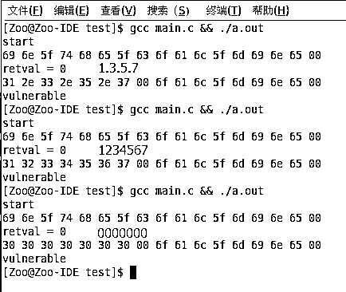

# CVE-2015-0235 - 穷到底 - 博客园

> 原文：[`www.cnblogs.com/suanguade/p/4280971.html`](https://www.cnblogs.com/suanguade/p/4280971.html)

看了下代码，由于各人能力问题，只是了解了漏洞的起因，知道哪里出了问题，但是不知道怎么用阿。。。

可怜。。。

这种漏洞，公布出来，只要不给 EXP，估计威胁都不大。或者，就是我脑筋太死？？？

首先，是网上的 POC，得到的运行结果，漏洞存在，而且内存溢出了 8 个字节。

经测试，这 8 个字节只可能是数字、和 . 没有其他的可能，

为啥会出现这种情况呢，得从 GLibC 里面找，

POC 里面调用的存在漏洞的函数是 gethostbyname_r ，就去这里找，

找啊找，它调用了一个叫 __nss_hostname_digits_dots ，进去继续找，

这个函数的代码，比较好翻，除了代码风格很垃圾以外，近乎完美，根本就不像一个专业程序员写出来的代码，这函数里面不同风格的缩进就有三种。。。

一半代码，不长，主要注释都在里面

int
__nss_hostname_digits_dots (const char *name, struct hostent *resbuf,
char **buffer, size_t *buffer_size,
size_t buflen, struct hostent **result,
enum nss_status *status, int af, int *h_errnop)
{
int save;

/* We have to test for the use of IPv6 which can only be done by
examining `_res'. */
if (__res_maybe_init (&_res, 0) == -1)
{
if (h_errnop)
*h_errnop = NETDB_INTERNAL;
*result = NULL;
return -1;
}

/*
* disallow names consisting only of digits/dots, unless
* they end in a dot.
*/
// name 是构造的一个特殊字符串
// 肯定会进入这里，第一个字符肯定是数字
if (isdigit (name[0]) || isxdigit (name[0]) || name[0] == ':')
{
const char *cp;
char *hostname;
typedef unsigned char host_addr_t[16];
host_addr_t *host_addr;
typedef char *host_addr_list_t[2];
host_addr_list_t *h_addr_ptrs;
char **h_alias_ptr;
size_t size_needed;
int addr_size;

switch (af)
{
case AF_INET: // gethostbyname_r 传入的是 2，所以会走这里
addr_size = INADDRSZ;
break;

case AF_INET6:
addr_size = IN6ADDRSZ;
break;

default:
af = (_res.options & RES_USE_INET6) ? AF_INET6 : AF_INET;
addr_size = af == AF_INET6 ? IN6ADDRSZ : INADDRSZ;
break;
}

// 这里算出来的数字 size_needed 正好是 1024
// 也就是 poc 中，的那个一串减法，最后得出的 991 ，再加回来
size_needed = (sizeof (*host_addr)
+ sizeof (*h_addr_ptrs) + strlen (name) + 1);

// 这里两个分支都不会进入
if (buffer_size == NULL)
{
if (buflen < size_needed)
{
if (h_errnop != NULL)
*h_errnop = TRY_AGAIN;
__set_errno (ERANGE);
goto done;
}
}
else if (buffer_size != NULL && *buffer_size < size_needed)
{
char *new_buf;
*buffer_size = size_needed;
new_buf = (char *) realloc (*buffer, *buffer_size);

if (new_buf == NULL)
{
save = errno;
free (*buffer);
*buffer = NULL;
*buffer_size = 0;
__set_errno (save);
if (h_errnop != NULL)
*h_errnop = TRY_AGAIN;
*result = NULL;
goto done;
}
*buffer = new_buf;
}

memset (*buffer, '\0', size_needed);

host_addr = (host_addr_t *) *buffer;
h_addr_ptrs = (host_addr_list_t *) // +0x10
((char *) host_addr + sizeof (*host_addr));
h_alias_ptr = (char **) ((char *) h_addr_ptrs + sizeof (*h_addr_ptrs)); // +0x20
hostname = (char *) h_alias_ptr + sizeof (*h_alias_ptr); // +0x28

if (isdigit (name[0]))
{
for (cp = name;; ++cp)
{
if (*cp == '\0')
{
int ok;

if (*--cp == '.')
break;

/* All-numeric, no dot at the end. Fake up a hostent as if
we'd actually done a lookup. What if someone types
255.255.255.255? The test below will succeed
spuriously... ??? */
if (af == AF_INET)
// 进入这个分支，由于 name 是一串 ‘0’ ，所以 ok = 1
// 参数 2 里面也都是 0，这不重要，重要的是 ok == 1
ok = __inet_aton (name, (struct in_addr *) host_addr);
else
{
assert (af == AF_INET6);
ok = inet_pton (af, name, host_addr) > 0;
}
// 不会进入这里
if (! ok)
{
*h_errnop = HOST_NOT_FOUND;
if (buffer_size)
*result = NULL;
goto done;
}

// 这里是最关键的，这里做 strcpy 的时候，内存溢出了
// name 长度 991
// hostname 的长度却是 0x28
// 整整溢出了 7+1 个字节，因为最后还有个 '\0'
// 这里向 *buffer + 0x28 后面写 991 个字符，正好溢出了
resbuf->h_name = strcpy (hostname, name);
h_alias_ptr[0] = NULL;
resbuf->h_aliases = h_alias_ptr;
(*h_addr_ptrs)[0] = (char *) host_addr;
(*h_addr_ptrs)[1] = NULL;
resbuf->h_addr_list = *h_addr_ptrs;
// 不进 if
if (af == AF_INET && (_res.options & RES_USE_INET6))
{
/* We need to change the IP v4 address into the
IP v6 address. */
char tmp[INADDRSZ];
char *p = (char *) host_addr;
int i;

/* Save a copy of the IP v4 address. */
memcpy (tmp, host_addr, INADDRSZ);
/* Mark this ipv6 addr as a mapped ipv4\. */
for (i = 0; i < 10; i++)
*p++ = 0x00;
*p++ = 0xff;
*p++ = 0xff;
/* Copy the IP v4 address. */
memcpy (p, tmp, INADDRSZ);
resbuf->h_addrtype = AF_INET6;
resbuf->h_length = IN6ADDRSZ;
}
else
{
resbuf->h_addrtype = af;
resbuf->h_length = addr_size;
}
if (h_errnop != NULL)
*h_errnop = NETDB_SUCCESS;
if (buffer_size == NULL)
*status = NSS_STATUS_SUCCESS;
else
*result = resbuf;
// done 直接返回了，返回值是 1
goto done;
}

验证漏洞存在，就这么简单，但是有什么用呢，我不会用啊，我需要一个 EXP。。。