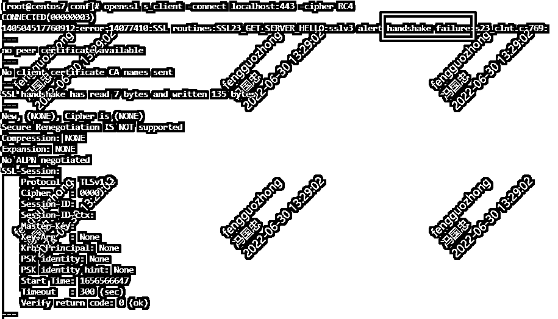
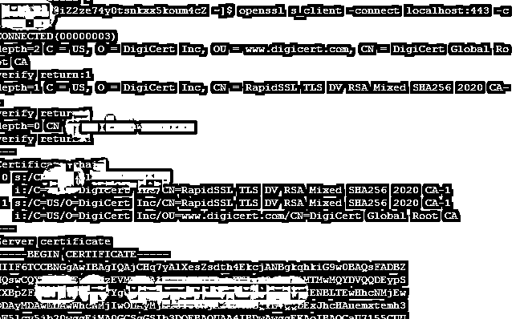
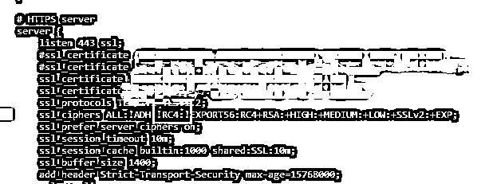

# CVE-2015-2808: RC4 加密问题漏洞-解决方法 - 柴高八斗 - 博客园

> 原文：[`www.cnblogs.com/fengguozhong/p/16426557.html`](https://www.cnblogs.com/fengguozhong/p/16426557.html)

# 一、漏洞描述

SSL/TLS 存在 Bar Mitzvah Attack 漏洞
详细描述：该漏洞是由功能较弱而且已经过时的 RC4 加密算法中一个问题所导致的。它能够在某些情况下泄露 SSL/TLS 加密流量中的密文，从而将账户用户名密码、信用卡数据和其他敏感信息泄露给黑客。
解决办法：
1、服务器端禁止使用 RC4 加密算法。
2、客户端应在浏览器 TLS 配置中禁止 RC4。
验证方法： 根据 SSL/TLS 存在 Bar Mitzvah Attack 漏洞原理，通过跟目标站点进行 SSL 握手并根据目标站点返回的 Server Hello 消息中的加密算法进行漏洞验证。
CVE 编号：CVE-2015-2808

# 二、验证方式

在终端通过 openssl 命令验证：

```
openssl s_client -connect  host:443 -cipher RC4
```

若执行命令后出现 handshake failure 说明 RC4 已禁用，否则需要修复，如下图：



如果出现类似下面的内容，那说明系统启用了 RC4 算法，已经存在漏洞了



# 三、修复方式——在 nginx 中禁用 RC4

在 nginx 配置参数 ssl_ciphers 中添加!RC4，如下：

