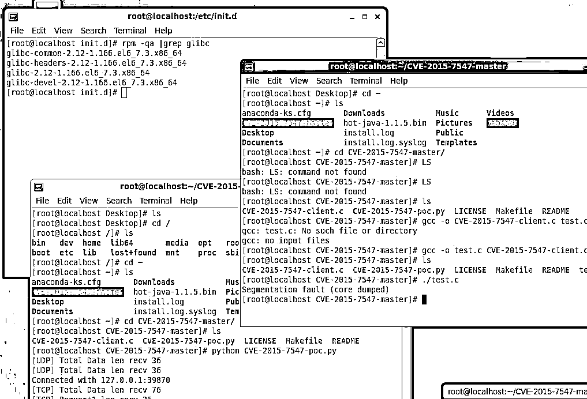

# CVE-2015-7547 - sevck - 博客园

> 原文：[`www.cnblogs.com/sevck/p/5225639.html`](https://www.cnblogs.com/sevck/p/5225639.html)

危险漏洞补丁修复通知

# 漏洞编号

漏洞编号为 CVE-2015-7547

# 漏洞说明：

Google 安全团队近日发现 glibc 存在的溢出漏洞。

glibc 的 DNS 客户端解析器中存在基于栈的缓冲区溢出漏洞。当软件用到 getaddrinfo 库函数（处理名字到地址以及服务到端口的转换）时，攻击者便可借助特制的域名、DNS 服务器或中间人攻击利用该漏洞，控制软件，并试图控制整个系统。

攻击者使用恶意的 DNS 域名服务器创建类似于 evildomain.com 的域名，然后向目标用户发送带有指向该域名的链接的邮件，一旦用户点击该链接，客户端或浏览器将会开始查找 ildomain.com，并最终得到恶意服务器的 buffer-busting 响应。该域名被嵌入服务器日志中，一旦解析就会触发远程代码执行，SH 客户端也会因此被控制。或者，位于目标用户网络中的中间人攻击者可以篡改 DNS 响应，向恶意代码中动态注入负载。

简单的说，只要控制了 linux 服务器所访问的 DNS 服务器，或者对 linux 服务器的流量进行劫持；那么，在 Linux 服务器做 DNS 请求时，恶意 DNS 服务器就可以对 linux 服务器进行远程溢出攻击，获取服务器权限。

# 漏洞影响范围

glibc 版本大于 2.9 的都受到影响。由于 glibc 2.9 存在较为久远，目前所有的 linux 系统都收影响，包括 centos/redhat 5、6、7，Ubuntu，debian，opensuse。

# 漏洞检测过程

漏洞验证 POC 地址为：https://github.com/fjserna/CVE-2015-7547

服务器环境测试：

 

1.更改 DNS 解析为 127.0.0.1，刷新 DNS 缓存/etc/init.d/nscd restart

2.使用 python，执行 CVE-2015-7547-poc.py，执行后保留窗口

3.在新窗口编译 CVE-2015-7547-client.c,然后执行编译出的文件 CVE-2015-7547-client

如果存在显示入下结果“Segmentation fault (core dumped)” 那么就说明存在漏洞。

 

# 修复措施

升级到官方最新 glibc 版本。另外，所有调用 glibc 库的服务都需要重新启动。由于调用 glibc 库的软件太多，建议重启系统更为方便。

# 各系统厂商补丁地址

ubuntu:

[`www.ubuntu.com/usn/usn-2900-1/`](http://www.ubuntu.com/usn/usn-2900-1/)

debian:

[`security-tracker.debian.org/tracker/CVE-2015-7547`](https://security-tracker.debian.org/tracker/CVE-2015-7547)

redhat:

[`lists.centos.org/pipermail/centos-announce/2016-February/021668.html`](https://lists.centos.org/pipermail/centos-announce/2016-February/021668.html)

centos：

[`lists.centos.org/pipermail/centos-announce/2016-February/021668.html`](https://lists.centos.org/pipermail/centos-announce/2016-February/021668.html)