# CVE-2015-7547 漏洞分析从原因到利用到补丁（非常适合小白）【转】 - 请给我倒杯茶 - 博客园

> 原文：[`www.cnblogs.com/zzb-Dream-90Time/p/8087492.html`](https://www.cnblogs.com/zzb-Dream-90Time/p/8087492.html)

本文转载自：[`blog.csdn.net/u012406115/article/details/72232535`](http://blog.csdn.net/u012406115/article/details/72232535)

## 一、         漏洞概述

CVE 漏洞链接：http://www.cve.mitre.org/cgi-bin/cvename.cgi?name=CVE-2015-7547

披露/发现时间：2015-07-13    提交时间:2016-02-17

漏洞等级：高  漏洞类别 缓冲区溢出

漏洞概述：该漏洞是 Glibc 中的 DNS 解析器中存在基于栈的缓冲区溢出漏洞，glibc 是 GNU 发布的 libc 库，即 c 运行库。glibc 是 linux 系统中最底层的 api，几乎其它任何运行库都会依赖于 glibc。glibc 除了封装 linux 操作系统所提供的系统服务外，它本身也提供了许多其它一些必要功能服务的实现。当在程序中调用 Getaddrinfo 函数时，攻击者自定义域名或是通过中间人攻击利用该漏洞控制用户系统。比如攻击者向用户发送带有指向恶意域名的链接的邮件，一旦用户点击该链接，攻击者构造合法的 DNS 请求时、以过大的 DNS 数据回应便会形成堆栈缓存区溢出并执行远程代码，达到完全控制用户操作系统。通过该漏洞直接批量获取大量主机权限。

影响范围：该漏洞影响 Glibc 2.9 以后的所有版本，Debian、Red Hat 以及更多其它 Linux 发行版，只要 glibc 版本大于 2.9 就会受到该溢出漏洞影响。不过虽然可以进行远程执行攻击，攻击者还需要解决绕过 ASLR 系统安全机制。

## 二、   POC 环境配置

为了深入分析该漏洞首先对 poc 的源码的执行环境进行配置，主要是可以触发的该漏洞 glibc 库的编译，以及对应的服务器配置和 POC 源码编译与运行

Poc：在 github 上：[`github.com/fjserna/CVE-2015-7547`](https://github.com/fjserna/CVE-2015-7547)

## 1.gilbc 下载与编译

由于一般主机的 glibc 的库是已经修复过该漏洞的，而且系统自带的 glibc 是发行版的，所以在编译的是时候选用了优化参数 -O2,所以在调试的过程中会出现变量被优化无法读取以及代码运行的时候与源码的行数对不上的情况。所以需要自行下载一个 glibc 库进行测试。这里我组下载了 2.20 版本。

首先为了可以使用 gdb 对 glibc 的跟踪调试，需要执行下面两个安装指令如下：

sudo apt-get install libc6-dbg   sudo apt-get source libc6-dev

然后下载 glibc2.9 以后的一个版本的 glibc 就行，这里我下载版本是 2.20 版本。

Glibc 的下载链接：http://ftp.gnu.org/gnu/glibc/

然后编译的时候要特别注意首先要加载到/usr/local/目录下新建的目录才能安装而且要使用 O1 进行编译否则默认 O2 会进行优化无法对应调试源码。执行如下命令进行配置：

/opt/glibc220/（下载解压缩的 glibc 的目录）configure --prefix=/usr/local/glibc220/ --enable-debugCFLAGS="-g -O1" CPPFLAGS = "-g -O1"

不过第一次会报错，百度以后发现必须要到/usr/local/glibc220/下去执行才可以。

  但继续安装又报了如下的错，按提示再安装 gawk，容易配置成功。在 configure 执行完成之后在直接 make&&make install 安装就好了。

## 2.poc 程序的编译与环境配置

       该漏洞是由于接受的 DNS 数据缓存溢出导致的，所以 POC 分为两个部分一个是模拟的恶意 DNS 服务器 py 文件，用于发送过长的字符串，另一个 client 客户端 c 文件负责调用 Getaddrinfo 函数接受数据触发溢出。由于服务器程序编写绑定是 127.0.0.1,所以需要修改本地 DNS 配置文件/etc/resolv.conf。将域名服务器 nameserver 改为 127.0.0.1。需要补充一点的是 Ubuntu 系统定时会重置这个文件所以每次运行之前需要检查这个文件是不是 127.0.0.1。

   然后执行如下命令指定我自己下载存在该漏洞的 glibc2.20 库去编译客户端源文件。

需要特别注意的是红字的部分还需要去指定动态库加载器，否则调试的时候会有问题无法对应到源码进行逐步调试。

gcc -O0 CVE-2015-7547-client.c -o client2-g -Wl,-rpath=/usr/local/glibc-220/lib -Wl,--dynamic-linker=/usr/local/glibc-220/lib/ld-linux.so.2

编译完成后可以通过 ldd 命令进行检查是否用的库我自己编译的 2.20 版本的库

## 三、         漏洞成因分析

### 1.     寻找漏洞溢出点

为了分析漏洞产生的原因首先就要定位到漏洞最后真正溢出点，我并没有去查看网上的博客去直接获得触发对应的缓冲区变量和函数，而是尝试自己去寻找追踪函数的调用过程发现触发点的。

首先我再开启服务器端 py 文件不断去发送超长的字符串。然后第一次 gdb 先直接运行客户端程序，如下图所示，产生的段溢出的错误。并且发现问题发生在 res_query 函数 res_query.c 264 代码上。

这时我进一步想既然是缓冲区溢出的段错误肯定是由于该缓冲区溢出覆盖了原有的返回地址，所以如果这时栈上最后一条函数地址就应该是溢出缓冲区申请的函数，因为栈上函数地址的存储顺序是按调用顺序进行，所以由于栈的是向上生长的溢出的缓冲区只能覆盖栈上自己的函数地址和调用该函数之前的函数的地址。这时我调用一个 bt 看一下栈如上图最后的红圈所示就可以推测出该溢出的缓冲区是在 _nss_dns_gethostbyname4_r 申请的。后续会进行验证之前的函数地址都被覆盖 0x42 也就是 B。

这时看一下抓包的 wireshark 果然服务器发了一个很长字符串的 B。

 通过我上一步分析可以知道程序停在 res_query 函数上于是重新运行在 resquery 上打一个断点再去查看栈就可以获取程序崩溃前完整的调用程序流如下图所示：

但实际到底为什么发生了溢出真实的溢出点是不是程序崩溃的位置呢，需要进一步分析这里我先不追踪溢出的缓冲区，只是从刚才的崩溃来分析再下一部分再验证，通过 gdb 告诉我程序崩溃是 res_query.c 文件的 264 行于是对应找到该源码。如下图最后的红圈所示，发现是验证 hp 和 hp2 的时候发生了错误，推测应该是溢出覆盖了这两个变量的值于是需要继续追踪分析找到 lib_res_nesend 函数的参数影响了 hp 和 hp1。由于函数参数在栈上是连续的所以去追踪该函数。

于是我继续追踪 libc_res_nesend 函数的参数发现 send_dg 和 send_vc 会影响这个函数的所有参数如下图所示：

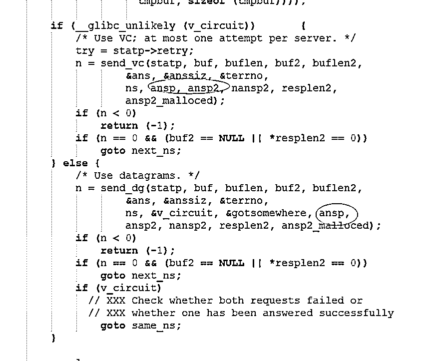

然后我再单步调试 nsend 函数发现是先执行 send_dg 再执行了 send_vc。这样我就先得到了完整的溢出触发的流程整体如下图所示：

 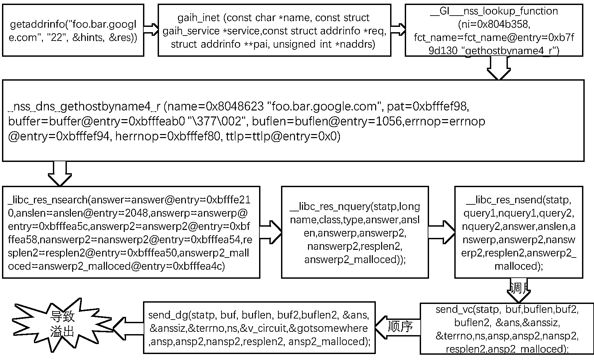

### 2.成因具体分析

#### 2.1 缓冲区变量跟踪

通过上面的分析只是推测出了溢出发生的函数触发流程，本节要通过之前的函数分析流程还具体分析到底是哪个变量指向缓冲区发生了溢出，为什么会发生溢出，同时这里也可以验证我之前的推测的触发过程是不是正确的。

通过上一节一开始的分析推测出这个栈空间应该是在 _nss_dns_gethostbyname4_r 函数发生的于是我断点在这个函数单步跟踪一下。如下图所示，果然发现了 host_buffer.buf 申请了 2048 字节的栈空间记录其栈的地址，而且发现 ans2p 这个变量（之前分析了这个变量赋值给 hp2 指针最终导致了崩溃）的地址只和栈底差了 0xbfffea58-（0xbfffe210+2048）只有 72 个字节，也从侧面说明了很可能就是这个缓冲区溢出导致了覆盖了这个变量的地址。

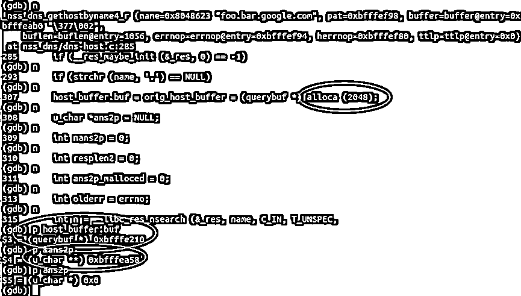

于是逐步追踪这个 host_buffer.buf 地址，对应 nsearch 函数的 answer 变量再到 nquery 函数的 answer 变量再到 nsend 函数的 ans 变量，长度变量最后对应 nsend 函数的 anssizp 变量。

**2.2 send_vc 和 send_dg 逻辑分析**

然后需要注意的是 send_vc 和 send_dg 传入的是对应变量的地址从如下的 nsend 函数定义和对应 send_dg 参数使用可以看出如下表所示

| 定义：int__libc_res_nsend(res_state statp, const u_char *buf, int buflen,               const u_char *buf2, int buflen2,               u_char *ans, int anssiz, u_char **ansp, u_char **ansp2,               int *nansp2, int *resplen2, int *ansp2_malloced)调用：n = send_dg(statp, buf, buflen, buf2, buflen2,                              &ans, &anssiz, &terrno,                               ns, &v_circuit, &gotsomewhere, ansp,                               ansp2, nansp2, resplen2, ansp2_malloced);定义：send_dg(res_state statp,       const u_char *buf, int buflen, const u_char *buf2, int buflen2,       u_char **ansp, ,//指针的指针 int *anssizp       int *terrno, int ns, int *v_circuit, int *gotsomewhere, u_char **anscp,       u_char **ansp2, int *anssizp2, int *resplen2, int *ansp2_malloced) |

于是需要继续追踪 send_dg 和 send_vc 函数的 ansp（2048 字节的缓冲区）和 anssizp（2048 字节的长度）这些变量内部的赋值与传递关系寻找最终的溢出触发位置。

由于 DNS 协议 TCP 和 UDP 都用到了。其中大数据包和域名系统间的消息传递用 TCP 即调用 send_vc 函数，一般的域名查询服务调用 UDP 即 send_dg 函数。

在 POC 中首先服务器发一个 2500UDP 包，所以客户端会先调用 send_dg 函数。去除调一些与关心变量无关的程序，通过 gdb 单步跟踪发现其核心的实际执行的关键代码和逻辑如下图所示。

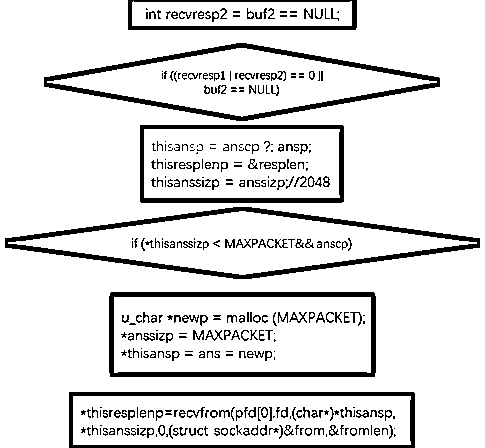

可以看到实际中第一次运行的时候在第一个判断的满足情况下，thisansp 为空所以会赋值 anscp 指向空间也就是这两个指针的地址是一样的，注意此时 anscp 指向的空间是 NULL。同时 thisansp 的值赋值为 ansszip 根据之前的分析该值为缓冲区长度 2048。所以其在第二个判断的时候该长度小于 MAXPACKET（65536）同时 anscp 是有地址的。所以满足条件下执行下面的代码块。或重新分配一个 65536 的堆空间给 thisansp，注意到此时 thisansp 和 anscp 地址是一致的，所以 anscp 被指向到了 65536 的一个堆空间。如下图所示：

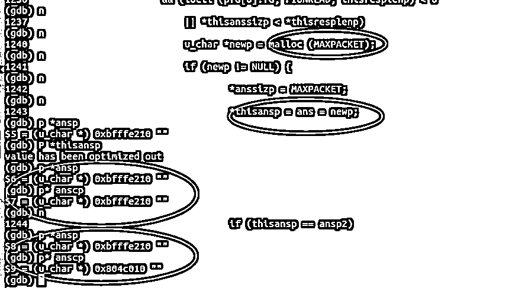

最后该函数会调用 recvfrom 在 65536 的实际堆缓冲区但标识其长度为 2048，去接受服务器的数据所以此时并不会触发溢出。但是注意到 anscp 指向 65536 的堆缓冲区而 ansp 还是指向 2048 字节的栈缓冲区。

       然后这 3 个变量又继续传递给了 send_vc 函数。我继续单步根据去分析其执行逻辑，发现其利用 goto 语句循环执行两遍的接受客户端数据的程序，但是会根据条件判断执行不同的程序路径，最终导致了溢出。关键的代码和执行路径我也画了一个图如下所示：

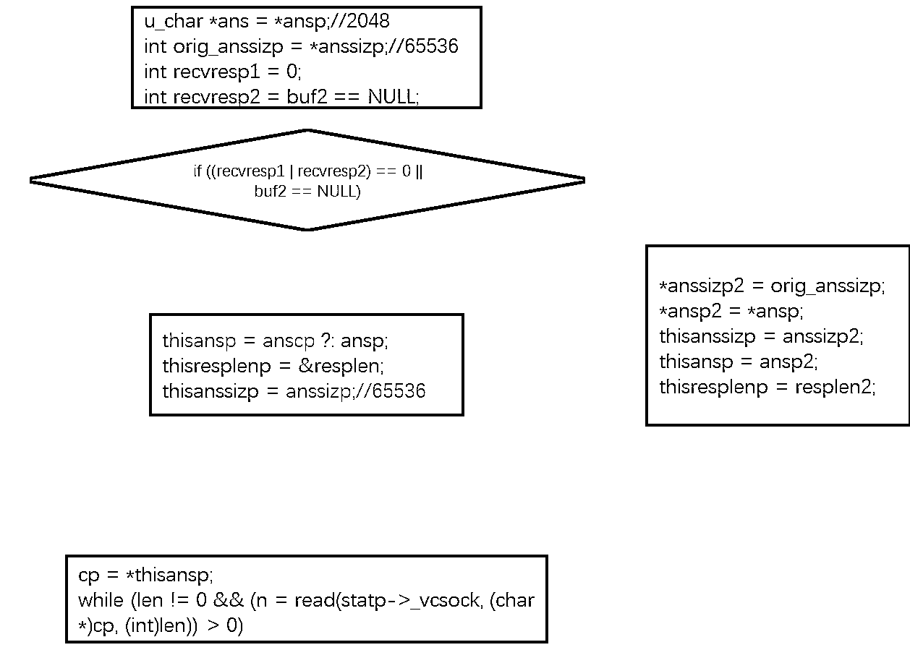

第一次会满足判断条件执行中间的路径,cp=thisansp=anscp 指向 65536 的堆空间如下图所示所以第一次读取数据不会发生溢出。

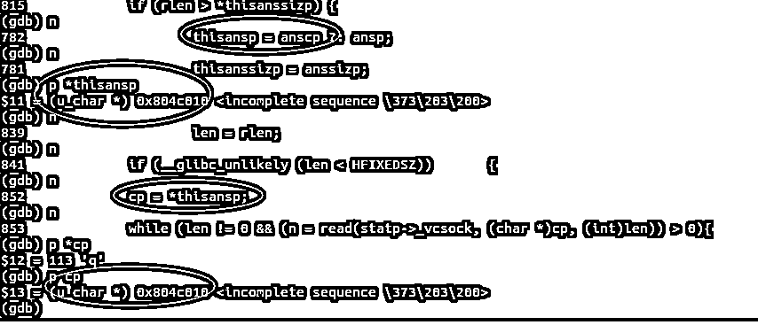

但是接受程序会循环等待第二次数据,这时会执行右边的路径分支。使 thisansp 最终等于 ansp 的栈空间 2048 个字节，而该程序以为缓冲区长度为 65536 的大小，所以允许接受数据包的长度可以大于 2048 没有改变如下图所示。这里 POC 服务发送的 2302 个字节大小的数据最终导致了溢出。

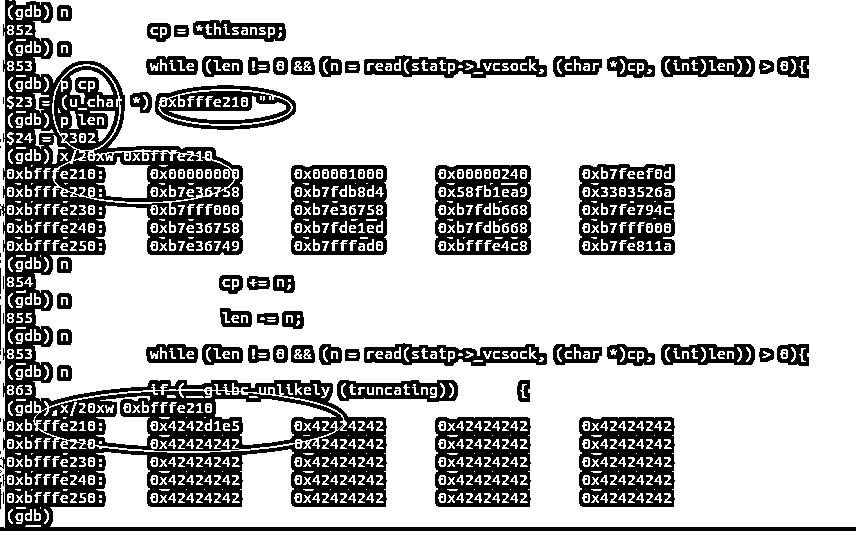

可以看到对应地址的缓冲区都被覆盖成了 0x42（B）。这也最终验证了我在第一部分推测的漏洞触发流程，通过跟踪对应的缓冲区最终发现了该缓冲区溢出，如下图所示红色标识的变量为溢出的缓冲区指针在调用一层层函数中对应的变量，可以很清楚的看出触发流程。

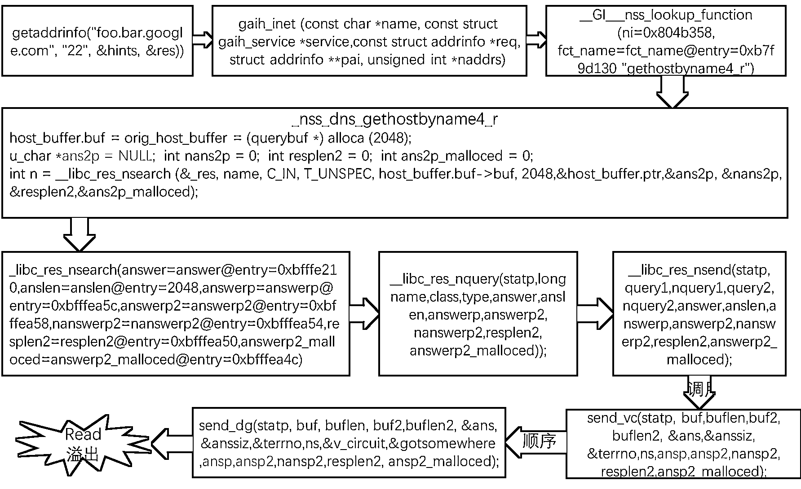

## 四、         漏洞可利用分析

由于程序有 ASLR 和 DEP 保护，最终并没有实际进行 ROP 等实际利用的攻击实验。该部分主要分析栈的结构和程序中的一些验证如何绕过的分析和测试。

栈溢出漏洞的关键就是覆盖函数返回地址使其执行攻击者想执行的代码的地址。于是我去查看申请溢出缓冲区的函数 nss_dns_gethostbyname4_r 的地址。在刚进入该函数后查看 esp 对应的位置开始的 4 个字节就是刚刚压入堆栈的该函数的返回地址，如下图所示红圈旁边的 4 个字节的返回地址是 0xb7f14c68 存储在红圈地址 0xbfffea7c 的位置。

可以看出该返回的地址和我申请缓冲区的地址 0xbfffe210 相差了 2156 个字节如下图所示，但是我经过前面的分析知道程序在 _libc_res_nquery 函数返回后验证 hp 和 hp1 的时候发生了段错误，说明在覆盖缓冲区的时候要绕过这些参数检查才能真正的利用成功。

于是我改变 POC 程序，让服务器发生小于等于 2048 个字节的数据，这时再跟踪程序到验证的地方找到 hp 和 hp2 的内容。如下图所示这时再查看缓冲区下界到返回地址之间的栈空间可以找到对应的 hp 和 hp2 如下图红圈所示。这时就可以知道 hp 和 hp2 的位置在 0xbfffea58 和 5c 的位置。

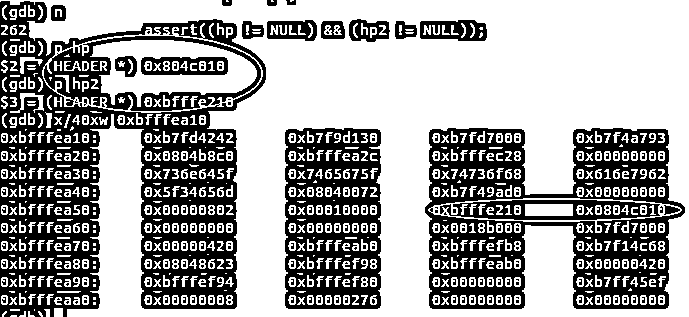

进一步跟踪程序发现在 libc_res_nsearch 的函数返回后会对 answerp2_malloc 检查是否为空。非空的话会释放 ans2p 仍然出错。

所以获取 ans2p 的地址如下图所示填充成 0，就可以跳过检查。

但还是出错了所以说明 hp 后面的参数还是有用的，重新画一下栈的空间修如下所示：

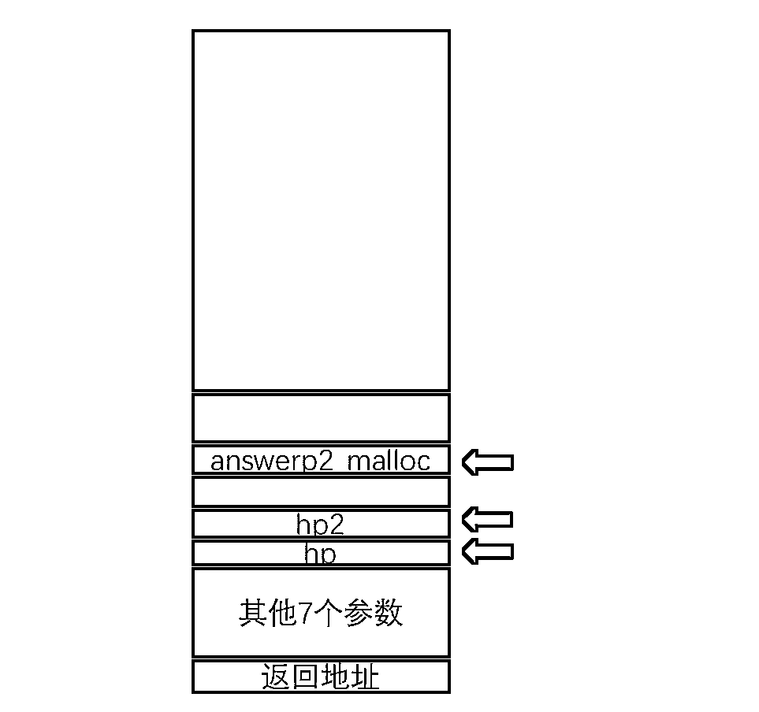

所以重新设置服务器端发送的数据如下图所示，把原来的参数原样填进去。

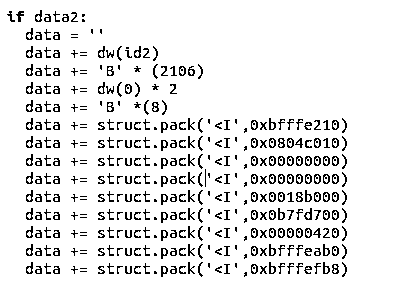

终于不再报错，说明可以进去覆盖返回地址的攻击了。

## 五、         漏洞补丁分析

我进一步分析了该漏洞补丁程序其中有许多的补丁版本这里只说明一种可以查到源码的。其中关键就是对 send_dg 和 send_vc 的修改对 send_vc 修改如下图所示：

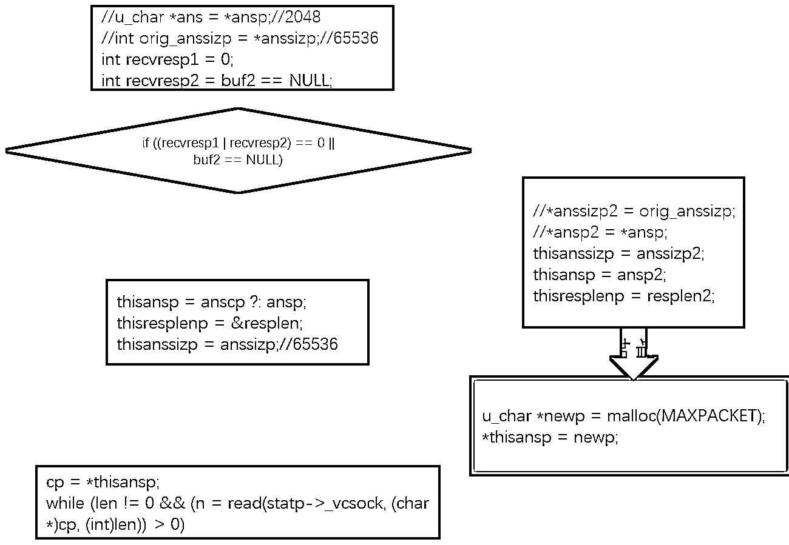

注释掉了 ansp=ansp，同时当 thisansp 为空的条件下增加了上图绿框中的代码，重新开辟 65536 的堆空间给 CP，这样就不会发生溢出。

同时补丁对 send_dg 修改如下，使 thisanssizp 的长度与 thisansp 的大小对应。

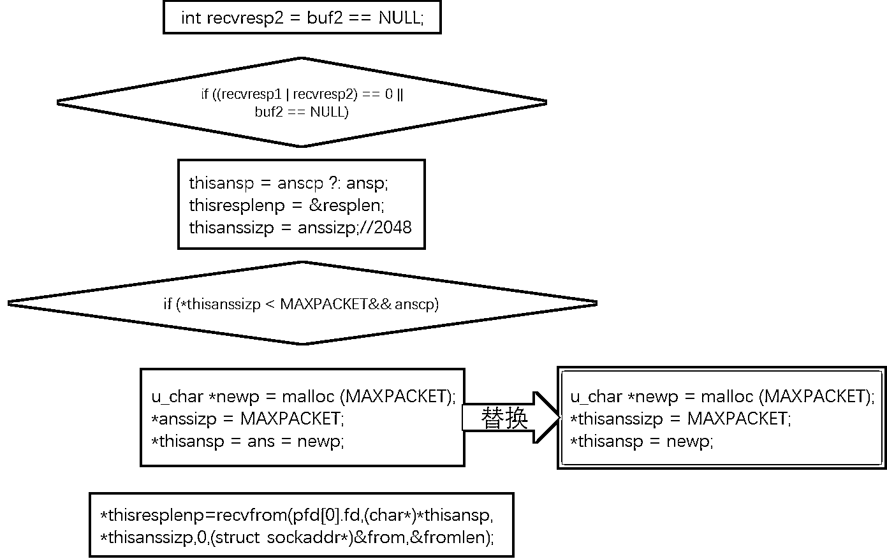

