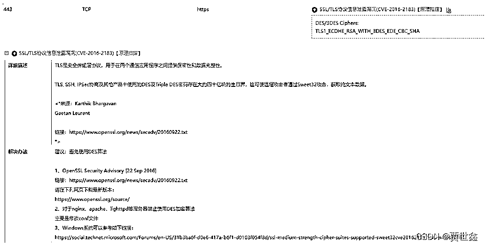
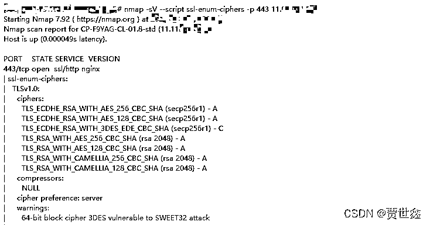

# CVE-2016-2183 解决方法 - study_goup - 博客园

> 原文：[`www.cnblogs.com/my-first-blog-lgz/p/16363377.html`](https://www.cnblogs.com/my-first-blog-lgz/p/16363377.html)

转至：https://blog.csdn.net/qq_23994787/article/details/123483548



通过漏扫建议是 DES/3DES 算法导致的问题，由于是 nginx 开启的 443 端口，所以需要去 nginx 中修改配置文件，禁用 3DES 算法。

## 问题复现

该问题可以用 nmap 进行复现，下图红色部分即为弱算法的告警。

```
[root]# nmap -sV --script ssl-enum-ciphers -p 443 xxx.xxx.xxx.xxx
```



##  问题修复

在 nginx 配置中禁用弱算法

 

```
ssl_ciphers ECDHE-RSA-AES128-GCM-SHA256:ECDHE:ECDH:AES:HIGH:!NULL:!aNULL:!MD5:!3DES:!ADH:!RC4:!DH:!DHE;
```

重启 Nginx 使配置生效。

```
nginx -s reload
```

## 问题复测

再次使用 nmap 进行测试，无相关告警信息

 