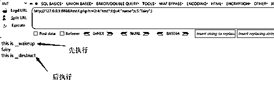
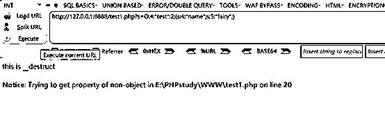
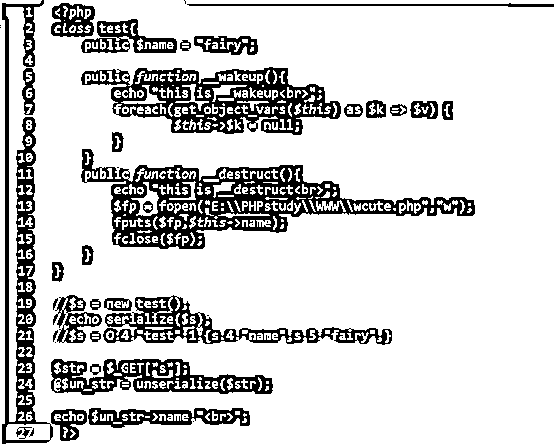
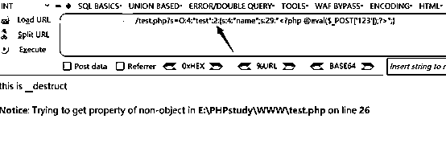
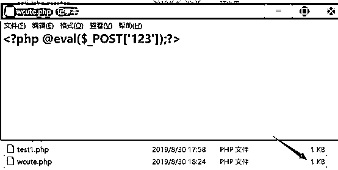

# CVE-2016-7124 漏洞复现 - 娘家人 - 博客园

> 原文：[`www.cnblogs.com/zy-king-karl/p/11436872.html`](https://www.cnblogs.com/zy-king-karl/p/11436872.html)

# CVE-2016-7124 漏洞复现

## __wakeup()魔术方法绕过

## 实验环境

操作机：Windows 10

服务器：apache 2.4

数据库：mysql 5.0

PHP 版本：5.5

## 漏洞影响版本：

PHP5 < 5.6.25

PHP7 < 7.0.10

## 漏洞产生原因：

如果存在 __wakeup 方法，调用 unserilize() 方法前则先调用 __wakeup 方法，但是序列化字符串中表示对象属性个数的值大于 真实的属性个数时会跳过 __wakeup 的执行

## 漏洞复现

编写测试脚本

Test1.php

脚本上标明接收 s 参数，对其反序列化后输出 name 属性的值

访问 test1.php

根据代码可以看出反序列化之前先调用了 __wakeup 方法，再调用 _destruct 方法。

将传入的序列化数据的对象变量个数由 1 更改为 2，页面只执行了 __destruct 方法，而且输出 name 属性时报错，是由于反序列化数据时失败无法创建对象。

 

## 漏洞利用

更改测试代码

test.php

 

其中 __destruct 方法在调用时将 name 参数写入 wcute.php 文件但是由于 __wakeup 方法清除了对象属性，所以在调用 __destruct 时已经没有了 name 属性，因此文件将会写入失败。

 

将对象属性个数改为 2 继续尝试，成功绕过 __wakeup 方法执行，将代码写入文件

 