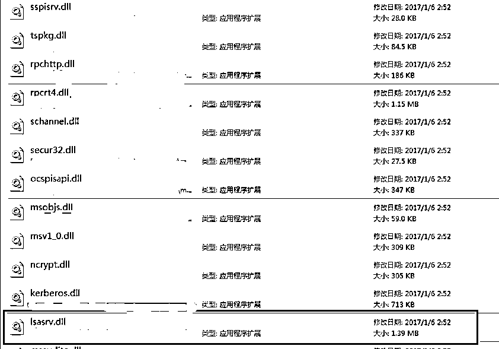
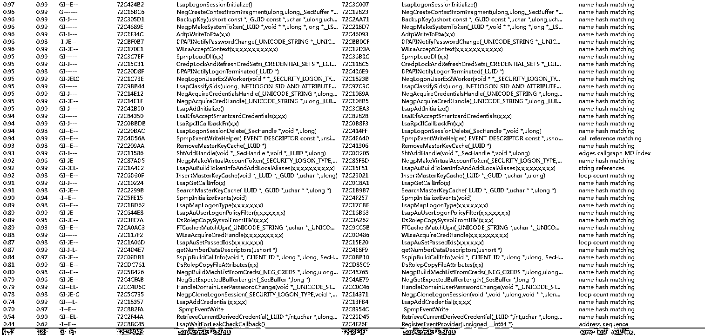
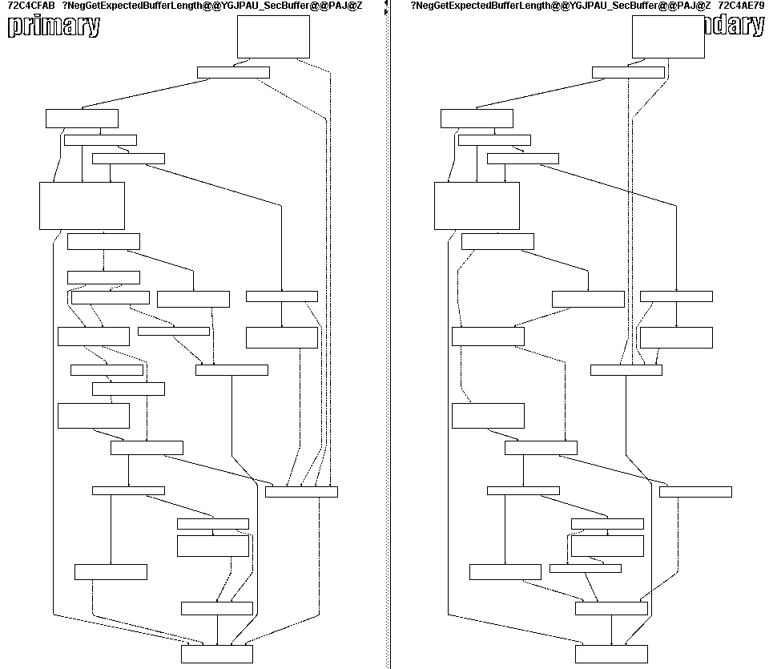
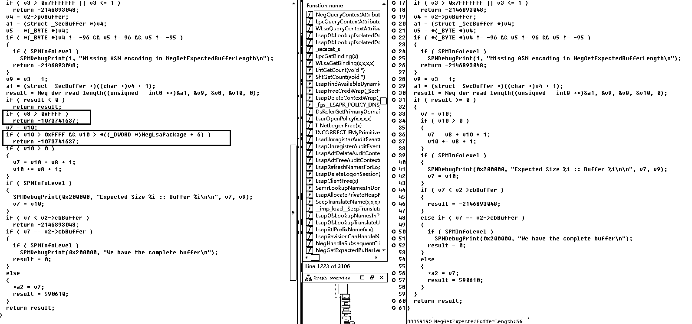
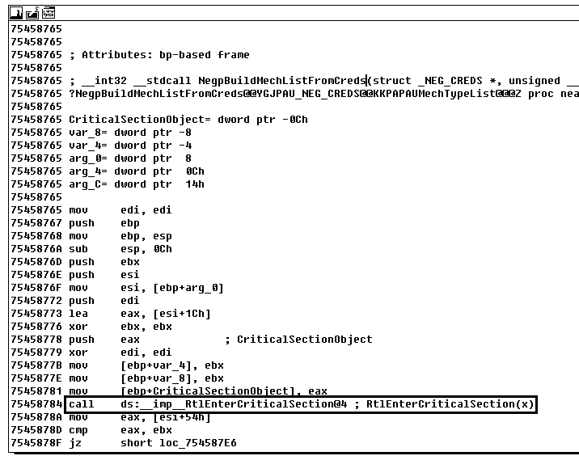
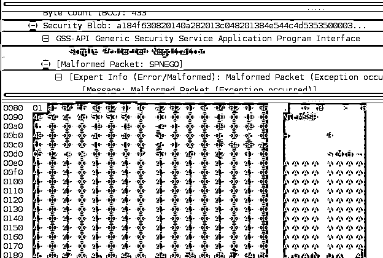
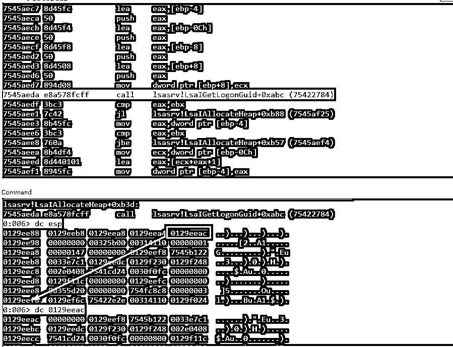
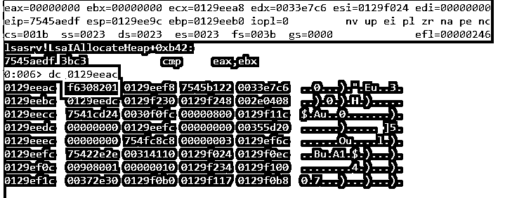
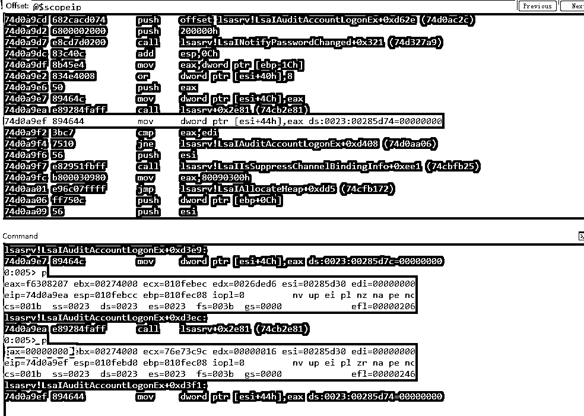

# CVE-2017-0004 相关 lsass 拒绝服务漏洞杂谈 - goabout2 - 博客园

> 原文：[`www.cnblogs.com/goabout2/p/6280185.html`](https://www.cnblogs.com/goabout2/p/6280185.html)

昨天微软更新的补丁对 lsass 服务中的一处拒绝服务漏洞进行了修补，由于是远程拒绝服务漏洞遂决定看看（毕竟这种类型的这十几年也没出几个）。补丁解压之后可以发现这次更新修改了大量的 dll（可以用 expand.exe，原因么，用了就知道哈哈），lsass.exe 本身没有修改

可能是运气好吧，我当时直接选了 lsasrv 这个 dll，事实证明运气不错。

 

可以看到这个 dll 是本地密码相关的动态链接库。

通过 binbiff 对比可以发现确实有不少修改的地方。

因此昨天都在看这个 dll 的补丁对比，当时找到一些可疑的函数，其中一个函数为 NegGetExpectedBufferLength，该函数是用于返回 buffer 长度的，补丁对比图如下。

详细的代码对比（左侧为最新的 dll），可以看到红框中增加了对 v8 这个变量的长度校验，当获取的长度大于 FFFF 时，直接返回一个负值，如下所示：

 

如果此时返回的结果为 90312，则会运行到后面的 LsapAllocateLsaHeap。

在 LsapAllocateLsaHeap 中会通过之前获取的长度分配一个内存，如果前面没有检测的话，这个地方会因为超长 size 分配一段超大内存，导致失败，从而分配一个空指针，该空指针会被放到 esi+44 的地址中，从而后面导致空指针引用？这是昨天对这个地方的函数的想法，但是由于不知道怎么触发运行到这个函数（想要构造的话只能反复看该处的汇编代码，这可是个费时间的活儿），因此就暂停了分析。

 

幸运的是今天 Nicolas Economou 发布的一篇 blog，该 blog 中对这次 lsass 服务的问题进行了精彩的阐述，并给出了相关的 poc

https://www.coresecurity.com/blog/unpatched-lsass-remote-denial-service-ms16-137

该漏洞实际出现在 lsasv 模块的 NegGetExpectedBufferLength 函数中，该函数没有对发送的 smb 中的一个长度域做限制，当漏洞存在时，该 size 会作为内存分配函数 LsapAllocateLsaHeap 分配内存时的 size，攻击者可以将该 size 设置为一个大 size，从而导致该处分配失败，失败后会生成一个空指针

 

该空指针会在 NegpBuildMechListFromCreds 中被引用，从而导致 lssas 进程重启。

 

运行 poc 之后如下，lsass 崩溃。

发送的 exp 数据包如下，其中的 f6308301 即为导致漏洞触发的长度域。

可以看到漏洞触发后崩溃的地址，如 kb 之后发现，最后的地址即在上面 NegpBuildMechListFromCreds 中的 RtlEnterCriticalSection 之后。

直接在 NegGetExpectedBufferLength 下断，单步到 Neg_der_read_length 前如下，此时的长度变量为 0。

函数运行之后可以看到此时获取的长度为 f6308201，即为 wireshark 抓包获取的长度

最后 LsapAllocateLsaHeap 分配一个巨大的内存失败，返回一个空指针，并保存到 esi+44 的位置，该空指针会在后面被引用从而导致崩溃。

从 Nicolas Economou 发布的 blog 中可以知道实际上这个漏洞在去年的时候就补过，不过当时微软补的地方是针对 NegpBuildMechListFromCreds 中的空指针进行修改，而且当时补的时候对该空指针的结构也没有完全补对，直到昨天的更新中才将其中的根源 NegGetExpectedBufferLength 中的长度进行了限制。

时间有限，实际上我这个地方对该空指针后续的操作没有详细的调试，可能有误差，有时间后续的调试再补上吧!

参考

https://www.coresecurity.com/blog/unpatched-lsass-remote-denial-service-ms16-137

转载请注明出处