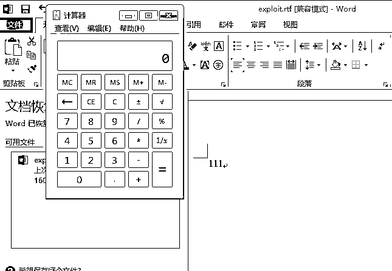
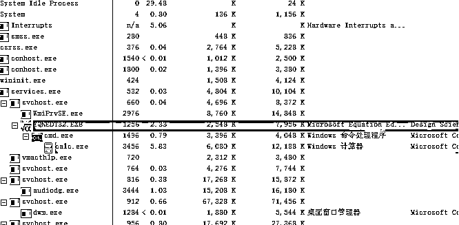
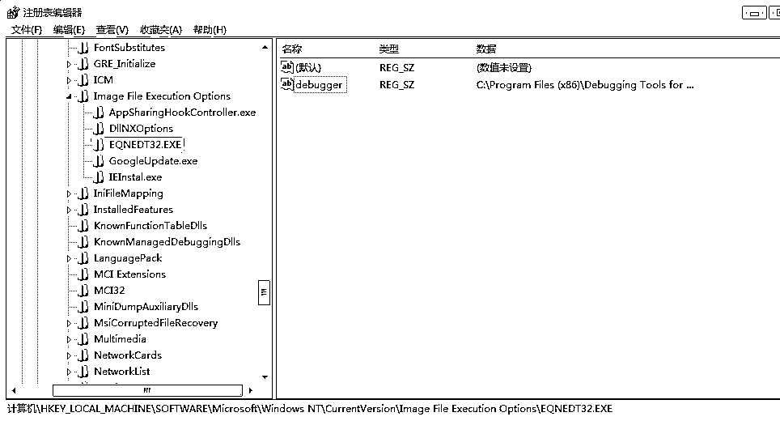
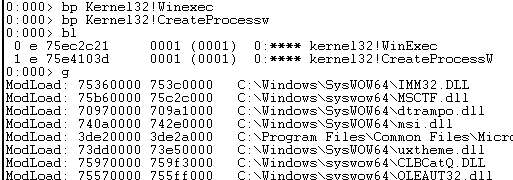
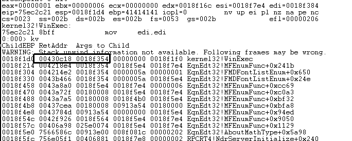
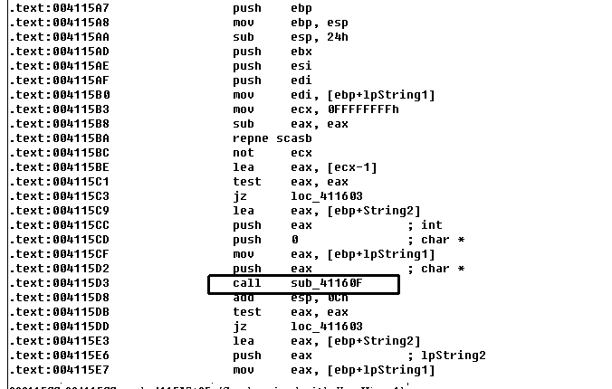
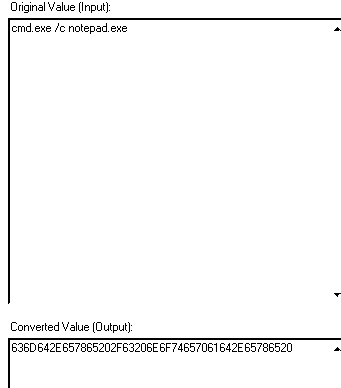
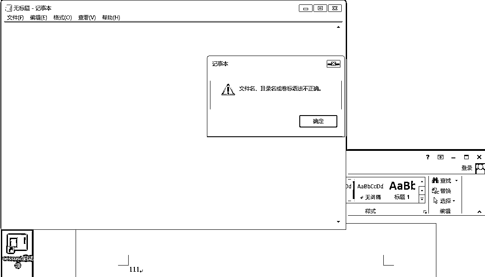

# CVE-2017-11882---Microsoft Office 数学公式编辑器内存损坏漏洞 - apossin - 博客园

> 原文：[`www.cnblogs.com/apossin/p/10155896.html`](https://www.cnblogs.com/apossin/p/10155896.html)

　做过不少 ctf 中的 pwn,但还是头一次复现 windows 的溢出漏洞。

   目的有二：

*   第一：学会使用 windbg，了解它的适用情况和优势。
*   第二：体验在 windows 下调试溢出漏洞，看看和 linux 下调试有何不同。

**#0x01 漏洞背景**

2017.11.14   微软发布 11 月补丁，修复了包括 CVE-2017-11882 在内的多个漏洞。 随后不久，安全公司 EMBEDI 在官方博客上公开了其向微软提交的编号为 CVE-2017-11882 的 Office 远程代码执行漏洞：[`embedi.com/blog/skeleton-closet-ms-office-vulnerability-you-didnt-know-about`](https://embedi.com/blog/skeleton-closet-ms-office-vulnerability-you-didnt-know-about)，讲述了漏洞的发现过程和部分细节。

　　漏洞出现在模块 EQNEDT32.EXE 中，该模块为公式编辑器，在 Office 的安装过程中被默认安装。该模块以 OLE 技术（Object Linking and Embedding，对象链接与嵌入）将公式嵌入在 Office 文档内。当插入和编辑数学公式时，EQNEDT32.EXE 并不会被作为 Office 进程（如 Word 等）的子进程创建，而是以单独的进程形式存在。这就意味着对于 WINWORD.EXE, EXCEL.EXE 等 Office 进程的保护机制，无法阻止 EQNEDT32.EXE 这个进程被利用。

漏洞存在于 EQNEDT32.EXE 处理 Office OLE Equation 对象中标记为字体名称记录的字节流中，如果 Equation 对象中存在标记为字体名称的超长字节流，则程序在处理该字符串的过程，会由于判断字符串长度而发生栈溢出漏洞。

　　攻击者可以通过刻意构造的数据内容覆盖掉栈上的函数地址，从而劫持程序流程，可以利用漏洞以当前登录的用户的身份执行任意命令。而且该漏洞没有弹窗，用户感觉不到。

　　影响版本：

```
Office 365

Microsoft Office 2000      

Microsoft Office 2003      

Microsoft Office 2007 Service Pack 3

Microsoft Office 2010 Service Pack 2

Microsoft Office 2013 Service Pack 1

Microsoft Office 2016

```

**#0x02 漏洞复现**

复现环境：win7sp1+Microsoft office 2013

　　首先在 github 上找一个 poc:https://github.com/embedi/CVE-2017-11882

　　在漏洞环境上运行成功弹出计算器。

　　

通过 Process Explorer 查看进程情况，可以看到最终执行命令的父进程是 EQNEDT32.EXE。

　　

根据漏洞的描述可知，EQNEDT32.EXE 是一个单独执行的进程。所以对它的调试相当于调试一个由进程创建的另一个进程。

大佬们早已给出了方法：https://www.52pojie.cn/thread-196194-1-1.html

在 HKEY_LOCAL_MACHINE\SOFTWARE\Microsoft\Windows NT\CurrentVersioin\Image File Execution Options\下创建字段 EQNEDT32.EXE。



下面创建一个名为 debugger 的字符串，值为 windbg 的路径。

由于触发结果是创建了进程打开 cmd.exe。

所以可以在 WinExec 和 CreateProcessw 下断点。然后执行。



```
bp 下断点
bl  显示断点
g   GO 执行
bc  [index]删除断点
```

程序中断后，观察栈里的返回地址和参数。



 定位到代码里，是对 winexec 的调用。


再往上找：


继续跟进找到第一个 call：



查看伪代码其伪代码：

```
int __cdecl sub_41160F(char *a1, char *a2, int a3)
{
  int result; // eax@12
  char v4; // [sp+Ch] [bp-88h]@5
  char v5; // [sp+30h] [bp-64h]@4
  __int16 v6; // [sp+51h] [bp-43h]@5
  char *v7; // [sp+58h] [bp-3Ch]@7
  int v8; // [sp+5Ch] [bp-38h]@1
  __int16 v9; // [sp+60h] [bp-34h]@1
  int v10; // [sp+64h] [bp-30h]@1
  __int16 v11; // [sp+68h] [bp-2Ch]@1
  char v12; // [sp+6Ch] [bp-28h]@1
  int v13; // [sp+90h] [bp-4h]@1

  LOWORD(v13) = -1;
  LOWORD(v8) = -1;
  v9 = strlen(a1);
  strcpy(&v12, a1);
  _strupr(&v12);
  v11 = sub_420FA0();
  LOWORD(v10) = 0;
  while ( v11 > (signed __int16)v10 )
  {
    if ( sub_420FBB(v10, &v5) )
    {
      strcpy(&v4, &v5);
      if ( v6 == 1 )
        _strupr(&v4);
      v7 = strstr(&v4, a1);
      if ( v7 || (v7 = strstr(&v4, &v12)) != 0 )
      {
        if ( !a2 || !strstr(&v4, a2) )
        {
          if ( (signed __int16)strlen(&v5) == v9 )
          {
            strcpy((char *)a3, &v5);
            return 1;
          }
          if ( v7 == &v4 )
            LOWORD(v8) = v10;
          else
            LOWORD(v13) = v10;
        }
      }
    }
    LOWORD(v10) = v10 + 1;
  }
  if ( (signed __int16)v8 < 0 )
  {
    if ( (signed __int16)v13 < 0 )
    {
      result = 0;
    }
    else
    {
      sub_420FBB(v13, &v5);
      strcpy((char *)a3, &v5);
      result = 1;
    }
  }
  else
  {
    sub_420FBB(v8, &v5);
    strcpy((char *)a3, &v5);
    result = 1;
  }
  return result;
}

```

可以看到在其对 strcpy 的处理中没有限制长度，复制位置在 bp-0x28,如果 a1 长度超过 0x28，就会覆盖接下来的 ebp 和返回地址。

查看其参数情况：


 

在执行完 strcpy 后，ebp-0x28 的位置被修改。


而返回地址被修改为 0x00430c12,就是执行 winexec 的地址：


所以可以对应到 poc 的关键位置。


修改 payload：




打开新的 poc 文件，成功弹出 notepad：



 ps:获取 shell 的方法可以利用 mshta，参考：https://blog.csdn.net/qq_27446553/article/details/78694488

**#0x03 参考**

1.  https://bbs.pediy.com/thread-247740.htm
2.  https://www.freebuf.com/vuls/154462.html