# CVE-2017-11882 漏洞分析总结 新手漏洞分析详细教程 - HsinTsao - 博客园

> 原文：[`www.cnblogs.com/HsinTsao/p/15408412.html`](https://www.cnblogs.com/HsinTsao/p/15408412.html)

# CVE-2017-11882 分析总结

**注：** 这篇随笔记录了 CVE-2017-11882 漏洞分析的整个过程，并介绍了相关调试软件的使用

## 漏洞信息

CVE-2017-11882 属于缓冲区溢出类型漏洞，产生漏洞原因于 EQNEDT32.EXE（微软 office 自带公式编辑器）进程在读入包含 MathType 的 ole 数据时，在拷贝公式字体名称（Font Name 数据）时没有对名称长度进行校验，导致缓冲区溢出。通过覆盖函数的返回地址，可执行任意代码。

## 漏洞复现

### 1\. 环境配置

*   **操作系统**：Window 7 专业版（64 位）
*   **office 软件**：office 2003 sp3 完整版 [`www.xz7.com/downinfo/36948.html`](http://www.xz7.com/downinfo/36948.html)
*   **poc**：[`github.com/embedi/CVE-2017-11882`](https://github.com/embedi/CVE-2017-11882)
    注意：office 必须是带有公式编辑功能的，所以不能下载精简版的 office。其次，在安装时必须选择完全安装，防止漏掉公式编辑功能。

### 2\. 流程

在配置好环境的虚拟机上，打开 poc，双机 exploit.rtf 文件，能正常已启动 office 软件并弹出 calc.exe 则成功触发漏洞。
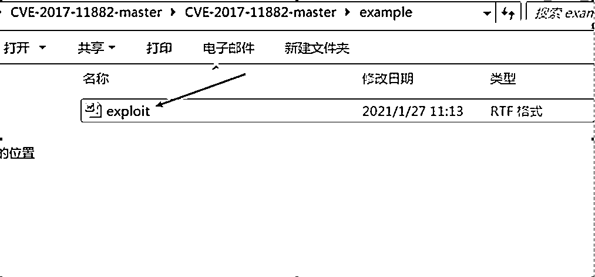
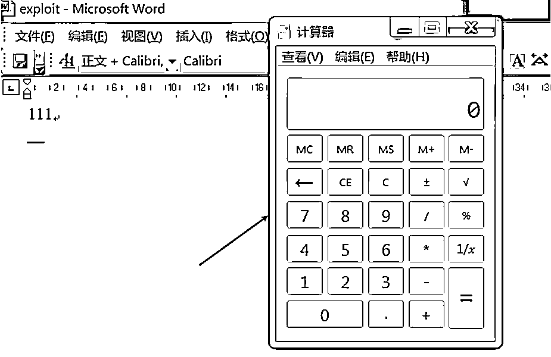

## 漏洞分析

### 1\. 定位漏洞

分析漏洞的第一步自然是定位漏洞。

#### 第一步:

1.  找到漏洞发生在哪个模块，但是第一步就遇到了问题。我用 processhacker 分析进程状态，可以看到 WINWOED.EXE 和 calc.exe 被创建出来，WINWOED.EXE 由 explore 创建，这个没问题，因为我是双击的文件打开的。calc.exe 由 cmd.exe 创建，也没问题，说明 poc 应该是拉起 cmd 的同时命令行传参，打开 calc 的。看不到 cmd 的父进程，这个不合理，至少有一个进程之类东西负责拉起 cmd。这里没显示，我感觉有可能是这个父进程把自己隐藏了，或者跑路了。
    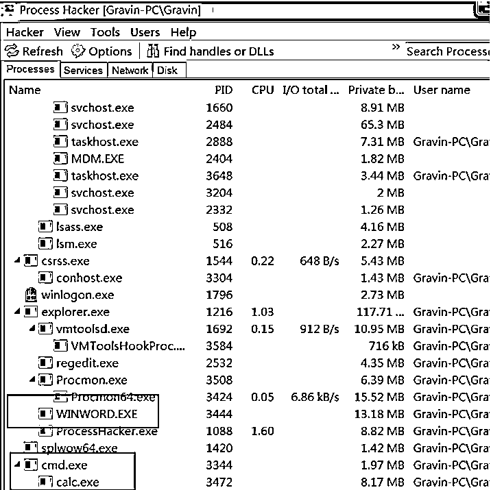

2.  接着我选择用 pchunter 来检测进程，因为 pchunter 的检测能力较强。从 pchunter 中能找到所有进程对应的父进程，但是这个关键的 cmd 的父进程 id：1872 却找不到对应的进程。虽然找到了这个关键进程的 id，但是还是不知道它是谁。推测大概率是这个 1872 进程已经结束了，它的生命周期非常短。
    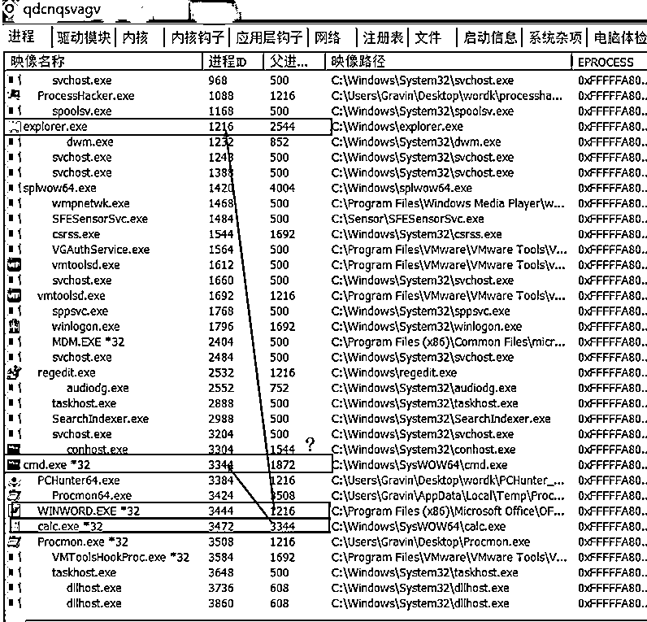

3.  花了很长时间，找到了解决方法，使用 process monitor。process monitor 虽然没有 process hack 那种动态变色方便观察的功能，但是它有个树形控件，看到所有进程之间的关系。但是依旧是遇到了一些困难，官网下载的 process monitor 无法在我这个 win7 虚拟机上运行，显示错误：无法加载设备驱动。一番百度之下，找到一个解决方案，给 win7 打上某个补丁就可以。但是我觉得这个方案不行，因为我是复现 poc，要是随便打补丁的话，就没有意义了。
    

4.  但是我记得几年前我用过这个软件，是没问题的，所以我去下载了一个老版本：2.5，于是可以正常运行。
    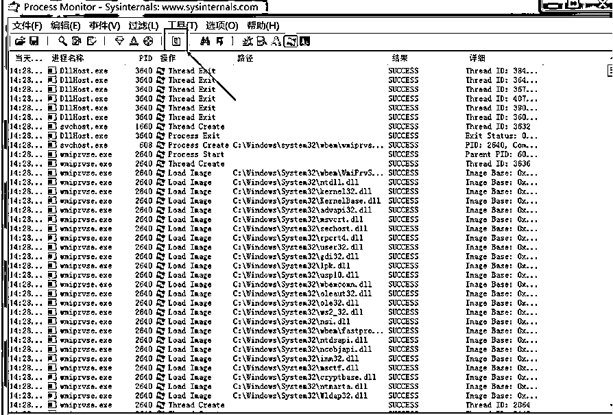

5.  点击这个树形控件之后，成功找到了 1872 这个进程：EQNEDT32.exe，并根据路径找到了文件地址。从这个监控可以看出，EQNEDT32 进程已经变灰了，说明它已经结束了，存在的时间很短。
    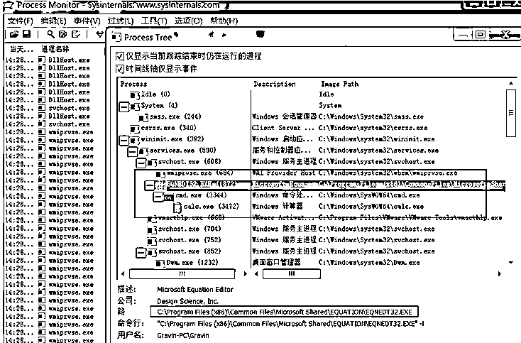

#### **第二步：**

1.  定位是这个 EQNEDT32 哪个函数有问题。原文是用的 OD 分析的，我使用的是 windbg。因为这个 EQNEDT32 是自动启动并且很快结束了，所以必须要能在它运行的第一时间就挂上调试器。这里有两个解决办法，第一个是利用 windbg 的小工具 gflag。它和 windbg 在同一层目录。
    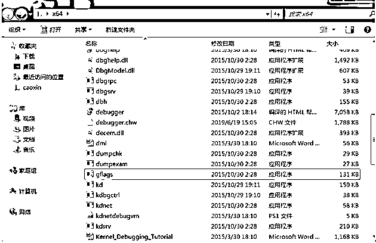
2.  我们调试的是应用层软件，所以选择 image file，然后填写名字和调试器路径即可。
    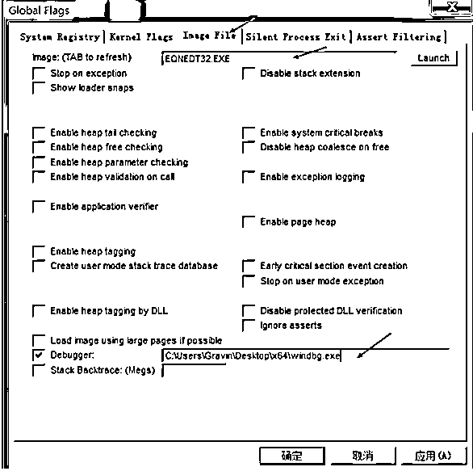
3.  还有一个方法是直接写注册表，方法一实质也是写注册表
    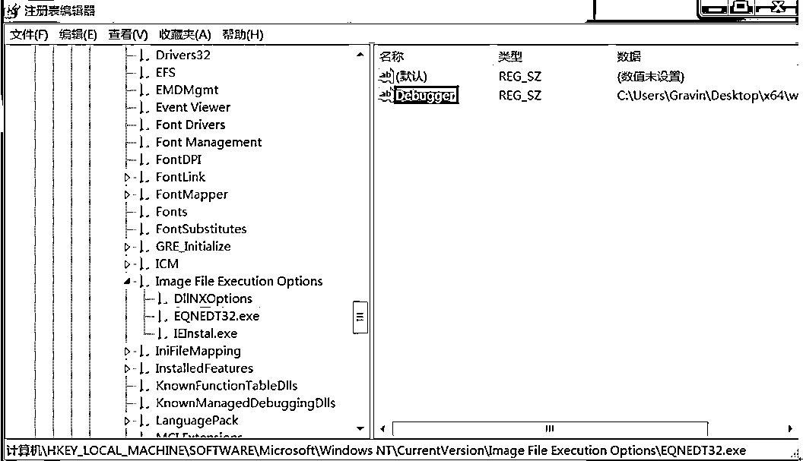
4.  这样子，只要 EQNEDT32 进程被创建就会立即被 windbg 挂住。
5.  根据 poc 可以弹出 calc，可以猜测程序中调用了 WinExec，CreateProcess 之类的 api，
    
    **注：** 这上面的第一个断点是错误示范，我第一次下断点，输错了模块名，导致断点下不上， 一度以为是符号的问题，不能在这些系统 api 上下断点。
6.  直接 g 命令，或者 f5 运行，第一处断点就找到了 WinExec，
    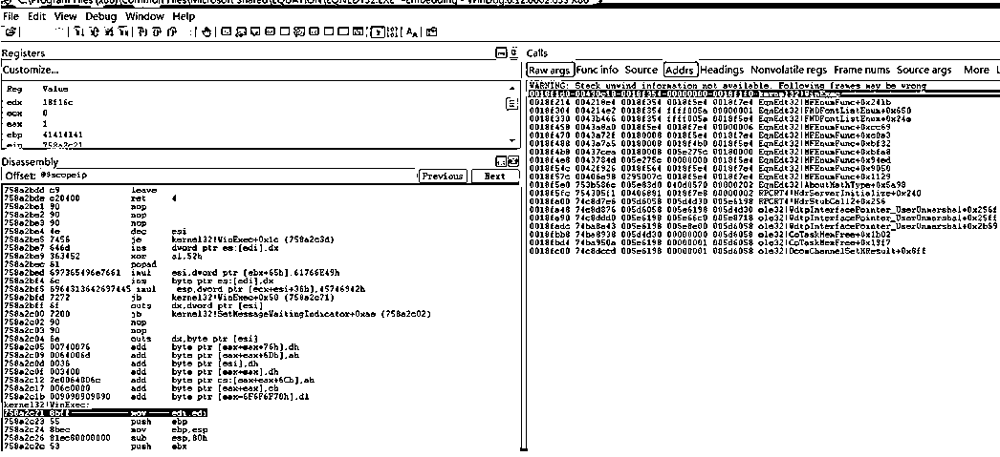
7.  查看函数栈，可以看到函数地址，以及参数。
    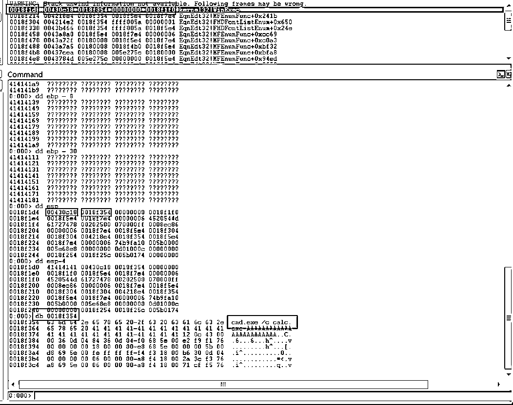
8.  其中 00430c18 是 函数返回地址，0018354 是函数参数，查看 0018354 这个地址里的内容，可以看见 cmd.exe /c calc.exe 字样，说明找到了 poc 触发位置。
    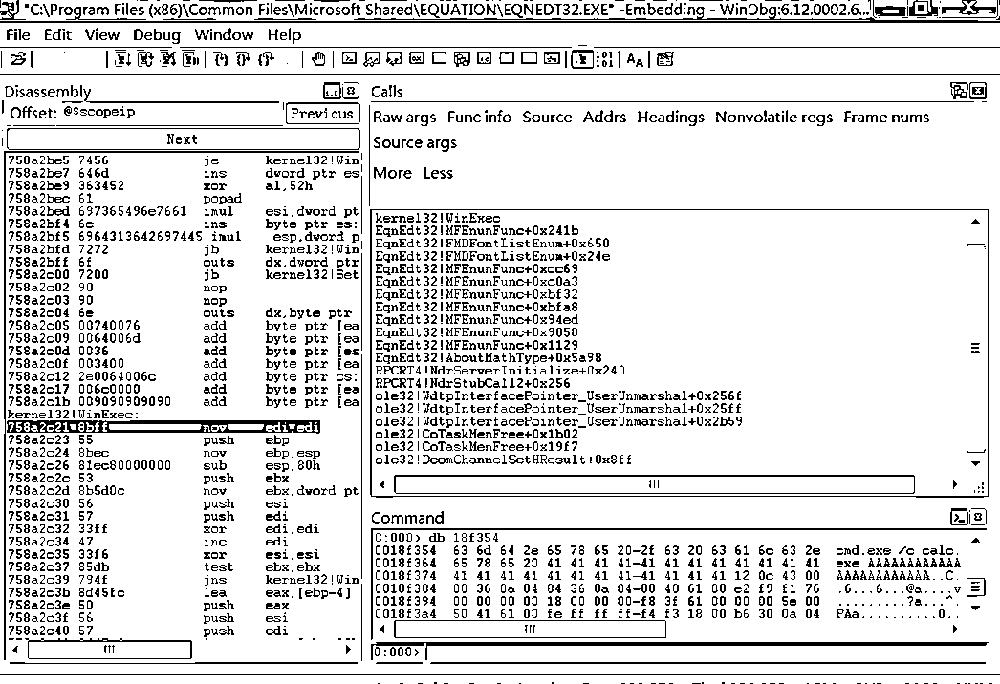
9.  再次查看函数栈，发现调用者返回地址是 004218。查看这个地址的汇编。
    
10.  找到 EqnEdt32.exe 中存在漏洞的函数，至此定位到漏洞函数。

#### **第三步：**

1.  分析漏洞原因。在 ida 中找这个函数，G + 004218df
    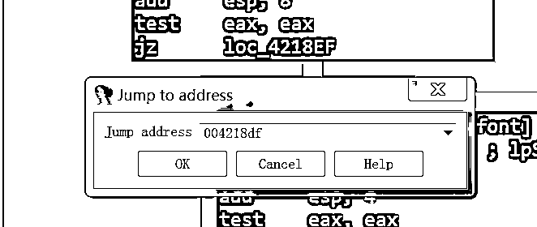
2.  找到这个函数 sub_4115A7，开始静态分析可能存在漏洞的地方。
    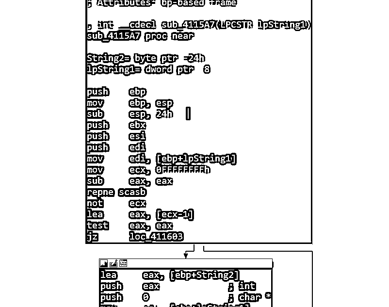
3.  这个函数很短 没什么问题，查看 sub_41160F
    
4.  在**sub_41160F**可以发现有一个字符串拷贝函数未作长度检验，也没有使用安全函数。这个地方就是漏洞所在。
    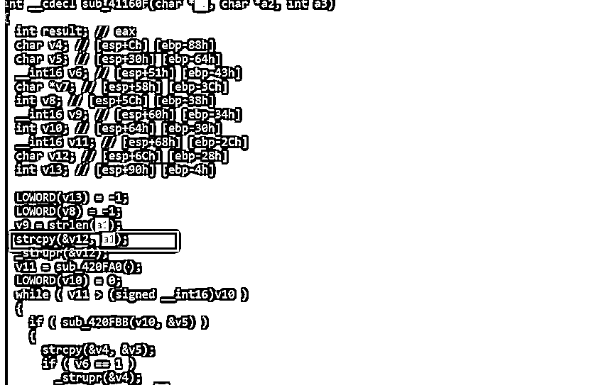

### 2\. 分析漏洞利用

1.  ida 分析发现实际存在字符串拷贝溢出的函数是 sub_441160F，其地址为 004115d3
    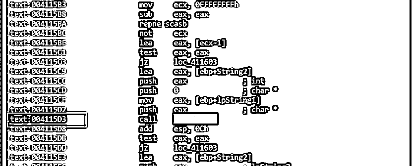
2.  再次运行 windbg，在 004115d3 处下断点
    
3.  进入这个函数，单步到字符串拷贝的地方
    
4.  分析栈帧发现，目前都很正常，函数返回地址被正确保存。`rep movs dword ptr es:[edi],dword ptr [esi]` 是字符串拷贝的关键步骤，它将 esi 指向的地址里的内存拷贝给 edi 指向的地址，先 5 查看两者内存，到这步还是正常的。
    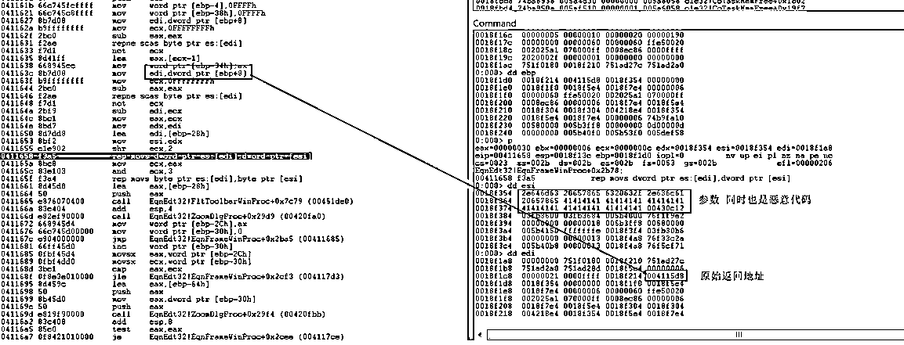
5.  但是参数的长度超过了申请的变量大小，执行该语句之后，覆盖了原始返回地址
    
    
6.  新的地址 00430c12 就是 exe 中原有的 winexec 函数。
    
7.  可见，这个 poc 没有在 shellcode 中执行跳转指令，而是直接找了现有的一个 API 函数，在正常流程 return 的时候，覆盖函数返回地址，插入了恶意代码。

## 漏洞补丁

1.  微软已经对此漏洞做出了修复
    下载 https://portal.msrc.microsoft.com/en-US/security-guidance/advisory/CVE-2017-11882 更新补丁进行修补
2.  在注册表中取消该模块的注册