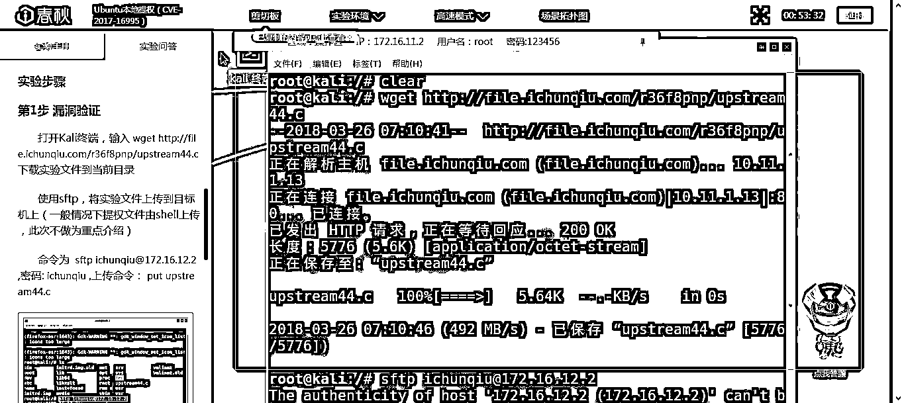
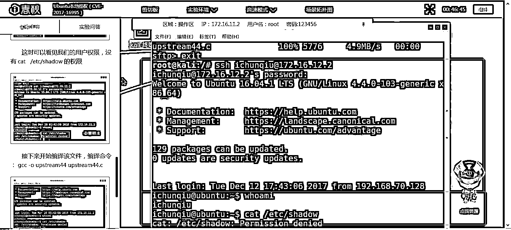
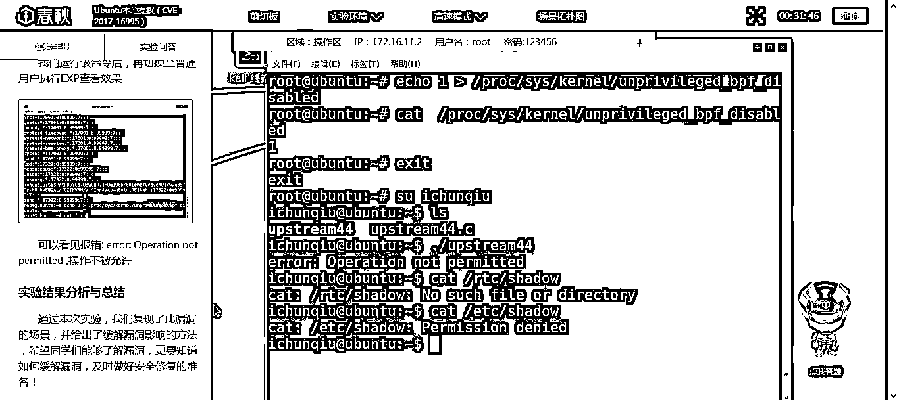

# CVE-2017-16995 漏洞利用 - Oran9e - 博客园

> 原文：[`www.cnblogs.com/Oran9e/p/8647860.html`](https://www.cnblogs.com/Oran9e/p/8647860.html)

Ubuntu 本地提权（CVE-2017-16995）漏洞复现

在 ichunqiu 看到的环境（https://www.ichunqiu.com/course/61487），觉得有意思就记录一下。

#### 实验环境

*   操作机：`Kali Linux`

*   IP：`172.16.11.2`

*   目标 IP：`172.16.12.2`

*   目标账号密码：`ichunqiu`

*   工具下载地址：`http://file.ichunqiu.com/r36f8pnp/`

#### 实验目的

*   了解 Ubuntu 本地提权漏洞的危害

*   验证本地提权漏洞

*   知晓 Ubuntu 本地提权漏洞的缓解修复

#### 实验工具

*   `upstream44.c`: 实验中本地提权 EXP 的源文件，需编译后执行

#### 实验内容

**漏洞概述**

近日，有网友发布消息：ubuntu 最新版本（Ubuntu 16.04）存在高危的本地提权漏洞，漏洞编号为 CVE-2017-16995。该漏洞存在于调用 eBPF bpf(2)的 Linux 内核系统中，当用户提供恶意 BPF 程序使 eBPF 验证器模块产生计算错误，导致任意内存读写问题， 低权限用户可使用此漏洞获得管理权限。

该漏洞在老版本中已经得到修复，然而最新版本中任可被利用，官方暂未发布相关补丁，漏洞处于 0day 状态。

**影响范围**

经 i 春秋安全研究员测试 Ubuntu 16.04.1~16.04.4 均存在此漏洞

#### 实验步骤

#### 第 1 步 漏洞验证

打开 Kali 终端，输入`wget http://file.ichunqiu.com/r36f8pnp/upstream44.c`下载实验文件到当前目录

使用 sftp，将实验文件上传到目标机上（一般情况下提权文件由 shell 上传，此次不做为重点介绍）

命令为 `sftp ichunqiu@172.16.12.2`,密码:`ichunqiu`,上传命令：`put upstream44.c`

 

`ichunqiu`是一个测试的普通权限用户

接着，我们使用 ssh 登录目标机器的`ichunqiu`用户

 

接下来开始编译该文件，编译命令：`gcc -o upstream44 upstream44.c`

得到可执行文件`upstream44`

最后，执行刚刚编译后的文件，成功提升至 root 权限

我们再来 `cat /etc/shadow`一下,现在可以看见内容了

 

#### 第 2 步 漏洞缓解

虽然官网暂时未发布补丁升级方案，但是可以通过修改内核参数来限制普通用户使用 bpf(2)系统调用的方式以规避风险。

修改命令如下

echo 1 > /proc/sys/kernel/unprivileged_bpf_disabled

我们运行该命令后，再切换至普通用户执行 EXP 查看效果

可以看见报错:`error: Operation not permitted`,操作不被允许

#### 

####  EXP： [`cyseclabs.com/exploits/upstream44.c`](http://cyseclabs.com/exploits/upstream44.c)

#### 实验结果分析与总结

通过本次实验，我们复现了此漏洞的场景，并给出了缓解漏洞影响的方法，希望同学们能够了解漏洞，更要知道如何缓解漏洞，及时做好安全修复的准备！

任重而道远！