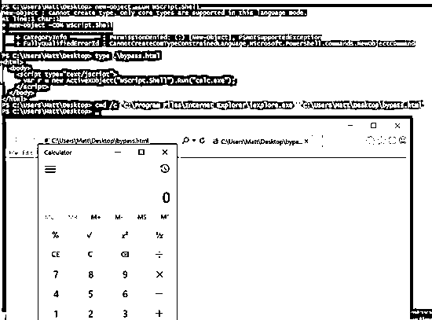
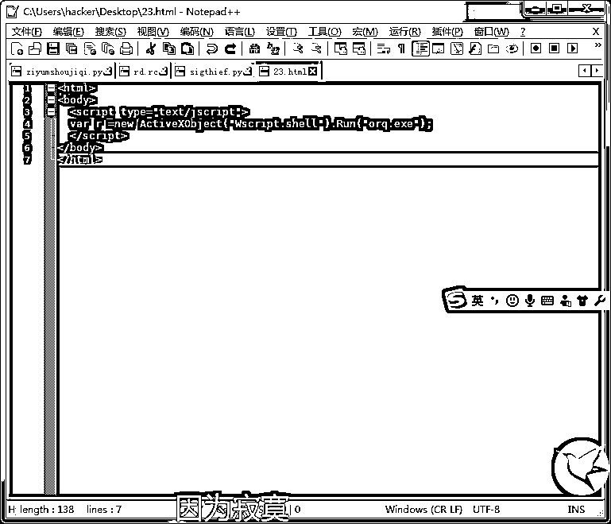
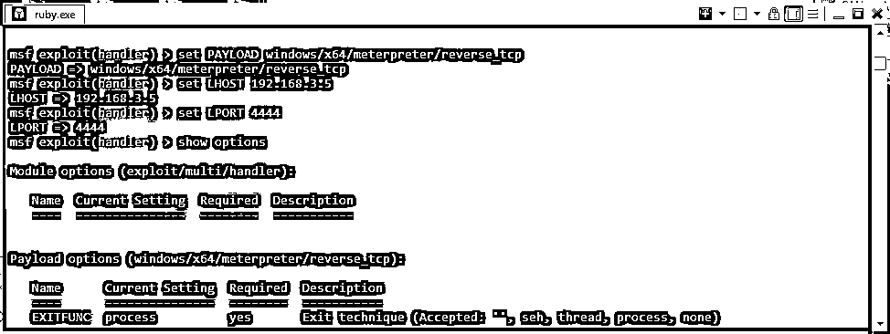
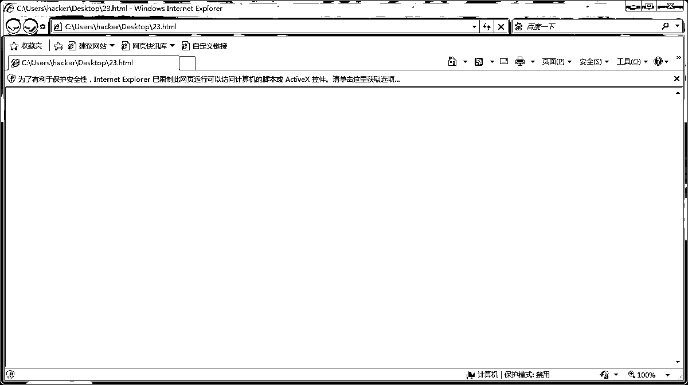
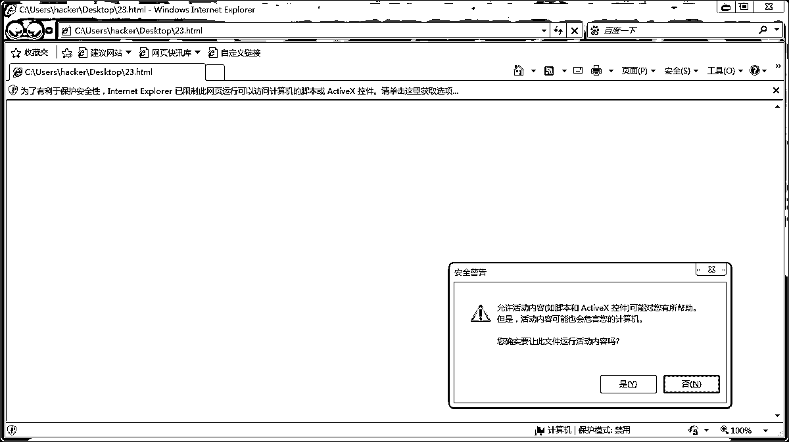
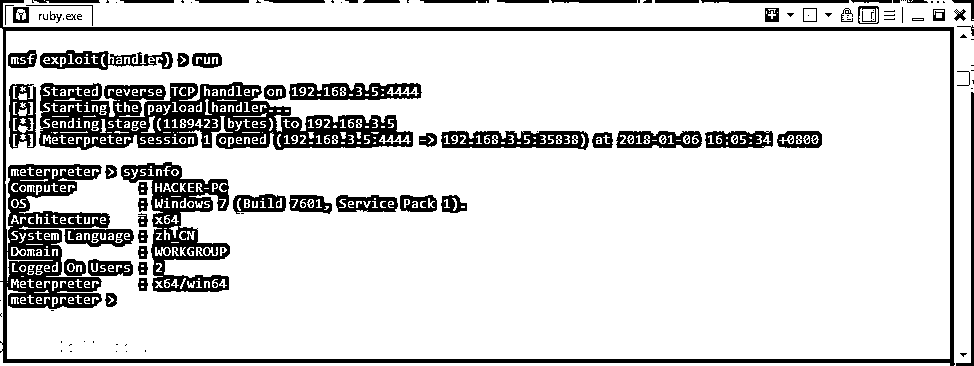

# CVE-2017-8635 复现 - 东京$ - 博客园

> 原文：[`www.cnblogs.com/haq5201314/p/8214526.html`](https://www.cnblogs.com/haq5201314/p/8214526.html)

在最近几个月里，我花了一些时间深入了 Device Guard 以及如何实现用户模式代码完整性（UMCI）。如果您对 Device Guard 不熟悉，您可以 [在这里](https://docs.microsoft.com/en-us/windows/device-security/device-guard/device-guard-deployment-guide)阅读更多信息。通常情况下，UMCI 可防止未经批准的二进制文件执行，限制 Windows 脚本主机，并将 PowerShell 置于“ [约束语言”模式](https://technet.microsoft.com/en-us/library/dn433292.aspx)。这使得在系统上获得代码执行相当具有挑战性。这篇文章将突出显示绕过用户模式代码完整性来实例化通常被阻止的对象。

此漏洞在 [CVE-2017-8625 的](https://portal.msrc.microsoft.com/en-us/security-guidance/advisory/CVE-2017-8625) 2017 年 8 月发布的补丁星期二发布。这个补丁修复了两种不同的技术，因为他们都滥用了 MSHTML 没有开明的事实。另一种技术滥用 Microsoft 编译的 HTML 帮助文件（CHM）。这是[@Oddvarmoe 的](https://twitter.com/Oddvarmoe)博客[文章](https://twitter.com/Oddvarmoe)，你可以在这里阅读更多关于：[https](https://msitpros.com/?p=3909) : [//msitpros.com/?p=3909](https://twitter.com/Oddvarmoe)

正如我上面提到的，错误的根本原因是 MSHTML 在 UMCI 环境下没有启发。这实际上意味着 Device Guard 的 UMCI 组件不会限制 MSHTML，只是让它用假定的“完全信任”来执行所有的事情。因此，Internet Explorer 允许加载受限制的对象。怎么，你可能会问？答案在于 Internet Explorer 能够与 ActiveX 和 COM 组件接口=）

例如，下面的 HTML 文件将使用脚本标记来运行一些 JScript。UMCI 通常阻止这个对象的实例化（以及几乎每隔一个）。作为一个 PoC，我刚刚实例化了 WScript.Shell 并调用了“Run”方法来演示我可以实例化一个阻塞的对象并调用它的一个方法。

这是 IE 的一个致命的漏洞，如果攻击者有台外网服务器借 msfvenom 的 payload。然后发到银行内部！后果可想而知

这时受害者打开 IE

然后！

补丁下载:https://bbs.aliyun.com/read/323926.html