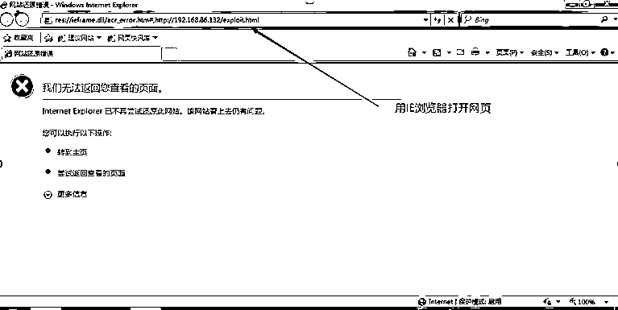

# CVE-2018-8174 漏洞复现（IE 浏览器远程代码执行漏洞） - 冲田总司 cc - 博客园

> 原文：[`www.cnblogs.com/tsimfeiwan/p/11990565.html`](https://www.cnblogs.com/tsimfeiwan/p/11990565.html)

**漏洞介绍：**CVE-2018-8174 这个漏洞是针对 IE 浏览器的一个远程代码执行漏洞，是 Windows VBScript Engine 代码执行漏洞，由于 VBScript 脚本执行引擎（vbscript.dll）存在代码执行漏洞，攻击者可以将恶意的 VBScript 嵌入到 office 文件或者网站中，一旦用户不小心点击，远程攻击者可以获取当前用户权限执行脚本中的恶意代码。

**受影响产品：**Windows 7, Windows Server 2012 R2, Windows RT 8.1, Windows Server 2008, Windows Server 2012, Windows 8.1, Windows Server 2016, Windows Server 2008 R2, Windows 10, Windows 10 Servers

**复现过程**

环境：kali[192.168.86.132]  + （win7+IE）[192.168.86.130]

step1、去 Github 下载 exp 到 kali 上

（下载地址：[`github.com/Sch01ar/CVE-2018-8174_EXP`](https://github.com/Sch01ar/CVE-2018-8174_EXP)）

 进入文件目录

 然后生成 payload

python CVE-2018-8174.py -u payload 的 url -o rtf 文件的名字 -i ip 地址 -p 端口

然后就能看到生成了两个文件：一个 HTML、一个 rtf 文件

将 HTML 文件复制到 nginx 的网站

 step2、关闭 apache 服务、重启 Nginx（现在的 kali 是自带安装好了 apache 和 nginx 了）

step3、启动 nc 监听刚刚设置好的端口，等待对方打开网站

 step4、用 win7 的 IE 浏览器打开 url 地址

IE 浏览器打开网页，虽然没有正常显示这个页面，但是已经攻击成功了，攻击机上没有发觉什么异样情况

 step5、返回 kali 看看，已经反弹一个 shell 了

over！！！（今天复现了一个漏洞，写了个笔记发在这里啦！）