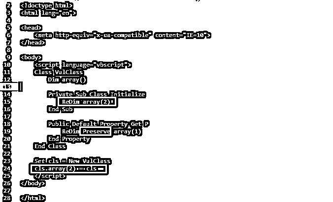
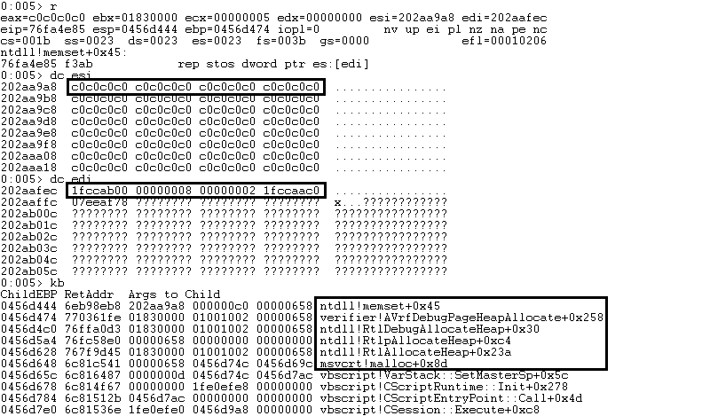
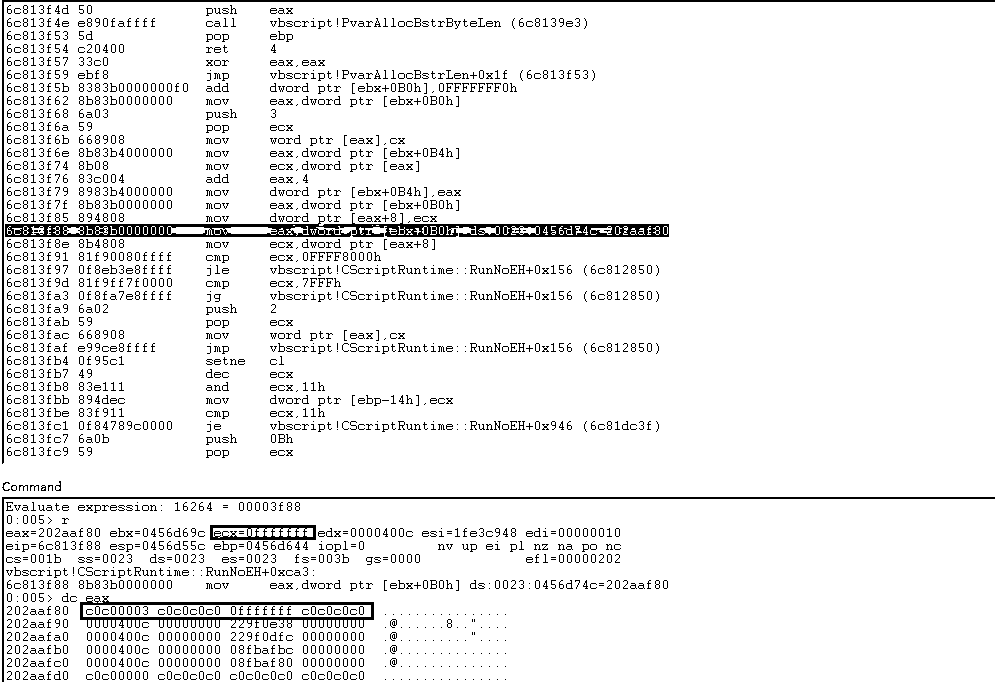

# CVE-2018-8373 相关利用杂谈 - goabout2 - 博客园

> 原文：[`www.cnblogs.com/goabout2/p/9601583.html`](https://www.cnblogs.com/goabout2/p/9601583.html)

前段时间趋势披露了 VBS 引擎的在野 0day CVE-2018-8373，当时中心第一时间披露了该次攻击和 Darkhotel 的关联，上周花了段时间将该漏洞的 exp 构造出来，如下所示，目前来看 UAF 占位上不是太稳定，后续会继续改进，构造 exp 的时候遇到一些坑，遂找时间记录一下。

利用思路上趋势的文章中其实已经介绍得很清楚，在 Default  Property 中通过一个二维数组 array1 对释放的 array（2）内存进行占位，并返回一个大的 0x0FFFFFFF 值，当 cls.array(2) = cls 赋值时，该 0x0FFFFFFF 会写入到 array（2），由于该 array（2）的内存空间之前巧妙的被二维数组 array1 占据，写入到 0x0FFFFFFF 正好将该二维数组的其中一维长度被设置为 0x0FFFFFFF。

通过该 array1（0x0FFFFFFF，2）创建一个超长的 fakearray，从而实现全局内存读写（期间需要在 array1 中搜索两个特殊的 index，可以使用银雁冰同学之前提供的方法，即暴力的 type 类型搜索）。

 

这个地方遇到的坑就是构造的时候最好不要在打了 CVE-2018-8174 的机器上测试，如下所示是我们正常构造的 array1 二维数组，其中红框对应的具体的两个维数（红框），我们的目标就是通过 cls.array(2) = cls 修改这两维。

 

返回的数据如下所示，这是一个 int 类型变量的内存结构，其数值为 0x0FFFFFFF，可以看到绿色部分不为 0（而是改为了 C0），第一个红框中的 8 个字节的高字节也不为 0（同样也是 C0），注意这样的内存结构是固定的。

 

这就导致之后 cls.array(2) = cls 返回二维数组被修改如下，但是这样的二维数组的内存结构是有问题的，此时你直接操作该二维数组将导致报错（数组越界，超过 0x0FFFFFFF）。

 

如下所示可以看到一个标准利用时被修改的 array1 的内存结构应该如下（该图来自于趋势科技的原文），通过后来的调试发现，8174 之前的补丁 0x0FFFFFF 对应的内存结构就是下图红框所示（虽然绿框中 0 部分有时也不为 0，但是其整体的值不会大于 0x0FFFFFF）。 

但是打过 8174 补丁之后，其中绿色的部分会被填充上数据（固定填充），从而导致之后难以利用。

 

其主要原因在于 CScriptRuntime 对象的 Local Variables 在补丁之后会初始化为 C0 的形式。

而变量的初始化时直接在这块内存上进行的，如下可知对 int 类型的变量只是简单的将 3,4 字节赋值为 0003（int 的 type 类型），8-c 赋值对 int 的实际值，其余位置默认为内存的初始化值 C0。

 

因此这里我挺好奇当时趋势抓获的样本中是否有相应的技巧将 0x0FFFFFF 变量的内存进行规范化，还是说他们当时测试的时候是在没有打 8174 补丁的机器上进行，如果是第二点的话，该漏洞的利用似乎在打了 8174 补丁上的机器上是无法利用的（如果不能很好解决变量初始化时的 C0 问题）。

 转载请注明出处

参考

[`blog.trendmicro.com/trendlabs-security-intelligence/use-after-free-uaf-vulnerability-cve-2018-8373-in-vbscript-engine-affects-internet-explorer-to-run-shellcode/`](https://blog.trendmicro.com/trendlabs-security-intelligence/use-after-free-uaf-vulnerability-cve-2018-8373-in-vbscript-engine-affects-internet-explorer-to-run-shellcode/)

[`bbs.pediy.com/thread-246327.htm`](https://bbs.pediy.com/thread-246327.htm)