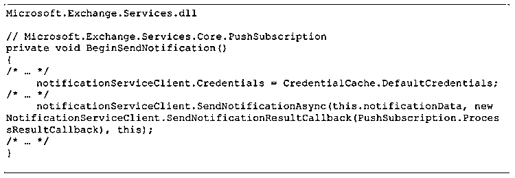
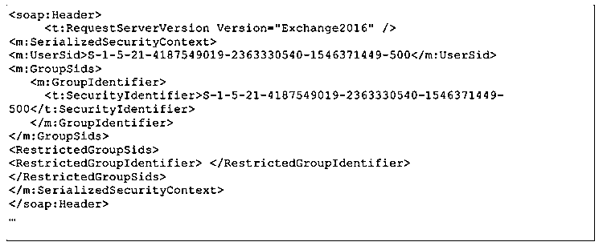
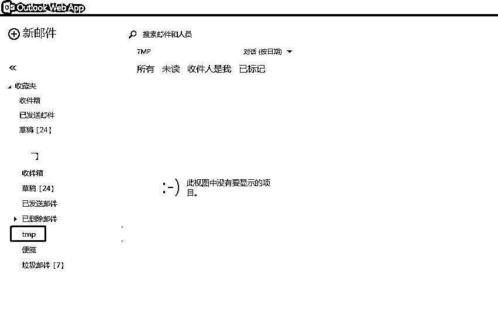
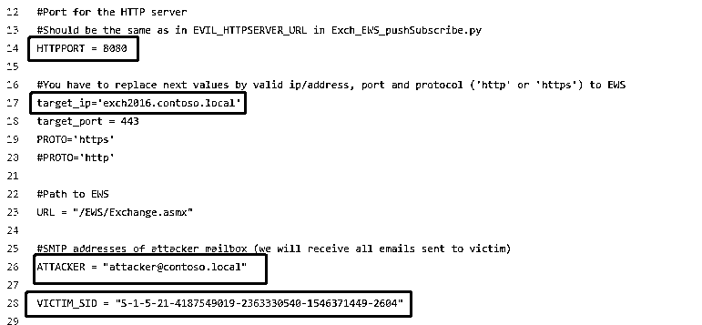
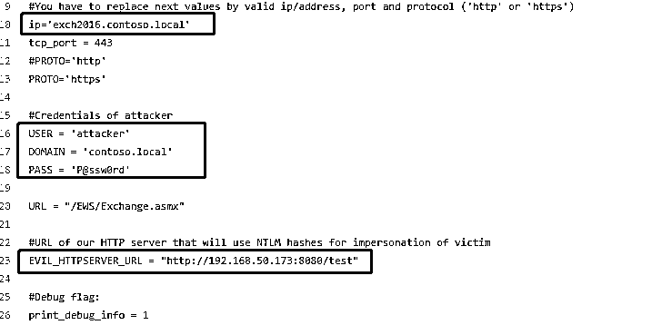
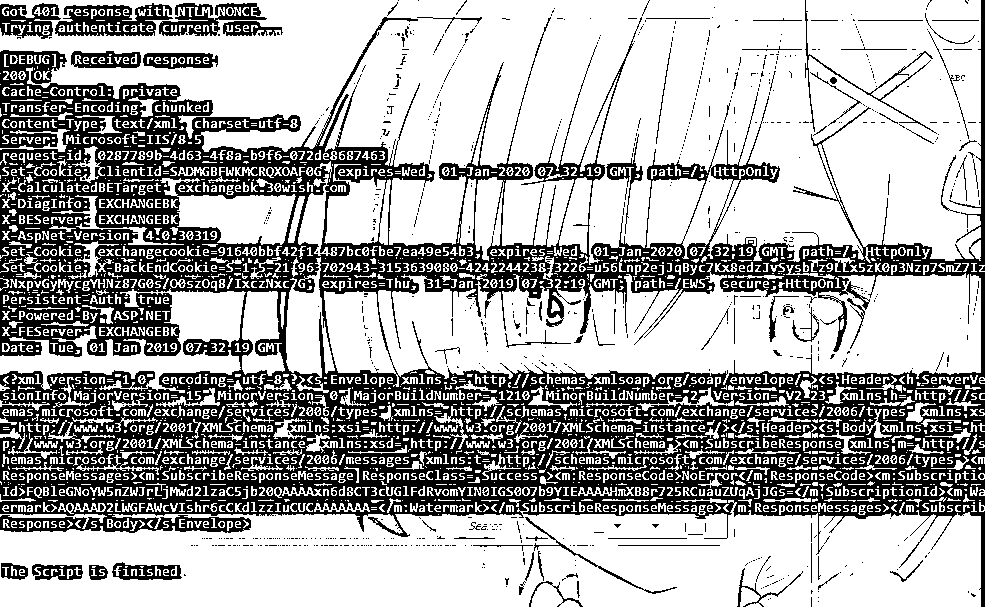
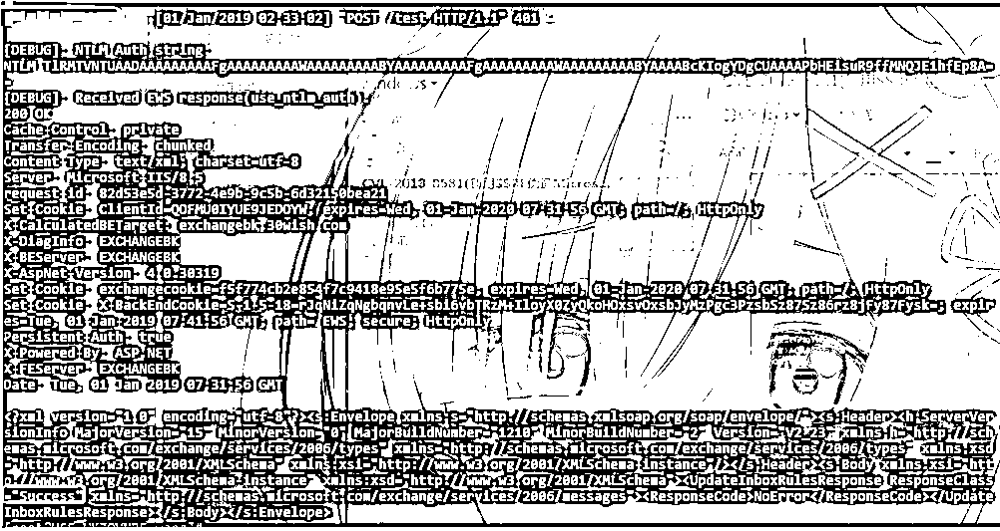

# CVE-2018-8581(利用 SSRF 伪造 Microsoft Exchange 任意用户) - apossin - 博客园

> 原文：[`www.cnblogs.com/apossin/p/10205605.html`](https://www.cnblogs.com/apossin/p/10205605.html)

**0x01 背景**    近日，安全研究人员发现微软 Microsoft Exchange SSRF 漏洞，该漏洞它允许任何经过身份验证的用户冒充 Exchange Server 上的其他用户，从而得到被冒充用户的权限。    漏洞的提交时间在 2018 年 11 月 14 日。    漏洞的影响版本为 Microsoft Exchange Server 2010、2013、2016、2019。**0x02 漏洞详情**    Exchange 允许任何用户把订阅推送到指定的 URL，服务器将向此 URL 发送通知。 Exchange 服务器使用了 CredentialCache.DefaultCredentials 进行连接导致出现以下问题：        在 Exchange Web 服务中，CredentialCache.DefaultCredentials 以 NT AUTHORITY \ SYSTEM 权限运行。导致 Exchange Server 会将 NTLM Hash 发送到攻击者的服务器。Exchange 服务器在默认情况下还设置了以下注册表项：

```
HKEY_LOCAL_MACHINE\SYSTEM\CurrentControlSet\Control\Lsa\DisableLoopbackCheck = 1
```

我们可以使用这些 NTLM Hash 进行 HTTP 身份验证。 例如，利用这些哈希来访问 Exchange Web 服务（EWS）。因为它以 NT AUTHORITY \ SYSTEM 权限运行，攻击者可以利用令牌来建立“特权”会话，然后利用 SOAP 头冒充任意用户。下面是利用管理员 SID 来伪造管理员身份的 SOAP 头：**0x03 漏洞利用**    为了冒充用户身份，需要结合 SSRF 和其他漏洞。    使用的脚本是： [`github.com/thezdi/PoC/tree/master/CVE-2018-8581`](https://github.com/thezdi/PoC/tree/master/CVE-2018-8581)     需要安装 python-ntlm 模块。    且需要一个授权用户的账号。第一步是获取他人的 SID。    1.首先用自己的账户登录 OWA，并任意创建一个文件夹。2.接下来在文件夹上右键-〉权限，添加被攻击的用户地址。    3.再次点击文件->权限。并对这一操作抓包。4.在响应正文里找到对应用户的 SID。具体位置为：Body->ResponseMessages->Items->0->Folders->0->PermissionSet->Permissions->N->UserId->SID（N 在本例中是 3）5.接下来修改脚本：serverHTTP_relayNTLM.py 并在 vps 上启动监听。6.接下来配置 Exch_EWS_pushSubscribe.py 并执行该脚本。7.一段时间后，vps 上收到推送。7.收到 success 代表攻击已经成功。新的规则已经被添加到受害者邮箱，受害者收到的所有电子邮件都会转发给攻击者。**0x04 攻击中可能遇到的问题**    1.在配置 Exch_EWS_pushSubscribe.py 时，需要配置 domain，它的获取可能不是那么容易。    2.我在运行 github 给出的 Exch_EWS_pushSubscribe.py 时，返回值是 500 没有成功，且返回的 response.msg 是乱码，没法确定问题。    这时，修改脚本按照 utf8 编码：#sending request and receiving response            conn.request("POST", URL, body, headers)            response = conn.getresponse()            resp_data = response.read().decode('utf-8')    得到返回报错。<?xml version="1.0" encoding="utf-8"?><s:Envelope xmlns:s="http://schemas.xmlsoap.org/soap/envelope/"><s:Body><s:Fault><faultcode xmlns:a="http://schemas.microsoft.com/exchange/services/2006/types">a:ErrorSchemaValidation</faultcode><faultstring xml:lang="zh-CN">该请求未通过架构验证: 元素 命名空间“http://schemas.microsoft.com/exchange/services/2006/messages”中的“PushSubscriptionRequest”。 的子元素 命名空间“http://schemas.microsoft.com/exchange/services/2006/types”中的“CallerData”。 无效。应为可能元素的列表: 命名空间“http://schemas.microsoft.com/exchange/services/2006/types”中的“URL”。。</faultstring><detail><e:ResponseCode xmlns:e="http://schemas.microsoft.com/exchange/services/2006/errors">ErrorSchemaValidation</e:ResponseCode><e:Message xmlns:e="http://schemas.microsoft.com/exchange/services/2006/errors">请求未通过架构验证。</e:Message><t:MessageXml xmlns:t="http://schemas.microsoft.com/exchange/services/2006/types"><t:LineNumber>18</t:LineNumber><t:LinePosition>17</t:LinePosition><t:Violation>元素 命名空间“http://schemas.microsoft.com/exchange/services/2006/messages”中的“PushSubscriptionRequest”。 的子元素 命名空间“http://schemas.microsoft.com/exchange/services/2006/types”中的“CallerData”。 无效。应为可能元素的列表: 命名空间“http://schemas.microsoft.com/exchange/services/2006/types”中的“URL”。。</t:Violation></t:MessageXml></detail></s:Fault></s:Body></s:Envelope>    发现是某个子元素无效。我对该命名空间缺乏了解，只能暴力一点，在 body 里删除无效的元素。（后发现并不影响执行效果）    3.在 vps 上执行的 serverHTTP_relayNTLM.py 需要注意请求的 owa 版本。脚本里默认是 2016,如果版本不对应会返回 500 错误，改成正确版本即可，我的话改成 2013。**0x05 修补方案**    Microsoft 在 11 月发布的更新里发布了此漏洞的环节措施，通过删除注册表项开启回环检测。    具体方法是开启管理员权限的 cmd 并输入命令：

```
reg delete HKEY_LOCAL_MACHINE \ SYSTEM \ CurrentControlSet \ Control \ Lsa / v DisableLoopbackCheck / f
```

    删除后无需重启系统或 Exchange Server。公告指出，未来 Exchange 更新后将不再默认启用注册表项。**0x06 参考**    [`nosec.org/home/detail/2117.html`](https://nosec.org/home/detail/2117.html)    [`cve.mitre.org/cgi-bin/cvename.cgi?name=CVE-2018-8581`](http://cve.mitre.org/cgi-bin/cvename.cgi?name=CVE-2018-8581)    [`cloud.tencent.com/developer/news/378493`](https://cloud.tencent.com/developer/news/378493)