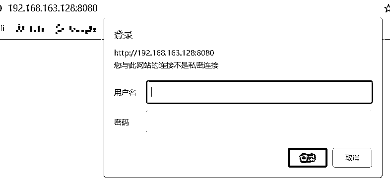
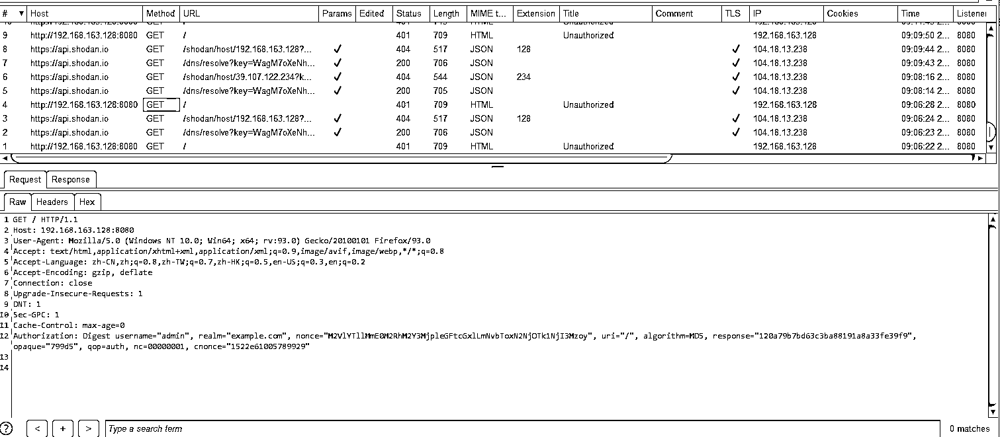
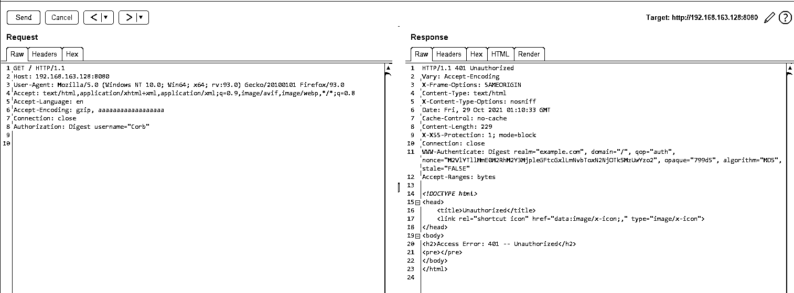
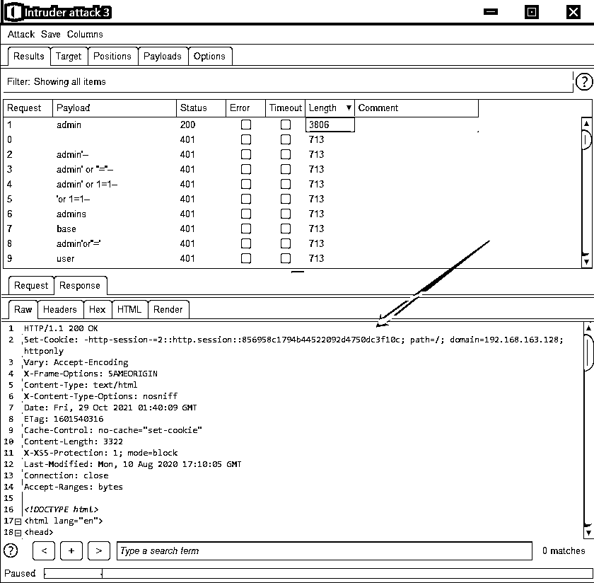
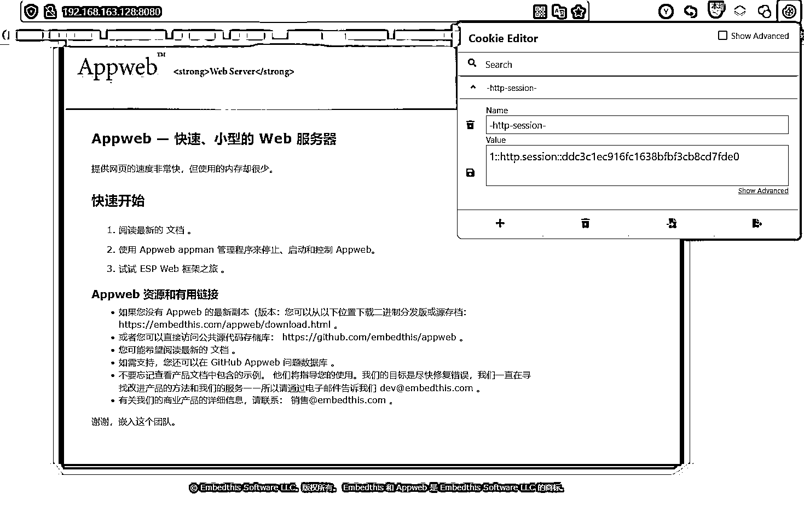

# CVE-2018-8715 - 七先生 - 博客园

> 原文：[`www.cnblogs.com/Qixiansheng/p/15479199.html`](https://www.cnblogs.com/Qixiansheng/p/15479199.html)

# Appweb CVE-2018-8715 漏洞复现

## 0\. 环境搭建

0.  安装 docker：

    ```
    curl -s https://get.docker.com/ | sh 
    ```

1.  搭建 vulhub，使用 wget 下载 vulhub：

    ```
    wget https://github.com/vulhub/vulhub/archive/master.zip -O vulhub-master.zip 
    ```

    解压：

    ```
    unzip vulhub-master.zip 
    ```

    进入漏洞环境：

    ```
    cd /tools/range/appweb/CVE-2018-8715 
    ```

    启动环境：

    ```
    docker-compose up -d 
    ```

## 1\. 漏洞原理

​ 在 APP 7.0.3 之前的版本中，对于 digest 和 form 两种认证方式，如果用户传入的密码为`null`（也就是没有传递密码参数），appweb 将因为一个逻辑错误导致直接认证成功， 并返回 session。

​ 漏洞影响范围：版本<= 7.0.2

## 2\. 漏洞复现

0.  访问 192.168.16.128:8080，Appweb 需要认证登录：



1.  设置代理，输入账号密码，Burp 抓包：



2.  修改包，删除其他参数，留下 username 参数：



3.  发送到 Intruder，开始爆破：



4.  爆破成功，用户名 admin，获取到 session，利用 session 修改插件，进入 Appweb：



漏洞复现完成~

* * *

### 总结

​ 该漏洞难度利用不大，难点在两，一是信息收集，你需要清楚这个基础认证是不是 Appweb，碰到 digest 的认证的时候，该漏洞可以尝试；二是字典，如果你的字典中间没有他的这个用户名，那就没什么办法，只能多收集，补充自己的字典。

​ 解决方法：升级版本永远都是漏洞的第一解决办法，因为出现漏洞急的永远不会是使用者和白帽们，首先急的一定是厂家。修改成非常用的用户名可能也是一个办法，不过就怕会碰到大字典的白帽，不能确定谁家字典就有那个用户名，所以不太推荐。