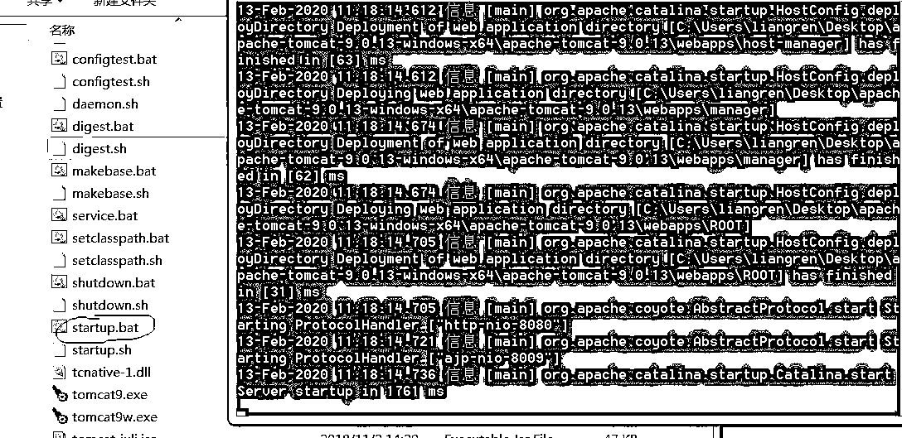
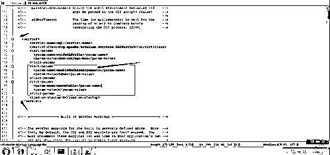
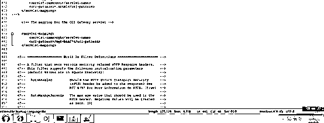
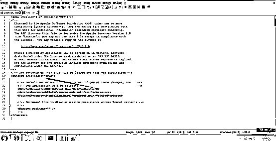
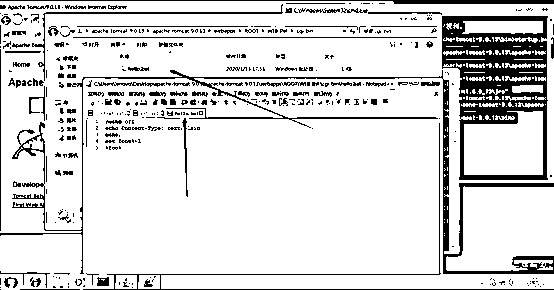
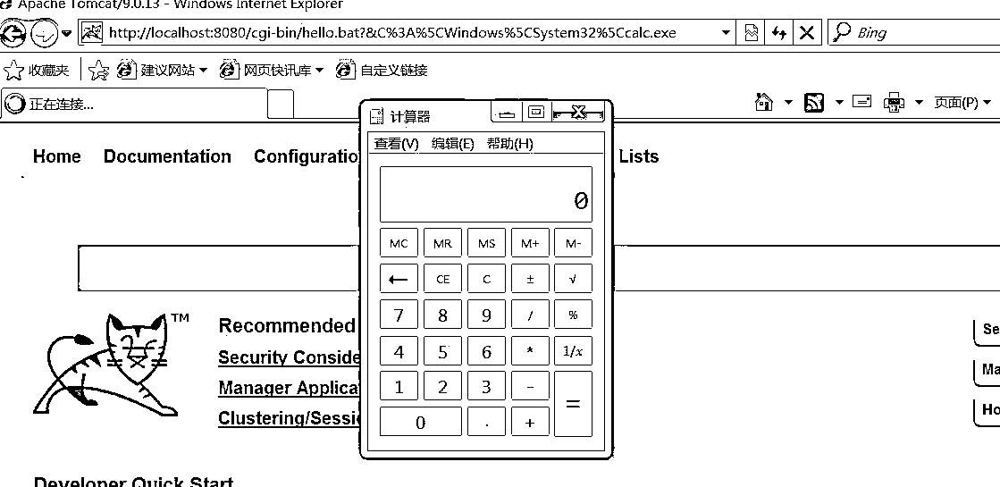

# CVE-2019-0232 漏洞复现 - 终落 - 博客园

> 原文：[`www.cnblogs.com/twlr/p/12303052.html`](https://www.cnblogs.com/twlr/p/12303052.html)

## CVE-2019-0232

## 1、漏洞简介

　　CVE-2019-0232 漏洞是由于 Tmocat CGI 将命令行参数传递给 Windows 程序的方式存在错误，使得 CHIServler 被命令注入影响。

　　该漏洞只影响 Windows 平台，要求启用了 CGIServlet 和 enableCmdLineArguments 参数。但是 CGIServlet 和 enableCmdLineArguments 参数默认情况下都不启用。

　　漏洞影响范围：

　　　　Apache Tomcat 9.0.0.M1 to 9.0.17

              Apache Tomcat 8.5.0 to 8.5.39

　　　　Apache Tomcat 7.0.0 to 7.0.93

## 2、搭建环境

　　靶机：windows7

　　jdk 环境(我这里用的 jdk_1.8.0_201)

　　下载符合版本的 Tomcat 安装包    [`archive.apache.org/dist/tomcat/`](https://archive.apache.org/dist/tomcat/)

## 3、漏洞复现

　　1、下载好安装包之后，进入 bin 目录执行 startup.bat 启动 tomcat。

 　　2、访问 http://localhost:8080

 　　3、修改配置文件

　　　　Tomcat 的 CGI Servlet 组件时默认关闭的，在 conf/web.xml 中找到注释的 CGIServlet 部分，删除注释，并配置 enableCmdLineArguments 和 executable（删除注释的一共两部分；源文件没有 enableCmdLineArguments 和 executable 参数所以需要手打即下访红框内容）

 

 　　接着修改 conf/context.xml 文档中的<Context>添加 privileged=“true”语句

　　

 　　4、在 apache-tomcat-9.0.13 安装包中的 webapps/ROOR/WEB-INF 目录下新建 cgi-bin 文件夹，并在文件夹内创建 bat 文件，bat 文件内容如下：

 　　环境配置完毕！重启 tomcat 服务。

　　5、利用 payload：

[`localhost:8080/cgi-bin/hello.bat?&C%3A%5CWindows%5CSystem32%5Ccalc.exe`](http://localhost:8080/cgi-bin/hello.bat?&C%3A%5CWindows%5CSystem32%5Ccalc.exe)

　　进行访问：

　　漏洞复现完成。

## 4、修复建议

1.  禁用 enableCmdLineArguments 参数。
2.  在 conf/web.xml 中覆写采用更严格的参数合法性检验规则。
3.  升级 tomcat 到 9.0.17 以上版本。