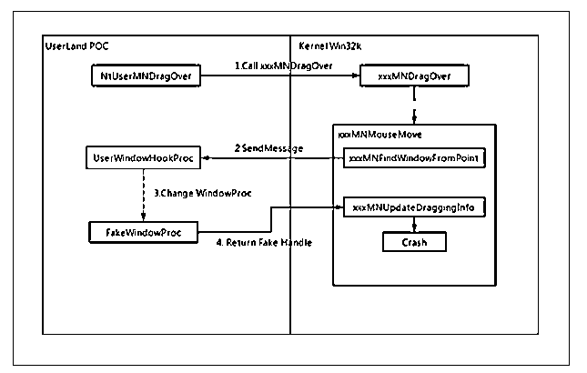
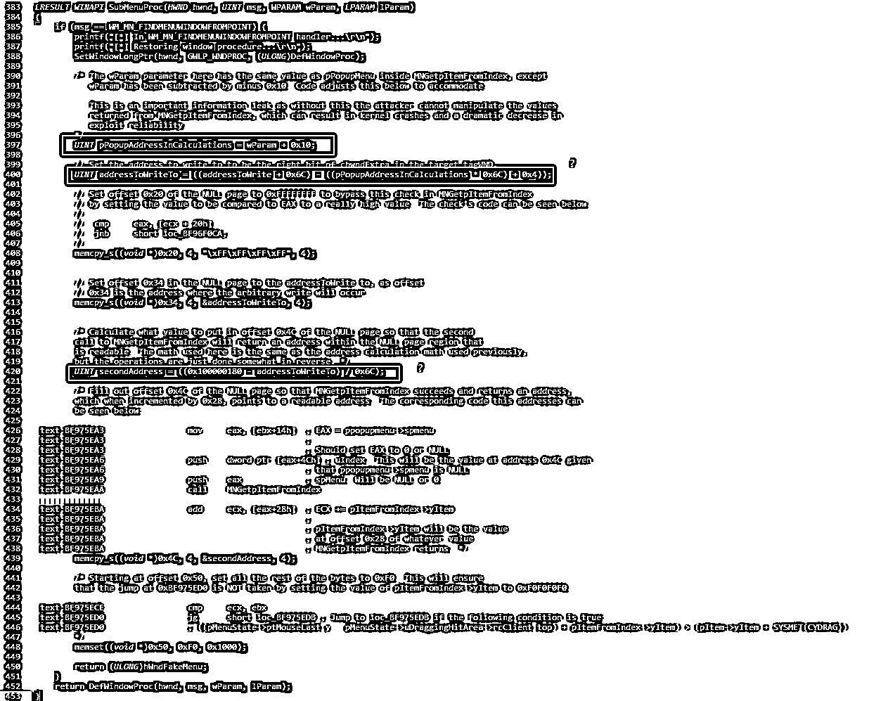
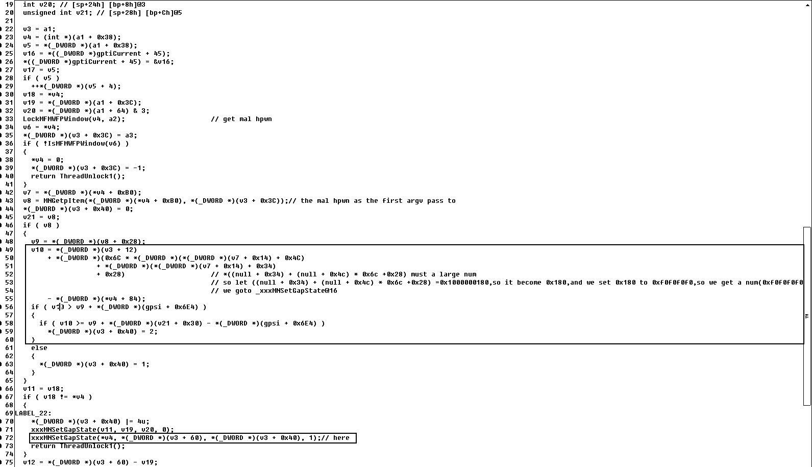
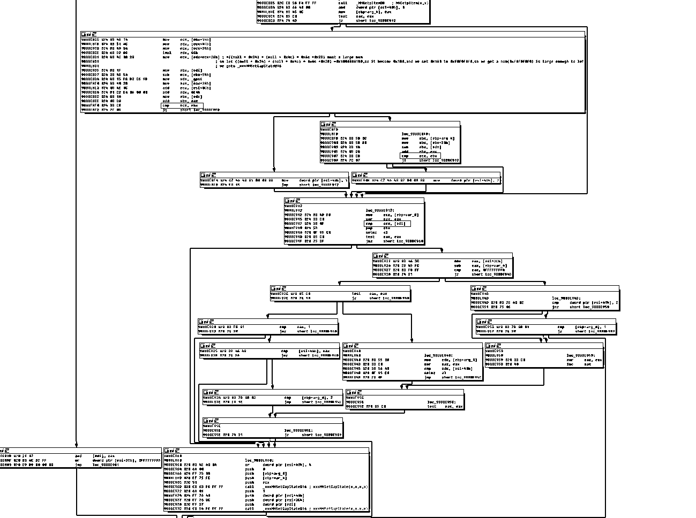
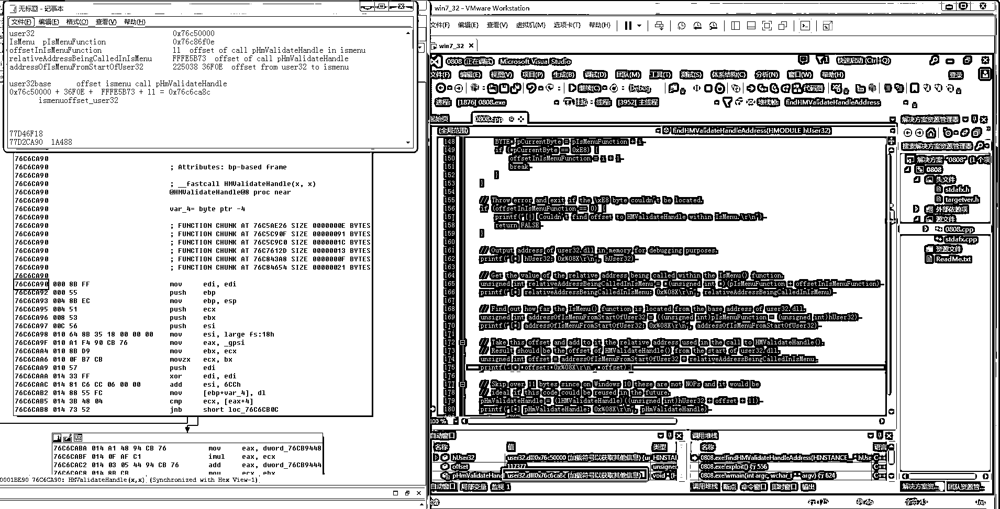
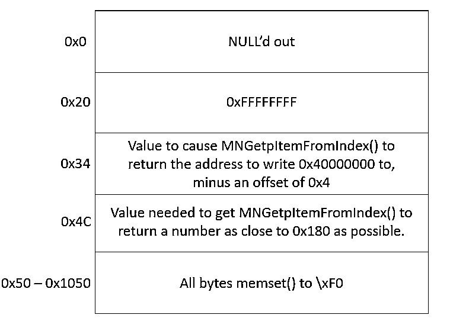

# CVE-2019-0808 利用里的几处数学问题 - goabout2 - 博客园

> 原文：[`www.cnblogs.com/goabout2/p/11255693.html`](https://www.cnblogs.com/goabout2/p/11255693.html)

CVE-2019-0808 是 2019 年 4 月 google 披露的一次使用 chrome 0day 进行攻击时用于绕过 chrome 沙箱限制的 windows 权限提升漏洞，本文并不对具体的漏洞原因及利用技术进行分析，exodusintel 的文章中已经分析得很清楚，这里只是对该漏洞中利用的几处数学问题进行一些解释。

该漏洞的原理如下图所示（直接借用 360 核心安全分析中的图），具体来说即当用户调用对应的 NtUserMNDragOver 函数时，在内核中将最终调用函数 xxxMNDragOver，此时如果检查到对应的 MourseMove 消息，将导致 xxxMNDragOver 中的消息处理函数 xxxCallHandleMenuMessages 进入到 xxxMNMouseMove 中，xxxMNMouseMove 函数中调用函数 xxxMNFindWindowFromPoint，在函数 xxxMNFindWindowFromPoint 会通过函数 SendMessage 发送 WM_MN_FINDMENUWINDOWFROMPOINT 消息，此时如果攻击者在 user 层通过 SetWindowsHook 的方式劫持的对应的 WM_MN_FINDMENUWINDOWFROMPOINT 消息，并返回一个空的 hmenu，此时该空的 hmenu 将通过函数 xxxMNFindWindowFromPoint 返回，并传递给 xxxMNMouseMov 下的 xxxMNUpdateDraggingInfo，xxxMNUpdateDraggingInfo 最终在通过 MNGetpItem 函数返回该空 hmenu 时将导致崩溃。

其本质上就是函数 xxxMNFindWindowFromPoint 对用户层返回的数据没有做校验的原因。

 

在利用的 hook 函数中，当监控到对应的漏洞 ox1eb 消息时，调用函数 SebMenuproc，该函数中实现对于 null 地址内存的布局。

 

SebMenuproc 中我们首先通过 wParam 获取到至关重要的 pPopupMenu，需要+0x10，之后通过这个值配合 pramary cbwndextr，计算出 0x34 中的值并写入，设置 0x20 处的值为 0xffffffff，设置 0x4c 出的值为((0x100000180 - addressToWriteTo) / 0x6C)。

具体如下图(借用 exodusintel 的布局图)

 

看到这个地方我们会有两个疑问

1.  ((addressToWrite + 0x6C) - ((pPopupAddressInCalculations * 0x6C) + 0x4))中(addressToWrite + 0x6C)为啥要+0x6c
2.  420 行处（偏移 0x4c 处）这么设置的原因。

我们首先来看看第二个的问题，实际上在 xxxMNUpdateDraggingInfo 中执行完第一个 MNGetpItem 后，要执行到之后 xxxMNSetGapState 触发函数，中间是有判断要求的。

通过反汇编模式可以看得更清楚，简单来说，第一个 MNGetpItem 执行完之后，会获取 0x4c 处的值将其*0x6c，并以此加上 0x34 处的值，再加上 0x28，通过这个值作为指针获取其中的值来进行一系列判断（下图中的 ecx），为了保证最终进入到后面的漏洞函数，一个简单的思路就是将这个最终计算的指针指向的值设置为一个巨大的值。

*((null + 0x34) + (null + 0x4c) * 0x6c +0x28)

 

关键的位置如下所示

 

从公式可知，0x34，0x4c 都是我们可控的，因此这个指针的值也是我们可控，问题是我们需要将这个指针指向何处，要知道我们能控制的地址实际上只有 null 附近的地址，因此我们将我们指针的位置控制在 0x120 到 0x180 之间，将这里附近的值都设置为 f0，从而保证其最终获取的值都为 0xf0f0f0f0，为什么不设置为 0xffffffff，因为之后还会有一些值的操作，0xffffffff 会导致直接上益，从而变成一个很小的值

*((null + 0x34) + (null + 0x4c) * 0x6c +0x28)

之所以用 0x100000180，注意这里是 9 位，这样实际的计算中*((null + 0x34) + (null + 0x4c) * 0x6c +0x28)获取的值将为 0x100000180，x86 下将直接去掉最高位，最终的值为 0x180，从而确保一定获取到 0xf0f0f0f0。

第二个疑问，为什么需要+0x6c，这里就是实际漏洞触发有关了，我们最终需要调用红框中的 MNGetpItem，通过其返回值来修改最终的 cbwndextra，而其参数注意并不是 a2，而是 a2-1

因此我们的计算公式需要在 a2 的位置-1，从而需要按照第二处的公式计算，

| 第一 addressToWrite = *(_DWORD *)(v2 + 0x34) + 0x6C * a2(pPopupAddressInCalculations);addressToWrite-4 = *(_DWORD *)(v2 + 0x34) + 0x6C * a2(pPopupAddressInCalculations);addressToWrite-4-0x6C * a2(pPopupAddressInCalculations) = *(_DWORD *)(v2 + 0x34)addressToWrite-(0x6C * a2(pPopupAddressInCalculations) + 4) = *(_DWORD *)(v2 + 0x34)第二 addressToWrite-(0x6C * a2(pPopupAddressInCalculations-1) + 4) = *(_DWORD *)(v2 + 0x34)addressToWrite+0x6C -((pPopupAddressInCalculations * 0x6C) + 0x4)) = *(_DWORD *)(v2 + 0x34) |

一次实际的调试如下所示

设置好对应的 null 地址之后，最终如下所示：

CVE-2018-0808 在利用是还是非常经典的，从一位写转化为全局读写，最终实现代码执行，这里强烈推荐 exodusintel 的文章，各个利用分析的细节都很清楚，这里只是将我分析中遇到的两个问题进行分享。

转载请注明出处

参考链接

[`security.googleblog.com/2019/03/disclosing-vulnerabilities-to-protect.html`](https://security.googleblog.com/2019/03/disclosing-vulnerabilities-to-protect.html)

[`blog.exodusintel.com/2019/05/17/windows-within-windows/`](https://blog.exodusintel.com/2019/05/17/windows-within-windows/)

[`blogs.360.cn/post/RootCause_CVE-2019-0808_CH`](http://blogs.360.cn/post/RootCause_CVE-2019-0808_CH)