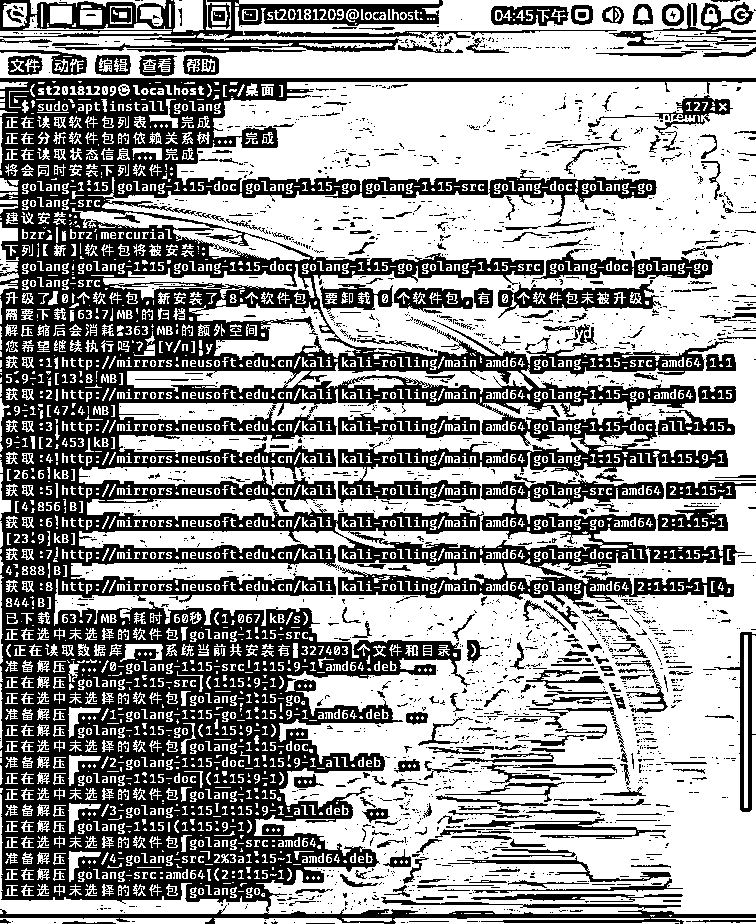
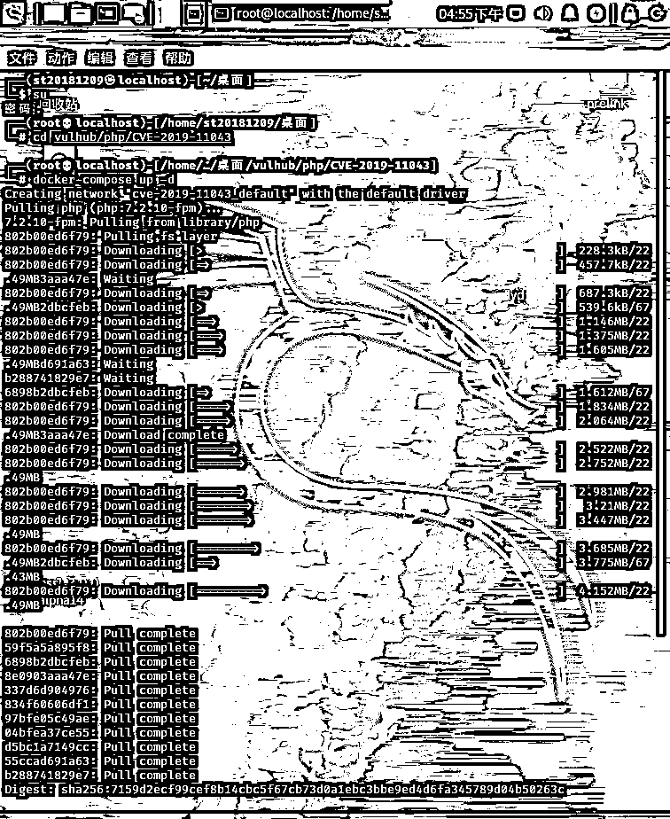
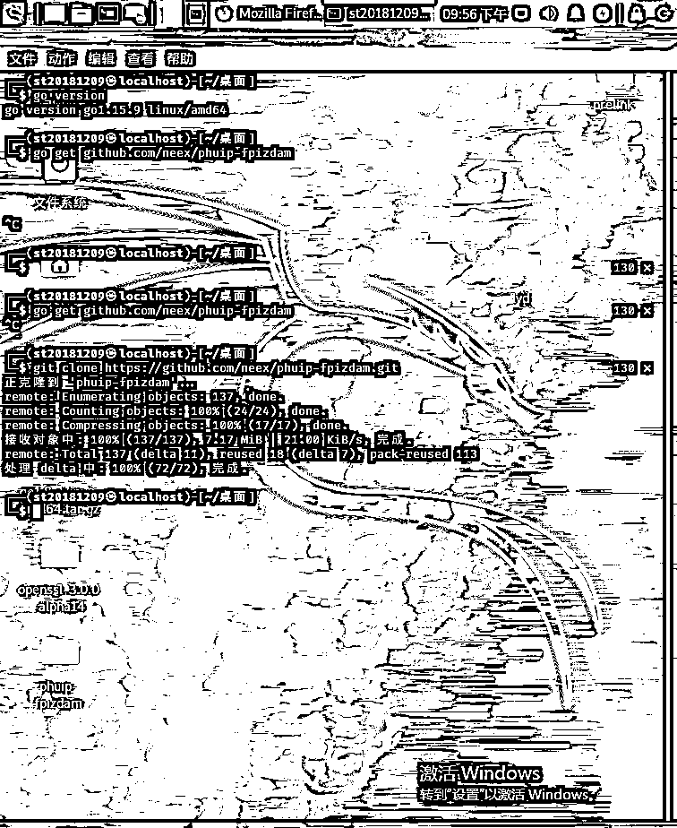
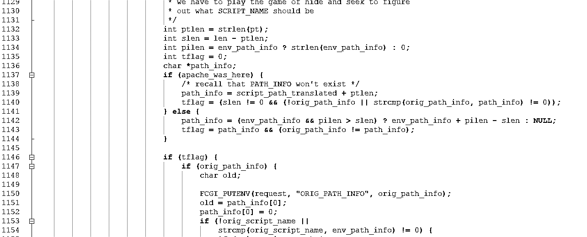

# CVE-2019-11043 漏洞分析与复现 - STong66 - 博客园

> 原文：[`www.cnblogs.com/st66/p/14735800.html`](https://www.cnblogs.com/st66/p/14735800.html)

**漏洞描述**

Nginx 上 fastcgi_split_path_info 在处理带有 %0a 的请求时，会因为遇到换行符 \n 导致 PATH_INFO 为空。而 php-fpm 在处理 PATH_INFO 为空的情况下，存在逻辑缺陷。攻击者通过精心的构造和利用，可以导致远程代码执行。

该漏洞需要在 nginx.conf 中进行特定配置才能触发。具体配置如下：

```
location ~ [^/]\.php(/|$) {

 ...

 fastcgi_split_path_info ^(.+?\.php)(/.*)$;

 fastcgi_param PATH_INFO $fastcgi_path_info;

 fastcgi_pass   php:9000;

 ...

}
```

攻击者可以使用换行符（％0a）来破坏`fastcgi_split_path_info`指令中的 Regexp。Regexp 被损坏导致 PATH_INFO 为空，从而触发该漏洞。

**漏洞类型：**远程代码执行漏洞

**危险等级：**高危

**利用条件：**nginx 配置了 fastcgi_split_path_info

**受影响系统：**PHP 5.6-7.x，Nginx>=0.7.31

**漏洞复现**

使用某个大佬的 docker 环境进行复现：

PHP-FPM 远程代码执行漏洞（CVE-2019-11043）

https://github.com/vulhub/vulhub/blob/master/php/CVE-2019-11043/README.zh-cn.md

## 准备工作：安装 docker、golang 环境

在 kali 中使用如下命令安装 docker 和 golang：

```
sudo apt-get install docker docker-compose
sudo apt install golang

```

```

```

 

## 搭建漏洞环境

```
git clone https://github.com/vulhub/vulhub.git
cd vulhub/php/CVE-2019-11043 && docker-compose up -d
```

```

```

 

```

```

 

## 安装漏洞利用工具

```

```
git clone https://github.com/neex/phuip-fpizdam.git
cd phuip-fpizdam
go get -v && go build
```

```

```

```

```

漏洞利用
**在 phuip-fpizdam 目录下执行  go run . "http://127.0.0.1:8080/index.php"后成功显示漏洞利用成功。**
**在浏览器进行了如下请求，成功复现，可以执行系统命令,id 可以替换为其他 OS 命令。**

```

```

```

```

**漏洞分析**

```
具体漏洞信息可参考：[`github.com/php/php-src/commit/ab061f95ca966731b1c84cf5b7b20155c0a1c06a/#diff-624bdd47ab6847d777e15327976a9227`](https://github.com/php/php-src/commit/ab061f95ca966731b1c84cf5b7b20155c0a1c06a#diff-624bdd47ab6847d777e15327976a9227)
有漏洞信息可知漏洞是由于 path_info 的地址可控导致的，我们可以看到，当 path_info 被%0a 截断时，path_info 将被置为空，回到代码中我就发现问题所在了。
如下漏洞代码


在代码的 1134 行我们发现了可控的 path_info 的指针 env_path_info
其中
env_path_info 就是变量 path_info 的地址，path_info 为 0 则 plien 为 0。
slen 变量来自于请求后 url 的长度 int ptlen = strlen(pt); int slen = len - ptlen;
由于`apache_was_here`这个变量在前面被设为了 0，因此 path_info 的赋值语句实际上就是：

```
path_info = env_path_info ? env_path_info + pilen - slen : NULL;
```

env_path_info 是从 Fast CGI 的 PATH_INFO 取过来的，而由于代入了`%0a`，在采取`fastcgi_split_path_info ^(.+?\.php)(/.*)$;`这样的 Nginx 配置项的情况下，fastcgi_split_path_info 无法正确识别现
在的 url，因此会 Path Info 置空，所以 env_path_info 在进行取值时，同样会取到空值，这也正是漏洞原因所在。

```

```