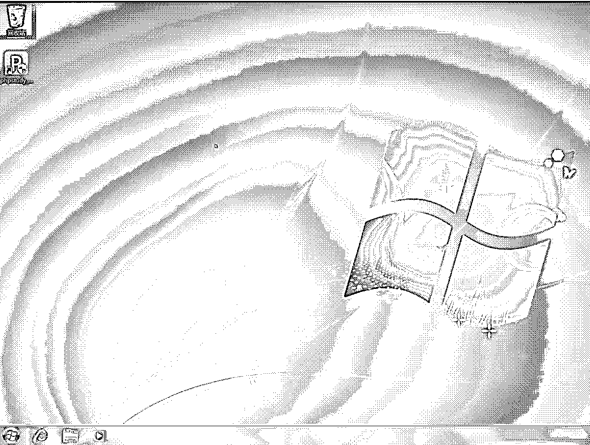
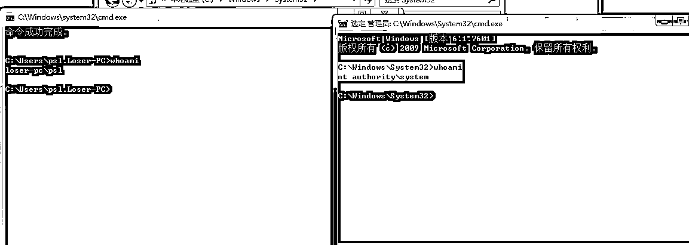
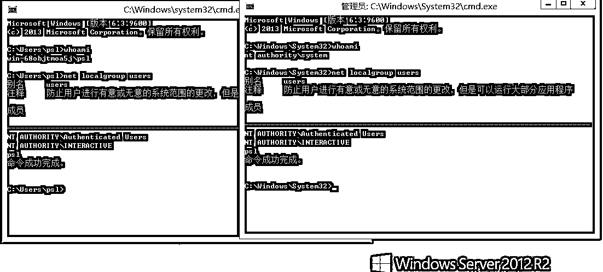

# CVE-2019-1388 UAC 提权复现 - Sylon - 博客园

> 原文：[`www.cnblogs.com/Sylon/p/11941276.html`](https://www.cnblogs.com/Sylon/p/11941276.html)

## 0x01 前言

该漏洞位于 Windows 的 UAC（User Account Control，用户帐户控制）机制中。默认情况下，Windows 会在一个单独的桌面上显示所有的 UAC 提示——Secure Desktop。这些提示是由名为 consent.exe 的可执行文件产生的，该可执行文件以 NT AUTHORITY\SYSTEM 权限运行，完整性级别为 System。因为用户可以与该 UI 交互，因此对 UI 来说紧限制是必须的。否则，低权限的用户可能可以通过 UI 操作的循环路由以 SYSTEM 权限执行操作。即使隔离状态的看似无害的 UI 特征都可能会成为引发任意控制的动作链的第一步。事实上，UAC 会话中含有尽可能少的点击操作选项。
利用该漏洞很容易就可以提升权限到 SYSTEM

## 0x02 危害范围

# 根绝 gayhub 的 exp 文档所说 支持如下（但 本机 win10 没成功 可能是补丁打过了吧 ）
exp 详情
[`github.com/jas502n/CVE-2019-1388`](https://github.com/jas502n/CVE-2019-1388)
SERVER

Windows 2008r2 7601 ** link OPENED AS SYSTEM **
Windows 2012r2 9600 ** link OPENED AS SYSTEM **
Windows 2016 14393 ** link OPENED AS SYSTEM **
Windows 2019 17763 link NOT opened

# WORKSTATION

Windows 7 SP1 7601 ** link OPENED AS SYSTEM **
Windows 8 9200 ** link OPENED AS SYSTEM **
Windows 8.1 9600 ** link OPENED AS SYSTEM **
Windows 10 1511 10240 ** link OPENED AS SYSTEM **
Windows 10 1607 14393 ** link OPENED AS SYSTEM **
Windows 10 1703 15063 link NOT opened
Windows 10 1709 16299 link NOT opened

## 0x03 复现详情

win7：

win2012：

## 0x04 修复方案

关注微软官网